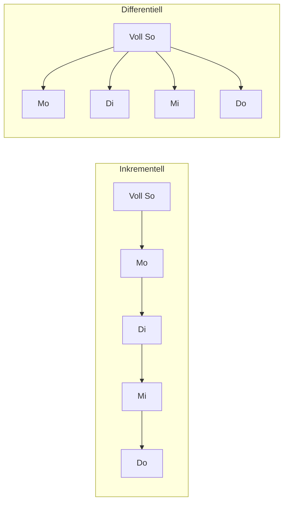

# 🗃️ Backup-Arten

Nicht jede Kopie ist ein Backup, und nicht jedes Backup ist gleich. Dieses Dokument erklärt die gängigen Arten und Begriffe.

<!-- TOC -->
## Inhaltsverzeichnis

- [Vollbackup (Full Backup)](#vollbackup-full-backup)
- [Inkrementelles Backup](#inkrementelles-backup)
- [Differentielles Backup](#differentielles-backup)
- [Vergleich: Voll, inkrementell, differentiell](#vergleich-voll-inkrementell-differentiell)
- [Snapshot](#snapshot)
- [Image-Backup (Abbild)](#image-backup-abbild)
- [Synchronisation und Spiegelung sind kein Backup](#synchronisation-und-spiegelung-sind-kein-backup)
- [Weitere Begriffe](#weitere-begriffe)
- [Die 3-2-1-Regel](#die-3-2-1-regel)
- [RPO und RTO](#rpo-und-rto)
- [Generationenprinzip (Großvater-Vater-Sohn)](#generationenprinzip-großvater-vater-sohn)
<!-- /TOC -->

## Vollbackup (Full Backup)

Es werden **alle** ausgewählten Daten vollständig gesichert – unabhängig davon, ob sie sich seit dem letzten Backup geändert haben.

| Vorteile | Nachteile |
| --- | --- |
| Wiederherstellung am einfachsten: nur **ein** Backup nötig | Braucht am meisten Speicherplatz |
| Unabhängig von anderen Backups | Dauert am längsten |
| | Hohe Netzwerk- und Plattenlast |

---

## Inkrementelles Backup

Es werden nur die Daten gesichert, die sich **seit dem letzten Backup (egal welcher Art)** geändert haben.

| Vorteile | Nachteile |
| --- | --- |
| Sehr schnell, sehr wenig Speicher | Wiederherstellung braucht das Vollbackup **und alle** Inkremente in der richtigen Reihenfolge |
| | Fehlt ein Inkrement oder ist es defekt, ist die Kette ab dort unbrauchbar |

---

## Differentielles Backup

Es werden alle Daten gesichert, die sich **seit dem letzten Vollbackup** geändert haben.

| Vorteile | Nachteile |
| --- | --- |
| Wiederherstellung braucht nur Vollbackup + **das letzte** differentielle Backup | Wird mit jedem Tag seit dem Vollbackup größer |
| Robuster als eine lange inkrementelle Kette | |

---

## Vergleich: Voll, inkrementell, differentiell

Angenommen, jeden Tag ändern sich 1 GB von 100 GB Daten. Sonntag Vollbackup, danach täglich:

| Tag | Voll (jeden Tag) | Inkrementell | Differentiell |
| --- | --- | --- | --- |
| So | 100 GB | 100 GB (Voll) | 100 GB (Voll) |
| Mo | 100 GB | 1 GB | 1 GB |
| Di | 100 GB | 1 GB | 2 GB |
| Mi | 100 GB | 1 GB | 3 GB |
| Do | 100 GB | 1 GB | 4 GB |
| **Summe** | 500 GB | 104 GB | 110 GB |
| **Restore Do** | Do | So + Mo + Di + Mi + Do | So + Do |



---

## Snapshot

Ein **Snapshot** friert den Zustand eines Dateisystems, Volumes oder einer VM **zu einem Zeitpunkt** ein. Technisch wird meist **Copy-on-Write** verwendet: Es wird nichts kopiert, sondern ab dem Snapshot werden Änderungen an einer anderen Stelle gespeichert. Deshalb ist ein Snapshot in Sekunden erstellt.

Vorkommen: VM-Snapshots (Proxmox, VMware, VirtualBox, `qcow2`), Dateisysteme (ZFS, Btrfs, LVM), Storage-Systeme, Cloud-Volumes.

> ⚠️ **Ein Snapshot ist kein Backup.** Er liegt auf demselben Speicher wie das Original. Stirbt die Platte, sind Original **und** Snapshot weg. Snapshots sind ideal für „kurz vor dem Update“ und als **konsistente Quelle für ein echtes Backup**, das dann auf ein anderes Medium kopiert wird.
>
> Außerdem: Viele und alte Snapshots verlangsamen VMs und belegen zunehmend Platz. Snapshots werden nach dem erfolgreichen Update wieder gelöscht.

---

## Image-Backup (Abbild)

Ein **Image** sichert ein komplettes Laufwerk oder eine Partition blockweise – inklusive Bootloader, Partitionstabelle und Betriebssystem. Damit lässt sich ein System auf neuer Hardware 1:1 wiederherstellen (*Bare-Metal Restore*).

Beispiele: `dd`, Clonezilla, das Klonen einer Raspberry-Pi-SD-Karte, Proxmox `vzdump` einer VM.

```bash
# SD-Karte eines Raspberry Pi komprimiert sichern (Karte nicht gemountet!)
sudo dd if=/dev/sdX bs=4M status=progress | zstd -T0 > pi-beamer_$(date +%F).img.zst
```

---

## Synchronisation und Spiegelung sind kein Backup

| Verfahren | Problem |
| --- | --- |
| **RAID 1/5/6** | Schützt vor dem Ausfall **einer Platte**. Löschen, Verschlüsselung durch Ransomware, Dateisystemfehler oder versehentliches Überschreiben werden sofort auf alle Platten übernommen. |
| **Sync** (Nextcloud, Dropbox, `rsync --delete`) | Eine gelöschte oder kaputte Datei wird beim nächsten Abgleich auch in der Kopie gelöscht/kaputt. |
| **Replikation** (Datenbank-Replica) | Ein `DROP TABLE` wird in Millisekunden repliziert. |

Ein Backup braucht **Versionen** (Zustände aus der Vergangenheit), die von Änderungen am Original **unabhängig** sind.

---

## Weitere Begriffe

| Begriff | Bedeutung |
| --- | --- |
| **Archiv** | Langzeitaufbewahrung von Daten, die nicht mehr aktiv genutzt werden. Ein Backup dient der Wiederherstellung, ein Archiv der Aufbewahrung. |
| **Synthetisches Vollbackup** | Backup-Software baut aus altem Voll + Inkrementen ein neues Vollbackup **auf dem Backup-Speicher** zusammen, ohne die Quelle erneut komplett zu lesen. |
| **Inkrementell für immer** (*forever incremental*) | Nur ein initiales Voll, danach nur noch Inkremente. Dank **Deduplizierung** kann jeder Stand trotzdem direkt wiederhergestellt werden (z. B. Proxmox Backup Server, BorgBackup, restic). |
| **Deduplizierung** | Gleiche Datenblöcke werden nur einmal gespeichert. Spart enorm Platz bei vielen ähnlichen Backups (z. B. VMs mit gleichem Betriebssystem). |
| **Hot / Cold Backup** | Hot = im laufenden Betrieb, Cold = System ist dafür gestoppt. |
| **Offsite** | Kopie an einem anderen Ort (anderes Gebäude, Cloud). Schützt vor Brand, Wasser, Diebstahl. |
| **Offline / Air-Gap** | Kopie ohne Netzwerkverbindung (abgesteckte Platte, Band). Schützt vor Ransomware. |
| **Immutable Backup** | Backup, das für eine Zeit nicht verändert oder gelöscht werden kann (WORM, S3 Object Lock). |

---

## Die 3-2-1-Regel

* **3** Kopien der Daten (Original + 2 Backups)
* auf **2** verschiedenen Medien/Systemen (z. B. Server-SSD + NAS)
* **1** Kopie außer Haus (offsite)

Erweiterung **3-2-1-1-0**: zusätzlich **1** Kopie offline/unveränderbar und **0** Fehler bei der Wiederherstellungsprüfung.

---

## RPO und RTO

| Begriff | Frage | Beispiel |
| --- | --- | --- |
| **RPO** – *Recovery Point Objective* | Wie viele Daten darf ich höchstens verlieren? | RPO 24 h → mindestens tägliches Backup |
| **RTO** – *Recovery Time Objective* | Wie lange darf die Wiederherstellung höchstens dauern? | RTO 2 h → Restore muss geübt und schnell sein |

Diese beiden Werte bestimmen die Backup-Strategie. Für eine Abschlussarbeit (Code in Git, Messdaten auf dem NAS) gelten andere Anforderungen als für den openHAB-Server, der eine Live-Demo steuert.

---

## Generationenprinzip (Großvater-Vater-Sohn)

Ein klassisches Schema, um mit wenig Speicher weit in die Vergangenheit zurückgehen zu können:

| Generation | Intervall | Aufbewahrung (Beispiel) |
| --- | --- | --- |
| **Sohn** | täglich | 7 Stück (eine Woche) |
| **Vater** | wöchentlich | 4–5 Stück (ein Monat) |
| **Großvater** | monatlich | 12 Stück (ein Jahr) |
| (Urgroßvater) | jährlich | mehrere Jahre |

Englisch: *Grandfather-Father-Son* (GFS). Umsetzung: [Retention & Rotation](Retention%20&%20Rotation.md).

---
