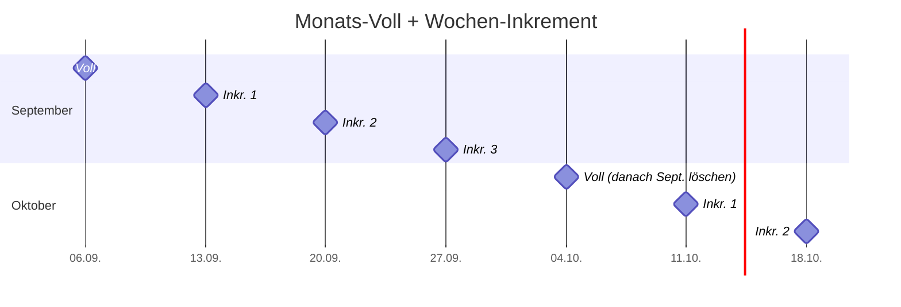

# ♻️ Retention & Rotation

**Retention** (Aufbewahrung) legt fest, **wie lange bzw. wie viele** Backups aufgehoben werden. **Rotation** ist der Vorgang, bei dem alte Backups gelöscht und durch neue ersetzt werden. Ohne Retention läuft der Backup-Speicher irgendwann voll – und dann schlägt das nächste Backup fehl, meist unbemerkt.

<!-- TOC -->
## Inhaltsverzeichnis

- [Warum regelmäßig löschen?](#warum-regelmäßig-löschen)
- [Strategie 1: Die letzten N behalten](#strategie-1-die-letzten-n-behalten)
- [Strategie 2: Nach Alter löschen](#strategie-2-nach-alter-löschen)
- [Strategie 3: Großvater-Vater-Sohn](#strategie-3-großvater-vater-sohn)
- [Monatlich voll, wöchentlich inkrementell](#monatlich-voll-wöchentlich-inkrementell)
  - [Umsetzung mit GNU tar](#umsetzung-mit-gnu-tar)
- [Retention planen](#retention-planen)
<!-- /TOC -->

## Warum regelmäßig löschen?

* **Speicherplatz** ist endlich, auch auf dem NAS.
* **Übersicht:** 400 Archive mit ähnlichem Namen helfen im Notfall niemandem.
* **Datenschutz (DSGVO):** Personenbezogene Daten dürfen nicht unbegrenzt aufgehoben werden. Gelöschte Daten müssen irgendwann auch aus den Backups verschwinden.
* **Kosten** bei Cloud-Speicher.

Gleichzeitig darf nicht zu früh gelöscht werden: Ein Fehler (z. B. versehentlich gelöschte Datei, schleichende Datenkorruption, Ransomware) wird oft erst nach Wochen bemerkt. Dann muss ein Backup **von vor dem Fehler** existieren.

---

## Strategie 1: Die letzten N behalten

Die einfachste Regel: Es werden immer die **letzten N Backups** aufbewahrt. Kommt ein neues hinzu, wird das älteste gelöscht.

```text
Vorher:  b1 b2 b3 b4 b5
Neu:     b1 b2 b3 b4 b5 b6
Löschen: b1
Nachher: b2 b3 b4 b5 b6
```

```bash
# Behalte die 5 neuesten Dateien, lösche den Rest (sortiert nach Änderungszeit)
ls -1t /mnt/nas/backups/weekly_*.tar.zst | tail -n +6 | xargs -r rm --
```

Robuster (auch mit Leerzeichen in Pfaden) mit `find`:

```bash
find /mnt/nas/backups -maxdepth 1 -name 'weekly_*.tar.zst' -printf '%T@ %p\n' \
  | sort -rn | tail -n +6 | cut -d' ' -f2- | xargs -r -d '\n' rm --
```

> **Wichtig:** Erst das **neue** Backup erstellen und prüfen, **dann** das alte löschen. Umgekehrt gibt es ein Zeitfenster, in dem nur N-1 Backups existieren – und wenn das neue fehlschlägt, hat man eines weniger als gedacht.

---

## Strategie 2: Nach Alter löschen

Alles, was älter als X Tage ist, wird gelöscht:

```bash
find /mnt/nas/backups/daily -name 'daily_*.tar.zst' -mtime +14 -delete
```

**Gefahr:** Schlägt das Backup längere Zeit fehl, löscht diese Regel trotzdem weiter – bis **kein einziges** Backup mehr übrig ist. Deshalb besser mit „die letzten N“ kombinieren oder eine Mindestanzahl sicherstellen.

---

## Strategie 3: Großvater-Vater-Sohn

Das Generationenprinzip (siehe [Backup-Arten](Backup-Arten.md#generationenprinzip-großvater-vater-sohn)) kombiniert mehrere Intervalle mit eigener Retention:

| Generation | Intervall | Behalten | Reicht zurück |
| --- | --- | --- | --- |
| Sohn | täglich | 7 | 1 Woche |
| Vater | wöchentlich | 5 | ~1 Monat |
| Großvater | monatlich | 12 | 1 Jahr |
| Urgroßvater | jährlich | 5 | 5 Jahre |

Insgesamt nur **29 Backups**, aber Wiederherstellung von gestern, letzter Woche, letztem Monat und vor drei Jahren möglich. Umsetzung mit drei getrennten Skripten: [Backup-Skripte & Intervalle](Backup-Skripte%20&%20Intervalle.md).

Deduplizierende Werkzeuge haben das eingebaut:

```bash
borg prune --keep-daily 7 --keep-weekly 5 --keep-monthly 12 --keep-yearly 5 /mnt/nas/borg-repo
restic forget --keep-daily 7 --keep-weekly 5 --keep-monthly 12 --keep-yearly 5 --prune
```

Proxmox bietet dieselben Optionen pro Backup-Job: `--prune-backups keep-daily=7,keep-weekly=5,keep-monthly=12`.

---

## Monatlich voll, wöchentlich inkrementell

Eine in der Praxis weit verbreitete Strategie:

* **Einmal im Monat** ein **Vollbackup**,
* **jede Woche** ein **inkrementelles** Backup,
* zum **nächsten Monat** ein neues Vollbackup – danach werden die Inkremente des Vormonats gelöscht und der Zyklus beginnt von vorn.



Jeder Monat bildet eine **Kette** (*Chain*): ein Voll + seine Inkremente. Eine Kette ist nur als Ganzes brauchbar – deshalb wird immer eine **ganze Kette** gelöscht, nie einzelne Teile daraus.

**Empfehlung zur Reihenfolge:** Erst das neue Vollbackup erstellen und prüfen, dann die alte Kette löschen. Wer es sich leisten kann, behält **zwei Ketten** (aktueller + vorheriger Monat). Sonst gibt es direkt nach dem Monatswechsel nur noch einen einzigen Wiederherstellungspunkt.

### Umsetzung mit GNU tar

Die Verzeichnisstruktur auf dem NAS:

```text
/mnt/nas/backups/pi-beamer/chains/
├── 2026-09/
│   ├── data.snar
│   ├── 2026-09-06_full.tar.zst
│   ├── 2026-09-13_inc.tar.zst
│   ├── 2026-09-20_inc.tar.zst
│   └── 2026-09-27_inc.tar.zst
└── 2026-10/
    ├── data.snar
    ├── 2026-10-04_full.tar.zst
    └── 2026-10-11_inc.tar.zst
```

`/usr/local/bin/backup_chain.sh`:

```bash
#!/usr/bin/env bash
# Monthly full + weekly incremental backup with GNU tar.
# Run once a week (e.g. Sunday). The first run of a month creates a full backup
# and afterwards removes old chains, keeping KEEP_CHAINS months.
set -euo pipefail

SOURCES=(/etc /opt /srv/data)
BASE="/mnt/nas/backups/$(hostname)/chains"
KEEP_CHAINS=2                      # 1 = nur aktueller Monat, 2 = aktueller + Vormonat

mountpoint -q /mnt/nas || { echo "NAS not mounted" >&2; exit 1; }

MONTH=$(date +%Y-%m)
TODAY=$(date +%F)
CHAIN="$BASE/$MONTH"
SNAR="$CHAIN/data.snar"

if [[ ! -f "$SNAR" ]]; then
  TYPE=full                        # erster Lauf im Monat → neue Kette
  mkdir -p "$CHAIN"
else
  TYPE=inc
fi

TARGET="$CHAIN/${TODAY}_${TYPE}.tar.zst"
tar --create --zstd --file "${TARGET}.part" \
    --listed-incremental="$SNAR" \
    --exclude='*.log' "${SOURCES[@]}"
tar --list --zstd --file "${TARGET}.part" --listed-incremental=/dev/null > /dev/null
mv "${TARGET}.part" "$TARGET"
sha256sum "$TARGET" > "${TARGET}.sha256"
echo "$(date '+%F %T') created $TYPE backup $TARGET"

# Alte Ketten erst NACH erfolgreichem Vollbackup löschen
if [[ "$TYPE" == full ]]; then
  find "$BASE" -mindepth 1 -maxdepth 1 -type d -name '????-??' \
    | sort -r | tail -n +$((KEEP_CHAINS + 1)) \
    | while read -r old_chain; do
        rm -rf -- "$old_chain"
        echo "$(date '+%F %T') removed old chain $old_chain"
      done
fi
```

Crontab (jeden Sonntag 02:30):

```cron
30 2 * * 0 /usr/local/bin/backup_chain.sh >> /var/log/backup_chain.log 2>&1
```

**Wiederherstellung** eines Stands, z. B. vom 20.09.:

```bash
cd /mnt/nas/backups/pi-beamer/chains/2026-09
for f in 2026-09-06_full.tar.zst 2026-09-13_inc.tar.zst 2026-09-20_inc.tar.zst; do
  tar --extract --zstd --file "$f" --listed-incremental=/dev/null -C /tmp/restore
done
```

> **Inkrementell vs. differentiell mit tar:** Wird die `.snar`-Datei nach jedem Lauf weiterverwendet, entsteht eine **inkrementelle** Kette (jedes Backup baut auf dem vorherigen auf). Kopiert man stattdessen vor jedem Wochenlauf die `.snar` **des Vollbackups**, entsteht ein **differentielles** Backup (jedes Wochenbackup enthält alle Änderungen seit dem Voll; zur Wiederherstellung reichen Voll + letztes Differential).

---

## Retention planen

Bei der Planung helfen folgende Fragen:

| Frage | Auswirkung |
| --- | --- |
| Wie spät wird ein Fehler typischerweise bemerkt? | Mindest-Aufbewahrungsdauer |
| Gibt es gesetzliche oder organisatorische Vorgaben? | z. B. Aufbewahrung von Prüfungsdaten, Löschfristen nach DSGVO |
| Wie groß ist ein Backup, wie viel Platz gibt es? | Maximale Anzahl |
| Wie wichtig sind alte Stände? (Forschungsdaten, Abschlussarbeiten) | Jährliche Archive dauerhaft |

**Faustformel für den Speicherbedarf** (ohne Deduplizierung): Anzahl Backups × Größe eines Backups × Sicherheitsfaktor 1,5. Den Füllstand des Backup-Speichers überwachen (z. B. per openHAB, Grafana oder einfachem Cron-Check mit `df`).

---
