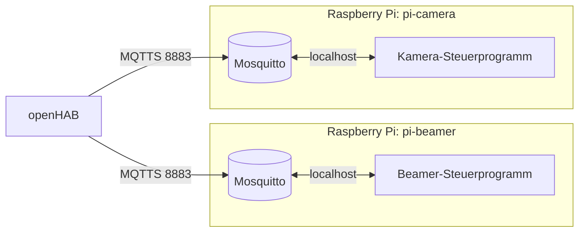

# 📡 Best Practice: MQTT

**Regeln in Kurzform:**

1. Jeder Broker bekommt ein **Zertifikat** (TLS auf Port 8883).
2. Jeder Broker verlangt **Benutzername und Passwort** – kein anonymer Zugriff.
3. Wer darf welches Topic lesen/schreiben, regelt eine **ACL**.
4. Ein Gerät, das gesteuert werden soll, bekommt **seinen eigenen Broker**.

<!-- TOC -->
## Inhaltsverzeichnis

- [Kurz erklärt: MQTT](#kurz-erklärt-mqtt)
- [Passwörter](#passwörter)
- [Zertifikate (TLS)](#zertifikate-tls)
- [ACL](#acl)
- [Ein Broker pro gesteuertem Gerät](#ein-broker-pro-gesteuertem-gerät)
- [Topic-Design](#topic-design)
- [Checkliste](#checkliste)
<!-- /TOC -->

## Kurz erklärt: MQTT

MQTT (*Message Queuing Telemetry Transport*) ist ein leichtgewichtiges **Publish/Subscribe-Protokoll**. Clients senden (*publish*) Nachrichten an ein **Topic** und abonnieren (*subscribe*) Topics. Dazwischen sitzt der **Broker** (z. B. Mosquitto), der Nachrichten verteilt. Sender und Empfänger kennen sich nicht – das ist das [Observer-Pattern](../Design%20Pattern/Verhaltensmuster/Observer.md) über das Netzwerk.

| Begriff | Bedeutung |
| --- | --- |
| **Topic** | Hierarchischer Kanalname, z. B. `lab/beamer/power/set` |
| **Wildcards** | `+` = genau eine Ebene, `#` = beliebig viele Ebenen (nur am Ende) |
| **QoS** | 0 = höchstens einmal, 1 = mindestens einmal, 2 = genau einmal |
| **Retained** | Broker speichert die letzte Nachricht eines Topics und schickt sie neuen Abonnenten sofort |
| **LWT** | *Last Will and Testament*: Nachricht, die der Broker veröffentlicht, wenn ein Client unerwartet die Verbindung verliert (z. B. `offline`) |
| **Bridge** | Verbindung zweier Broker, die bestimmte Topics weiterreichen |

---

## Passwörter

Seit Mosquitto 2.0 ist ohne Konfiguration nur noch `localhost` erlaubt und anonymer Zugriff standardmäßig aus. Trotzdem wird es explizit gesetzt.

```bash
sudo mosquitto_passwd -c /etc/mosquitto/passwd openhab   # -c nur beim ersten Benutzer!
sudo mosquitto_passwd /etc/mosquitto/passwd beamer-ctl
sudo chown root:mosquitto /etc/mosquitto/passwd
sudo chmod 640 /etc/mosquitto/passwd
```

* Ein Benutzer **pro Client** (openHAB, Gerät, Node-RED, …), nicht ein gemeinsamer Benutzer für alle.
* Passwörter generieren statt ausdenken: `openssl rand -base64 24`
* Passwörter im Passwort-Manager bzw. in `ansible-vault` ablegen, nicht im Repository.

---

## Zertifikate (TLS)

Ohne TLS gehen Benutzername und Passwort **im Klartext** über das Netz. Deshalb bekommt jeder Broker ein Zertifikat – siehe [Zertifikate](Zertifikate.md) (Erstellung, Namenskonvention `<hostname>_ca.crt`).

`/etc/mosquitto/conf.d/tls.conf`:

```text
per_listener_settings false
allow_anonymous false
password_file /etc/mosquitto/passwd
acl_file /etc/mosquitto/acl

# Unverschlüsselt nur lokal (für Programme auf demselben Gerät)
listener 1883 127.0.0.1

# Verschlüsselt für das Netzwerk
listener 8883
cafile   /etc/mosquitto/certs/pi-beamer_ca.crt
certfile /etc/mosquitto/certs/pi-beamer.crt
keyfile  /etc/mosquitto/certs/pi-beamer.key
tls_version tlsv1.2
```

Test:

```bash
mosquitto_sub -h pi-beamer -p 8883 --cafile pi-beamer_ca.crt \
  -u openhab -P '...' -t 'lab/beamer/#' -v
```

Für besonders schützenswerte Geräte zusätzlich **Client-Zertifikate** (mTLS): `require_certificate true` und `use_identity_as_username true`.

---

## ACL

Die **Access Control List** legt fest, welcher Benutzer welche Topics lesen und schreiben darf. Ohne ACL darf jeder angemeldete Benutzer alles. Hintergrund zu ACLs: [Zugriffskontrolle → ACL](../Zugriffskontrolle/ACL.md).

`/etc/mosquitto/acl`:

```text
# Das Steuerprogramm des Beamers
user beamer-ctl
topic read  lab/beamer/+/set
topic write lab/beamer/+/state
topic write lab/beamer/status

# openHAB darf Befehle senden und Zustände lesen
user openhab
topic write lab/beamer/+/set
topic read  lab/beamer/#

# Muster: jeder Client darf in seinen eigenen Bereich schreiben (%c = Client-ID, %u = Benutzer)
pattern write clients/%c/#
```

Grundsatz: **Least Privilege** – nur so viel freigeben wie nötig.

---

## Ein Broker pro gesteuertem Gerät

Wird ein Gerät über MQTT gesteuert (z. B. ein Beamer, ein Roboter, eine Kamera über einen Raspberry Pi), dann läuft **auf diesem Gerät bzw. dem zugehörigen Steuerrechner ein eigener Broker**. Das Steuerprogramm verbindet sich lokal mit diesem Broker. Zentrale Systeme wie openHAB verbinden sich mit dem Geräte-Broker.



**Warum?**

| Vorteil | Erklärung |
| --- | --- |
| **Eigenständigkeit** | Das Gerät funktioniert auch, wenn der zentrale Server ausfällt oder neu aufgesetzt wird. |
| **Kapselung** | Gerät + Broker + Steuerprogramm bilden eine Einheit, die man komplett umziehen, sichern oder einem anderen Labor geben kann. |
| **Klare Schnittstelle** | Die Topics des Geräts sind sein „API“. Sie werden in der [Dokumentation](Dokumentation.md) des Geräteprogramms beschrieben. |
| **Sicherheit** | Jeder Broker hat eigene Benutzer, ACL und Zertifikat. Ein kompromittierter Client sieht nur ein Gerät. |
| **Lokale Kommunikation unverschlüsselt erlaubt** | Programm und Broker reden über `127.0.0.1:1883`, nur der Netzwerk-Port braucht TLS. |

Wird trotzdem eine zentrale Sicht benötigt (z. B. für Logging oder Node-RED), werden die Geräte-Broker per **Bridge** mit einem zentralen Broker verbunden:

```text
# auf pi-beamer: /etc/mosquitto/conf.d/bridge.conf
connection bridge-to-central
address central-broker:8883
bridge_cafile /etc/mosquitto/certs/central-broker_ca.crt
remote_username bridge-pi-beamer
remote_password ...
topic lab/beamer/# both 1
```

---

## Topic-Design

* Hierarchisch und sprechend: `<ort>/<gerät>/<eigenschaft>/<aktion>` → `lab/beamer/power/set`, `lab/beamer/power/state`
* Befehle (`/set`) und Zustände (`/state`) trennen
* Keine Leerzeichen, keine Umlaute, Kleinschreibung, keine führenden `/`
* Online-Status per **LWT** mit `retained`: `lab/beamer/status` → `online` / `offline`
* Zustände als `retained` veröffentlichen, damit neue Clients sofort den aktuellen Wert kennen; Befehle **nicht** retained (sonst wird ein alter Befehl nach Neustart erneut ausgeführt)
* Payload einheitlich: entweder einfache Werte (`ON`, `21.5`) oder JSON – innerhalb eines Geräts nicht mischen

---

## Checkliste

- [ ] Eigener Broker auf dem Gerät / Steuerrechner
- [ ] `allow_anonymous false`, ein Benutzer pro Client
- [ ] TLS-Listener auf 8883 mit Zertifikat, Port 1883 nur auf `127.0.0.1`
- [ ] ACL-Datei mit minimalen Rechten
- [ ] LWT und Status-Topic eingerichtet
- [ ] Topics und Payloads in der README des Geräteprogramms dokumentiert
- [ ] Broker-Konfiguration per [Ansible](Ansible.md) ausgerollt

---
