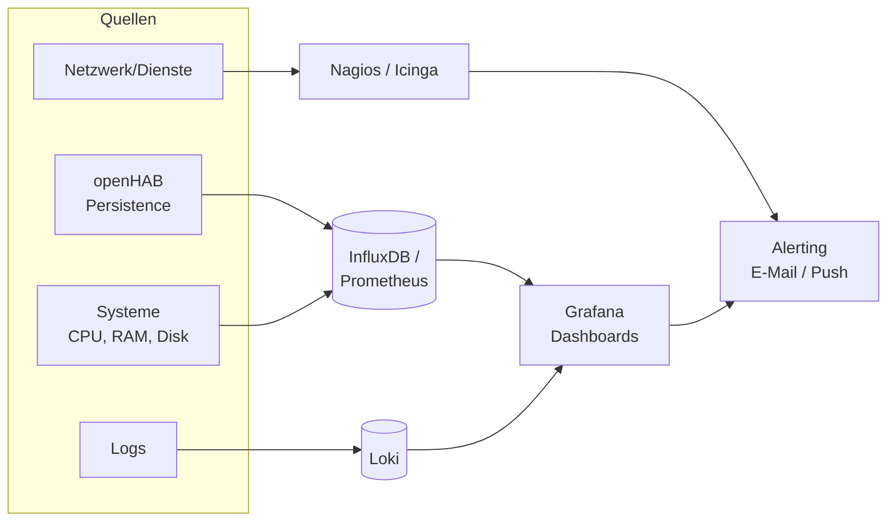

# 📊 Monitoring & Alerting

**Monitoring** heißt, den Zustand von Systemen und Diensten laufend zu beobachten; **Alerting** heißt, bei Problemen rechtzeitig benachrichtigt zu werden. Im Labor sorgt das dafür, dass ein ausgefallener Broker, eine volle SD-Karte oder ein abgelaufenes Zertifikat **auffällt, bevor eine Demo scheitert**.

<!-- TOC -->
## Inhaltsverzeichnis

- [Zwei Fragen, zwei Werkzeugklassen](#zwei-fragen-zwei-werkzeugklassen)
- [Was man im Labor überwachen sollte](#was-man-im-labor-überwachen-sollte)
- [Status-Monitoring: Nagios / Icinga](#status-monitoring-nagios--icinga)
  - [Leichtgewichtige Alternativen](#leichtgewichtige-alternativen)
- [Metriken und Dashboards: Grafana](#metriken-und-dashboards-grafana)
- [Alerting](#alerting)
- [Empfehlung fürs Labor](#empfehlung-fürs-labor)
<!-- /TOC -->

## Zwei Fragen, zwei Werkzeugklassen

Man verwechselt leicht zwei verschiedene Dinge:

| Frage | Werkzeugklasse | Beispiele |
| --- | --- | --- |
| **Funktioniert es?** (Dienst läuft / Host erreichbar / Platte voll) | **Status-/Verfügbarkeits-Monitoring** | Nagios, Icinga, Zabbix, Uptime Kuma, Prometheus + Alertmanager |
| **Wie verhält es sich über die Zeit?** (Temperatur, Auslastung, wie oft geschaltet) | **Metrik-/Zeitreihen-Visualisierung** | Grafana (+ InfluxDB/Prometheus/Loki) |

Beide ergänzen sich: **Nagios/Icinga** beantworten „läuft der Dienst?“ und alarmieren; **Grafana** zeigt Verläufe und Dashboards. Man braucht meist beides.



---

## Was man im Labor überwachen sollte

| Kategorie | Beispiele |
| --- | --- |
| **Erreichbarkeit** | Pings auf Server, Pis, Broker, Gateways |
| **Dienste** | openHAB, Mosquitto, Datenbank, Reverse Proxy, Docker-Container |
| **System** | CPU-Last, RAM, **Plattenplatz** (SD-Karten!), Temperatur |
| **Netzwerk** | DNS, DHCP, Internet-Erreichbarkeit, Bandbreite |
| **Zertifikate** | Ablaufdatum (rechtzeitig vor Ablauf warnen) (→ [Zertifikate](Zertifikate.md)) |
| **Backups** | Letzter erfolgreicher Lauf, Alter des neuesten Backups |
| **Smart-Home-Spezifisch** | Batteriestand von Funksensoren, „Gerät seit X nicht mehr gesehen“ |
| **Updates** | ausstehende Sicherheitsupdates |

---

## Status-Monitoring: Nagios / Icinga

**Nagios** (und sein aktiverer Fork **Icinga**) führen regelmäßig **Checks** aus und melden `OK` / `WARNING` / `CRITICAL` / `UNKNOWN`. Checks auf entfernten Rechnern laufen über **NRPE** (Nagios Remote Plugin Executor) oder SNMP.

```text
# typical checks
check_ping, check_http, check_disk, check_load, check_ntp,
check_apt (pending updates), check_ssl_cert, check_procs
```

| Begriff | Bedeutung |
| --- | --- |
| **Host** | Überwachtes Gerät |
| **Service** | Einzelner Check an einem Host |
| **Plugin** | Programm, das einen Check durchführt (`check_*`) |
| **NRPE** | Führt Plugins auf dem **Zielrechner** aus und meldet das Ergebnis zurück |
| **State** | OK / WARNING / CRITICAL / UNKNOWN, mit Schwellwerten |

> **Wichtig für openHAB:** Checks **auf dem Zielrechner** über **NRPE** ausführen, nicht über das openHAB-Exec-Binding mit `sudo`. Die früher genutzte Lösung, Dutzende `check_*`-Kommandos (teils mit `sudo`) in die openHAB-Exec-Whitelist einzutragen, ist ein Sicherheitsrisiko (→ [Exec Binding & Remote-Ausführung](Exec-Binding%20%26%20Remote-Ausführung.md)).

openHAB und Nagios lassen sich verbinden: Mit `check_openhab` kann Nagios Item-States prüfen; umgekehrt können Nagios-Ergebnisse als Items in openHAB angezeigt werden.

### Leichtgewichtige Alternativen

* **Uptime Kuma:** Sehr einfaches, hübsches Status-Monitoring (HTTP, Ping, Ports, Zertifikate) als Container – für ein Labor oft völlig ausreichend.
* **Prometheus + Alertmanager:** Moderner Standard mit „Exporters“ (node_exporter für Systemmetriken), Pull-Modell und mächtiger Alarmierung.

---

## Metriken und Dashboards: Grafana

**Grafana** visualisiert Daten aus vielen Quellen. Im Labor vor allem:

| Datenquelle | Liefert |
| --- | --- |
| **InfluxDB** (openHAB Persistence) | Item-Verläufe: Temperatur, Schaltzustände, Verbrauch (→ [Zeitreihen & openHAB Persistence](../Datenbanken/Zeitreihen%20%26%20openHAB%20Persistence.md)) |
| **Prometheus** | System- und Dienstmetriken |
| **Loki** | Logs (durchsuchbar, als Text oder Kurve) |

**Grafana in openHAB einbetten:** Ein Panel lässt sich als Webview in Sitemap oder MainUI einbinden:

```text
Webview url="https://grafana.lab.local/d-solo/abc/lampe1?panelId=6&from=now-24h&to=now" height=10
```

> **Loki-Besonderheit:** Loki liest die **aktuellen** Logdateien. Bei einem openHAB-Neustart werden `events.log`/`openhab.log` rotiert – für eine lückenlose Langzeithistorie braucht es eine zusätzliche Speicherung (Persistenz der Items in einer Datenbank, bzw. Logs dauerhaft nach Loki/Datenbank schreiben). Eine frühere Eigenlösung („LogSaver“, letzte Logzeile in eine DB schreiben) ist überholt.

---

## Alerting

Ein Monitoring nützt nur, wenn jemand die Alarme **sieht**. Grundregeln:

* **Wenige, aussagekräftige Alarme.** Zu viele Fehlalarme führen dazu, dass alle ignoriert werden (*Alert Fatigue*).
* **Schwellwerte mit Puffer:** Platte erst bei 85 % warnen, bei 95 % kritisch – nicht erst, wenn sie voll ist.
* **Rechtzeitig:** Zertifikat 2–3 Wochen vor Ablauf, nicht am Ablauftag.
* **Sinnvolle Kanäle:** E-Mail für Zusammenfassungen, Push/Matrix/Signal für Dringendes. openHAB selbst kann über seine Notification-Actions alarmieren.
* **Eskalation vermeiden kurz vor Demos:** Wartungsfenster/Silences nutzen.

Ein einfacher Einstieg ohne zusätzliche Software: eine **openHAB-Regel**, die Batteriestände, „zuletzt gesehen“-Zeiten und den Zertifikatsablauf prüft und bei Problemen eine Nachricht schickt.

---

## Empfehlung fürs Labor

1. **Grafana** (Container) mit InfluxDB (openHAB-Persistence) und Loki – für Verläufe und Dashboards.
2. **Uptime Kuma** oder **Icinga** – für Dienst-/Host-Verfügbarkeit mit Alarmierung; Checks per NRPE auf den Zielsystemen.
3. Ein paar **openHAB-Regeln** für Smart-Home-Spezifisches (Batterie, „Gerät stumm“, Zertifikatsablauf).
4. Alles als **Container/Dienst** betreiben und ins [Backup](../Backup-Strategien/README.md) aufnehmen.

---
