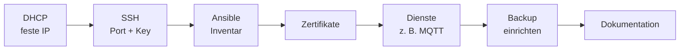

# Best Practices

Bewährte Vorgehensweisen für den Labor- und Projektalltag. Jedes Dokument beginnt mit den Regeln in Kurzform und endet mit einer Checkliste.

<!-- TOC -->
## Inhaltsverzeichnis

- [Übersicht](#übersicht)
- [Reihenfolge bei einem neuen Gerät](#reihenfolge-bei-einem-neuen-gerät)
<!-- /TOC -->

## Übersicht

| Dokument | Kernaussage |
| --- | --- |
| [Dokumentation](Dokumentation.md) | Projektdoku in Markdown, auf Englisch, vollständig |
| [DHCP](DHCP.md) | Neues Gerät → MAC ermitteln → sofort feste IP |
| [SSH](SSH.md) | Eigener Port, Schlüssel-Login, `sshpass` mitinstallieren |
| [Zertifikate](Zertifikate.md) | TLS ab dem ersten Tag, automatisch erneuern, `<hostname>_ca.crt` |
| [MQTT](MQTT.md) | TLS + Passwörter + ACL, ein Broker pro gesteuertem Gerät |
| [Ansible](Ansible.md) | Gruppieren, kleine wiederverwendbare Rollen, Gerät sofort ins Inventar |
| [Repositories pflegen & archivieren](Repositories%20pflegen%20%26%20archivieren.md) | Lebenszyklus, Mindestinhalt, Deprecated-Hinweis, archivieren statt löschen, Ordnung bei mehreren Code-Varianten |
| [Web-Server & Deployment](Web-Server%20%26%20Deployment.md) | Nginx als Reverse Proxy mit HTTPS, Flask über Gunicorn, Node.js über pm2 |

## Reihenfolge bei einem neuen Gerät

Verwandte Themen: [Zugriffskontrolle](../Zugriffskontrolle/README.md), [Backup-Strategien](../Backup-Strategien/README.md), [Cron & systemd-Timer](../Linux%20&%20Werkzeuge/Cron%20&%20systemd-Timer.md).
