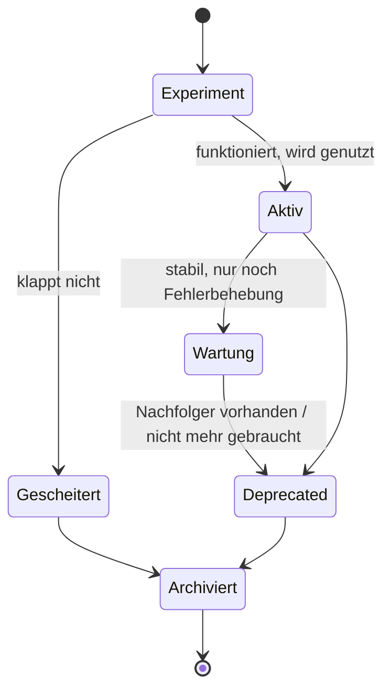

# 🗄️ Repositories pflegen & archivieren

Über die Jahre entstehen im Labor sehr viele Repositories: Gerätesteuerungen, Bibliotheken, Experimente, Vorlagen. Damit andere sie finden und richtig einschätzen können, braucht jedes Repository einen **erkennbaren Status** – vor allem die, die nicht mehr gepflegt werden.

<!-- TOC -->
## Inhaltsverzeichnis

- [Lebenszyklus eines Repositorys](#lebenszyklus-eines-repositorys)
- [Jedes Repository braucht](#jedes-repository-braucht)
- [Deprecated kennzeichnen](#deprecated-kennzeichnen)
- [Archivieren statt löschen](#archivieren-statt-löschen)
- [Ordnung innerhalb eines Repositorys](#ordnung-innerhalb-eines-repositorys)
- [Übersicht über alle Repositories](#übersicht-über-alle-repositories)
<!-- /TOC -->

## Lebenszyklus eines Repositorys



| Status | Bedeutung | Erkennbar an |
| --- | --- | --- |
| **Experiment** | Ausprobieren, Ergebnis offen | Hinweis „experimentell / ungetestet“ in der README |
| **Aktiv** | Wird genutzt und weiterentwickelt | Aktuelle Commits, vollständige README |
| **Wartung** | Funktioniert, nur noch Fehlerbehebungen | Hinweis in der README |
| **Deprecated** | Soll nicht mehr verwendet werden | **Hinweis mit Nachfolger** ganz oben in der README |
| **Archiviert** | Schreibgeschützt, nur noch zur Dokumentation | GitHub-Banner „This repository has been archived“ |
| **Gescheitert** | Ansatz hat nicht funktioniert | README erklärt, **warum** – das ist wertvolles Wissen |

---

## Jedes Repository braucht

* [ ] Eine **README** mit Zweck, Installation, Konfiguration, Start, Status (→ [Dokumentation](Dokumentation.md))
* [ ] Eine **Beschreibung** (About) und **Topics** auf GitHub, z. B. `openhab`, `smart-home`, `mqtt`, `raspberry-pi`
* [ ] Eine **Lizenz** (`LICENSE`) – ohne Lizenz dürfen andere den Code rechtlich nicht verwenden
* [ ] Eine **`.gitignore`**, die Geheimnisse, virtuelle Umgebungen und Build-Ergebnisse ausschließt
* [ ] **Keine Zugangsdaten**, Tokens oder internen Details, die nicht öffentlich sein sollen
* [ ] Angabe der **unterstützten Versionen** (Python, openHAB, Betriebssystem, Hardware)

---

## Deprecated kennzeichnen

Ganz oben in die README:

```markdown
> [!WARNING]
> **Deprecated** – This project is no longer maintained.
> It has been replaced by [webtv-openhab](https://github.com/Michdo93/webtv-openhab).
> Kept for reference only.
```

Auf GitHub wird `> [!WARNING]` als farbig hervorgehobener Hinweis dargestellt. Zusätzlich:

1. Die **Beschreibung** (About) beginnen mit `[DEPRECATED]`.
2. Im Nachfolger-Repository auf den Vorgänger verweisen („replaces …“).
3. Prüfen, ob im Labor noch etwas davon **läuft** (Services, Cron-Jobs, Container, Exec-Whitelist-Einträge) – und es entfernen.
4. Nach einer Übergangszeit **archivieren**.

---

## Archivieren statt löschen

**GitHub → Settings → General → Danger Zone → Archive this repository.**

| | Archivieren | Löschen |
| --- | --- | --- |
| Code und Historie | bleiben lesbar | weg |
| Issues, Pull Requests, Commits | nicht mehr möglich (schreibgeschützt) | weg |
| Links von anderswo | funktionieren weiter | brechen |
| Rückgängig machen | jederzeit (*Unarchive*) | nicht möglich |

> Nicht mehr gepflegte Repositories enthalten oft Erkenntnisse, die später wieder gebraucht werden – z. B. dekompilierte Apps, Protokollanalysen oder Gründe, warum ein Weg nicht funktioniert hat. **Im Zweifel archivieren, nicht löschen.**

---

## Ordnung innerhalb eines Repositorys

Ein häufiges Problem in Laborprojekten: mehrere Varianten desselben Codes (`main.py`, `main2.py`, `main_final.py`, `test_neu.py`) – und niemand weiß mehr, welche die richtige ist.

* **Eine** funktionierende Variante im Hauptverzeichnis, Startbefehl in der README.
* Experimente in Branches statt in Dateinamen.
* Alte Varianten, die man behalten will, in `archive/` mit einer kurzen Notiz, warum sie nicht mehr verwendet werden.
* Funktionierende Stände mit **Tags** bzw. **Releases** markieren (`v1.0.0`, Semantic Versioning).
* Den Stand, der auf einem Gerät tatsächlich läuft, in der README nennen („läuft auf pi-beamer seit …“) oder per Tag markieren.

---

## Übersicht über alle Repositories

Bei vielen Repositories lohnt sich eine **zentrale Übersicht** mit Status, Zweck und Zuständigkeit – im Smart Home Labor ist das die [Repository-Übersicht im Labor-Backlog](https://github.com/Michdo93/Smart-Home-Labor-Backlog/blob/main/Repositories.md). Ergänzend helfen auf GitHub:

* **Topics** zum Filtern (Suche z. B. `user:Michdo93 topic:openhab` auf github.com),
* **angepinnte Repositories** auf dem Profil für die wichtigsten Projekte,
* eine **Profil-README** mit Kategorien und Links.

---
