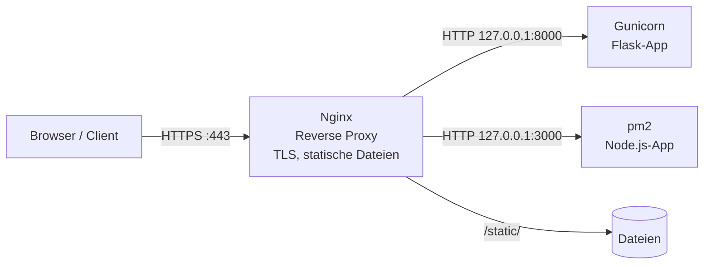
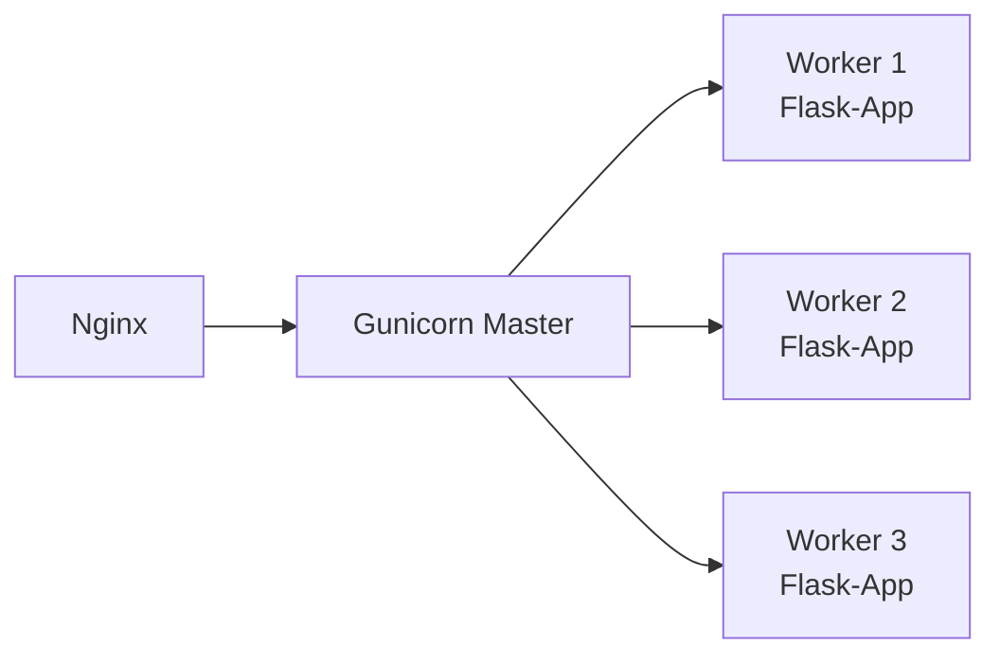

# 🌍 Web-Server & Deployment

Viele Projekte im Labor haben eine Weboberfläche oder eine REST-API: Dashboards, Gerätesteuerungen, kleine Tools. Während der Entwicklung startet man sie mit `python3 app.py` oder `node app.js`. Für den **dauerhaften Betrieb** ist das aber der falsche Weg. Dieses Kapitel beschreibt, wie wir Webanwendungen **richtig betreiben**.

<!-- TOC -->
## Inhaltsverzeichnis

- [Die Grundregeln](#die-grundregeln)
- [Architektur: Reverse Proxy](#architektur-reverse-proxy)
- [Warum Nginx statt Apache2?](#warum-nginx-statt-apache2)
- [Nginx](#nginx)
  - [Installation und Grundbefehle](#installation-und-grundbefehle)
  - [Verzeichnisstruktur (Debian/Ubuntu)](#verzeichnisstruktur-debianubuntu)
  - [Beispiel: Reverse Proxy mit HTTPS](#beispiel-reverse-proxy-mit-https)
- [Flask mit Gunicorn](#flask-mit-gunicorn)
  - [Warum nicht flask run?](#warum-nicht-flask-run)
  - [Anwendung](#anwendung)
  - [Als systemd-Service](#als-systemd-service)
- [Node.js mit pm2](#nodejs-mit-pm2)
  - [Warum pm2?](#warum-pm2)
  - [Grundbefehle](#grundbefehle)
  - [Konfigurationsdatei](#konfigurationsdatei)
- [Statische Seiten](#statische-seiten)
- [Fehlersuche](#fehlersuche)
- [Checkliste](#checkliste)
<!-- /TOC -->

## Die Grundregeln

| Situation | So machen wir es | Nicht so |
| --- | --- | --- |
| Web-Server / Reverse Proxy | **Nginx** | Apache2 (nur mit gutem Grund) |
| Flask- (oder Django-)Anwendung | **Gunicorn** als Anwendungsserver, als systemd-Service, hinter Nginx | `python3 app.py`, `flask run` |
| Node.js-Anwendung | **pm2** als Prozessmanager, hinter Nginx | `node app.js` in einer offenen SSH-Sitzung |
| Statische Seiten (HTML/CSS/JS) | Direkt von **Nginx** ausliefern | Python-/Node-Server nur für statische Dateien |
| Verschlüsselung | **HTTPS** am Nginx, Zertifikat von Anfang an | HTTP „erst mal zum Testen“ |

---

## Architektur: Reverse Proxy



Nginx nimmt **alle** Anfragen von außen an und

* **terminiert TLS** (HTTPS) an einer Stelle,
* liefert **statische Dateien** sehr effizient aus,
* **leitet dynamische Anfragen weiter** an die Anwendungsserver, die nur auf `127.0.0.1` lauschen,
* übernimmt Komprimierung, Caching, Größenlimits, Zugriffsbeschränkungen und Logging.

So ist **keine** Anwendung direkt aus dem Netz erreichbar, und mehrere Anwendungen teilen sich Port 443 (unterschieden nach Hostname oder Pfad). Das ist ein klassisches [Proxy-Pattern](../Design%20Pattern/Strukturmuster/Proxy.md) auf Netzwerkebene.

---

## Warum Nginx statt Apache2?

Beide sind ausgereift – im Labor setzen wir einheitlich auf **Nginx**:

| | Nginx | Apache2 |
| --- | --- | --- |
| Architektur | Ereignisgesteuert, wenige Worker-Prozesse | Klassisch prozess-/threadbasiert (MPMs) |
| Ressourcen | Sehr sparsam – ideal für Raspberry Pi und kleine VMs | Höherer Speicherbedarf bei vielen Verbindungen |
| Reverse Proxy / WebSockets | Kernaufgabe, einfach konfiguriert | Möglich über Module |
| Konfiguration | Zentral, kein `.htaccess` | `.htaccess` pro Verzeichnis möglich |
| Einheitlichkeit | Eine Konfigurationsweise für alle Laborsysteme | – |

Der wichtigste Grund ist die **Einheitlichkeit**: Wer im Labor ein System betreut, soll überall dieselbe Struktur vorfinden.

---

## Nginx

### Installation und Grundbefehle

```bash
sudo apt install nginx
sudo systemctl enable --now nginx
sudo nginx -t                       # test configuration - ALWAYS before reload
sudo systemctl reload nginx         # apply configuration without downtime
```

### Verzeichnisstruktur (Debian/Ubuntu)

| Pfad | Inhalt |
| --- | --- |
| `/etc/nginx/nginx.conf` | Hauptkonfiguration |
| `/etc/nginx/sites-available/` | Eine Datei pro Website/Anwendung |
| `/etc/nginx/sites-enabled/` | Symlinks auf aktive Seiten |
| `/var/log/nginx/access.log`, `error.log` | Logs |
| `/var/www/` | Übliches Verzeichnis für statische Inhalte |

```bash
sudo ln -s /etc/nginx/sites-available/dashboard /etc/nginx/sites-enabled/
sudo rm /etc/nginx/sites-enabled/default        # remove default page
```

### Beispiel: Reverse Proxy mit HTTPS

```nginx
# /etc/nginx/sites-available/dashboard
server {
    listen 80;
    server_name dashboard.lab.local;
    return 301 https://$host$request_uri;        # always redirect to HTTPS
}

server {
    listen 443 ssl;
    http2 on;                                    # nginx >= 1.25; older: 'listen 443 ssl http2;'
    server_name dashboard.lab.local;

    ssl_certificate     /etc/ssl/lab/dashboard.crt;
    ssl_certificate_key /etc/ssl/lab/dashboard.key;
    ssl_protocols       TLSv1.2 TLSv1.3;

    client_max_body_size 10m;

    # static files served directly by nginx
    location /static/ {
        alias /opt/lab/dashboard/static/;
        expires 7d;
    }

    # API -> Gunicorn (Flask)
    location /api/ {
        proxy_pass http://127.0.0.1:8000;
        proxy_set_header Host              $host;
        proxy_set_header X-Real-IP         $remote_addr;
        proxy_set_header X-Forwarded-For   $proxy_add_x_forwarded_for;
        proxy_set_header X-Forwarded-Proto $scheme;
    }

    # live updates -> Node.js (WebSockets)
    location /ws/ {
        proxy_pass http://127.0.0.1:3000;
        proxy_http_version 1.1;
        proxy_set_header Upgrade    $http_upgrade;
        proxy_set_header Connection "upgrade";
        proxy_set_header Host       $host;
        proxy_read_timeout 1h;
    }
}
```

Zertifikate: eigene CA im Labornetz oder Let's Encrypt per **Certbot** (`sudo certbot --nginx -d host.example.org`) – siehe [Zertifikate](Zertifikate.md).

---

## Flask mit Gunicorn

### Warum nicht `flask run`?

Der eingebaute Server von Flask (Werkzeug) ist ein **Entwicklungsserver**. Flask gibt beim Start selbst die Warnung aus, ihn nicht im Produktivbetrieb zu verwenden. Gründe:

* nicht auf Last, Stabilität und Sicherheit ausgelegt,
* im Debug-Modus kann über den interaktiven Debugger **beliebiger Code ausgeführt** werden,
* kein Prozessmanagement: stürzt er ab, bleibt er aus.

**Gunicorn** („Green Unicorn“) ist ein **WSGI-Server**: Er startet mehrere **Worker-Prozesse**, verteilt die Anfragen und ersetzt abgestürzte Worker automatisch.



### Anwendung

```python
# /opt/lab/dashboard/app.py
from flask import Flask, jsonify

app = Flask(__name__)


@app.get("/api/health")
def health():
    return jsonify(status="ok")


if __name__ == "__main__":
    app.run(debug=True)          # development only
```

```bash
cd /opt/lab/dashboard
python3 -m venv .venv
.venv/bin/pip install flask gunicorn
.venv/bin/gunicorn --workers 3 --bind 127.0.0.1:8000 app:app     # module:variable
```

**Faustregel für Worker:** `2 × CPU-Kerne + 1`; auf einem Raspberry Pi reichen meist 2–3. Bei WebSockets oder langen Verbindungen spezielle Worker-Klassen (`gthread`, `eventlet`, `gevent`) verwenden.

### Als systemd-Service

```ini
# /etc/systemd/system/dashboard.service
[Unit]
Description=Lab dashboard (Flask via Gunicorn)
After=network-online.target
Wants=network-online.target

[Service]
Type=exec
User=labservice
Group=www-data
WorkingDirectory=/opt/lab/dashboard
EnvironmentFile=-/etc/lab/dashboard.env
ExecStart=/opt/lab/dashboard/.venv/bin/gunicorn \
    --workers 3 \
    --bind 127.0.0.1:8000 \
    --access-logfile - \
    app:app
ExecReload=/bin/kill -s HUP $MAINPID
Restart=on-failure
RestartSec=5

[Install]
WantedBy=multi-user.target
```

Alle Optionen erklärt das Kapitel [systemd-Services](../Linux%20%26%20Werkzeuge/systemd-Services.md). Ein `HUP`-Signal lädt den Code neu, ohne Verbindungen abzubrechen.

---

## Node.js mit pm2

### Warum pm2?

`node app.js` läuft nur, solange die Konsole offen ist, startet nach einem Absturz oder Neustart nicht wieder und schreibt keine Logs. **pm2** ist ein **Prozessmanager** für Node.js, der genau das übernimmt:

* automatischer **Neustart** bei Absturz,
* **Autostart** beim Booten (über eine systemd-Unit, die pm2 selbst erzeugt),
* **Logs** pro Anwendung mit Rotation (Modul `pm2-logrotate`),
* **Cluster-Modus**: mehrere Instanzen auf mehreren CPU-Kernen,
* Überwachung von CPU und Speicher (`pm2 monit`).

### Grundbefehle

```bash
sudo npm install -g pm2

pm2 start app.js --name dashboard-ws
pm2 list                         # status of all apps
pm2 logs dashboard-ws            # live logs
pm2 restart dashboard-ws
pm2 reload dashboard-ws          # zero-downtime reload (cluster mode)
pm2 stop dashboard-ws
pm2 delete dashboard-ws

pm2 startup systemd              # prints a command - run it with sudo
pm2 save                         # remember current app list for reboot
```

> `pm2 startup` muss **als der Benutzer** ausgeführt werden, unter dem die Anwendungen laufen sollen – nicht als root. Nach jeder Änderung der App-Liste `pm2 save` nicht vergessen.

### Konfigurationsdatei

Statt langer Kommandozeilen gehört die Konfiguration ins Repository:

```javascript
// ecosystem.config.js
module.exports = {
  apps: [
    {
      name: "dashboard-ws",
      script: "./server.js",
      cwd: "/opt/lab/dashboard-ws",
      instances: 1,
      autorestart: true,
      max_restarts: 10,
      restart_delay: 5000,
      max_memory_restart: "200M",
      env: {
        NODE_ENV: "production",
        PORT: 3000,
        HOST: "127.0.0.1",
      },
    },
  ],
};
```

```bash
pm2 start ecosystem.config.js
pm2 save
```

> **pm2 oder systemd?** Eine Node-Anwendung lässt sich auch direkt als systemd-Service betreiben. Wir verwenden für Node.js **einheitlich pm2**, weil es für Node zugeschnittene Funktionen (Cluster, Zero-Downtime-Reload, Speicherlimit) mitbringt und alle Node-Anwendungen auf einem System mit `pm2 list` auf einen Blick sichtbar sind.

---

## Statische Seiten

Reine HTML/CSS/JS-Anwendungen (z. B. ein Dashboard, das direkt die openHAB REST API anspricht) brauchen **keinen** Anwendungsserver:

```nginx
server {
    listen 443 ssl;
    server_name panel.lab.local;
    ssl_certificate     /etc/ssl/lab/panel.crt;
    ssl_certificate_key /etc/ssl/lab/panel.key;

    root /var/www/panel;
    index index.html;

    location / {
        try_files $uri $uri/ /index.html;    # single-page apps
    }
}
```

Bei Zugriffen auf eine API unter einem anderen Hostnamen auf **CORS** achten – oder die API über denselben Nginx unter einem Pfad (`/rest/`) bereitstellen, dann entfällt das Problem.

---

## Fehlersuche

| Symptom | Ursache (meist) | Prüfen |
| --- | --- | --- |
| **502 Bad Gateway** | Anwendung läuft nicht oder lauscht auf anderem Port | `systemctl status dashboard`, `pm2 list`, `ss -tlnp` |
| **504 Gateway Timeout** | Anwendung antwortet zu langsam | Logs der Anwendung, `proxy_read_timeout` |
| **403 Forbidden** | Dateirechte: Nginx (`www-data`) kann Datei/Verzeichnis nicht lesen | `sudo -u www-data ls /pfad` (→ [Benutzer, Gruppen & Rechte](../Linux%20%26%20Werkzeuge/Benutzer%2C%20Gruppen%20%26%20Rechte.md)) |
| **404** bei Unterseiten einer SPA | `try_files` fehlt | Konfiguration |
| Nginx startet nicht | Syntaxfehler, Port belegt | `sudo nginx -t`, `journalctl -u nginx` |
| WebSocket bricht ab | `Upgrade`-Header fehlen, Timeout | `location`-Block für WebSockets |
| Zertifikatsfehler im Browser | Falscher Hostname, abgelaufen, CA nicht vertrauenswürdig | `openssl s_client -connect host:443` |

```bash
sudo tail -f /var/log/nginx/error.log
curl -vk https://dashboard.lab.local/api/health
curl -v http://127.0.0.1:8000/api/health      # bypass nginx: is the app itself ok?
```

---

## Checkliste

* [ ] Anwendung lauscht nur auf `127.0.0.1`, öffentlich erreichbar ist nur Nginx
* [ ] HTTPS mit gültigem Zertifikat, HTTP leitet auf HTTPS um
* [ ] Flask/Django über **Gunicorn** als systemd-Service, Node.js über **pm2** mit `pm2 startup` + `pm2 save`
* [ ] Debug-Modus aus, `NODE_ENV=production`
* [ ] Eigener Benutzer, kein root
* [ ] Abhängigkeiten in `venv` bzw. `package.json`/`package-lock.json` mit festen Versionen
* [ ] Konfiguration (Nginx-Site, Service-Unit, `ecosystem.config.js`) im Repository
* [ ] Neustart des Systems getestet – kommt alles von selbst wieder hoch?
* [ ] In der README dokumentiert: URL, Ports, Start/Stopp, Logs

---
