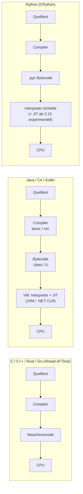

# 🔤 Compiler, Interpreter & JIT

Ein Prozessor versteht nur **Maschinencode** – Folgen von Bits, die für einen bestimmten Befehlssatz (x86-64, ARM, RISC-V …) stehen. Jede höhere Programmiersprache muss also irgendwann in Maschinencode übersetzt werden. Die Frage ist nur: **wann** und **von wem**?

<!-- TOC -->
## Inhaltsverzeichnis

- [Analogie: Übersetzer und Dolmetscher](#analogie-übersetzer-und-dolmetscher)
- [Die Realität: fast alles ist gemischt](#die-realität-fast-alles-ist-gemischt)
- [Bytecode und virtuelle Maschinen](#bytecode-und-virtuelle-maschinen)
- [JIT – Just-in-Time-Kompilierung](#jit--just-in-time-kompilierung)
- [Transpiler](#transpiler)
- [Was bedeutet das für die Praxis?](#was-bedeutet-das-für-die-praxis)
<!-- /TOC -->

## Analogie: Übersetzer und Dolmetscher

| | Compiler | Interpreter |
| --- | --- | --- |
| Analogie | **Übersetzer** eines Buches | **Simultandolmetscher** |
| Wann wird übersetzt? | **Vorab**, einmal komplett | **Während der Ausführung**, Stück für Stück |
| Ergebnis | Eigenständige Datei (Programm) | Kein eigenständiges Ergebnis – der Dolmetscher muss immer dabei sein |
| Fehler | Viele Fehler **vor** dem Start (Compilerfehler) | Fehler erst, wenn die Zeile **ausgeführt** wird |
| Geschwindigkeit | Schnelle Ausführung, Übersetzung dauert | Sofortiger Start, langsamere Ausführung |
| Beispiele | C, C++, Rust, Go, Fortran | Shell (Bash), klassisch BASIC; Python/JS mit Einschränkungen (s. u.) |

**Wortherkunft:** *to compile* = **zusammentragen, zusammenstellen**. Grace Hopper nannte ihr Programm **A-0** (1952) einen *Compiler*, weil es Unterprogramme aus einer Bibliothek **zusammentrug** und zu einem Programm verband – also eher das, was wir heute einen Linker nennen würden. Der Name blieb, die Bedeutung verschob sich zur Übersetzung. *Interpreter* kommt von lateinisch *interpres* = **Vermittler, Dolmetscher**.

---

## Die Realität: fast alles ist gemischt

Die Einteilung „kompilierte vs. interpretierte Sprache“ ist eine Vereinfachung. Eigentlich ist es eine Eigenschaft der **Implementierung**, nicht der Sprache. Die meisten modernen Sprachen nutzen eine **Zwischenstufe**:



| Sprache | Typischer Ablauf |
| --- | --- |
| **C, C++** | Ahead-of-Time (AOT) zu Maschinencode |
| **Java** | `javac` → Bytecode (`.class`) → JVM interpretiert und **JIT**-kompiliert heiße Stellen (HotSpot) |
| **C#** | Compiler → IL (Intermediate Language) → .NET-Runtime mit JIT; optional Native AOT |
| **Python (CPython)** | Quelltext → Bytecode (`__pycache__/*.pyc`) → Interpreter; **PyPy** hat einen JIT |
| **JavaScript** | Engine (V8, SpiderMonkey) parst, interpretiert zuerst und JIT-kompiliert häufig genutzten Code |
| **Bash** | Echter Interpreter, Zeile für Zeile |

```python
# Python really compiles - look at the bytecode
import dis

def celsius_to_fahrenheit(c):
    return c * 9 / 5 + 32

dis.dis(celsius_to_fahrenheit)
```

---

## Bytecode und virtuelle Maschinen

**Bytecode** ist ein kompakter Zwischencode für eine **gedachte (virtuelle) Maschine**. Vorteil: Derselbe Bytecode läuft überall dort, wo es die VM gibt – Javas Versprechen *„Write once, run anywhere“*.

* Der Name kommt daher, dass die Befehle (Opcodes) ursprünglich **ein Byte** groß waren.
* Die VM ist ein Programm, das Bytecode ausführt – nicht zu verwechseln mit einer **System-VM** (Proxmox, VirtualBox), die einen ganzen Rechner emuliert.

---

## JIT – Just-in-Time-Kompilierung

Ein **JIT-Compiler** übersetzt Bytecode **während der Laufzeit** in Maschinencode – aber nur die Teile, die oft ausgeführt werden („Hot Spots“). Er kann dabei Informationen nutzen, die ein AOT-Compiler nicht hat (welche Typen tatsächlich vorkommen, welche Zweige häufig genommen werden).

| | AOT | JIT |
| --- | --- | --- |
| Start | schnell | langsamer („Warm-up“) |
| Spitzenleistung | sehr gut | sehr gut, teils besser durch Laufzeitinfos |
| Speicher | gering | höher (Compiler läuft mit) |
| Einsatz | Embedded, Systemprogramme, CLI-Tools | Server, langlaufende Anwendungen |

Der Begriff stammt aus der Produktion: **Just-in-Time** heißt, Teile werden **genau dann geliefert, wenn sie gebraucht werden** (Toyota-Produktionssystem).

---

## Transpiler

Ein **Transpiler** (*source-to-source compiler*) übersetzt zwischen **Hochsprachen** auf ähnlicher Abstraktionsebene:

* TypeScript → JavaScript (`tsc`)
* Modernes JavaScript → altes JavaScript (Babel, → [Polyfill & Shim](../Workarounds%20%26%20Hacks/Polyfill%20%26%20Shim.md))
* Sass/SCSS → CSS
* Cython: Python-ähnlicher Code → C

---

## Was bedeutet das für die Praxis?

* **Fehler früh finden:** In interpretierten Sprachen gibt es keinen Compiler, der Tippfehler vorab meldet. Deshalb sind **Linter** (`ruff`), **Typprüfer** (`mypy`) und **Tests** in Python besonders wichtig.
* **`__pycache__`** und `*.pyc` gehören in die `.gitignore`.
* **Performance in Python:** Rechenintensives in Bibliotheken auslagern, die in C geschrieben sind (`numpy`, `opencv`) – dort läuft kompilierter Code.
* **Plattform:** Kompilierte Programme laufen nur auf der Architektur, für die sie gebaut wurden → [Cross-Compiling](Cross-Compiling.md). Bytecode (Java, Python) ist portabel, **native Erweiterungen** (C-Module in Python-Paketen) aber nicht.

---
