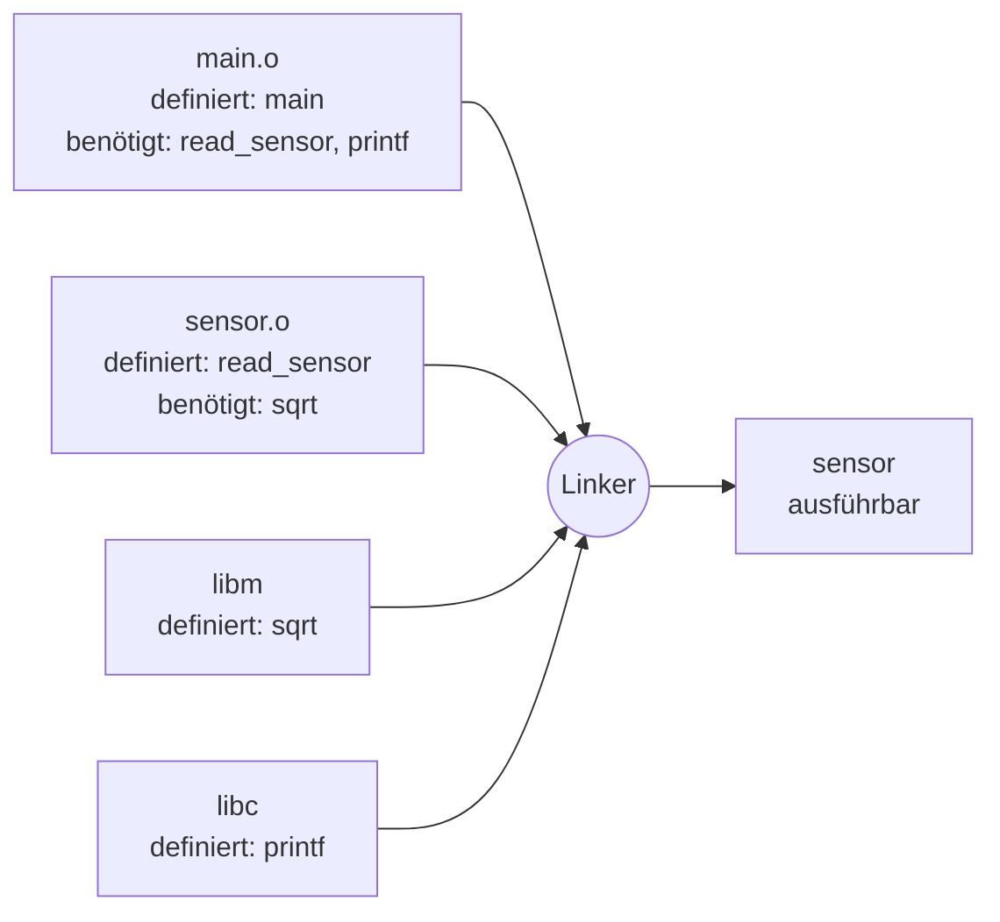

# 🔗 Linker & Bibliotheken

Der **Linker** (Binder) fügt die einzeln kompilierten **Objektdateien** und die benutzten **Bibliotheken** zu einem ausführbaren Programm zusammen. Er sorgt dafür, dass ein Aufruf von `printf()` oder `mqtt_connect()` auch tatsächlich bei der richtigen Funktion landet.

<!-- TOC -->
## Inhaltsverzeichnis

- [Warum braucht man einen Linker?](#warum-braucht-man-einen-linker)
- [Symbole ansehen](#symbole-ansehen)
- [Statisches vs. dynamisches Linken](#statisches-vs-dynamisches-linken)
- [Laden zur Laufzeit](#laden-zur-laufzeit)
- [Typische Linkerfehler](#typische-linkerfehler)
- [Python und Bibliotheken](#python-und-bibliotheken)
<!-- /TOC -->

## Warum braucht man einen Linker?

Größere Programme bestehen aus vielen Quelldateien. Jede wird **einzeln** kompiliert (das spart Zeit: nur Geändertes muss neu übersetzt werden). Dabei weiß der Compiler bei `main.c` noch nicht, **wo** die Funktion `read_sensor()` aus `sensor.c` später im Speicher liegt. Er hinterlässt in der Objektdatei eine **offene Referenz** (ein *unresolved symbol*). Der Linker löst alle diese Referenzen auf.



**Analogie:** Mehrere Autoren schreiben Kapitel eines Buches mit Querverweisen („siehe Seite ??“). Der Linker ist der **Setzer**, der die Kapitel zusammenfügt und alle Seitenzahlen einträgt.

---

## Symbole ansehen

```bash
gcc -c sensor.c -o sensor.o
nm sensor.o            # T = defined in text (code), U = undefined (needed from elsewhere)
#   0000000000000000 T read_sensor
#                    U sqrt
```

---

## Statisches vs. dynamisches Linken

| | Statisch | Dynamisch |
| --- | --- | --- |
| Bibliotheksdatei | `.a` (Linux), `.lib` (Windows) | `.so` (Linux), `.dll` (Windows), `.dylib` (macOS) |
| Wann eingebunden? | Beim **Bauen** in das Programm kopiert | Beim **Start** vom Loader nachgeladen |
| Programmgröße | groß | klein |
| Abhängigkeiten auf dem Zielsystem | keine | Bibliothek muss in passender Version vorhanden sein |
| Sicherheitsupdates der Bibliothek | Programm muss neu gebaut werden | Bibliothek austauschen genügt |
| Speicher bei vielen Prozessen | jeder Prozess hat eigene Kopie | gemeinsam genutzt |
| Typisch für | Embedded, einzelne Tools, Go/Rust-Binaries | Linux-Distributionen, Desktop |

```bash
# dynamic (default)
gcc main.o sensor.o -lm -o sensor
ldd ./sensor                     # which shared libraries are needed?

# static
gcc main.o sensor.o -lm -static -o sensor-static
ls -lh sensor sensor-static      # compare sizes
```

**`-l` und `-L`:** `-lm` sucht eine Bibliothek namens `libm.so`/`libm.a`; `-L/pfad` fügt ein Suchverzeichnis hinzu. **Reihenfolge zählt** beim GNU-Linker: Bibliotheken **nach** den Objektdateien angeben, die sie brauchen.

---

## Laden zur Laufzeit

Beim Start eines dynamisch gelinkten Programms sucht der **Loader** (`ld-linux.so`) die Bibliotheken in:

1. `RPATH`/`RUNPATH` im Programm (beim Linken gesetzt: `-Wl,-rpath,/opt/lab/lib`)
2. `LD_LIBRARY_PATH` (Umgebungsvariable – gut zum Testen, schlecht für den Dauerbetrieb)
3. Systempfade aus `/etc/ld.so.conf` (Cache via `sudo ldconfig`)

---

## Typische Linkerfehler

| Fehlermeldung | Bedeutung | Lösung |
| --- | --- | --- |
| `undefined reference to 'sqrt'` | Funktion deklariert (Header), aber Bibliothek nicht gelinkt | `-lm` ergänzen, Reihenfolge prüfen |
| `undefined reference to 'read_sensor'` | Objektdatei fehlt im Linkaufruf / Build-System | `sensor.c` zum Build hinzufügen |
| `multiple definition of 'counter'` | Variable/Funktion in **Header** definiert und mehrfach eingebunden | Im Header nur `extern int counter;`, Definition in **einer** `.c`-Datei |
| `cannot find -lpaho-mqtt3c` | Bibliothek (Entwicklungspaket) nicht installiert oder nicht im Suchpfad | `sudo apt install libpaho-mqtt-dev`, `-L` |
| `error while loading shared libraries: libX.so.1: cannot open shared object file` | Laufzeit: Loader findet `.so` nicht | Paket installieren, `ldconfig`, `RPATH` |
| `undefined reference` bei C-Funktion aus C++ | **Name Mangling**: C++ verändert Funktionsnamen | `extern "C" { #include "lib.h" }` |
| `wrong ELF class: ELFCLASS32` / `cannot execute binary file: Exec format error` | Falsche Architektur (x86 vs. ARM) | Für Zielarchitektur bauen (→ [Cross-Compiling](Cross-Compiling.md)) |

> **Faustregel:** Compilerfehler zeigen meist eine **Zeilennummer** – Linkerfehler nicht. Wenn die Meldung `ld` oder `collect2` erwähnt, liegt das Problem beim **Linken**, nicht im Code der Zeile.

---

## Python und Bibliotheken

Auch Python-Pakete können native Bibliotheken enthalten (`.so` / `.pyd`), z. B. `numpy`, `opencv-python`, `cryptography`. Typische Fehler wie `ImportError: libGL.so.1: cannot open shared object file` sind daher **Linker-/Loader-Fehler** – Lösung: fehlende Systembibliothek installieren (`sudo apt install libgl1`) oder ein `-headless`-Paket verwenden.

---
