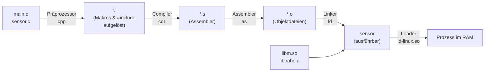

# ⚙️ Compiler & Build

Wie wird aus Quelltext ein laufendes Programm? Dieser Ordner erklärt die Werkzeugkette – vom Präprozessor bis zum Cross-Compiling für den Raspberry Pi.

<!-- TOC -->
## Inhaltsverzeichnis

- [Übersicht](#übersicht)
- [Der Weg vom Quelltext zum Programm (C/C++)](#der-weg-vom-quelltext-zum-programm-cc)
- [Begriffe im Überblick](#begriffe-im-überblick)
<!-- /TOC -->

## Übersicht

| Dokument | Inhalt |
| --- | --- |
| [Compiler, Interpreter & JIT](Compiler%2C%20Interpreter%20%26%20JIT.md) | Kompilieren vs. Interpretieren, Bytecode, virtuelle Maschinen, Just-in-Time, AOT, Transpiler |
| [Linker & Bibliotheken](Linker%20%26%20Bibliotheken.md) | Objektdateien, statisches vs. dynamisches Linken, `.a`/`.so`/`.dll`, `ldd`, typische Linkerfehler |
| [Build-Systeme](Build-Systeme.md) | Make, CMake, Gradle/Maven, MSBuild/dotnet, Python-Packaging, ROS `colcon` |
| [Cross-Compiling](Cross-Compiling.md) | Für eine andere Architektur bauen: Toolchains, Target-Triplets, sysroot, CMake-Toolchain-Datei, Docker `buildx`, Go/Rust |

---

## Der Weg vom Quelltext zum Programm (C/C++)



```bash
gcc -E main.c -o main.i      # preprocess only
gcc -S main.c -o main.s      # compile to assembly
gcc -c main.c -o main.o      # assemble to object file
gcc main.o sensor.o -lm -o sensor   # link
gcc -v main.c                # show every step gcc performs
```

Im Alltag ruft man nur `gcc`/`g++` auf – das Programm ist ein **Compiler-Treiber**, der alle Stufen nacheinander startet.

---

## Begriffe im Überblick

| Begriff | Kurz erklärt |
| --- | --- |
| **Quelltext / Source Code** | Vom Menschen geschriebenes Programm |
| **Compiler** | Übersetzt Quelltext **vorab** in eine andere Sprache (meist Maschinencode oder Bytecode) |
| **Interpreter** | Führt Quelltext (oder Bytecode) **direkt** aus, Anweisung für Anweisung |
| **Assembler** | Übersetzt Assemblersprache (menschenlesbare Maschinenbefehle) in Maschinencode |
| **Linker** | Fügt Objektdateien und Bibliotheken zu einem ausführbaren Programm zusammen |
| **Loader** | Lädt das Programm beim Start in den Speicher und löst dynamische Bibliotheken auf |
| **Bytecode** | Zwischencode für eine virtuelle Maschine (Java `.class`, Python `.pyc`, .NET IL) |
| **JIT** | Just-in-Time-Compiler: übersetzt Bytecode **zur Laufzeit** in Maschinencode |
| **Transpiler** | Übersetzt zwischen Hochsprachen (TypeScript → JavaScript) |
| **Toolchain** | Zusammengehörige Werkzeuge: Compiler, Assembler, Linker, Debugger, Bibliotheken |
| **Build-System** | Automatisiert den ganzen Ablauf und baut nur neu, was sich geändert hat |
| **Host / Target** | Rechner, **auf dem** gebaut wird / Rechner, **für den** gebaut wird |

---
