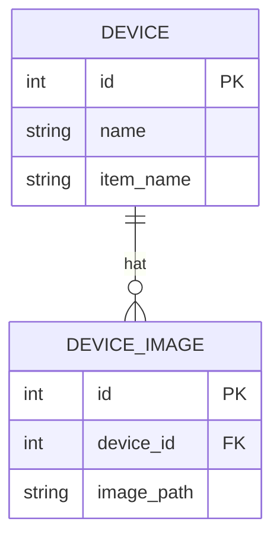
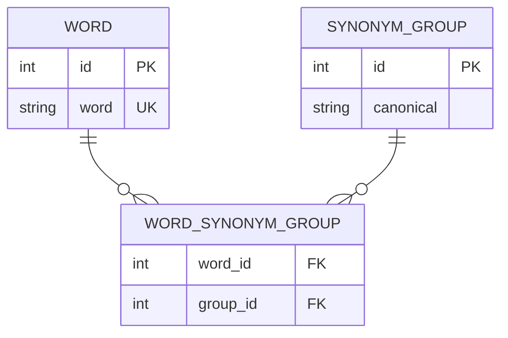

# 🗃️ Relationale Modellierung

Fast jede Anwendung speichert Daten: Benutzer, Geräte, Trainingsbeispiele, Konfigurationen. Eine gut durchdachte **Datenbankstruktur** spart später viel Ärger – eine schlecht durchdachte führt zu doppelten, widersprüchlichen Daten und komplizierten Abfragen. Dieses Kapitel erklärt die Grundlagen des relationalen Modells an Beispielen aus dem Smart Home.

<!-- TOC -->
## Inhaltsverzeichnis

- [Grundbegriffe](#grundbegriffe)
- [Beziehungen (Kardinalitäten)](#beziehungen-kardinalitäten)
  - [1:1](#11)
  - [1:n](#1n)
  - [n:m](#nm)
- [Beispiel mit SQLite](#beispiel-mit-sqlite)
- [Normalisierung in Kürze](#normalisierung-in-kürze)
- [Dateien in der Datenbank?](#dateien-in-der-datenbank)
- [Datenbanksysteme im Überblick](#datenbanksysteme-im-überblick)
  - [ORM](#orm)
- [Gute Praxis](#gute-praxis)
<!-- /TOC -->

## Grundbegriffe

| Begriff | Bedeutung | Beispiel |
| --- | --- | --- |
| **Tabelle** (Relation) | Sammlung gleichartiger Datensätze | `devices` |
| **Zeile** (Datensatz, Tupel) | Ein Eintrag | Die Küchenlampe |
| **Spalte** (Attribut) | Eine Eigenschaft mit festem Datentyp | `name TEXT` |
| **Primärschlüssel** (PK) | Identifiziert jede Zeile eindeutig | `id` |
| **Fremdschlüssel** (FK) | Verweist auf den Primärschlüssel einer anderen Tabelle | `device_images.device_id → devices.id` |
| **Constraint** | Regel, die die Datenbank erzwingt | `NOT NULL`, `UNIQUE`, `FOREIGN KEY` |
| **Index** | Beschleunigt Suchen in einer Spalte | Index auf `item_name` |

---

## Beziehungen (Kardinalitäten)

### 1:1

Jeder Datensatz in A gehört zu **höchstens einem** in B und umgekehrt. Selten; oft kann man die Tabellen zusammenlegen. Sinnvoll z. B. für selten gebrauchte oder besonders geschützte Zusatzdaten.

### 1:n

Ein Datensatz in A hat **viele** in B, jeder in B gehört zu **genau einem** in A. Der Fremdschlüssel steht auf der **n-Seite**.



Beispiel: Ein Gerät hat mehrere Referenzbilder. Die Bildpfade **nicht** als Semikolon-Liste in eine Spalte schreiben (`bild1.jpg;bild2.jpg`) – das verletzt die erste Normalform und macht Löschen, Zählen und Suchen umständlich.

### n:m

Ein Datensatz in A hat **viele** in B, und ein Datensatz in B hat **viele** in A. Das lässt sich **nicht** mit einem Fremdschlüssel abbilden – man braucht eine **Zwischentabelle** (Verknüpfungs-, Assoziations- oder *Junction*-Tabelle), die zwei Fremdschlüssel enthält.

Beispiel: **Synonyme.** Ein Wort gehört zu einer Synonymgruppe; eine Gruppe enthält viele Wörter; und ein Wort kann mehrdeutig sein und zu mehreren Gruppen gehören („Bank“ als Sitzbank und als Geldinstitut).



Weitere n:m-Beispiele im Smart Home: Benutzer ↔ Rollen, Geräte ↔ Räume (ein Gerät kann raumübergreifend sein), Items ↔ Gruppen (in openHAB kann ein Item Mitglied mehrerer Gruppen sein), Intents ↔ Entity-Typen.

---

## Beispiel mit SQLite

SQLite ist in Python eingebaut und für Prototypen, Abschlussarbeiten und viele Laborprojekte völlig ausreichend.

```python
import sqlite3

db = sqlite3.connect(":memory:")            # use a file like "assistant.db" in practice
db.execute("PRAGMA foreign_keys = ON")      # SQLite enforces foreign keys only when enabled!

db.executescript("""
CREATE TABLE word (
    id   INTEGER PRIMARY KEY,
    word TEXT NOT NULL UNIQUE
);
CREATE TABLE synonym_group (
    id        INTEGER PRIMARY KEY,
    canonical TEXT NOT NULL UNIQUE          -- value the system works with, e.g. 'ON'
);
CREATE TABLE word_synonym_group (
    word_id  INTEGER NOT NULL REFERENCES word(id) ON DELETE CASCADE,
    group_id INTEGER NOT NULL REFERENCES synonym_group(id) ON DELETE CASCADE,
    PRIMARY KEY (word_id, group_id)         -- each pair only once
);
""")


def add_synonyms(canonical: str, words: list[str]) -> None:
    db.execute("INSERT OR IGNORE INTO synonym_group (canonical) VALUES (?)", (canonical,))
    group_id = db.execute("SELECT id FROM synonym_group WHERE canonical = ?", (canonical,)).fetchone()[0]
    for w in words:
        db.execute("INSERT OR IGNORE INTO word (word) VALUES (?)", (w.lower(),))
        word_id = db.execute("SELECT id FROM word WHERE word = ?", (w.lower(),)).fetchone()[0]
        db.execute("INSERT OR IGNORE INTO word_synonym_group VALUES (?, ?)", (word_id, group_id))


add_synonyms("ON", ["an", "ein", "einschalten", "anmachen"])
add_synonyms("OFF", ["aus", "ausschalten", "ausmachen"])
add_synonyms("Kueche", ["küche", "kochbereich"])


def canonical(word: str) -> list[str]:
    rows = db.execute("""
        SELECT g.canonical
        FROM word w
        JOIN word_synonym_group wg ON wg.word_id = w.id
        JOIN synonym_group g       ON g.id = wg.group_id
        WHERE w.word = ?""", (word.lower(),)).fetchall()
    return [r[0] for r in rows]


def synonyms_of(word: str) -> list[str]:
    rows = db.execute("""
        SELECT DISTINCT w2.word
        FROM word w1
        JOIN word_synonym_group a ON a.word_id = w1.id
        JOIN word_synonym_group b ON b.group_id = a.group_id
        JOIN word w2              ON w2.id = b.word_id
        WHERE w1.word = ? AND w2.word <> w1.word
        ORDER BY w2.word""", (word.lower(),)).fetchall()
    return [r[0] for r in rows]


print(canonical("Anmachen"))        # ['ON']
print(synonyms_of("aus"))           # ['ausmachen', 'ausschalten']
print(canonical("Kochbereich"))     # ['Kueche']
```

> Synonyme müssen nicht auf **einzelne Wörter** beschränkt sein. Oft ist es sinnvoller, ganze **Phrasen** („mach hell“, „Licht an“) zu speichern – dieselbe Struktur funktioniert dafür unverändert.

---

## Normalisierung in Kürze

**Normalisierung** vermeidet Redundanz und Widersprüche. Für die Praxis reichen meist die ersten drei Normalformen:

| Normalform | Regel | Verstoß (Beispiel) | Lösung |
| --- | --- | --- | --- |
| **1. NF** | Jede Zelle enthält **einen** Wert | `image_paths = "a.jpg;b.jpg"` | Eigene Tabelle `device_images` |
| **2. NF** | Jede Spalte hängt vom **ganzen** Schlüssel ab | In `(device_id, image_id)`-Tabelle steht auch `device_name` | Gerätename nur in `devices` |
| **3. NF** | Keine Spalte hängt von einer **anderen Nicht-Schlüsselspalte** ab | `devices` enthält `room_id` **und** `room_name` | `room_name` nur in `rooms` |

> Merksatz: *„Jede Information steht an genau einer Stelle.“* Wird der Raum umbenannt, ändert man **eine** Zeile – nicht hundert.

Bewusst **denormalisieren** darf man, wenn es gute Gründe gibt (z. B. Performance bei Auswertungen) – dann dokumentiert.

---

## Dateien in der Datenbank?

Häufige Frage bei Bild- und Audiodaten (Referenzbilder für Bilderkennung, Sprachaufnahmen, Modelle):

| Ansatz | Vorteile | Nachteile | Empfehlung |
| --- | --- | --- | --- |
| **Datei im Dateisystem, Pfad in der Datenbank** | Datenbank bleibt klein und schnell; Dateien direkt nutzbar (z. B. als Trainingsdaten) | Datei und Datenbankeintrag können auseinanderlaufen (gelöschte Datei, verwaister Eintrag) | **Standard** – mit **relativen** Pfaden und Aufräumlogik |
| **BLOB in der Datenbank** | Alles in einer Datei; transaktionssicher; einfaches Backup | Datenbank wird groß; langsamer bei vielen/großen Dateien | Nur für kleine Datenmengen oder Prototypen |
| **Objektspeicher** (z. B. S3, MinIO) | Skaliert sehr gut, versionierbar | Zusätzlicher Dienst | Für größere, verteilte Systeme |

Für **trainierte Modelle** gilt dasselbe: Modelldatei im Dateisystem, in der Datenbank **Metadaten** (Version, Zeitstempel, Trainingsdaten-Stand, Messwerte, Pfad).

---

## Datenbanksysteme im Überblick

| System | Typ | Einsatz |
| --- | --- | --- |
| **SQLite** | Eingebettet, eine Datei, kein Server | Prototypen, Einzelplatz, Mobile Apps (Android: **Room** basiert auf SQLite), viele Laborprojekte |
| **MariaDB / MySQL** | Client-Server, relational | Webanwendungen mit mehreren Benutzern, openHAB-Persistence (JDBC) |
| **PostgreSQL** | Client-Server, relational, sehr standardkonform | Anspruchsvollere Anwendungen; mit Erweiterungen auch Zeitreihen (TimescaleDB) und Vektoren (pgvector) |
| **InfluxDB** | Zeitreihendatenbank | Messwerte und Zustandsverläufe (→ [Zeitreihen & openHAB Persistence](Zeitreihen%20%26%20openHAB%20Persistence.md)) |
| **Redis** | Key-Value im Arbeitsspeicher | Caching, Warteschlangen |

### ORM

Ein **Object-Relational Mapper** bildet Tabellen auf Klassen ab, sodass man im Code mit Objekten statt mit SQL arbeitet: **SQLAlchemy** (Python), **Room** (Android), **Hibernate/JPA** (Java), **Entity Framework** (C#). ORMs sparen Boilerplate; trotzdem sollte man das erzeugte SQL und das Datenmodell verstehen.

---

## Gute Praxis

* [ ] Datenmodell **vor** dem Programmieren als ER-Diagramm skizzieren
* [ ] Jede Tabelle hat einen Primärschlüssel
* [ ] Beziehungen über **Fremdschlüssel** mit passendem `ON DELETE`-Verhalten
* [ ] n:m immer über eine Zwischentabelle
* [ ] Keine Listen in einer Spalte
* [ ] Passwörter **nie im Klartext**, sondern als Hash (z. B. bcrypt, Argon2)
* [ ] **Parametrisierte Abfragen** (`?`-Platzhalter) statt zusammengesetzter Strings – sonst droht **SQL-Injection**
* [ ] Schemaänderungen über **Migrationen** (z. B. Alembic, Room-Migrations) statt von Hand
* [ ] Datenbank ins [Backup](../Backup-Strategien/README.md) aufnehmen

---
