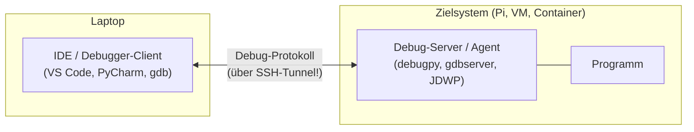

# 🌐 Remote-Debugging

Im Labor läuft Code selten auf dem eigenen Laptop: Er läuft auf einem **Raspberry Pi**, im **Docker-Container**, auf einer **VM** oder auf dem **Roboter**. Beim **Remote-Debugging** läuft das Programm auf dem Zielsystem, der **Debugger-Client** (IDE) aber bequem auf dem eigenen Rechner.

<!-- TOC -->
## Inhaltsverzeichnis

- [Prinzip](#prinzip)
- [Sicherheit zuerst: Debug-Ports nie offen ins Netz](#sicherheit-zuerst-debug-ports-nie-offen-ins-netz)
- [Python mit debugpy](#python-mit-debugpy)
- [C/C++ mit gdbserver](#cc-mit-gdbserver)
- [Node.js](#nodejs)
- [Java (JDWP)](#java-jdwp)
- [Docker-Container](#docker-container)
- [VS Code Remote-SSH](#vs-code-remote-ssh)
- [Wenn kein Debugger geht](#wenn-kein-debugger-geht)
<!-- /TOC -->

## Prinzip



| Sprache | Debug-Server auf dem Ziel | Protokoll | Standardport |
| --- | --- | --- | --- |
| Python | `debugpy` | DAP (Debug Adapter Protocol) | 5678 |
| C / C++ | `gdbserver` | GDB Remote Serial Protocol | frei wählbar (z. B. 2345) |
| Node.js | `node --inspect` | Chrome DevTools Protocol | 9229 |
| Java | JDWP-Agent | Java Debug Wire Protocol | frei wählbar (z. B. 5005) |
| C# / .NET | `vsdbg` | DAP | über SSH |

---

## Sicherheit zuerst: Debug-Ports nie offen ins Netz

Ein Debug-Port erlaubt **beliebige Codeausführung** auf dem Zielsystem. Deshalb:

* [ ] Debug-Server **nur auf `127.0.0.1`** lauschen lassen.
* [ ] Zugriff ausschließlich über einen **SSH-Tunnel** (→ [Best Practice SSH](../Best%20Practices/SSH.md)).
* [ ] Debug-Server **nie** im Produktivbetrieb dauerhaft aktiv lassen.

```bash
# Forward local port 5678 to port 5678 on the Pi (which listens only on localhost)
ssh -N -L 5678:127.0.0.1:5678 -p 2222 pi@192.168.10.21
```

`-N`: keinen Befehl ausführen, nur tunneln · `-L lokal:ziel:zielport` · `-p`: eigener SSH-Port.

---

## Python mit debugpy

**Auf dem Pi:**

```bash
pip install debugpy
# start the program and wait until the debugger attaches
python -m debugpy --listen 127.0.0.1:5678 --wait-for-client sensor_service.py
```

Oder im Code (nur für Debug-Builds!):

```python
import os

if os.environ.get("DEBUGPY") == "1":
    import debugpy
    debugpy.listen(("127.0.0.1", 5678))
    print("waiting for debugger on port 5678 ...")
    debugpy.wait_for_client()
```

**Auf dem Laptop** (SSH-Tunnel aktiv), `.vscode/launch.json`:

```json
{
  "version": "0.2.0",
  "configurations": [
    {
      "name": "Attach to Raspberry Pi",
      "type": "debugpy",
      "request": "attach",
      "connect": { "host": "127.0.0.1", "port": 5678 },
      "pathMappings": [
        { "localRoot": "${workspaceFolder}", "remoteRoot": "/opt/lab/sensor-service" }
      ]
    }
  ]
}
```

`pathMappings` ist entscheidend: Der Debugger muss wissen, welche lokale Datei welcher Datei auf dem Pi entspricht – sonst greifen Breakpoints nicht.

---

## C/C++ mit gdbserver

**Auf dem Ziel** (z. B. Pi):

```bash
gdbserver 127.0.0.1:2345 ./sensor        # start program under gdbserver
# or attach to a running process:
gdbserver --attach 127.0.0.1:2345 $(pidof sensor)
```

**Auf dem Laptop** (Tunnel auf Port 2345):

```bash
gdb-multiarch ./sensor                   # same binary WITH debug symbols (-g)
(gdb) set sysroot /path/to/pi-sysroot    # libraries of the target (see cross compiling)
(gdb) target remote 127.0.0.1:2345
(gdb) break main
(gdb) continue
```

Bei **cross-kompilierten** Programmen braucht man einen Debugger, der die Zielarchitektur versteht (`gdb-multiarch` oder `aarch64-linux-gnu-gdb`) sowie die Bibliotheken des Ziels (**sysroot**) – siehe [Cross-Compiling](../Compiler%20%26%20Build/Cross-Compiling.md). Für Mikrocontroller funktioniert das gleiche Prinzip mit **OpenOCD** oder J-Link als gdbserver über JTAG/SWD.

---

## Node.js

```bash
# on the target: inspector listens on localhost only (default)
node --inspect=127.0.0.1:9229 server.js
# --inspect-brk: stop at the first line
```

Auf dem Laptop SSH-Tunnel auf 9229, dann in Chrome `chrome://inspect` öffnen oder in VS Code „Attach to Node Process“.

---

## Java (JDWP)

```bash
# on the target
java -agentlib:jdwp=transport=dt_socket,server=y,suspend=n,address=127.0.0.1:5005 -jar app.jar
```

Ab Java 9 lauscht `address=5005` nur auf localhost; `*:5005` würde auf allen Schnittstellen lauschen – **nicht** verwenden. In IntelliJ/VS Code: „Remote JVM Debug“ auf `localhost:5005` (über Tunnel).

---

## Docker-Container

```yaml
# compose.override.yaml - only for development
services:
  sensor-service:
    command: python -m debugpy --listen 0.0.0.0:5678 --wait-for-client app.py
    ports:
      - "127.0.0.1:5678:5678"     # publish only on the host's localhost
```

Im Container muss der Debug-Server auf `0.0.0.0` lauschen (sonst ist er von außerhalb des Containers nicht erreichbar); geschützt wird er durch das Port-Mapping auf `127.0.0.1` des Hosts. Alternativ: **VS Code Dev Containers** / „Attach to Running Container“.

---

## VS Code Remote-SSH

Oft die bequemste Lösung: Mit der Erweiterung **Remote - SSH** öffnet VS Code einen Ordner **direkt auf dem Pi**. Editor, Terminal und Debugger laufen dann so, als wäre der Code lokal – ohne Path-Mappings und manuellen Tunnel.

> Auf einem Raspberry Pi mit wenig RAM (≤ 1 GB) kann der VS-Code-Server allerdings spürbar Ressourcen kosten. Dann ist `debugpy` + Tunnel die schlankere Variante.

---

## Wenn kein Debugger geht

Bei Robotern in Bewegung, Echtzeitsystemen oder verteilten Systemen hält man das Programm nicht einfach an. Dann:

* **Ausführliches Logging** mit Zeitstempeln, zentral gesammelt (`journalctl`, Syslog, Loki).
* **Aufzeichnen und offline abspielen:** `ros2 bag`, MQTT-Nachrichten mitschneiden, `tcpdump`.
* **Remote-Shell + `py-spy`:** `py-spy dump --pid <PID>` zeigt den aktuellen Python-Stack eines laufenden Prozesses, ohne ihn anzuhalten.
* **Serielle Konsole** bei Embedded-Geräten, die kein Netzwerk haben.

---
