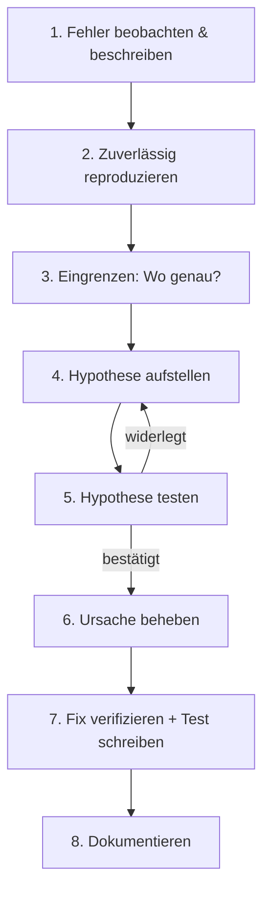

# 🔍 Vorgehen beim Debugging

Gutes Debugging folgt einer **Methode**, nicht dem Bauchgefühl. Im Kern ist es die wissenschaftliche Methode: beobachten → Hypothese → Experiment → Schluss.

<!-- TOC -->
## Inhaltsverzeichnis

- [Der Debugging-Zyklus](#der-debugging-zyklus)
- [1. Beobachten und beschreiben](#1-beobachten-und-beschreiben)
- [2. Reproduzieren](#2-reproduzieren)
- [3. Eingrenzen](#3-eingrenzen)
  - [Teile und herrsche](#teile-und-herrsche)
  - [Bisektion in der Historie](#bisektion-in-der-historie)
- [4. & 5. Hypothesen bilden und testen](#4--5-hypothesen-bilden-und-testen)
- [Rubber Duck Debugging](#rubber-duck-debugging)
- [Typische Fehlerklassen](#typische-fehlerklassen)
- [Besondere Bugs mit Namen](#besondere-bugs-mit-namen)
- [6.–8. Beheben, verifizieren, dokumentieren](#68-beheben-verifizieren-dokumentieren)
- [Gute Fehlerberichte (Issues)](#gute-fehlerberichte-issues)
<!-- /TOC -->

## Der Debugging-Zyklus



---

## 1. Beobachten und beschreiben

Bevor man irgendetwas anfasst, schriftlich festhalten:

* **Erwartet:** Was sollte passieren?
* **Tatsächlich:** Was passiert stattdessen? (Exakte Fehlermeldung kopieren, nicht abtippen!)
* **Seit wann?** Was hat sich geändert? (Update, neue Konfiguration, anderes Gerät, Stromausfall?)
* **Wo?** Nur auf einem Gerät oder überall? Nur bei bestimmten Eingaben?

> „Es geht nicht“ ist keine Fehlerbeschreibung. „Seit dem Update auf openHAB 5.0 liefert das Item `Beamer_Power` nach dem Einschalten `NULL` statt `ON`, nur beim BenQ, nicht beim Samsung-TV“ ist eine.

---

## 2. Reproduzieren

* Minimale Schritte finden, mit denen der Fehler **immer** auftritt.
* **Minimal reproduzierbares Beispiel (MRE):** Allen Code weglassen, der nicht nötig ist, um den Fehler zu zeigen. Oft findet man den Fehler schon dabei.
* Tritt der Fehler nur **manchmal** auf? → Timing, Race Conditions, Netzwerk, Speicher, externe Abhängigkeiten. Logging mit Zeitstempeln ist hier entscheidend.

---

## 3. Eingrenzen

### Teile und herrsche

Ein System von außen nach innen prüfen. Beispiel „openHAB schaltet das Licht nicht“:


An **jeder Station** prüfen, ob das Signal ankommt:

| Station | Prüfung |
| --- | --- |
| openHAB | Item-Zustand in der Konsole / Log `events.log` |
| MQTT | `mosquitto_sub -h broker -t '#' -v` – kommt die Nachricht an? |
| Gerät | Log des Geräts, LED, serielle Konsole |
| Netzwerk | `ping`, `nc -zv host port`, `ss -tlnp` auf dem Zielsystem |

Den Fehler so lange **halbieren**, bis die defekte Station feststeht.

### Bisektion in der Historie

Funktionierte es früher? Dann mit **`git bisect`** automatisch den verantwortlichen Commit finden:

```bash
git bisect start
git bisect bad                 # current version is broken
git bisect good v1.2           # this version worked
# git checks out a commit in the middle - test it, then:
git bisect good                # or: git bisect bad
# ... repeat (log2(n) steps) until git names the first bad commit
git bisect reset
```

Mit einem Testskript sogar vollautomatisch: `git bisect run pytest tests/test_beamer.py`.

---

## 4. & 5. Hypothesen bilden und testen

* **Eine** konkrete, prüfbare Vermutung: „Der Timeout ist zu kurz, weil der Beamer 30 s zum Aufwärmen braucht.“
* Ein **Experiment**, das sie bestätigen **oder widerlegen** kann: Timeout auf 60 s setzen.
* Ergebnis notieren – auch Fehlschläge. Das verhindert, dass man im Kreis läuft.

**Annahmen prüfen!** Die meisten langen Debugging-Sessions enden mit „Ach, das war gar nicht …“:

* Läuft wirklich die Version, die ich gerade bearbeite? (Datei gespeichert? Dienst neu gestartet? Richtiges venv? Richtiger Container?)
* Liest das Programm wirklich die Konfigurationsdatei, die ich ändere?
* Ist es wirklich der Rechner/die IP, die ich denke? (→ [DHCP](../Best%20Practices/DHCP.md))

---

## Rubber Duck Debugging

Erkläre das Problem **Zeile für Zeile** einer **Gummiente** (oder einem Kollegen, der nichts sagen muss). Beim lauten Erklären fällt einem die Lücke im eigenen Denken oft selbst auf. Der Name stammt aus dem Buch *The Pragmatic Programmer* (Hunt & Thomas, 1999).

> Das Schreiben einer guten Frage für Kollegen, ein Forum oder einen KI-Assistenten hat denselben Effekt – häufig löst sich das Problem, bevor man auf „Absenden“ klickt.

---

## Typische Fehlerklassen

| Klasse | Beispiel | Hinweis |
| --- | --- | --- |
| **Off-by-one** | `range(1, n)` statt `range(n)` | Grenzen prüfen |
| **Falscher Typ** | `"25" > 3` (JS) / String statt Zahl aus MQTT | Payloads sind Bytes/Strings! |
| **None/null** | `AttributeError: 'NoneType' object has no attribute` | Wo kam das `None` her? |
| **Encoding** | `UnicodeDecodeError`, `ä` statt `ä` | (→ [Cross-Plattform-Tricks](../Workarounds%20%26%20Hacks/Cross-Plattform-Tricks.md)) |
| **Race Condition** | Fehler nur „manchmal“ | Logging mit Zeitstempeln, Locks |
| **Umgebung** | Läuft lokal, nicht im Cron | `PATH`, Arbeitsverzeichnis (→ [Cron](../Linux%20%26%20Werkzeuge/Cron%20%26%20systemd-Timer.md)) |
| **Rechte** | `Permission denied` | Benutzer, Gruppen, Dateirechte, ACL |
| **Netzwerk** | Timeout, Connection refused | Firewall, falscher Port, Dienst läuft nicht |
| **Caching** | Änderung „wirkt nicht“ | Browser-Cache, `__pycache__`, Docker-Layer |
| **Zeit** | Fehler nur nachts/bei Zeitumstellung | Zeitzonen, UTC verwenden |

---

## Besondere Bugs mit Namen

| Name | Bedeutung |
| --- | --- |
| **Heisenbug** | Verschwindet, sobald man ihn beobachtet (z. B. durch Debugger oder Logging ändert sich das Timing) |
| **Bohrbug** | Zuverlässig reproduzierbar – „solide“ wie das Bohr’sche Atommodell |
| **Mandelbug** | Ursache so komplex, dass das Verhalten chaotisch wirkt |
| **Schrödingbug** | Code, der nie hätte funktionieren dürfen – und ab dem Moment, in dem man das merkt, nicht mehr funktioniert |
| **Regression** | Etwas, das früher ging, ist durch eine Änderung kaputt gegangen |

---

## 6.–8. Beheben, verifizieren, dokumentieren

* Die **Ursache** beheben, nicht das Symptom (sonst ist es ein [Workaround](../Workarounds%20%26%20Hacks/Begriffe.md) – dann auch so kennzeichnen).
* **Test schreiben**, der den Fehler reproduziert und nach dem Fix grün ist (Regressionstest).
* Commit-Nachricht mit **Ursache** und **Lösung**: `fix(beamer): wait for warm-up before polling power state (#17)`.
* Bei schwierigen Fehlern: kurze Notiz in der Projektdoku („Known Issues“, „Troubleshooting“).

---

## Gute Fehlerberichte (Issues)

```markdown
**Describe the bug**
Beamer item stays NULL after power on.

**To reproduce**
1. Send ON to `Beamer_Power`
2. Wait 60 s
3. Item state is still NULL

**Expected behaviour**
`Beamer_Power` = ON

**Environment**
- openHAB 5.0.1 on Raspberry Pi 4 (Raspberry Pi OS 12, 64-bit)
- benq-rs232-tcp 0.3.0, Python 3.11

**Logs**
(paste the relevant lines from events.log / openhab.log, not screenshots)
```

---
