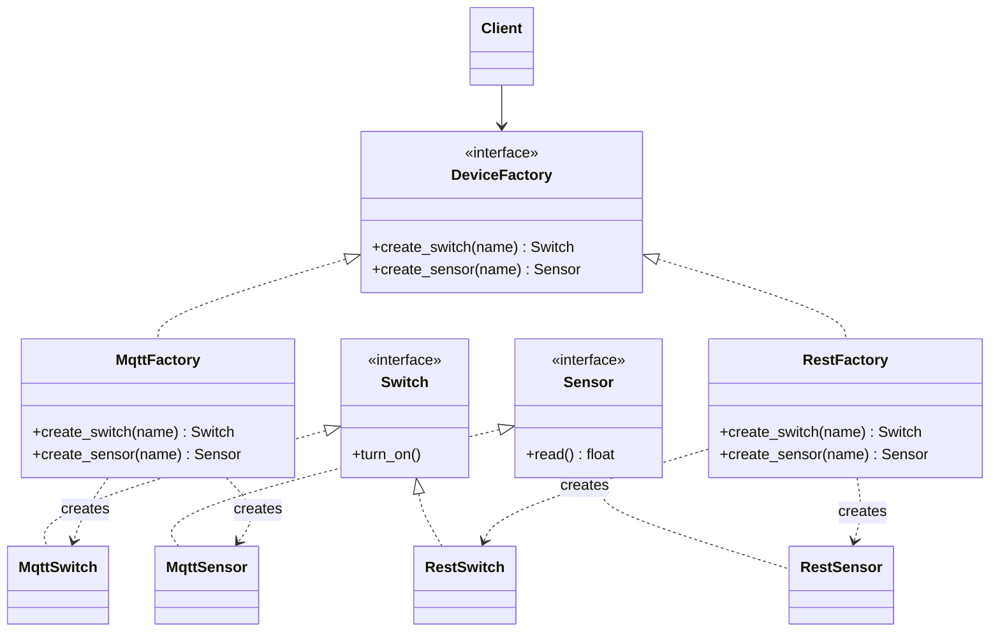

# 🏭 Abstract Factory (Abstrakte Fabrik)

**Kategorie:** Erzeugungsmuster · **Gültigkeitsbereich:** Objekt

<!-- TOC -->
## Inhaltsverzeichnis

- [Zweck](#zweck)
- [Problem](#problem)
- [Lösung](#lösung)
- [Struktur](#struktur)
- [Beispiel](#beispiel)
- [Praxis](#praxis)
- [Vor- und Nachteile](#vor--und-nachteile)
- [Verwandte Muster](#verwandte-muster)
<!-- /TOC -->

## Zweck

Stellt eine Schnittstelle bereit, um **Familien zusammengehöriger Objekte** zu erzeugen, ohne ihre konkreten Klassen zu nennen.

---

## Problem

Ein Programm arbeitet mit mehreren Objekten, die **zusammenpassen müssen**. Beispiel: Eine Smart-Home-Anwendung soll Geräte entweder über **MQTT** oder über **HTTP/REST** ansprechen. Zu jedem Protokoll gehören ein passender Schalter und ein passender Sensor. Ein MQTT-Schalter zusammen mit einem REST-Sensor ergibt ein inkonsistentes System.

Steht im Code überall `MqttSwitch()` und `MqttSensor()`, muss beim Wechsel des Protokolls jede Stelle angepasst werden – und es ist leicht, eine zu vergessen.

---

## Lösung

Für jede Produktfamilie gibt es eine **konkrete Fabrik**, die alle Produkte dieser Familie erzeugt. Alle Fabriken implementieren dieselbe **abstrakte Fabrik**. Der Client bekommt einmal eine Fabrik übergeben und erzeugt alle Objekte nur noch über sie. Wird die Fabrik getauscht, wechselt die gesamte Familie – konsistent und an genau einer Stelle.

---

## Struktur



| Teilnehmer | Aufgabe |
| --- | --- |
| **AbstractFactory** (`DeviceFactory`) | Deklariert Methoden zum Erzeugen jedes Produkts |
| **ConcreteFactory** (`MqttFactory`, `RestFactory`) | Erzeugt die Produkte einer Familie |
| **AbstractProduct** (`Switch`, `Sensor`) | Schnittstelle eines Produkttyps |
| **ConcreteProduct** (`MqttSwitch`, …) | Konkrete Implementierung |
| **Client** | Nutzt nur die abstrakten Schnittstellen |

---

## Beispiel

```python
from abc import ABC, abstractmethod


class Switch(ABC):
    @abstractmethod
    def turn_on(self) -> None: ...


class Sensor(ABC):
    @abstractmethod
    def read(self) -> float: ...


# --- MQTT family ---
class MqttSwitch(Switch):
    def __init__(self, name: str):
        self.topic = f"lab/{name}/power/set"

    def turn_on(self) -> None:
        print(f"MQTT publish {self.topic} -> ON")


class MqttSensor(Sensor):
    def __init__(self, name: str):
        self.topic = f"lab/{name}/value/state"

    def read(self) -> float:
        print(f"MQTT read {self.topic}")
        return 21.5


# --- REST family ---
class RestSwitch(Switch):
    def __init__(self, name: str):
        self.url = f"http://gateway/api/{name}/on"

    def turn_on(self) -> None:
        print(f"HTTP POST {self.url}")


class RestSensor(Sensor):
    def __init__(self, name: str):
        self.url = f"http://gateway/api/{name}/value"

    def read(self) -> float:
        print(f"HTTP GET {self.url}")
        return 21.7


# --- Factories ---
class DeviceFactory(ABC):
    @abstractmethod
    def create_switch(self, name: str) -> Switch: ...

    @abstractmethod
    def create_sensor(self, name: str) -> Sensor: ...


class MqttFactory(DeviceFactory):
    def create_switch(self, name: str) -> Switch:
        return MqttSwitch(name)

    def create_sensor(self, name: str) -> Sensor:
        return MqttSensor(name)


class RestFactory(DeviceFactory):
    def create_switch(self, name: str) -> Switch:
        return RestSwitch(name)

    def create_sensor(self, name: str) -> Sensor:
        return RestSensor(name)


# --- Client: knows only the abstract types ---
def setup_room(factory: DeviceFactory) -> None:
    light = factory.create_switch("ceiling_light")
    temperature = factory.create_sensor("temperature")
    if temperature.read() < 22.0:
        light.turn_on()


setup_room(MqttFactory())   # change ONE line to switch the whole family
setup_room(RestFactory())
```

---

## Praxis

* **GUI-Toolkits:** Eine Fabrik pro Look & Feel (Windows, macOS, GTK) erzeugt Buttons, Menüs, Fenster, die zueinander passen.
* **Datenbankzugriff:** `DbProviderFactory` in .NET erzeugt Connection, Command und Parameter für denselben Datenbanktyp.
* **Tests:** Eine `FakeDeviceFactory` liefert simulierte Geräte für Unit-Tests, die `MqttFactory` echte.
* **Robotik:** Eine Fabrik für die **Simulation** (Gazebo) und eine für den **echten Roboter** liefern jeweils passende Motor-, Sensor- und Kamera-Objekte.

---

## Vor- und Nachteile

| Vorteile | Nachteile |
| --- | --- |
| Produkte einer Familie passen garantiert zusammen | Neue **Produktart** (z. B. `Dimmer`) erfordert Änderung **aller** Fabriken |
| Austausch der ganzen Familie an einer Stelle | Viele zusätzliche Klassen |
| Client kennt keine konkreten Klassen (lose Kopplung) | Für eine einzige Produktart überdimensioniert |

---

## Verwandte Muster

* **[Factory Method](Factory%20Method.md):** Abstract-Factory-Methoden sind oft als Fabrikmethoden umgesetzt. Factory Method erzeugt **ein** Produkt, Abstract Factory **eine Familie**.
* **[Singleton](Singleton.md):** Meist wird pro Anwendung nur eine konkrete Fabrik benötigt.
* **[Prototype](Prototype.md):** Eine Fabrik kann Produkte auch durch Klonen von Prototypen erzeugen.
* **[Bridge](../Strukturmuster/Bridge.md):** Eine Abstract Factory kann die passende Implementierung für eine Bridge erzeugen.

---
