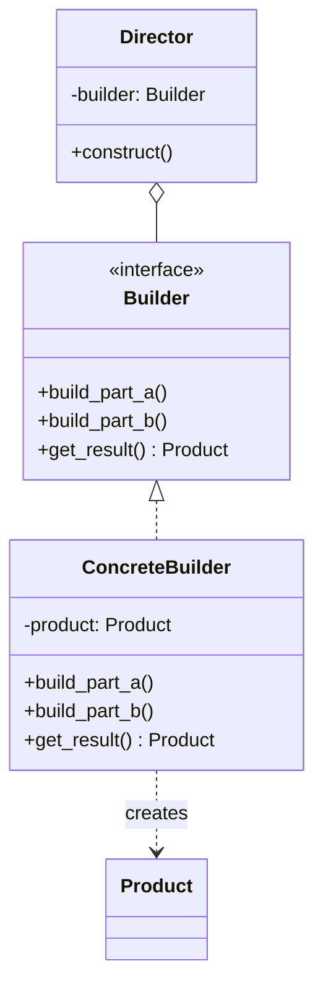

# 🧱 Builder (Erbauer)

**Kategorie:** Erzeugungsmuster · **Gültigkeitsbereich:** Objekt

<!-- TOC -->
## Inhaltsverzeichnis

- [Zweck](#zweck)
- [Problem](#problem)
- [Lösung](#lösung)
- [Struktur](#struktur)
- [Beispiel](#beispiel)
- [Praxis](#praxis)
- [Vor- und Nachteile](#vor--und-nachteile)
- [Verwandte Muster](#verwandte-muster)
<!-- /TOC -->

## Zweck

Trennt die **Konstruktion** eines komplexen Objekts von seiner **Repräsentation**, sodass derselbe Konstruktionsprozess unterschiedliche Ergebnisse liefern kann. Im Alltag vor allem: **komplexe Objekte Schritt für Schritt und lesbar aufbauen**.

---

## Problem

Ein Objekt hat viele, teilweise optionale Parameter. Ein Konstruktor mit zwölf Parametern ist unlesbar und fehleranfällig:

```text
MqttClient("broker", 8883, "openhab", "secret", True, "ca.crt", None, None, 60, True, "lab/status", "offline")
```

Welcher Wert gehört zu welchem Parameter? Was bedeutet das dritte `None`? Man spricht vom **Telescoping-Constructor-Problem** (immer längere Konstruktor-Überladungen).

Außerdem soll derselbe Bauablauf manchmal unterschiedliche Produkte erzeugen – etwa dieselben Bericht-Abschnitte einmal als Markdown und einmal als HTML.

---

## Lösung

Ein **Builder** sammelt die Teile über einzelne, sprechende Methoden ein und liefert am Ende mit `build()` das fertige Objekt. Oft geben die Methoden `self` zurück, sodass die Aufrufe verkettet werden können (**Fluent Interface**). Ein optionaler **Director** kennt die Reihenfolge der Bauschritte für Standardkonfigurationen.

---

## Struktur



| Teilnehmer | Aufgabe |
| --- | --- |
| **Builder** | Schnittstelle für die Bauschritte |
| **ConcreteBuilder** | Setzt die Schritte um, hält das Produkt im Aufbau |
| **Director** (optional) | Ruft die Bauschritte in sinnvoller Reihenfolge auf |
| **Product** | Das fertige, komplexe Objekt |

---

## Beispiel

```python
from dataclasses import dataclass


@dataclass(frozen=True)
class MqttConnection:
    host: str
    port: int
    username: str | None
    password: str | None
    ca_file: str | None
    keepalive: int
    will_topic: str | None
    will_payload: str | None


class MqttConnectionBuilder:
    def __init__(self, host: str):
        self._host = host
        self._port = 1883
        self._username = None
        self._password = None
        self._ca_file = None
        self._keepalive = 60
        self._will_topic = None
        self._will_payload = None

    def with_tls(self, ca_file: str, port: int = 8883) -> "MqttConnectionBuilder":
        self._ca_file = ca_file
        self._port = port
        return self

    def with_credentials(self, username: str, password: str) -> "MqttConnectionBuilder":
        self._username = username
        self._password = password
        return self

    def with_last_will(self, topic: str, payload: str = "offline") -> "MqttConnectionBuilder":
        self._will_topic = topic
        self._will_payload = payload
        return self

    def with_keepalive(self, seconds: int) -> "MqttConnectionBuilder":
        self._keepalive = seconds
        return self

    def build(self) -> MqttConnection:
        if self._ca_file and self._port == 1883:
            raise ValueError("TLS on port 1883 is almost certainly a mistake")
        return MqttConnection(self._host, self._port, self._username, self._password,
                              self._ca_file, self._keepalive,
                              self._will_topic, self._will_payload)


connection = (
    MqttConnectionBuilder("pi-beamer")
    .with_tls("pi-beamer_ca.crt")
    .with_credentials("openhab", "secret")
    .with_last_will("lab/openhab/status")
    .build()
)
print(connection)
```

Der Builder kann im `build()` außerdem **prüfen**, ob die Kombination der Parameter gültig ist – bevor ein halbfertiges Objekt entsteht.

---

## Praxis

* **Java:** `StringBuilder`, `HttpRequest.newBuilder()`, Lombok `@Builder`
* **C#:** `StringBuilder`, `WebApplication.CreateBuilder()`, `ConfigurationBuilder`
* **Python:** SQLAlchemy-Abfragen (`select(User).where(...).order_by(...)`), `argparse.ArgumentParser` (Schritt für Schritt Argumente hinzufügen)
* **Testdaten:** „Test Data Builder“ erzeugen Objekte mit sinnvollen Defaults, in denen der Test nur das Relevante überschreibt.
* **Docker:** Ein `Dockerfile` ist eine Bauanleitung, `docker build` der Builder.

---

## Vor- und Nachteile

| Vorteile | Nachteile |
| --- | --- |
| Lesbarer Aufbau, benannte Schritte | Zusätzliche Klasse pro Produkt |
| Optionale Parameter ohne Konstruktor-Explosion | In Sprachen mit benannten Parametern (Python, C#, Kotlin) oft unnötig |
| Validierung vor der Erzeugung, Produkt kann unveränderlich sein | |
| Gleicher Ablauf, verschiedene Repräsentationen | |

> In Python lösen **Keyword-Argumente mit Defaults** das Telescoping-Problem bereits weitgehend: `MqttConnection(host="pi", port=8883, ca_file="ca.crt")`. Ein Builder lohnt sich, wenn der Aufbau mehrstufig ist oder geprüft werden muss.

---

## Verwandte Muster

* **[Abstract Factory](Abstract%20Factory.md):** Liefert eine Familie sofort, der Builder baut **ein** komplexes Objekt schrittweise.
* **[Composite](../Strukturmuster/Composite.md):** Builder werden oft zum Aufbau von Baumstrukturen verwendet.
* **[Template Method](../Verhaltensmuster/Template%20Method.md):** Der Director legt wie eine Schablonenmethode die Reihenfolge fest.

---
