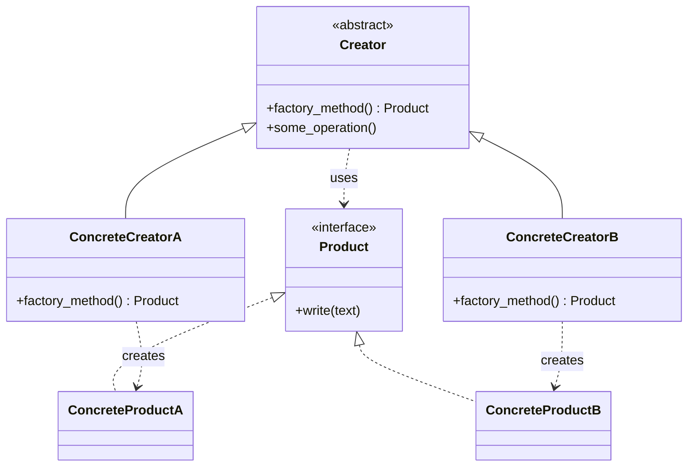

# 🔨 Factory Method (Fabrikmethode)

**Kategorie:** Erzeugungsmuster · **Gültigkeitsbereich:** Klasse

<!-- TOC -->
## Inhaltsverzeichnis

- [Zweck](#zweck)
- [Problem](#problem)
- [Lösung](#lösung)
- [Struktur](#struktur)
- [Beispiel](#beispiel)
- [Praxis](#praxis)
- [Vor- und Nachteile](#vor--und-nachteile)
- [Verwandte Muster](#verwandte-muster)
<!-- /TOC -->

## Zweck

Definiert eine Schnittstelle zur Erzeugung eines Objekts, lässt aber **Unterklassen entscheiden, welche Klasse instanziiert wird**.

---

## Problem

Eine Basisklasse implementiert einen allgemeinen Ablauf, in dem ein Objekt benötigt wird – sie weiß aber nicht, **welches konkrete Objekt**. Beispiel: Ein Logger-Framework schreibt Meldungen immer gleich formatiert, das **Ziel** (Datei, Konsole, MQTT, Syslog) hängt aber von der konkreten Anwendung ab. Steht `FileWriter()` fest in der Basisklasse, kann niemand ein anderes Ziel verwenden, ohne die Basisklasse zu ändern.

---

## Lösung

Die Basisklasse ruft zur Erzeugung eine eigene, überschreibbare Methode auf – die **Fabrikmethode**. Unterklassen überschreiben nur diese Methode und liefern das passende Objekt. Der restliche Ablauf bleibt unverändert.

> Umgangssprachlich wird „Factory“ oft auch für eine einfache Funktion verwendet, die je nach Parameter unterschiedliche Objekte liefert (`create_device("mqtt")`). Das ist die **Simple Factory** – kein GoF-Muster, aber sehr verbreitet. Beide Varianten sind unten gezeigt.

---

## Struktur



| Teilnehmer | Aufgabe |
| --- | --- |
| **Product** | Schnittstelle der erzeugten Objekte |
| **ConcreteProduct** | Konkrete Implementierung |
| **Creator** | Deklariert die Fabrikmethode und nutzt sie im eigenen Ablauf |
| **ConcreteCreator** | Überschreibt die Fabrikmethode |

---

## Beispiel

**GoF-Variante (Vererbung):**

```python
from abc import ABC, abstractmethod
from datetime import datetime


class LogWriter(ABC):
    @abstractmethod
    def write(self, line: str) -> None: ...


class ConsoleWriter(LogWriter):
    def write(self, line: str) -> None:
        print(line)


class MqttWriter(LogWriter):
    def write(self, line: str) -> None:
        print(f"MQTT publish lab/logs -> {line}")


class Logger(ABC):
    """The general flow is fixed; only the writer is chosen by subclasses."""

    def __init__(self):
        self._writer = self.create_writer()   # factory method call

    @abstractmethod
    def create_writer(self) -> LogWriter:     # the factory method
        ...

    def log(self, level: str, message: str) -> None:
        line = f"{datetime.now():%H:%M:%S} [{level}] {message}"
        self._writer.write(line)


class ConsoleLogger(Logger):
    def create_writer(self) -> LogWriter:
        return ConsoleWriter()


class MqttLogger(Logger):
    def create_writer(self) -> LogWriter:
        return MqttWriter()


for logger in (ConsoleLogger(), MqttLogger()):
    logger.log("INFO", "Beamer switched on")
```

**Simple Factory (häufig in der Praxis):**

```python
class Camera:
    def __init__(self, host: str):
        self.host = host


class OnvifCamera(Camera): ...
class RtspCamera(Camera): ...


_CAMERA_TYPES = {"onvif": OnvifCamera, "rtsp": RtspCamera}


def create_camera(kind: str, host: str) -> Camera:
    try:
        return _CAMERA_TYPES[kind](host)
    except KeyError:
        raise ValueError(f"Unknown camera type: {kind}") from None


cam = create_camera("onvif", "192.168.1.60")   # e.g. value read from a config file
print(type(cam).__name__)
```

---

## Praxis

* **Python:** `logging.getLogger()`, `datetime.fromtimestamp()`, `dict.fromkeys()` (alternative Konstruktoren als `@classmethod` sind Fabrikmethoden)
* **Java:** `Calendar.getInstance()`, `List.of()`, `NumberFormat.getInstance()`
* **C#:** `Task.Run()`, `WebRequest.Create()`
* **Frameworks:** Template-Klassen, deren Unterklassen über Methoden wie `createView()` oder `create_node()` bestimmen, welche Objekte das Framework verwendet
* **Plugin-Systeme:** Konfiguration nennt einen Typ (`"type": "mqtt"`), eine Fabrik liefert die passende Klasse

---

## Vor- und Nachteile

| Vorteile | Nachteile |
| --- | --- |
| Basisklasse ist unabhängig von konkreten Produkten | Für jedes Produkt eine eigene Creator-Unterklasse (GoF-Variante) |
| Neue Produkte ohne Änderung des Ablaufs (Open/Closed-Prinzip) | Vererbung koppelt fester als Komposition |
| Erzeugungslogik an einer Stelle | |

---

## Verwandte Muster

* **[Abstract Factory](Abstract%20Factory.md):** Wird oft mit mehreren Fabrikmethoden umgesetzt.
* **[Template Method](../Verhaltensmuster/Template%20Method.md):** Fabrikmethoden werden typischerweise innerhalb von Schablonenmethoden aufgerufen.
* **[Prototype](Prototype.md):** Alternative ohne Unterklassen: Objekt durch Klonen statt durch Fabrikmethode erzeugen.

---
