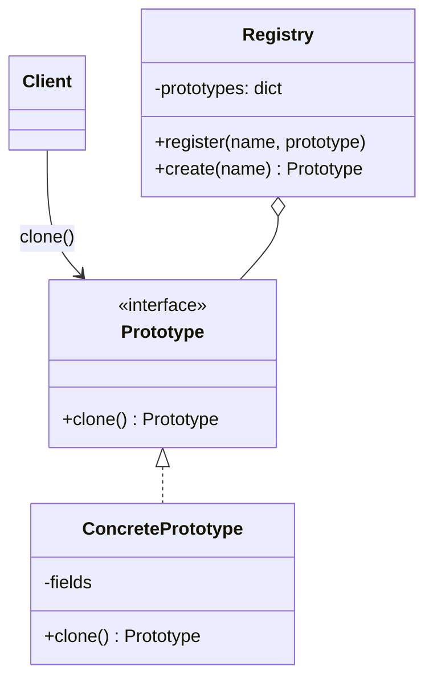

# 🧬 Prototype (Prototyp)

**Kategorie:** Erzeugungsmuster · **Gültigkeitsbereich:** Objekt

<!-- TOC -->
## Inhaltsverzeichnis

- [Zweck](#zweck)
- [Problem](#problem)
- [Lösung](#lösung)
- [Struktur](#struktur)
- [Beispiel](#beispiel)
- [Praxis](#praxis)
- [Vor- und Nachteile](#vor--und-nachteile)
- [Verwandte Muster](#verwandte-muster)
<!-- /TOC -->

## Zweck

Erzeugt neue Objekte durch **Kopieren (Klonen) eines bestehenden Exemplars** – des Prototyps – statt durch Instanziieren einer Klasse.

---

## Problem

* Die Erzeugung eines Objekts ist **aufwendig** (Konfiguration aus Datei lesen, Kalibrierung, Netzwerkabfrage), es werden aber viele ähnliche Objekte gebraucht.
* Der Code soll Objekte erzeugen, **ohne ihre konkrete Klasse zu kennen** – er hat nur ein Exemplar vor sich.
* Es gibt viele **Varianten**, die sich nur in wenigen Werten unterscheiden. Für jede Variante eine eigene Unterklasse wäre übertrieben.

Beispiel: Im Labor sollen 20 gleichartige Temperatursensoren angelegt werden. Sie haben alle dieselbe Grundkonfiguration (Einheit, Messintervall, Schwellenwerte, Kalibrierung), unterscheiden sich aber in Name und Raum.

---

## Lösung

Ein vollständig konfiguriertes Objekt dient als **Vorlage**. Neue Objekte entstehen durch `clone()` und werden anschließend nur noch in den abweichenden Werten angepasst. Häufig werden Prototypen in einer **Registry** unter einem Namen abgelegt.

Wichtig ist die Unterscheidung:

| | Flache Kopie (*shallow copy*) | Tiefe Kopie (*deep copy*) |
| --- | --- | --- |
| Was wird kopiert | Nur das Objekt selbst; enthaltene Listen/Objekte werden **geteilt** | Das Objekt **und alle enthaltenen** Objekte |
| Gefahr | Änderung an einer Liste im Klon ändert auch den Prototyp | Langsamer, mehr Speicher |
| Python | `copy.copy()` | `copy.deepcopy()` |

---

## Struktur



---

## Beispiel

```python
import copy
from dataclasses import dataclass, field


@dataclass
class SensorConfig:
    name: str
    room: str
    unit: str = "°C"
    interval_s: int = 60
    thresholds: dict = field(default_factory=lambda: {"low": 18.0, "high": 26.0})
    tags: list = field(default_factory=lambda: ["Temperature", "Measurement"])

    def clone(self, **changes) -> "SensorConfig":
        new = copy.deepcopy(self)          # deep copy: thresholds/tags are not shared
        for key, value in changes.items():
            setattr(new, key, value)
        return new


class PrototypeRegistry:
    def __init__(self):
        self._prototypes: dict[str, SensorConfig] = {}

    def register(self, key: str, prototype: SensorConfig) -> None:
        self._prototypes[key] = prototype

    def create(self, key: str, **changes) -> SensorConfig:
        return self._prototypes[key].clone(**changes)


registry = PrototypeRegistry()
registry.register("lab_temperature", SensorConfig(name="template", room="lab", interval_s=30))

sensors = [registry.create("lab_temperature", name=f"temp_{i:02d}", room=f"room_{i // 5}")
           for i in range(20)]

sensors[0].thresholds["high"] = 30.0              # changes only this clone
print(sensors[0].thresholds, sensors[1].thresholds)
```

Mit `copy.copy()` statt `deepcopy()` würden **alle** Sensoren dasselbe `thresholds`-Dictionary teilen – die Änderung am ersten würde alle betreffen. Das ist der häufigste Fehler bei diesem Muster.

---

## Praxis

* **JavaScript** ist eine **prototypbasierte** Sprache: Objekte erben direkt von anderen Objekten (`Object.create(proto)`), nicht von Klassen.
* **Java:** `Cloneable` / `clone()`, **C#:** `ICloneable`, `MemberwiseClone()`, `record`-`with`-Ausdrücke
* **VM- und Container-Templates:** Proxmox-Templates, VirtualBox-Klone, Docker-Images – eine fertig konfigurierte Maschine wird geklont statt neu installiert
* **Grafik / Spiele:** Gegner, Partikel, Bauteile werden aus Vorlagen kopiert
* **Office:** „Folie duplizieren“, „Datei aus Vorlage erstellen“

---

## Vor- und Nachteile

| Vorteile | Nachteile |
| --- | --- |
| Teure Initialisierung nur einmal | Tiefe Kopie bei komplexen Objekten schwierig (Zyklen, Ressourcen wie Sockets oder Dateien) |
| Weniger Unterklassen für Varianten | Fehlerquelle flache vs. tiefe Kopie |
| Objekte erzeugen, ohne die Klasse zu kennen | |
| Varianten zur Laufzeit registrierbar | |

---

## Verwandte Muster

* **[Abstract Factory](Abstract%20Factory.md):** Kann Prototypen speichern und klonen, statt Unterklassen zu verwenden.
* **[Memento](../Verhaltensmuster/Memento.md):** Speichert ebenfalls Kopien eines Zustands – aber zur Wiederherstellung, nicht zur Erzeugung neuer Objekte.
* **[Composite](../Strukturmuster/Composite.md) / [Decorator](../Strukturmuster/Decorator.md):** Komplexe Strukturen aus diesen Mustern lassen sich per Prototype vervielfältigen.

---
