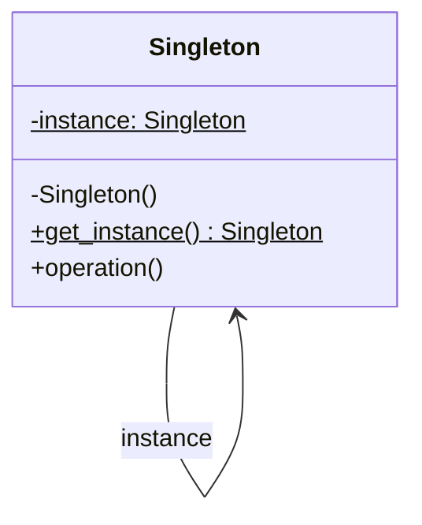

# 1️⃣ Singleton (Einzelstück)

**Kategorie:** Erzeugungsmuster · **Gültigkeitsbereich:** Objekt

<!-- TOC -->
## Inhaltsverzeichnis

- [Zweck](#zweck)
- [Problem](#problem)
- [Lösung](#lösung)
- [Struktur](#struktur)
- [Beispiel](#beispiel)
- [Praxis](#praxis)
- [Vor- und Nachteile](#vor--und-nachteile)
- [Verwandte Muster](#verwandte-muster)
<!-- /TOC -->

## Zweck

Stellt sicher, dass eine Klasse **genau eine Instanz** hat, und bietet einen **globalen Zugriffspunkt** darauf.

---

## Problem

Manche Ressourcen soll es nur einmal geben: eine Konfiguration, eine Verbindung zu einem Gerät, das nur einen Client erlaubt (z. B. eine serielle Schnittstelle oder eine RS232-über-TCP-Verbindung zu einem Beamer), ein zentraler Cache, ein Logger. Würden mehrere Programmteile jeweils eigene Instanzen anlegen, gäbe es konkurrierende Verbindungen oder widersprüchliche Zustände.

---

## Lösung

Die Klasse verhindert, dass von außen beliebig viele Instanzen erzeugt werden, und gibt stattdessen über eine statische Methode bzw. Klassenmethode immer **dieselbe** Instanz zurück. Die Instanz wird oft erst beim ersten Zugriff erzeugt (**Lazy Initialization**).

---

## Struktur



Unterstrichene bzw. mit `$` markierte Elemente sind **statisch** (gehören zur Klasse, nicht zur Instanz).

---

## Beispiel

**Klassische Umsetzung (threadsicher):**

```python
import threading


class SerialPortConnection:
    _instance = None
    _lock = threading.Lock()

    def __new__(cls, port: str = "/dev/ttyUSB0"):
        if cls._instance is None:
            with cls._lock:                       # double-checked locking
                if cls._instance is None:
                    instance = super().__new__(cls)
                    instance.port = port
                    print(f"Opening {port} (only once)")
                    cls._instance = instance
        return cls._instance

    def send(self, command: str) -> None:
        print(f"{self.port} <- {command}")


a = SerialPortConnection()
b = SerialPortConnection()
print(a is b)          # True
a.send("PWR ON")
```

**Pythonisch:** In Python ist ein **Modul** bereits ein Singleton – es wird nur einmal importiert. Oft genügt daher:

```python
# config.py
import json

settings = {"broker": "pi-beamer", "port": 8883}   # in practice: json.load(open(...))

# anywhere else:
# from config import settings
```

In C# übernimmt ein **DI-Container** die Aufgabe: `services.AddSingleton<IBeamerConnection, BeamerConnection>();` – die Klasse selbst bleibt normal und testbar.

---

## Praxis

* Logger (`logging.getLogger("name")` liefert pro Name immer dasselbe Objekt)
* Konfigurationsobjekte, Anwendungskontext (Spring Beans sind standardmäßig Singletons im Container)
* Verbindungs-Pools, Gerätetreiber für exklusive Hardware
* `java.lang.Runtime.getRuntime()`
* In Python: `None`, `True`, `False` sind Singletons

---

## Vor- und Nachteile

| Vorteile | Nachteile |
| --- | --- |
| Garantiert genau eine Instanz | **Globaler Zustand** durch die Hintertür – versteckte Abhängigkeiten |
| Lazy Initialization möglich | Schwer zu **testen** (Zustand überlebt zwischen Tests, schwer zu ersetzen) |
| Zentraler Zugriffspunkt | Verletzt das Single-Responsibility-Prinzip (Klasse kümmert sich um Logik **und** Lebenszyklus) |
| | Nebenläufigkeit erfordert Synchronisation |

> ⚠️ Singleton ist das **umstrittenste** GoF-Muster und wird oft als Anti-Pattern bezeichnet, weil es leicht missbraucht wird, um „mal eben“ globale Variablen einzuführen. Bevorzugt: **eine** Instanz erzeugen und per **Dependency Injection** (Konstruktorparameter) weiterreichen. Dann gibt es faktisch nur eine Instanz, der Code bleibt aber testbar.

---

## Verwandte Muster

* **[Abstract Factory](Abstract%20Factory.md), [Builder](Builder.md), [Prototype](Prototype.md):** Werden oft als Singleton umgesetzt.
* **[Facade](../Strukturmuster/Facade.md):** Eine Fassade gibt es meist nur einmal.
* **[Flyweight](../Strukturmuster/Flyweight.md):** Teilt ebenfalls Instanzen – aber viele, nach Schlüssel unterschieden.

---
