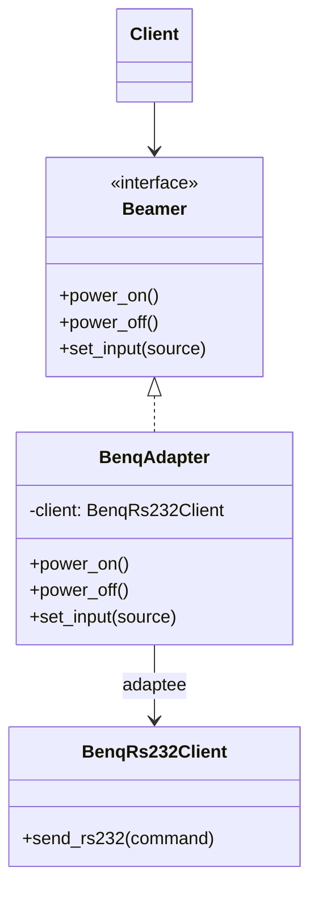

# 🔌 Adapter

**Kategorie:** Strukturmuster · **Gültigkeitsbereich:** Klasse und Objekt · **Auch bekannt als:** Wrapper

<!-- TOC -->
## Inhaltsverzeichnis

- [Zweck](#zweck)
- [Problem](#problem)
- [Lösung](#lösung)
- [Struktur](#struktur)
- [Beispiel](#beispiel)
- [Praxis](#praxis)
- [Vor- und Nachteile](#vor--und-nachteile)
- [Verwandte Muster](#verwandte-muster)
<!-- /TOC -->

## Zweck

Passt die **Schnittstelle einer Klasse an eine andere, erwartete Schnittstelle** an. Der Adapter lässt Klassen zusammenarbeiten, die wegen inkompatibler Schnittstellen sonst nicht zusammenarbeiten könnten.

---

## Problem

Das eigene Programm erwartet für alle Beamer eine einheitliche Schnittstelle `power_on()`, `power_off()`, `set_input(source)`. Nun kommt ein Gerät hinzu, dessen Bibliothek eine völlig andere Schnittstelle hat – etwa `send_rs232("<CR>*pow=on#<CR>")`. Die Bibliothek kann (oder soll) nicht verändert werden, weil sie fremd ist oder anderswo verwendet wird.

**Analogie:** Ein Reisestecker-Adapter. Die Steckdose (erwartete Schnittstelle) und der Stecker (vorhandene Schnittstelle) passen nicht zusammen. Der Adapter ändert nichts am Gerät und nichts an der Wand – er sitzt dazwischen.

---

## Lösung

Eine Adapter-Klasse implementiert die **erwartete Schnittstelle** (*Target*) und übersetzt jeden Aufruf in einen oder mehrere Aufrufe des **vorhandenen Objekts** (*Adaptee*).

* **Objektadapter:** Der Adapter **enthält** den Adaptee (Komposition) – üblich und flexibel.
* **Klassenadapter:** Der Adapter **erbt** vom Adaptee und vom Target (Mehrfachvererbung, z. B. in C++).

---

## Struktur



---

## Beispiel

```python
from abc import ABC, abstractmethod


class Beamer(ABC):
    """Target: the interface our application expects."""

    @abstractmethod
    def power_on(self) -> None: ...

    @abstractmethod
    def power_off(self) -> None: ...

    @abstractmethod
    def set_input(self, source: str) -> None: ...


class BenqRs232Client:
    """Adaptee: third-party code with an incompatible interface."""

    def send_rs232(self, command: str) -> str:
        print(f"TCP -> {command!r}")
        return "OK"


class BenqAdapter(Beamer):
    _SOURCES = {"hdmi1": "hdmi", "hdmi2": "hdmi2", "pc": "RGB"}

    def __init__(self, client: BenqRs232Client):
        self._client = client

    def power_on(self) -> None:
        self._client.send_rs232("\r*pow=on#\r")

    def power_off(self) -> None:
        self._client.send_rs232("\r*pow=off#\r")

    def set_input(self, source: str) -> None:
        self._client.send_rs232(f"\r*sour={self._SOURCES[source]}#\r")


def start_presentation(beamer: Beamer) -> None:   # client code knows only Beamer
    beamer.power_on()
    beamer.set_input("hdmi1")


start_presentation(BenqAdapter(BenqRs232Client()))
```

---

## Praxis

* **openHAB-Bindings:** Jedes Binding ist im Kern ein Adapter zwischen einem Geräteprotokoll und dem einheitlichen Item-/Channel-Modell.
* **Hardware-Abstraktion:** ROS-Treiber passen herstellerspezifische Sensor-APIs an standardisierte Nachrichten (`sensor_msgs/LaserScan`) an.
* **Java:** `InputStreamReader` (Byte-Stream → Zeichen-Stream), `Arrays.asList()`
* **Python:** `io.TextIOWrapper`, Datenbanktreiber nach DB-API 2.0
* **Legacy-Code:** Alte Schnittstellen hinter einer neuen verstecken, um schrittweise zu migrieren
* Hardware selbst: USB-Seriell-Adapter, HDMI-auf-VGA-Adapter

---

## Vor- und Nachteile

| Vorteile | Nachteile |
| --- | --- |
| Vorhandener Code wird wiederverwendet, ohne ihn zu ändern | Zusätzliche Indirektion |
| Client bleibt unabhängig von der fremden API | Nicht jede Funktion lässt sich 1:1 abbilden |
| Austausch des Geräts/der Bibliothek ohne Änderung am Client | |

---

## Verwandte Muster

* **[Bridge](Bridge.md):** Wird **vorab** entworfen, um Abstraktion und Implementierung zu trennen. Der Adapter wird **nachträglich** eingesetzt, um Unpassendes passend zu machen.
* **[Decorator](Decorator.md):** Erweitert ein Objekt **ohne** die Schnittstelle zu ändern; der Adapter **ändert** die Schnittstelle.
* **[Facade](Facade.md):** Definiert eine **neue, vereinfachte** Schnittstelle für ein ganzes Subsystem; der Adapter passt eine **bestehende** an.
* **[Proxy](Proxy.md):** Bietet **dieselbe** Schnittstelle wie das Original.

---
