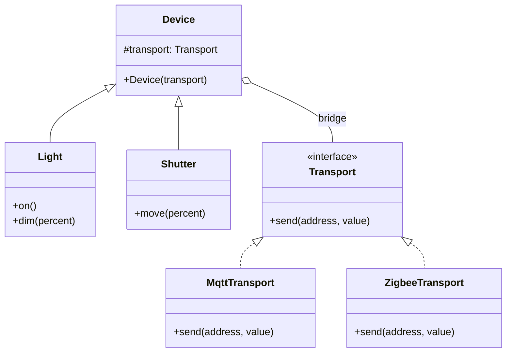

# 🌉 Bridge (Brücke)

**Kategorie:** Strukturmuster · **Gültigkeitsbereich:** Objekt

<!-- TOC -->
## Inhaltsverzeichnis

- [Zweck](#zweck)
- [Problem](#problem)
- [Lösung](#lösung)
- [Struktur](#struktur)
- [Beispiel](#beispiel)
- [Praxis](#praxis)
- [Vor- und Nachteile](#vor--und-nachteile)
- [Verwandte Muster](#verwandte-muster)
<!-- /TOC -->

## Zweck

**Entkoppelt eine Abstraktion von ihrer Implementierung**, sodass beide unabhängig voneinander variiert werden können.

---

## Problem

Es gibt zwei unabhängige Dimensionen, die sich beide ändern können. Beispiel: **Gerätetypen** (Licht, Rollladen, Heizung) und **Kommunikationswege** (MQTT, Zigbee, KNX). Mit reiner Vererbung entsteht eine Klassenexplosion:

```text
MqttLight, ZigbeeLight, KnxLight,
MqttShutter, ZigbeeShutter, KnxShutter,
MqttHeating, ZigbeeHeating, KnxHeating ...
```

3 Gerätetypen × 3 Protokolle = 9 Klassen. Ein weiteres Protokoll bedeutet drei neue Klassen, ein weiterer Gerätetyp ebenfalls.

---

## Lösung

Die beiden Dimensionen werden in **zwei getrennte Hierarchien** aufgeteilt:

* Die **Abstraktion** (Gerätetyp: was das Gerät fachlich kann) und
* die **Implementierung** (Protokoll: wie Befehle technisch übertragen werden).

Die Abstraktion **enthält eine Referenz** auf ein Implementierungsobjekt – das ist die „Brücke“. Aus 3 × 3 Klassen werden 3 + 3.

---

## Struktur



---

## Beispiel

```python
from abc import ABC, abstractmethod


# --- Implementation hierarchy ---
class Transport(ABC):
    @abstractmethod
    def send(self, address: str, value: str) -> None: ...


class MqttTransport(Transport):
    def send(self, address: str, value: str) -> None:
        print(f"MQTT  {address}/set <- {value}")


class ZigbeeTransport(Transport):
    def send(self, address: str, value: str) -> None:
        print(f"ZIGBEE {address} <- {value}")


# --- Abstraction hierarchy ---
class Device:
    def __init__(self, address: str, transport: Transport):
        self.address = address
        self._transport = transport          # the bridge


class Light(Device):
    def on(self) -> None:
        self._transport.send(self.address, "ON")

    def dim(self, percent: int) -> None:
        self._transport.send(self.address, str(percent))


class Shutter(Device):
    def move(self, percent: int) -> None:
        self._transport.send(self.address, f"POSITION {percent}")


mqtt, zigbee = MqttTransport(), ZigbeeTransport()
Light("lab/ceiling", mqtt).dim(40)
Light("0x00124b0012345678", zigbee).on()
Shutter("lab/window", mqtt).move(80)
```

---

## Praxis

* **JDBC / ODBC:** Die Anwendung nutzt die Abstraktion (`Connection`, `Statement`), der Treiber liefert die Implementierung für die jeweilige Datenbank.
* **Grafikbibliotheken:** Zeichenfunktionen (Abstraktion) über verschiedene Backends (OpenGL, Vulkan, DirectX).
* **Logging:** SLF4J-Fassade + austauschbares Backend.
* **ROS 2:** Die Kommunikations-API (`rclcpp`) ist von der DDS-Implementierung (Fast DDS, Cyclone DDS) über die RMW-Schicht getrennt.

---

## Vor- und Nachteile

| Vorteile | Nachteile |
| --- | --- |
| Beide Dimensionen unabhängig erweiterbar | Muss früh im Entwurf erkannt werden |
| Keine Klassenexplosion | Mehr Indirektion, schwerer zu überblicken |
| Implementierung zur Laufzeit austauschbar | Bei nur einer Dimension unnötig |

---

## Verwandte Muster

* **[Adapter](Adapter.md):** Nachträgliche Anpassung, Bridge ist vorab geplante Trennung.
* **[Abstract Factory](../Erzeugungsmuster/Abstract%20Factory.md):** Kann die passende Implementierung erzeugen und konfigurieren.
* **[Strategy](../Verhaltensmuster/Strategy.md):** Strukturell ähnlich (Objekt delegiert an austauschbares Objekt). Strategy tauscht ein **Verhalten**, Bridge trennt eine **ganze Implementierungsebene**.

---
