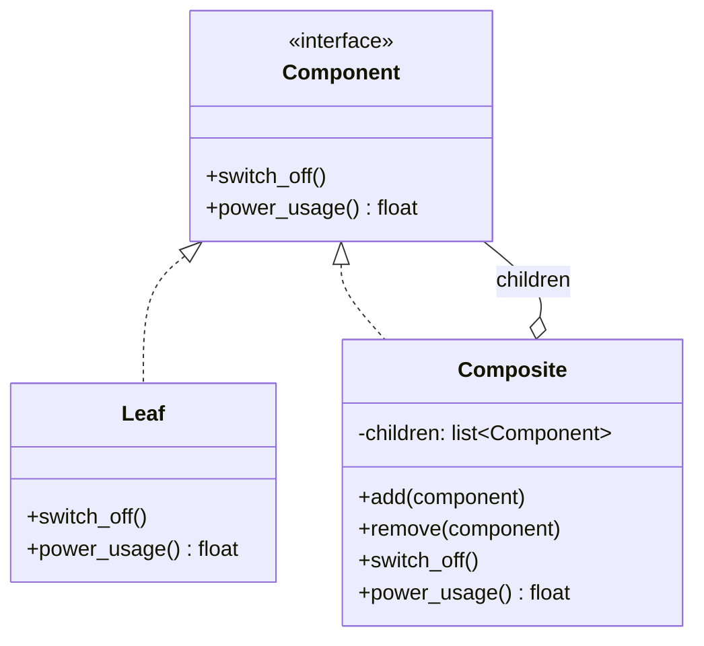

# 🌳 Composite (Kompositum)

**Kategorie:** Strukturmuster · **Gültigkeitsbereich:** Objekt

<!-- TOC -->
## Inhaltsverzeichnis

- [Zweck](#zweck)
- [Problem](#problem)
- [Lösung](#lösung)
- [Struktur](#struktur)
- [Beispiel](#beispiel)
- [Praxis](#praxis)
- [Vor- und Nachteile](#vor--und-nachteile)
- [Verwandte Muster](#verwandte-muster)
<!-- /TOC -->

## Zweck

Setzt Objekte zu **Baumstrukturen** zusammen, um **Teil-Ganzes-Hierarchien** darzustellen. Der Client kann **einzelne Objekte und Zusammensetzungen einheitlich behandeln**.

---

## Problem

Ein Smart Home besteht aus Gebäude → Stockwerken → Räumen → Geräten. Der Befehl „Alles aus“ soll auf jeder Ebene funktionieren: für eine einzelne Lampe, für einen Raum, für ein Stockwerk, für das ganze Haus. Ohne Muster muss der Code ständig unterscheiden: „Ist das ein Gerät oder eine Gruppe? Wenn Gruppe, dann über alle Kinder iterieren, die wiederum Gruppen sein können …“

---

## Lösung

Einzelobjekte (**Leaf**) und Gruppen (**Composite**) implementieren **dieselbe Schnittstelle** (**Component**). Eine Gruppe leitet einen Aufruf einfach an alle ihre Kinder weiter. Da die Kinder wieder Gruppen sein können, entsteht eine **Rekursion** – und der Client muss den Unterschied nicht kennen.

---

## Struktur



---

## Beispiel

```python
from abc import ABC, abstractmethod


class Component(ABC):
    def __init__(self, name: str):
        self.name = name

    @abstractmethod
    def switch_off(self) -> None: ...

    @abstractmethod
    def power_usage(self) -> float: ...


class Device(Component):                       # Leaf
    def __init__(self, name: str, watts: float):
        super().__init__(name)
        self.watts = watts

    def switch_off(self) -> None:
        print(f"  {self.name}: OFF")
        self.watts = 0.0

    def power_usage(self) -> float:
        return self.watts


class Group(Component):                        # Composite
    def __init__(self, name: str, *children: Component):
        super().__init__(name)
        self.children = list(children)

    def add(self, child: Component) -> "Group":
        self.children.append(child)
        return self

    def switch_off(self) -> None:
        print(f"{self.name}: switching off all")
        for child in self.children:
            child.switch_off()

    def power_usage(self) -> float:
        return sum(child.power_usage() for child in self.children)


lab = Group("Lab",
            Device("Beamer", 280),
            Device("Ceiling light", 40),
            Group("Workbench", Device("Soldering station", 60), Device("Monitor", 25)))
house = Group("Building", lab, Group("Office", Device("Printer", 15)))

print(f"Total: {house.power_usage()} W")
lab.switch_off()                      # works the same for a single device or a whole tree
print(f"Total: {house.power_usage()} W")
```

---

## Praxis

* **openHAB Group Items:** Eine Gruppe mit Aggregationsfunktion (`Group:Switch:OR(ON,OFF)`, `Group:Number:SUM`) verhält sich wie ein einzelnes Item; ein Befehl an die Gruppe geht an alle Mitglieder. Das **semantische Modell** (Location → Equipment → Point) ist ein Kompositum.
* **Dateisysteme:** Verzeichnisse enthalten Dateien und Verzeichnisse.
* **GUI:** Ein Panel enthält Buttons und weitere Panels (DOM, Qt-Widgets, JavaFX-Scenegraph).
* **Robotik:** Der TF-Baum in ROS (Koordinatensysteme mit Eltern-Kind-Beziehung), URDF-Modelle.
* **Dokumente:** Kapitel → Abschnitte → Absätze; HTML/XML.

---

## Vor- und Nachteile

| Vorteile | Nachteile |
| --- | --- |
| Client behandelt Einzelobjekte und Gruppen gleich | Schnittstelle ist manchmal zu allgemein (`add()` ergibt für ein Blatt keinen Sinn) |
| Neue Elementtypen leicht hinzufügbar | Einschränkungen („ein Raum darf keine Stockwerke enthalten“) schwer durchzusetzen |
| Natürliche Abbildung von Hierarchien, rekursive Algorithmen | |

---

## Verwandte Muster

* **[Iterator](../Verhaltensmuster/Iterator.md):** Zum Durchlaufen eines Kompositums.
* **[Visitor](../Verhaltensmuster/Visitor.md):** Für neue Operationen über alle Knoten des Baums.
* **[Decorator](Decorator.md):** Strukturell ähnlich (rekursive Komposition), aber ein Decorator hat genau **ein** Kind und fügt Verhalten hinzu.
* **[Chain of Responsibility](../Verhaltensmuster/Chain%20of%20Responsibility.md):** Oft entlang der Eltern-Verknüpfung eines Kompositums.
* **[Flyweight](Flyweight.md):** Blätter können als Fliegengewichte geteilt werden.

---
