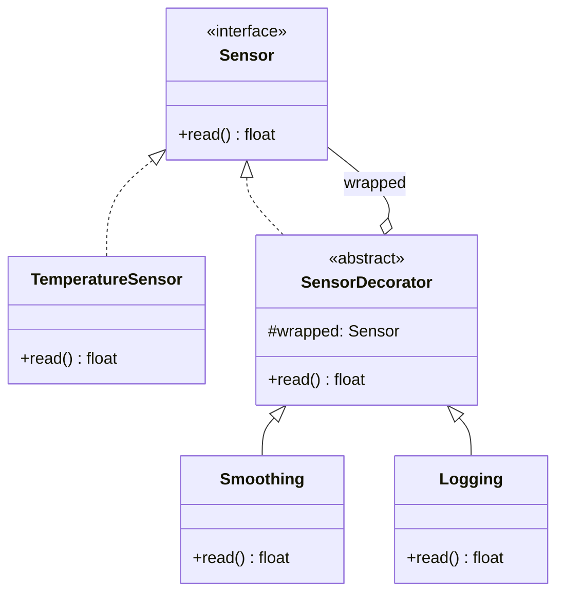

# 🎀 Decorator (Dekorierer)

**Kategorie:** Strukturmuster · **Gültigkeitsbereich:** Objekt · **Auch bekannt als:** Wrapper

<!-- TOC -->
## Inhaltsverzeichnis

- [Zweck](#zweck)
- [Problem](#problem)
- [Lösung](#lösung)
- [Struktur](#struktur)
- [Beispiel](#beispiel)
- [Praxis](#praxis)
- [Vor- und Nachteile](#vor--und-nachteile)
- [Verwandte Muster](#verwandte-muster)
<!-- /TOC -->

## Zweck

Fügt einem Objekt **dynamisch zusätzliche Verantwortlichkeiten** hinzu. Ein Decorator ist eine flexible Alternative zur Vererbung, um Funktionalität zu erweitern.

---

## Problem

Ein Sensor liefert Messwerte. Je nach Einsatz sollen die Werte zusätzlich **geglättet**, **in eine andere Einheit umgerechnet**, **zwischengespeichert** oder **protokolliert** werden – in beliebiger Kombination. Mit Vererbung bräuchte man für jede Kombination eine Unterklasse (`LoggingSmoothedFahrenheitSensor` …).

---

## Lösung

Ein Decorator **implementiert dieselbe Schnittstelle** wie das Objekt, das er „umhüllt“, und **enthält** dieses Objekt. Er leitet Aufrufe weiter und fügt davor oder danach eigenes Verhalten hinzu. Weil der Decorator selbst wieder dieselbe Schnittstelle hat, lassen sich Decorators **beliebig stapeln** – wie Schichten einer Zwiebel.

---

## Struktur



---

## Beispiel

**Objekt-Decorator nach GoF:**

```python
import random
from abc import ABC, abstractmethod
from collections import deque


class Sensor(ABC):
    @abstractmethod
    def read(self) -> float: ...


class TemperatureSensor(Sensor):
    def read(self) -> float:
        return 21.0 + random.uniform(-1.5, 1.5)          # noisy raw value


class SensorDecorator(Sensor):
    def __init__(self, wrapped: Sensor):
        self._wrapped = wrapped


class Smoothing(SensorDecorator):
    def __init__(self, wrapped: Sensor, window: int = 5):
        super().__init__(wrapped)
        self._values = deque(maxlen=window)

    def read(self) -> float:
        self._values.append(self._wrapped.read())
        return sum(self._values) / len(self._values)


class Fahrenheit(SensorDecorator):
    def read(self) -> float:
        return self._wrapped.read() * 9 / 5 + 32


class Logging(SensorDecorator):
    def read(self) -> float:
        value = self._wrapped.read()
        print(f"read -> {value:.2f}")
        return value


sensor = Logging(Fahrenheit(Smoothing(TemperatureSensor(), window=10)))
for _ in range(3):
    sensor.read()
```

**Python-Decorators** (`@`) folgen derselben Idee für **Funktionen**: Eine Funktion wird in eine andere Funktion eingewickelt.

```python
import functools
import time


def retry(times: int = 3, delay: float = 0.1):
    def decorator(func):
        @functools.wraps(func)
        def wrapper(*args, **kwargs):
            for attempt in range(1, times + 1):
                try:
                    return func(*args, **kwargs)
                except ConnectionError as err:
                    print(f"attempt {attempt} failed: {err}")
                    time.sleep(delay)
            raise ConnectionError(f"{func.__name__} failed after {times} attempts")
        return wrapper
    return decorator


calls = {"n": 0}


@retry(times=3)
def connect_to_beamer() -> str:
    calls["n"] += 1
    if calls["n"] < 3:
        raise ConnectionError("no answer")
    return "connected"


print(connect_to_beamer())
```

---

## Praxis

* **Java I/O:** `new BufferedReader(new InputStreamReader(new FileInputStream(file)))` – jede Schicht fügt etwas hinzu (Pufferung, Zeichenkodierung).
* **Python:** `@functools.lru_cache`, `@property`, `@staticmethod`, Flask-Routen `@app.route(...)`
* **Web-Middleware:** Express/ASP.NET-Middleware umhüllt den Request-Handler (Logging, Authentifizierung, Kompression).
* **Streams:** `gzip.open()` umhüllt eine Datei mit Kompression.

---

## Vor- und Nachteile

| Vorteile | Nachteile |
| --- | --- |
| Funktionen zur Laufzeit kombinierbar | Viele kleine Objekte, Debugging durch mehrere Schichten |
| Keine Klassenexplosion durch Kombinationen | Reihenfolge kann entscheidend sein (erst glätten, dann umrechnen?) |
| Single Responsibility: jeder Decorator macht eine Sache | Identitätsprüfungen (`is`, `isinstance` auf die konkrete Klasse) funktionieren nicht mehr |

---

## Verwandte Muster

* **[Adapter](Adapter.md):** Ändert die Schnittstelle, Decorator behält sie bei.
* **[Proxy](Proxy.md):** Gleiche Struktur, anderer Zweck: Proxy **kontrolliert den Zugriff**, Decorator **erweitert das Verhalten**.
* **[Composite](Composite.md):** Decorator ist wie ein Kompositum mit genau einem Kind.
* **[Strategy](../Verhaltensmuster/Strategy.md):** Decorator ändert die „Hülle“, Strategy das „Innere“ eines Objekts.

---
