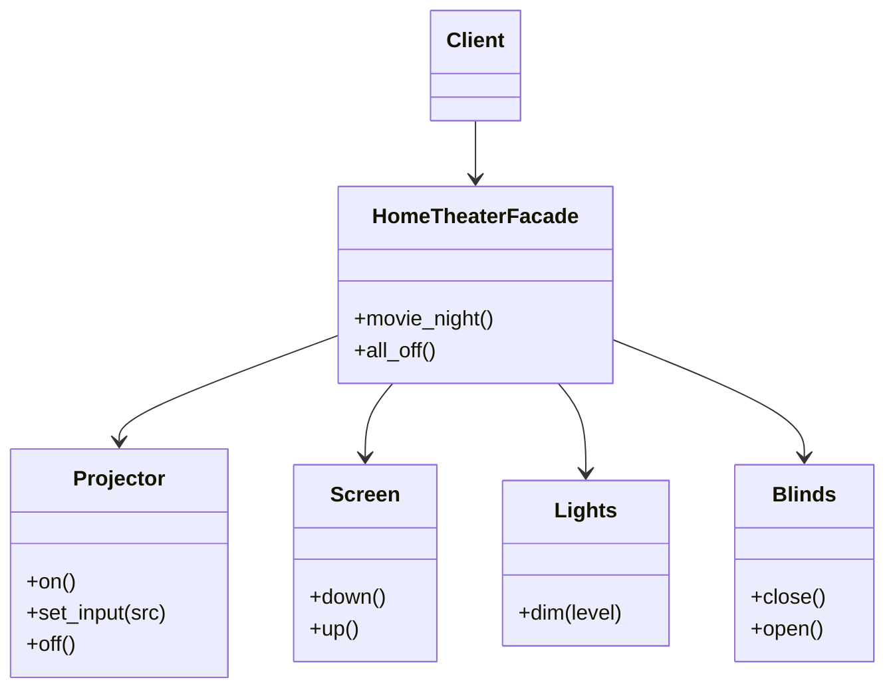

# 🏛️ Facade (Fassade)

**Kategorie:** Strukturmuster · **Gültigkeitsbereich:** Objekt

<!-- TOC -->
## Inhaltsverzeichnis

- [Zweck](#zweck)
- [Problem](#problem)
- [Lösung](#lösung)
- [Struktur](#struktur)
- [Beispiel](#beispiel)
- [Praxis](#praxis)
- [Vor- und Nachteile](#vor--und-nachteile)
- [Verwandte Muster](#verwandte-muster)
<!-- /TOC -->

## Zweck

Bietet eine **einheitliche, vereinfachte Schnittstelle** zu einer Menge von Schnittstellen eines Subsystems. Die Fassade definiert eine höhere Abstraktionsebene, die das Subsystem leichter benutzbar macht.

---

## Problem

Für einen „Filmabend“ im Smart-Home-Labor müssen viele Komponenten in der richtigen Reihenfolge angesprochen werden: Rollladen schließen, Licht dimmen, Beamer einschalten, Eingang wählen, Leinwand herunterfahren, AV-Receiver auf den richtigen Kanal stellen. Jeder Aufrufer (Regel, Dashboard, Sprachassistent) müsste diese Abfolge kennen und wiederholen.

---

## Lösung

Eine **Fassaden-Klasse** kapselt die Abfolge in wenigen, sprechenden Methoden (`movie_night()`, `all_off()`). Die Subsystem-Klassen bleiben unverändert und weiterhin direkt nutzbar – die Fassade **verbietet nichts**, sie **vereinfacht** nur den häufigen Fall.

---

## Struktur



---

## Beispiel

```python
class Projector:
    def on(self) -> None: print("projector: on")
    def set_input(self, source: str) -> None: print(f"projector: input {source}")
    def off(self) -> None: print("projector: off")


class Screen:
    def down(self) -> None: print("screen: down")
    def up(self) -> None: print("screen: up")


class Lights:
    def dim(self, level: int) -> None: print(f"lights: {level} %")


class Blinds:
    def close(self) -> None: print("blinds: closed")
    def open(self) -> None: print("blinds: open")


class HomeTheaterFacade:
    def __init__(self, projector: Projector, screen: Screen, lights: Lights, blinds: Blinds):
        self._projector = projector
        self._screen = screen
        self._lights = lights
        self._blinds = blinds

    def movie_night(self, source: str = "HDMI1") -> None:
        self._blinds.close()
        self._lights.dim(10)
        self._screen.down()
        self._projector.on()
        self._projector.set_input(source)

    def all_off(self) -> None:
        self._projector.off()
        self._screen.up()
        self._lights.dim(100)
        self._blinds.open()


theater = HomeTheaterFacade(Projector(), Screen(), Lights(), Blinds())
theater.movie_night()
theater.all_off()
```

---

## Praxis

* **Bibliotheken:** `requests` ist eine Fassade über `urllib3`, Sockets, TLS, Cookies und Redirects.
* **Python:** `shutil.copytree()` kapselt viele `os`-Aufrufe.
* **openHAB:** Eine Szenen-Regel („Filmabend“) ist eine Fassade über viele Items.
* **APIs:** Ein „Backend for Frontend“ (BFF) bündelt mehrere Microservices für eine Oberfläche.
* **Hardware-Treiber:** Eine eigene Python-Klasse für einen Beamer kapselt das RS232-Protokoll mit seinen Kommandostrings.

---

## Vor- und Nachteile

| Vorteile | Nachteile |
| --- | --- |
| Einfache Benutzung des Subsystems | Gefahr eines „God Object“, wenn die Fassade alles können soll |
| Lose Kopplung zwischen Client und Subsystem | Zusätzliche Schicht, die gepflegt werden muss |
| Subsystem bleibt für Spezialfälle direkt nutzbar | Versteckt evtl. wichtige Details (Fehlerbehandlung, Timing) |

---

## Verwandte Muster

* **[Adapter](Adapter.md):** Passt eine **vorhandene** Schnittstelle an eine erwartete an; die Fassade **definiert eine neue, einfachere**.
* **[Mediator](../Verhaltensmuster/Mediator.md):** Koordiniert Kollegen untereinander (bidirektional); die Fassade spricht nur in eine Richtung mit dem Subsystem.
* **[Singleton](../Erzeugungsmuster/Singleton.md):** Oft gibt es nur eine Fassade pro Subsystem.
* **[Abstract Factory](../Erzeugungsmuster/Abstract%20Factory.md):** Kann zusammen mit einer Fassade Subsystem-Objekte erzeugen.

---
