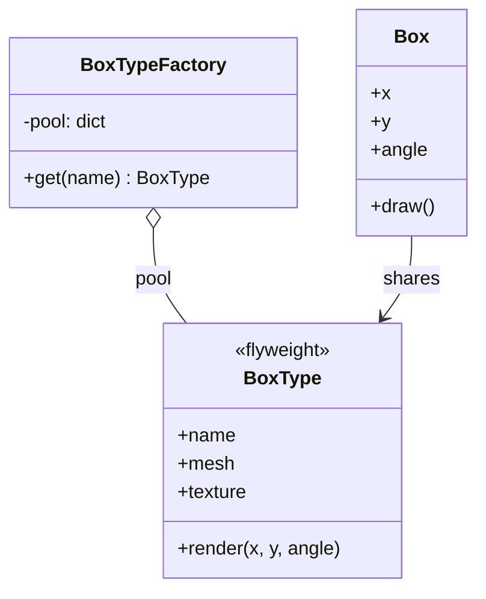

# 🪶 Flyweight (Fliegengewicht)

**Kategorie:** Strukturmuster · **Gültigkeitsbereich:** Objekt

<!-- TOC -->
## Inhaltsverzeichnis

- [Zweck](#zweck)
- [Problem](#problem)
- [Lösung](#lösung)
- [Struktur](#struktur)
- [Beispiel](#beispiel)
- [Praxis](#praxis)
- [Vor- und Nachteile](#vor--und-nachteile)
- [Verwandte Muster](#verwandte-muster)
<!-- /TOC -->

## Zweck

Nutzt **Teilen (Sharing)**, um eine große Anzahl feingranularer Objekte effizient zu unterstützen. Gemeinsame Daten werden nur **einmal** im Speicher gehalten.

---

## Problem

Eine Robotik-Simulation stellt eine Lagerhalle mit 100 000 Kisten dar. Jede Kiste hätte ihr eigenes 3D-Mesh, ihre eigene Textur und ihre eigenen Materialdaten – obwohl es nur fünf verschiedene Kistentypen gibt. Der Speicher läuft voll, obwohl sich die Kisten nur in **Position** und **Rotation** unterscheiden.

---

## Lösung

Den Objektzustand aufteilen:

| Zustand | Bedeutung | Beispiel | Wo gespeichert? |
| --- | --- | --- | --- |
| **intrinsisch** | unveränderlich, teilbar | Mesh, Textur, Gewicht des Kistentyps | im Flyweight (einmal pro Typ) |
| **extrinsisch** | kontextabhängig | Position, Rotation | beim Aufrufer / im Kontext-Objekt |

Eine **Flyweight-Factory** verwaltet einen Pool und gibt für denselben Schlüssel immer **dasselbe** Objekt zurück. Flyweights müssen **unveränderlich** sein, sonst beeinflusst eine Änderung alle Nutzer.

---

## Struktur



---

## Beispiel

```python
import sys
from dataclasses import dataclass


@dataclass(frozen=True)                     # immutable -> safe to share
class BoxType:
    name: str
    mesh: bytes
    texture: bytes

    def render(self, x: float, y: float, angle: float) -> str:
        return f"{self.name} at ({x:.1f}, {y:.1f}) rotated {angle:.0f} deg"


class BoxTypeFactory:
    _pool: dict[str, BoxType] = {}

    @classmethod
    def get(cls, name: str) -> BoxType:
        if name not in cls._pool:
            # pretend this is an expensive load from disk
            cls._pool[name] = BoxType(name, mesh=b"\x00" * 50_000, texture=b"\xff" * 200_000)
        return cls._pool[name]


@dataclass
class Box:                                  # extrinsic state only
    x: float
    y: float
    angle: float
    kind: BoxType

    def draw(self) -> str:
        return self.kind.render(self.x, self.y, self.angle)


boxes = [
    Box(x=i % 100, y=i // 100, angle=(i * 15) % 360,
        kind=BoxTypeFactory.get(["euro", "small", "large"][i % 3]))
    for i in range(10_000)
]

print(boxes[42].draw())
print("distinct box types in memory:", len(BoxTypeFactory._pool))
print("size of one type (mesh+texture):", len(boxes[0].kind.mesh) + len(boxes[0].kind.texture), "bytes")
print("same object shared:", boxes[0].kind is boxes[3].kind)
print("size of extrinsic object:", sys.getsizeof(boxes[0]), "bytes")
```

Ohne Flyweight lägen hier 10 000 × 250 kB ≈ 2,5 GB im Speicher, mit Flyweight 3 × 250 kB.

---

## Praxis

* **Python:** Kleine Integer (−5 … 256) und internierte Strings (`sys.intern`) werden geteilt.
* **Java:** `Integer.valueOf()` cacht Werte von −128 bis 127, der String-Pool.
* **Spiele/Simulation (Gazebo, Unity):** Instanced Rendering – ein Mesh, viele Transformationen.
* **Texteditoren:** Glyphen eines Zeichensatzes werden einmal geladen, jedes Zeichen speichert nur Position und Verweis.
* **Mermaid/Diagramme:** Gleiche Stil-Objekte für viele Knoten.

---

## Vor- und Nachteile

| Vorteile | Nachteile |
| --- | --- |
| Drastisch weniger Speicherverbrauch | Komplexerer Code durch Aufteilung des Zustands |
| Weniger teure Ladevorgänge | Extrinsischer Zustand muss bei jedem Aufruf übergeben werden |
| | Lohnt sich nur bei **sehr vielen** gleichartigen Objekten |
| | Flyweights müssen unveränderlich und ggf. thread-sicher sein |

---

## Verwandte Muster

* **[Composite](Composite.md):** Blätter eines Baums werden oft als Flyweights geteilt.
* **[Factory Method](../Erzeugungsmuster/Factory%20Method.md):** Die Flyweight-Factory ist meist eine Fabrik mit Cache.
* **[Singleton](../Erzeugungsmuster/Singleton.md):** Singleton = genau ein Objekt; Flyweight = ein Objekt **pro Schlüssel**.
* **[State](../Verhaltensmuster/State.md) / [Strategy](../Verhaltensmuster/Strategy.md):** Zustandslose State- und Strategy-Objekte können als Flyweights geteilt werden.

---
