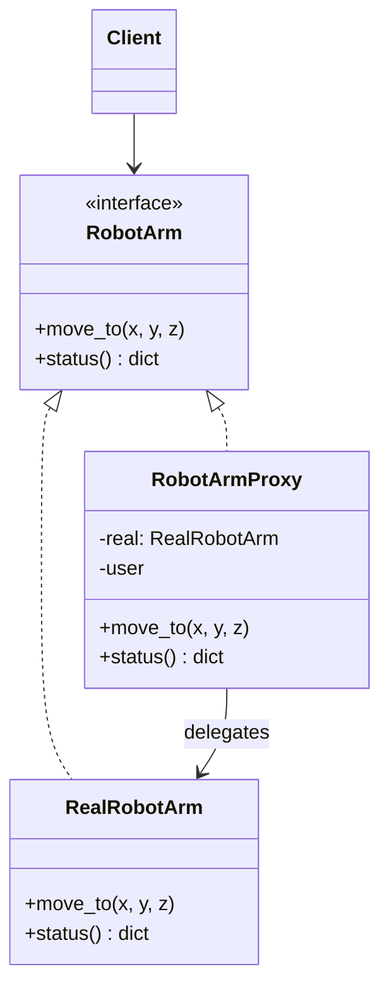

# 🛡️ Proxy (Stellvertreter)

**Kategorie:** Strukturmuster · **Gültigkeitsbereich:** Objekt · **Auch bekannt als:** Surrogate, Stellvertreter

<!-- TOC -->
## Inhaltsverzeichnis

- [Zweck](#zweck)
- [Problem](#problem)
- [Lösung](#lösung)
- [Struktur](#struktur)
- [Beispiel](#beispiel)
- [Praxis](#praxis)
- [Vor- und Nachteile](#vor--und-nachteile)
- [Verwandte Muster](#verwandte-muster)
<!-- /TOC -->

## Zweck

Stellt einen **Platzhalter** für ein anderes Objekt bereit, um den **Zugriff darauf zu kontrollieren**.

---

## Problem

Ein Roboterarm wird über eine Netzwerkverbindung gesteuert. Die Verbindung soll erst aufgebaut werden, wenn sie wirklich gebraucht wird, nur berechtigte Nutzer dürfen Bewegungen auslösen, und teure Statusabfragen sollen kurz zwischengespeichert werden. Der aufrufende Code soll davon aber **nichts merken** – er soll weiterhin einfach `arm.move_to(...)` aufrufen.

---

## Lösung

Der Proxy **implementiert dieselbe Schnittstelle** wie das echte Objekt (Subject) und hält eine Referenz darauf. Jeder Aufruf geht zuerst an den Proxy, der vor oder nach der Weiterleitung eingreift. Typische Arten:

| Proxy-Art | Aufgabe | Beispiel |
| --- | --- | --- |
| **Virtual Proxy** | Lazy Loading: teures Objekt erst bei Bedarf erzeugen | Bild erst laden, wenn es angezeigt wird |
| **Protection Proxy** | Zugriffskontrolle (→ [Autorisierung](../../Zugriffskontrolle/Authentifizierung%20%26%20Autorisierung.md)) | Nur Rolle `operator` darf `move_to()` |
| **Remote Proxy** | Lokaler Stellvertreter für ein entferntes Objekt | gRPC-/RPC-Stub, Java RMI |
| **Caching Proxy** | Ergebnisse zwischenspeichern | Statusabfrage max. 1× pro Sekunde |
| **Logging/Smart Proxy** | Protokollierung, Referenzzählung | Audit-Log jeder Bewegung |

---

## Struktur



---

## Beispiel

Ein Proxy, der Virtual, Protection und Caching Proxy kombiniert:

```python
import time
from abc import ABC, abstractmethod


class RobotArm(ABC):
    @abstractmethod
    def move_to(self, x: float, y: float, z: float) -> None: ...

    @abstractmethod
    def status(self) -> dict: ...


class RealRobotArm(RobotArm):
    def __init__(self, host: str):
        print(f"connecting to {host} ...")          # expensive
        self._pos = (0.0, 0.0, 0.0)

    def move_to(self, x: float, y: float, z: float) -> None:
        self._pos = (x, y, z)
        print(f"arm moved to {self._pos}")

    def status(self) -> dict:
        time.sleep(0.2)                              # slow network request
        return {"pos": self._pos, "ts": time.time()}


class RobotArmProxy(RobotArm):
    def __init__(self, host: str, user_roles: set[str], cache_seconds: float = 1.0):
        self._host = host
        self._roles = user_roles
        self._real: RealRobotArm | None = None
        self._cache: dict | None = None
        self._cache_time = 0.0
        self._cache_seconds = cache_seconds

    def _arm(self) -> RealRobotArm:                  # virtual proxy (lazy)
        if self._real is None:
            self._real = RealRobotArm(self._host)
        return self._real

    def move_to(self, x: float, y: float, z: float) -> None:
        if "operator" not in self._roles:           # protection proxy
            raise PermissionError("role 'operator' required")
        self._arm().move_to(x, y, z)
        self._cache = None                           # invalidate cache

    def status(self) -> dict:                        # caching proxy
        now = time.monotonic()
        if self._cache is None or now - self._cache_time > self._cache_seconds:
            self._cache = self._arm().status()
            self._cache_time = now
        return self._cache


viewer = RobotArmProxy("192.168.10.50", user_roles={"viewer"})
try:
    viewer.move_to(1, 2, 3)
except PermissionError as err:
    print("denied:", err)                            # no connection was opened

operator = RobotArmProxy("192.168.10.50", user_roles={"operator"})
operator.move_to(0.3, 0.1, 0.5)
print(operator.status())
print(operator.status())                             # served from cache
```

---

## Praxis

* **Netzwerk:** Forward-Proxy (Squid), **Reverse Proxy** (nginx, Traefik, Caddy) vor openHAB, Grafana & Co. – inkl. TLS-Terminierung (→ [Zertifikate](../../Best%20Practices/Zertifikate.md)).
* **ORMs:** SQLAlchemy/Hibernate laden verknüpfte Objekte lazy über Proxies.
* **Python:** `weakref.proxy`, `unittest.mock.Mock` (ein Proxy, der Aufrufe aufzeichnet).
* **JavaScript:** Das eingebaute `Proxy`-Objekt (Vue 3 nutzt es für Reaktivität).
* **RPC:** gRPC-Stubs, Java RMI, ROS-Service-Proxies (`rospy.ServiceProxy`).

---

## Vor- und Nachteile

| Vorteile | Nachteile |
| --- | --- |
| Zugriffskontrolle, Caching, Lazy Loading ohne Änderung am echten Objekt | Zusätzliche Indirektion, ggf. Latenz |
| Client merkt keinen Unterschied (gleiche Schnittstelle) | Verhalten kann überraschen (Cache liefert veraltete Daten) |
| Open/Closed: neue Proxys ohne Änderung am Subject | Bei Remote-Proxys werden Netzwerkfehler zu „lokalen“ Fehlern |

---

## Verwandte Muster

* **[Decorator](Decorator.md):** Gleiche Struktur; Decorator **erweitert Verhalten** und wird vom Client zusammengesetzt, Proxy **kontrolliert den Zugriff** und verwaltet oft selbst den Lebenszyklus des echten Objekts.
* **[Adapter](Adapter.md):** Liefert eine **andere** Schnittstelle, der Proxy **dieselbe**.
* **[Facade](Facade.md):** Vereinfacht ein ganzes Subsystem, Proxy steht für **ein** Objekt.

---
