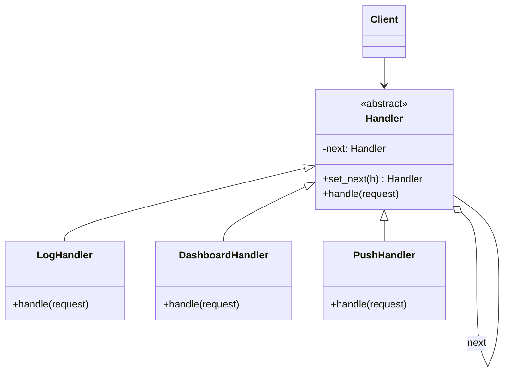
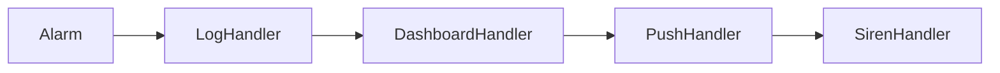

# ⛓️ Chain of Responsibility (Zuständigkeitskette)

**Kategorie:** Verhaltensmuster · **Gültigkeitsbereich:** Objekt

<!-- TOC -->
## Inhaltsverzeichnis

- [Zweck](#zweck)
- [Problem](#problem)
- [Lösung](#lösung)
- [Struktur](#struktur)
- [Beispiel](#beispiel)
- [Praxis](#praxis)
- [Vor- und Nachteile](#vor--und-nachteile)
- [Verwandte Muster](#verwandte-muster)
<!-- /TOC -->

## Zweck

Vermeidet die Kopplung zwischen dem Sender einer Anfrage und ihrem Empfänger, indem **mehrere Objekte die Chance bekommen, die Anfrage zu bearbeiten**. Die Empfänger werden zu einer Kette verbunden; die Anfrage wird entlang der Kette weitergereicht, bis ein Objekt sie bearbeitet.

---

## Problem

Ein Alarmsystem im Labor erhält Meldungen unterschiedlicher Schwere: Info (nur loggen), Warnung (Dashboard), kritisch (Push-Nachricht), Notfall (Sirene + Abschaltung). Ein riesiges `if/elif` im Sender wäre schwer erweiterbar – und die Zuständigkeiten sollen sich je nach Installation ändern lassen.

---

## Lösung

Jeder **Handler** kennt seinen **Nachfolger**. Er entscheidet:

1. Kann ich die Anfrage bearbeiten? → bearbeiten (und ggf. abbrechen),
2. sonst (oder zusätzlich) → an den Nachfolger weiterreichen.

Die Kette wird **zur Laufzeit** zusammengesetzt; der Sender kennt nur das erste Glied.

---

## Struktur





---

## Beispiel

```python
from __future__ import annotations

from dataclasses import dataclass
from enum import IntEnum


class Level(IntEnum):
    INFO = 1
    WARNING = 2
    CRITICAL = 3
    EMERGENCY = 4


@dataclass
class Alarm:
    source: str
    level: Level
    text: str


class Handler:
    def __init__(self) -> None:
        self._next: Handler | None = None

    def set_next(self, handler: Handler) -> Handler:
        self._next = handler
        return handler                       # allows a.set_next(b).set_next(c)

    def handle(self, alarm: Alarm) -> None:
        if self._next:
            self._next.handle(alarm)


class LogHandler(Handler):
    def handle(self, alarm: Alarm) -> None:
        print(f"[log] {alarm.level.name}: {alarm.source} - {alarm.text}")
        super().handle(alarm)                 # always pass on


class DashboardHandler(Handler):
    def handle(self, alarm: Alarm) -> None:
        if alarm.level >= Level.WARNING:
            print(f"[dashboard] show banner: {alarm.text}")
        super().handle(alarm)


class PushHandler(Handler):
    def handle(self, alarm: Alarm) -> None:
        if alarm.level >= Level.CRITICAL:
            print(f"[push] notify staff: {alarm.text}")
        super().handle(alarm)


class SirenHandler(Handler):
    def handle(self, alarm: Alarm) -> None:
        if alarm.level == Level.EMERGENCY:
            print("[siren] ON, cutting power to robot cell")
            return                             # end of chain
        super().handle(alarm)


chain = LogHandler()
chain.set_next(DashboardHandler()).set_next(PushHandler()).set_next(SirenHandler())

chain.handle(Alarm("door_sensor", Level.INFO, "door opened"))
chain.handle(Alarm("temp_server", Level.CRITICAL, "server room 38 C"))
chain.handle(Alarm("light_curtain", Level.EMERGENCY, "person in robot cell"))
```

> In der klassischen GoF-Variante bearbeitet **genau ein** Handler die Anfrage und bricht ab. In der Praxis (Middleware, Filter) reichen Handler oft **zusätzlich** weiter – wie hier.

---

## Praxis

* **Web-Middleware:** Express, Django, ASP.NET – jede Middleware kann antworten oder `next()` aufrufen.
* **Servlet-Filter** (Java), **Logging-Handler** in Python (`logging` reicht an Eltern-Logger weiter).
* **GUI-Events:** Ein Klick „blubbert“ vom Button über den Container bis zum Fenster (Event Bubbling im DOM).
* **Exceptions:** Die Aufrufkette sucht den ersten passenden `except`-/`catch`-Block.
* **Firewall-Regeln / ACLs:** Erste passende Regel gewinnt (→ [ACL](../../Zugriffskontrolle/ACL.md)).

---

## Vor- und Nachteile

| Vorteile | Nachteile |
| --- | --- |
| Sender und Empfänger entkoppelt | Keine Garantie, dass jemand die Anfrage bearbeitet |
| Kette zur Laufzeit konfigurierbar | Reihenfolge entscheidend, Fehler schwer zu finden |
| Single Responsibility pro Handler | Lange Ketten kosten Performance, Debugging über viele Stationen |

---

## Verwandte Muster

* **[Composite](../Strukturmuster/Composite.md):** Der Elternknoten dient oft als Nachfolger in der Kette.
* **[Command](Command.md):** Anfragen werden häufig als Command-Objekte durch die Kette gereicht.
* **[Decorator](../Strukturmuster/Decorator.md):** Ähnliche Verkettung, aber jeder Decorator **muss** weiterleiten; ein Handler **darf** abbrechen.
* **[Observer](Observer.md):** Alle Beobachter werden benachrichtigt; in der Kette entscheidet jedes Glied, ob es weitergeht.

---
