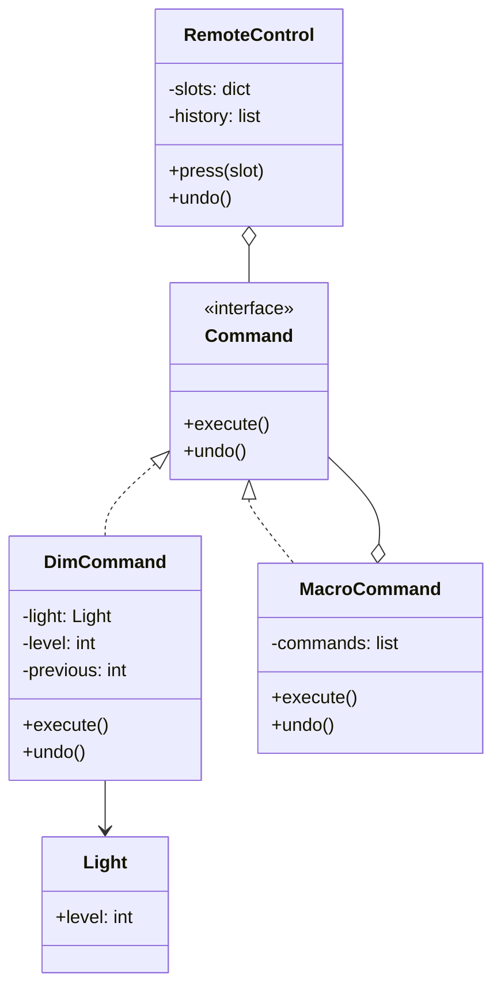

# 🎮 Command (Befehl)

**Kategorie:** Verhaltensmuster · **Gültigkeitsbereich:** Objekt · **Auch bekannt als:** Action, Transaction

<!-- TOC -->
## Inhaltsverzeichnis

- [Zweck](#zweck)
- [Problem](#problem)
- [Lösung](#lösung)
- [Struktur](#struktur)
- [Beispiel](#beispiel)
- [Praxis](#praxis)
- [Vor- und Nachteile](#vor--und-nachteile)
- [Verwandte Muster](#verwandte-muster)
<!-- /TOC -->

## Zweck

Kapselt eine **Anfrage als Objekt**. Dadurch lassen sich Aufrufer mit unterschiedlichen Anfragen parametrisieren, Anfragen in **Warteschlangen** stellen, **protokollieren** und **rückgängig machen** (Undo).

---

## Problem

Eine Fernbedienungs-App für das Labor hat frei belegbare Tasten. Taste 1 soll heute das Licht schalten, morgen den Beamer. Außerdem soll es einen „Rückgängig“-Knopf geben und Makros, die mehrere Aktionen hintereinander ausführen. Wenn die Tasten direkt `light.on()` aufrufen, ist all das nicht möglich.

---

## Lösung

Jede Aktion wird zu einem Objekt mit einer einheitlichen Methode `execute()` (und optional `undo()`). Beteiligte:

| Rolle | Aufgabe | Beispiel |
| --- | --- | --- |
| **Command** | Schnittstelle `execute()` / `undo()` | `Command` |
| **ConcreteCommand** | Bindet Empfänger + Aktion + Parameter | `DimCommand(light, 30)` |
| **Receiver** | Weiß, wie die Aktion wirklich ausgeführt wird | `Light` |
| **Invoker** | Löst den Befehl aus, kennt den Empfänger nicht | `RemoteControl` |
| **Client** | Erzeugt Commands und weist sie zu | Konfiguration |

---

## Struktur



---

## Beispiel

```python
from abc import ABC, abstractmethod


class Light:                                   # receiver
    def __init__(self, name: str):
        self.name = name
        self.level = 0

    def set_level(self, level: int) -> None:
        self.level = level
        print(f"{self.name}: {level} %")


class Command(ABC):
    @abstractmethod
    def execute(self) -> None: ...

    @abstractmethod
    def undo(self) -> None: ...


class DimCommand(Command):
    def __init__(self, light: Light, level: int):
        self._light = light
        self._level = level
        self._previous = 0

    def execute(self) -> None:
        self._previous = self._light.level
        self._light.set_level(self._level)

    def undo(self) -> None:
        self._light.set_level(self._previous)


class MacroCommand(Command):
    def __init__(self, *commands: Command):
        self._commands = commands

    def execute(self) -> None:
        for cmd in self._commands:
            cmd.execute()

    def undo(self) -> None:
        for cmd in reversed(self._commands):   # undo in reverse order
            cmd.undo()


class RemoteControl:                           # invoker
    def __init__(self):
        self._slots: dict[int, Command] = {}
        self._history: list[Command] = []

    def assign(self, slot: int, command: Command) -> None:
        self._slots[slot] = command

    def press(self, slot: int) -> None:
        command = self._slots[slot]
        command.execute()
        self._history.append(command)

    def undo(self) -> None:
        if self._history:
            self._history.pop().undo()


ceiling, desk = Light("ceiling"), Light("desk")
remote = RemoteControl()
remote.assign(1, DimCommand(ceiling, 80))
remote.assign(2, MacroCommand(DimCommand(ceiling, 10), DimCommand(desk, 60)))  # "reading"

remote.press(1)
remote.press(2)
remote.undo()                                  # back to ceiling 80, desk 0
```

---

## Praxis

* **Undo/Redo** in Editoren, Grafikprogrammen, IDEs.
* **GUI:** Menüeinträge, Tastenkürzel und Toolbar-Buttons teilen sich dasselbe Action-Objekt (Qt `QAction`, Java Swing `Action`).
* **Job-Queues:** Celery-Tasks, Ansible-Tasks, Cron-Jobs – ein Auftrag als Datenobjekt, später ausgeführt.
* **ROS Actions / MQTT-Kommandos:** Ein Befehl als Nachricht (`{"cmd": "move", "x": 1}`) wird übertragen und beim Empfänger ausgeführt.
* **Datenbanken:** Transaktionen, Migrationen mit `upgrade()`/`downgrade()` (Alembic, Flyway).
* **CLI-Frameworks:** `click`, `argparse`-Subcommands.

---

## Vor- und Nachteile

| Vorteile | Nachteile |
| --- | --- |
| Aufrufer und Ausführender entkoppelt | Viele kleine Klassen |
| Undo/Redo, Makros, Warteschlangen, Logging möglich | Undo erfordert, dass jeder Befehl seinen alten Zustand kennt |
| Neue Befehle ohne Änderung bestehenden Codes | Bei einfachen Fällen reicht oft eine Funktion/Lambda (in Python sind Funktionen bereits Objekte) |

---

## Verwandte Muster

* **[Memento](Memento.md):** Speichert den Zustand, den ein Command für `undo()` braucht.
* **[Composite](../Strukturmuster/Composite.md):** `MacroCommand` ist ein Kompositum aus Commands.
* **[Chain of Responsibility](Chain%20of%20Responsibility.md):** Commands können durch eine Kette gereicht werden.
* **[Prototype](../Erzeugungsmuster/Prototype.md):** Commands kopieren, bevor sie in die Historie wandern.
* **[Strategy](Strategy.md):** Strategy beschreibt **wie** etwas getan wird, Command **was** getan werden soll.

---
