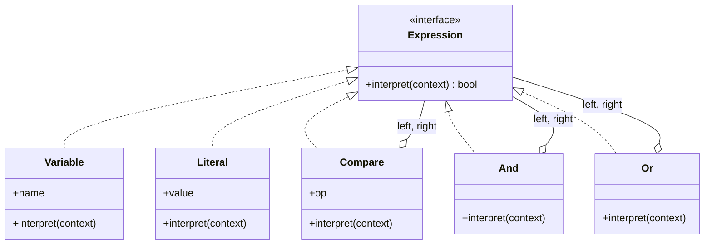
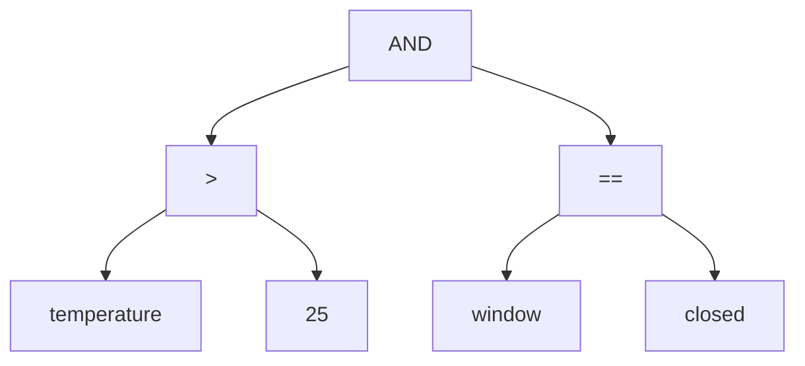

# 🗣️ Interpreter

**Kategorie:** Verhaltensmuster · **Gültigkeitsbereich:** Klasse

<!-- TOC -->
## Inhaltsverzeichnis

- [Zweck](#zweck)
- [Problem](#problem)
- [Lösung](#lösung)
- [Struktur](#struktur)
- [Beispiel](#beispiel)
- [Praxis](#praxis)
- [Vor- und Nachteile](#vor--und-nachteile)
- [Verwandte Muster](#verwandte-muster)
<!-- /TOC -->

## Zweck

Definiert für eine **einfache Sprache** eine Darstellung ihrer **Grammatik** sowie einen Interpreter, der Sätze dieser Sprache mithilfe dieser Darstellung auswertet.

---

## Problem

Nutzer des Labors sollen einfache Automatisierungsbedingungen selbst formulieren können, ohne Python zu schreiben, z. B.:

```text
temperature > 25 AND window == closed
```

Die Bedingung soll gespeichert, angezeigt und zur Laufzeit gegen aktuelle Sensorwerte ausgewertet werden. `eval()` ist keine Option (→ Sicherheitslücke, beliebiger Code ausführbar).

---

## Lösung

Jede Grammatikregel wird zu einer **Klasse**. Ein Satz wird als **abstrakter Syntaxbaum (AST)** aus diesen Objekten dargestellt. Jede Klasse hat eine Methode `interpret(context)`:

* **Terminal-Ausdrücke** (Blätter): Literale, Variablen
* **Nichtterminal-Ausdrücke** (innere Knoten): `AND`, `OR`, Vergleiche – rufen `interpret()` ihrer Kinder auf

```text
expression  := comparison (("AND" | "OR") comparison)*
comparison  := name OP value
OP          := ">" | "<" | "=="
```

Das Pattern beschreibt nur das **Auswerten** des Baums, nicht das **Parsen** des Textes – das übernimmt ein separater (oft einfacher) Parser.

---

## Struktur





---

## Beispiel

```python
import operator
from abc import ABC, abstractmethod


class Expression(ABC):
    @abstractmethod
    def interpret(self, context: dict): ...


class Literal(Expression):
    def __init__(self, value):
        self.value = value

    def interpret(self, context: dict):
        return self.value


class Variable(Expression):
    def __init__(self, name: str):
        self.name = name

    def interpret(self, context: dict):
        return context[self.name]


class Compare(Expression):
    OPS = {">": operator.gt, "<": operator.lt, "==": operator.eq}

    def __init__(self, left: Expression, op: str, right: Expression):
        self.left, self.op, self.right = left, op, right

    def interpret(self, context: dict) -> bool:
        return self.OPS[self.op](self.left.interpret(context), self.right.interpret(context))


class And(Expression):
    def __init__(self, left: Expression, right: Expression):
        self.left, self.right = left, right

    def interpret(self, context: dict) -> bool:
        return self.left.interpret(context) and self.right.interpret(context)


class Or(Expression):
    def __init__(self, left: Expression, right: Expression):
        self.left, self.right = left, right

    def interpret(self, context: dict) -> bool:
        return self.left.interpret(context) or self.right.interpret(context)


def parse(text: str) -> Expression:
    """Tiny parser: 'a > 1 AND b == x OR c < 3' (left to right, no brackets)."""
    def literal(token: str) -> Literal:
        try:
            return Literal(float(token))
        except ValueError:
            return Literal(token)

    tokens = text.split()
    expr: Expression = Compare(Variable(tokens[0]), tokens[1], literal(tokens[2]))
    i = 3
    while i < len(tokens):
        keyword = tokens[i]
        right = Compare(Variable(tokens[i + 1]), tokens[i + 2], literal(tokens[i + 3]))
        expr = And(expr, right) if keyword == "AND" else Or(expr, right)
        i += 4
    return expr


rule = parse("temperature > 25 AND window == closed")
print(rule.interpret({"temperature": 27.5, "window": "closed"}))   # True
print(rule.interpret({"temperature": 27.5, "window": "open"}))     # False
```

---

## Praxis

* **Reguläre Ausdrücke:** Ein Regex wird intern in einen Baum/Automaten übersetzt.
* **SQL-`WHERE`-Klauseln, Suchfilter**, Query-DSLs (Elasticsearch, MongoDB-Queries).
* **Template-Engines** (Jinja2) werten Ausdrücke wie `{{ user.name | upper }}` aus (→ [Templates & Templating](../../Software-Konzepte/Templates%20%26%20Templating.md)).
* **Konfigurationssprachen**, Rechner, Formeln in Tabellenkalkulationen.
* **openHAB:** Die Rules DSL wird geparst und interpretiert.
* Python selbst: Der Bytecode-Interpreter wertet einen AST aus (`import ast`).

---

## Vor- und Nachteile

| Vorteile | Nachteile |
| --- | --- |
| Grammatik leicht änder- und erweiterbar | Für komplexe Grammatiken unübersichtlich (eine Klasse pro Regel) |
| Sicher: nur erlaubte Konstrukte auswertbar (kein `eval`) | Langsam bei großen Eingaben |
| Gut kombinierbar mit Visitor (Ausgabe, Optimierung) | Für echte Sprachen besser Parser-Generatoren (ANTLR, Lark, PLY) |

---

## Verwandte Muster

* **[Composite](../Strukturmuster/Composite.md):** Der Syntaxbaum **ist** ein Kompositum.
* **[Visitor](Visitor.md):** Weitere Operationen auf dem Baum (Ausgabe, Typprüfung) ohne neue Methoden in jeder Klasse.
* **[Flyweight](../Strukturmuster/Flyweight.md):** Terminale (z. B. gleiche Literale) können geteilt werden.
* **[Iterator](Iterator.md):** Zum Durchlaufen des Baums.

---
