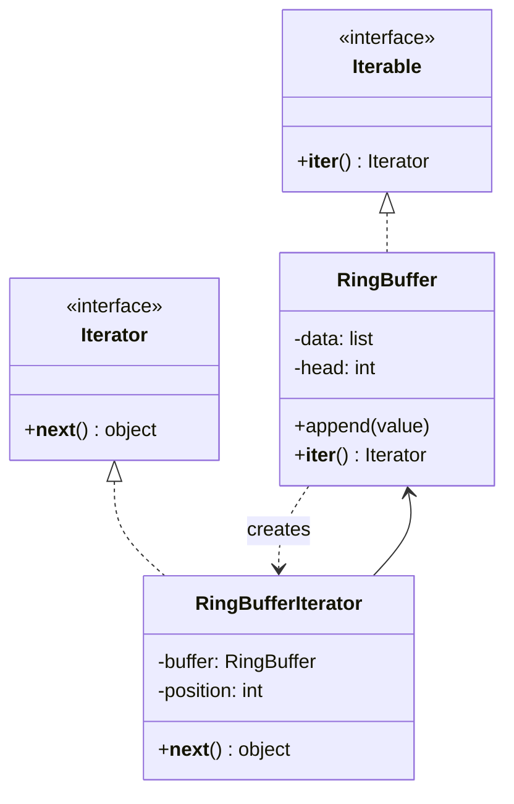

# 🔁 Iterator

**Kategorie:** Verhaltensmuster · **Gültigkeitsbereich:** Objekt · **Auch bekannt als:** Cursor

<!-- TOC -->
## Inhaltsverzeichnis

- [Zweck](#zweck)
- [Problem](#problem)
- [Lösung](#lösung)
- [Struktur](#struktur)
- [Beispiel](#beispiel)
- [Praxis](#praxis)
- [Vor- und Nachteile](#vor--und-nachteile)
- [Verwandte Muster](#verwandte-muster)
<!-- /TOC -->

## Zweck

Ermöglicht den **sequenziellen Zugriff** auf die Elemente eines zusammengesetzten Objekts, **ohne seine interne Struktur offenzulegen**.

---

## Problem

Ein Messdaten-Puffer speichert Sensorwerte intern als Ringpuffer (Array + Schreibindex). Nutzer sollen die Werte in zeitlicher Reihenfolge durchlaufen können – ohne zu wissen, wie der Ringpuffer funktioniert, und ohne den Index selbst zu verwalten. Außerdem soll man **gleichzeitig mehrere Durchläufe** machen können.

---

## Lösung

Die Durchlauflogik wird in ein eigenes **Iterator-Objekt** ausgelagert, das sich die aktuelle Position merkt. Die Sammlung (Aggregate) bietet eine Methode zum Erzeugen eines Iterators an.

In Python ist das Muster **in die Sprache eingebaut**:

| GoF-Begriff | Python |
| --- | --- |
| `Aggregate.createIterator()` | `__iter__()` |
| `Iterator.next()` + `isDone()` | `__next__()` + `StopIteration` |
| Iterator-Klasse | Generator-Funktion mit `yield` |

---

## Struktur



---

## Beispiel

**Klassisch mit eigener Iterator-Klasse:**

```python
class RingBuffer:
    def __init__(self, capacity: int):
        self._data = [None] * capacity
        self._capacity = capacity
        self._head = 0                     # next write position
        self._size = 0

    def append(self, value: float) -> None:
        self._data[self._head] = value
        self._head = (self._head + 1) % self._capacity
        self._size = min(self._size + 1, self._capacity)

    def __iter__(self):
        return RingBufferIterator(self)


class RingBufferIterator:
    def __init__(self, buffer: RingBuffer):
        self._buffer = buffer
        self._count = 0
        self._start = (buffer._head - buffer._size) % buffer._capacity

    def __iter__(self):
        return self

    def __next__(self) -> float:
        if self._count >= self._buffer._size:
            raise StopIteration
        index = (self._start + self._count) % self._buffer._capacity
        self._count += 1
        return self._buffer._data[index]


buf = RingBuffer(capacity=4)
for value in [20.1, 20.4, 20.9, 21.3, 21.8, 22.0]:
    buf.append(value)

print(list(buf))                           # oldest -> newest: [20.9, 21.3, 21.8, 22.0]
print(max(buf), sum(buf) / 4)              # works with every iterable-aware function
```

**Pythonisch mit Generator** – gleiche Wirkung, viel kürzer:

```python
def sensor_stream(readings, threshold: float):
    """Lazily yield only readings above a threshold."""
    for timestamp, value in readings:
        if value > threshold:
            yield timestamp, value


data = [("08:00", 19.5), ("09:00", 23.1), ("10:00", 26.4), ("11:00", 27.0)]
for ts, val in sensor_stream(data, threshold=25):
    print(ts, val)
```

---

## Praxis

* **Jede `for`-Schleife** in Python, Java (`Iterable`/`Iterator`), C# (`IEnumerable`/`foreach`), C++ (`begin()`/`end()`), JavaScript (`Symbol.iterator`, `for...of`).
* **Datenbank-Cursor:** Ergebnisse werden zeilenweise geholt, nicht alles auf einmal.
* **Dateien:** `for line in open("log.txt")` liest zeilenweise, auch bei GB-großen Logs.
* **Paginierte REST-APIs:** Ein Iterator holt automatisch die nächste Seite.
* **`os.walk()`, `pathlib.Path.rglob()`** durchlaufen Verzeichnisbäume.

---

## Vor- und Nachteile

| Vorteile | Nachteile |
| --- | --- |
| Interne Struktur bleibt verborgen | Für einfache Listen Overkill (wenn nicht in der Sprache eingebaut) |
| Mehrere unabhängige Durchläufe gleichzeitig | Ändert man die Sammlung während des Durchlaufs, wird es gefährlich (`RuntimeError: dictionary changed size during iteration`) |
| Lazy Evaluation: Elemente erst bei Bedarf erzeugen | Ein Iterator ist i. d. R. nur **einmal** durchlaufbar |

---

## Verwandte Muster

* **[Composite](../Strukturmuster/Composite.md):** Iteratoren durchlaufen oft rekursive Strukturen.
* **[Factory Method](../Erzeugungsmuster/Factory%20Method.md):** `__iter__()` ist eine Fabrikmethode für den passenden Iterator.
* **[Memento](Memento.md):** Ein Iterator kann seine Position als Memento speichern.
* **[Visitor](Visitor.md):** Iterator bestimmt die **Reihenfolge**, Visitor die **Operation** pro Element.

---
