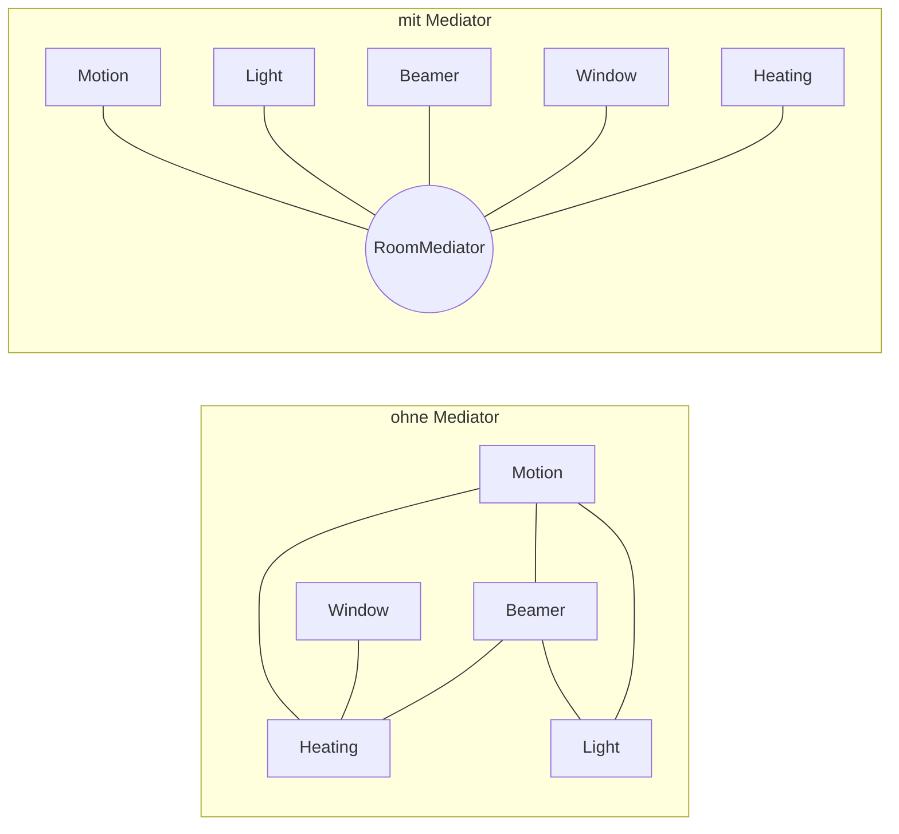
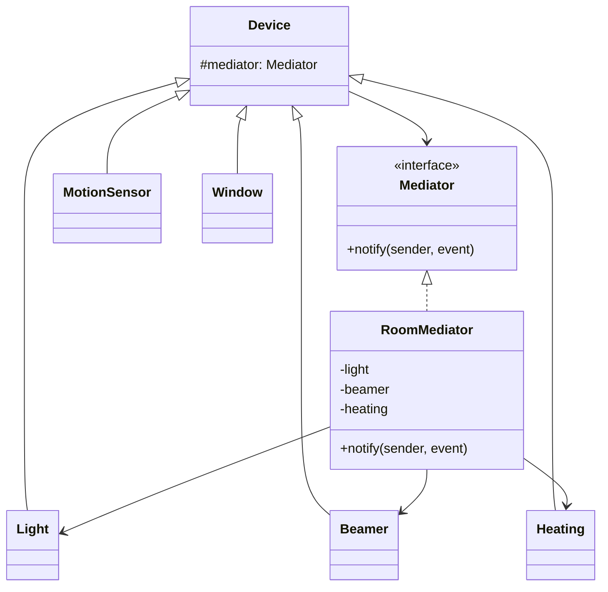

# 🤝 Mediator (Vermittler)

**Kategorie:** Verhaltensmuster · **Gültigkeitsbereich:** Objekt

<!-- TOC -->
## Inhaltsverzeichnis

- [Zweck](#zweck)
- [Problem](#problem)
- [Lösung](#lösung)
- [Struktur](#struktur)
- [Beispiel](#beispiel)
- [Praxis](#praxis)
- [Vor- und Nachteile](#vor--und-nachteile)
- [Verwandte Muster](#verwandte-muster)
<!-- /TOC -->

## Zweck

Definiert ein Objekt, das das **Zusammenspiel einer Menge von Objekten kapselt**. Der Mediator fördert lose Kopplung, indem er verhindert, dass Objekte direkt aufeinander verweisen.

---

## Problem

Im Labor beeinflussen sich viele Geräte gegenseitig: Bewegungsmelder schaltet Licht; ist der Beamer an, soll das Licht gedimmt bleiben; ist das Fenster offen, soll die Heizung aus; ist der Raum leer, sollen Beamer und Licht aus. Wenn jedes Gerät alle anderen kennt, entsteht ein **Spinnennetz** aus Abhängigkeiten (n × (n−1) Verbindungen).



---

## Lösung

Die Geräte (**Colleagues**) kennen nur den **Mediator** und melden ihm Ereignisse. Die gesamte Koordinationslogik steckt im Mediator. Aus n × (n−1) Verbindungen werden n.

---

## Struktur



---

## Beispiel

```python
from __future__ import annotations


class Device:
    def __init__(self, name: str):
        self.name = name
        self.mediator: RoomMediator | None = None

    def emit(self, event: str) -> None:
        print(f"{self.name}: {event}")
        if self.mediator:
            self.mediator.notify(self, event)


class MotionSensor(Device): ...
class Window(Device): ...


class Light(Device):
    def set(self, level: int) -> None:
        print(f"  -> light {level} %")


class Beamer(Device):
    is_on = False

    def power(self, on: bool) -> None:
        self.is_on = on
        print(f"  -> beamer {'on' if on else 'off'}")


class Heating(Device):
    def set_enabled(self, enabled: bool) -> None:
        print(f"  -> heating {'enabled' if enabled else 'disabled'}")


class RoomMediator:
    def __init__(self, motion: MotionSensor, light: Light, beamer: Beamer,
                 window: Window, heating: Heating):
        self.light, self.beamer, self.heating = light, beamer, heating
        for device in (motion, light, beamer, window, heating):
            device.mediator = self

    def notify(self, sender: Device, event: str) -> None:
        if event == "presence":
            self.light.set(20 if self.beamer.is_on else 100)
        elif event == "empty":
            self.light.set(0)
            self.beamer.power(False)
        elif event == "beamer_on":
            self.beamer.power(True)
            self.light.set(20)
        elif event == "opened":
            self.heating.set_enabled(False)
        elif event == "closed":
            self.heating.set_enabled(True)


motion, light, beamer = MotionSensor("motion"), Light("light"), Beamer("beamer")
window, heating = Window("window"), Heating("heating")
room = RoomMediator(motion, light, beamer, window, heating)

motion.emit("presence")
beamer.emit("beamer_on")
window.emit("opened")
motion.emit("empty")
```

---

## Praxis

* **openHAB / Home Assistant:** Die Regel-Engine ist der Mediator; Items kennen sich nicht gegenseitig.
* **MQTT-Broker / Message-Bus:** Clients kommunizieren nur über den Broker (Mediator + Observer).
* **ROS-Master / DDS-Discovery:** Vermittelt zwischen Publishern und Subscribern.
* **GUI-Dialoge:** Ein Dialog koordiniert seine Widgets (Checkbox aktiviert Textfeld usw.).
* **Flugsicherung (Analogie):** Flugzeuge sprechen mit dem Tower, nicht untereinander.

---

## Vor- und Nachteile

| Vorteile | Nachteile |
| --- | --- |
| Lose Kopplung der Colleagues | Mediator kann zum unübersichtlichen „God Object“ werden |
| Zusammenspiel zentral an einer Stelle verständlich | Single Point of Failure |
| Colleagues wiederverwendbar | Logik ist zentralisiert statt verteilt – Änderungen betreffen alles |

---

## Verwandte Muster

* **[Facade](../Strukturmuster/Facade.md):** Vereinfacht ein Subsystem (unidirektional); der Mediator koordiniert Kollegen (bidirektional).
* **[Observer](Observer.md):** Colleagues melden sich oft per Observer beim Mediator.
* **[Command](Command.md):** Ereignisse an den Mediator können als Commands modelliert werden.
* Siehe auch [Orchestrierung & Choreografie](../../Software-Konzepte/Orchestrierung%20%26%20Choreografie.md): Der Mediator entspricht der **Orchestrierung**.

---
