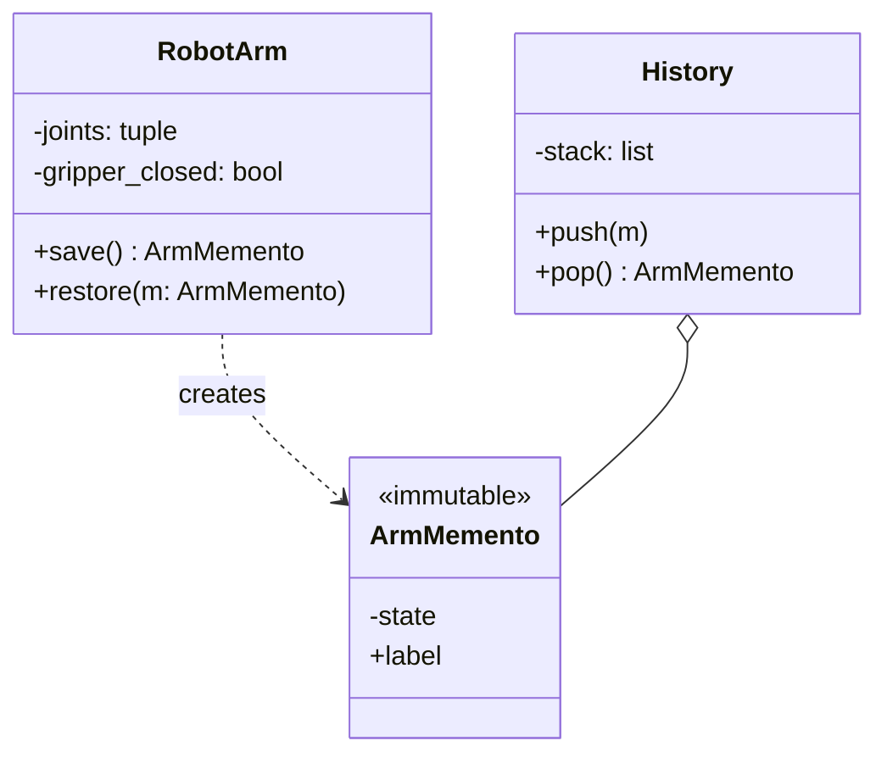

# 💾 Memento

**Kategorie:** Verhaltensmuster · **Gültigkeitsbereich:** Objekt · **Auch bekannt als:** Token, Snapshot

<!-- TOC -->
## Inhaltsverzeichnis

- [Zweck](#zweck)
- [Problem](#problem)
- [Lösung](#lösung)
- [Struktur](#struktur)
- [Beispiel](#beispiel)
- [Praxis](#praxis)
- [Vor- und Nachteile](#vor--und-nachteile)
- [Verwandte Muster](#verwandte-muster)
<!-- /TOC -->

## Zweck

Erfasst und externalisiert den **internen Zustand eines Objekts**, ohne seine Kapselung zu verletzen, sodass das Objekt **später in diesen Zustand zurückversetzt** werden kann.

---

## Problem

Ein Roboterarm wird im Teach-in-Modus eingestellt: Gelenkwinkel, Greiferzustand, Geschwindigkeit. Vor einem riskanten Versuch soll der aktuelle Zustand gesichert und bei Bedarf wiederhergestellt werden. Würde der Aufrufer dafür alle internen Attribute auslesen und zurückschreiben, müssten diese öffentlich sein – und jede Änderung der Klasse würde den Aufrufer brechen.

---

## Lösung

| Rolle | Aufgabe |
| --- | --- |
| **Originator** | Das Objekt mit Zustand. Erzeugt Mementos (`save()`) und stellt sich daraus wieder her (`restore()`). |
| **Memento** | Unveränderlicher Schnappschuss des Zustands. Nur der Originator kennt den Inhalt. |
| **Caretaker** | Verwahrt Mementos (z. B. Undo-Stack), **schaut aber nicht hinein**. |

Das Prinzip kennt man aus [Backups](../../Backup-Strategien/Backup-Arten.md) und VM-**Snapshots**: Der Hypervisor (Caretaker) verwaltet Snapshots, die nur die VM (Originator) sinnvoll interpretieren kann.

---

## Struktur



---

## Beispiel

```python
from dataclasses import dataclass, field
from datetime import datetime


@dataclass(frozen=True)
class ArmMemento:
    _joints: tuple[float, ...]
    _gripper_closed: bool
    label: str = ""
    created: datetime = field(default_factory=datetime.now)


class RobotArm:                                       # originator
    def __init__(self):
        self._joints = (0.0, 0.0, 0.0, 0.0, 0.0, 0.0)
        self._gripper_closed = False

    def move(self, *joints: float) -> None:
        self._joints = tuple(joints)

    def grip(self, closed: bool) -> None:
        self._gripper_closed = closed

    def save(self, label: str = "") -> ArmMemento:
        return ArmMemento(self._joints, self._gripper_closed, label)

    def restore(self, memento: ArmMemento) -> None:
        self._joints = memento._joints
        self._gripper_closed = memento._gripper_closed

    def __repr__(self) -> str:
        return f"RobotArm(joints={self._joints}, gripper_closed={self._gripper_closed})"


class History:                                        # caretaker
    def __init__(self, keep: int = 10):
        self._stack: list[ArmMemento] = []
        self._keep = keep

    def push(self, memento: ArmMemento) -> None:
        self._stack.append(memento)
        del self._stack[:-self._keep]                 # retention: keep last n

    def pop(self) -> ArmMemento:
        return self._stack.pop()


arm, history = RobotArm(), History(keep=5)

arm.move(10, 45, -30, 0, 90, 0)
history.push(arm.save("pick position"))

arm.move(80, 10, 15, 30, 0, 45)
arm.grip(True)
print("experiment:", arm)

arm.restore(history.pop())
print("restored:  ", arm)
```

> In Python gibt es keine echte Kapselung – das führende `_` ist eine Konvention. In Java/C++ würde man das Memento als **innere Klasse** oder mit `friend` umsetzen, damit nur der Originator den Inhalt sieht.

---

## Praxis

* **Undo** in Editoren (oft kombiniert mit [Command](Command.md)).
* **VM-/Container-Snapshots**, Datenbank-Savepoints (`SAVEPOINT` in SQL).
* **Spiele:** Speicherstände, Checkpoints.
* **Serialisierung:** `pickle`, JSON-Export eines Zustands zur Wiederherstellung.
* **openHAB:** `persistence`-Service mit `restoreOnStartup` stellt Item-Zustände nach Neustart wieder her.
* **Robotik:** Gespeicherte Posen/Waypoints im Teach-Pendant.

---

## Vor- und Nachteile

| Vorteile | Nachteile |
| --- | --- |
| Kapselung bleibt erhalten | Speicherintensiv bei großen/häufigen Zuständen (→ inkrementelle Mementos) |
| Undo/Redo und Rollback einfach | Caretaker weiß nicht, wie groß ein Memento ist → Retention nötig |
| Originator bleibt einfach | Referenzen auf externe Ressourcen (Dateien, Sockets) lassen sich nicht „einfrieren“ |

---

## Verwandte Muster

* **[Command](Command.md):** Commands speichern Mementos für ihr `undo()`.
* **[Prototype](../Erzeugungsmuster/Prototype.md):** Ein Klon kann als einfaches Memento dienen.
* **[Iterator](Iterator.md):** Mementos können eine Iterationsposition festhalten.
* **[State](State.md):** State wechselt das Verhalten, Memento sichert Daten.

---
