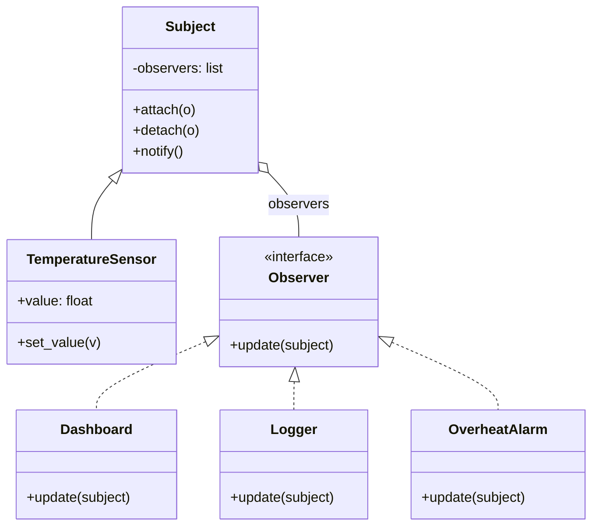
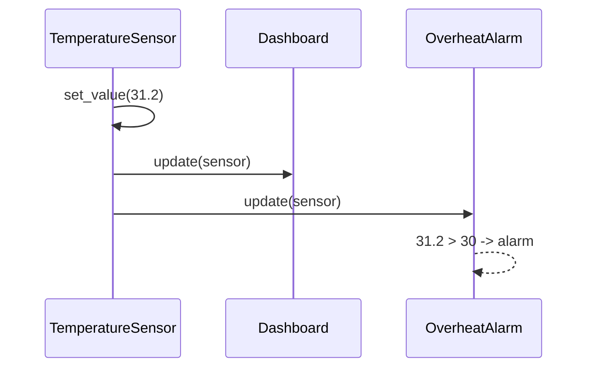

# 👀 Observer (Beobachter)

**Kategorie:** Verhaltensmuster · **Gültigkeitsbereich:** Objekt · **Auch bekannt als:** Publish-Subscribe (verwandt), Listener, Dependents

<!-- TOC -->
## Inhaltsverzeichnis

- [Zweck](#zweck)
- [Problem](#problem)
- [Lösung](#lösung)
  - [Observer vs. Publish-Subscribe](#observer-vs-publish-subscribe)
- [Struktur](#struktur)
- [Beispiel](#beispiel)
- [Praxis](#praxis)
- [Vor- und Nachteile](#vor--und-nachteile)
- [Verwandte Muster](#verwandte-muster)
<!-- /TOC -->

## Zweck

Definiert eine **1-zu-n-Abhängigkeit** zwischen Objekten, sodass bei einer Zustandsänderung eines Objekts **alle abhängigen Objekte automatisch benachrichtigt** und aktualisiert werden.

---

## Problem

Ein Temperatursensor liefert neue Werte. Interessiert sind: das Dashboard, ein Logger, die Heizungsregelung und eine Alarmfunktion. Ruft der Sensor jeden davon direkt auf, muss er alle kennen – jeder neue Interessent erfordert eine Änderung am Sensor-Code.

---

## Lösung

Das **Subject** führt eine Liste von **Observern** mit gemeinsamer Schnittstelle (`update()`). Observer **melden sich an** (`attach`) und **ab** (`detach`). Bei einer Änderung ruft das Subject `notify()` auf, das alle Observer informiert. Das Subject kennt nur die Schnittstelle, nicht die konkreten Klassen.

### Observer vs. Publish-Subscribe

| | Observer (GoF) | Publish-Subscribe |
| --- | --- | --- |
| Kopplung | Subject kennt seine Observer (Liste) | Publisher und Subscriber kennen sich **nicht** |
| Vermittler | keiner | **Broker** / Event-Bus |
| Prozessgrenzen | meist im selben Prozess | auch über Netzwerk |
| Beispiel | GUI-Listener | **MQTT**, ROS-Topics, Kafka |

Pub/Sub ist gewissermaßen Observer + [Mediator](Mediator.md) (→ [Best Practice MQTT](../../Best%20Practices/MQTT.md)).

---

## Struktur





---

## Beispiel

```python
from abc import ABC, abstractmethod


class Observer(ABC):
    @abstractmethod
    def update(self, subject: "Subject") -> None: ...


class Subject:
    def __init__(self):
        self._observers: list[Observer] = []

    def attach(self, observer: Observer) -> None:
        if observer not in self._observers:
            self._observers.append(observer)

    def detach(self, observer: Observer) -> None:
        self._observers.remove(observer)

    def notify(self) -> None:
        for observer in list(self._observers):    # copy: observers may detach themselves
            observer.update(self)


class TemperatureSensor(Subject):
    def __init__(self, name: str):
        super().__init__()
        self.name = name
        self.value = 0.0

    def set_value(self, value: float) -> None:
        if value != self.value:                   # notify only on change
            self.value = value
            self.notify()


class Dashboard(Observer):
    def update(self, subject: TemperatureSensor) -> None:
        print(f"[dashboard] {subject.name}: {subject.value:.1f} C")


class OverheatAlarm(Observer):
    def __init__(self, threshold: float):
        self.threshold = threshold

    def update(self, subject: TemperatureSensor) -> None:
        if subject.value > self.threshold:
            print(f"[alarm] {subject.name} above {self.threshold} C!")


sensor = TemperatureSensor("server_room")
sensor.attach(Dashboard())
sensor.attach(OverheatAlarm(threshold=30))

for value in (24.0, 24.0, 28.5, 31.2):
    sensor.set_value(value)
```

**Kompakte Variante mit Callbacks** (in Python oft ausreichend):

```python
class Event:
    def __init__(self):
        self._handlers = []

    def subscribe(self, handler):
        self._handlers.append(handler)

    def emit(self, *args):
        for handler in self._handlers:
            handler(*args)


door_opened = Event()
door_opened.subscribe(lambda room: print(f"light on in {room}"))
door_opened.subscribe(lambda room: print(f"log: door opened in {room}"))
door_opened.emit("lab_a")
```

---

## Praxis

* **GUI:** Event-Listener (`addEventListener`, Qt Signals/Slots, Java `ActionListener`).
* **MQTT / ROS-Topics:** Publish-Subscribe über einen Broker.
* **openHAB:** Regeln mit `Item X changed` sind Observer auf Items.
* **Reaktive Frameworks:** RxJS, Vue/React-State, Python `asyncio`-Events.
* **Model-View-Controller:** Views beobachten das Model.
* **Webhooks:** Observer über HTTP.

---

## Vor- und Nachteile

| Vorteile | Nachteile |
| --- | --- |
| Lose Kopplung: Subject kennt nur die Schnittstelle | Reihenfolge der Benachrichtigung undefiniert |
| Observer zur Laufzeit an- und abmeldbar | **Memory Leaks**, wenn Observer nicht abgemeldet werden („Lapsed Listener“) |
| Broadcast an beliebig viele Empfänger | Kaskaden: Observer ändert Subject → Endlosschleife möglich |
| | Schwer nachvollziehbarer Kontrollfluss („Wer hat das ausgelöst?“) |

---

## Verwandte Muster

* **[Mediator](Mediator.md):** Bündelt komplexe Abhängigkeiten; Observer verteilt Benachrichtigungen.
* **[Singleton](../Erzeugungsmuster/Singleton.md):** Ein Event-Bus ist oft ein Singleton.
* **[Command](Command.md):** Ereignisse können als Command-Objekte verteilt werden.
* **[Chain of Responsibility](Chain%20of%20Responsibility.md):** Hier entscheidet jedes Glied, ob weitergereicht wird – beim Observer werden immer alle informiert.

---
