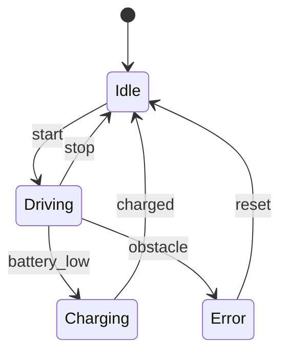
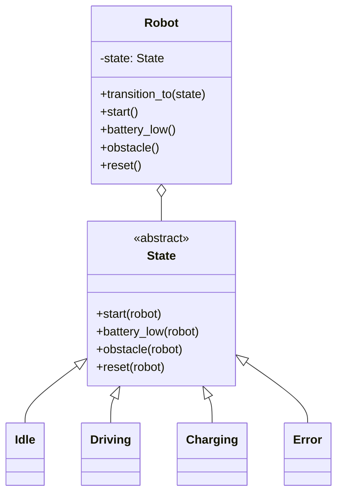

# 🚦 State (Zustand)

**Kategorie:** Verhaltensmuster · **Gültigkeitsbereich:** Objekt · **Auch bekannt als:** Objects for States

<!-- TOC -->
## Inhaltsverzeichnis

- [Zweck](#zweck)
- [Problem](#problem)
- [Lösung](#lösung)
- [Struktur](#struktur)
- [Beispiel](#beispiel)
- [Praxis](#praxis)
- [Vor- und Nachteile](#vor--und-nachteile)
- [Verwandte Muster](#verwandte-muster)
<!-- /TOC -->

## Zweck

Ermöglicht einem Objekt, sein **Verhalten zu ändern, wenn sich sein interner Zustand ändert**. Es sieht so aus, als hätte das Objekt seine Klasse gewechselt.

---

## Problem

Ein mobiler Roboter kennt die Zustände `Idle`, `Driving`, `Charging` und `Error`. Je nach Zustand reagiert er unterschiedlich auf dieselben Ereignisse (`start`, `battery_low`, `obstacle`, `reset`). Implementiert man das mit `if state == ...` in jeder Methode, wachsen verschachtelte Bedingungen unkontrolliert, und neue Zustände erfordern Änderungen an vielen Stellen.

---

## Lösung

Jeder Zustand wird eine **eigene Klasse** mit derselben Schnittstelle. Das **Context**-Objekt (der Roboter) hält eine Referenz auf das aktuelle Zustandsobjekt und **delegiert** Ereignisse daran. Zustände entscheiden selbst über **Übergänge**.



---

## Struktur



---

## Beispiel

```python
from __future__ import annotations


class State:
    name = "state"

    def start(self, robot: Robot) -> None:
        print(f"  ignored 'start' in {self.name}")

    def battery_low(self, robot: Robot) -> None:
        print(f"  ignored 'battery_low' in {self.name}")

    def obstacle(self, robot: Robot) -> None:
        print(f"  ignored 'obstacle' in {self.name}")

    def reset(self, robot: Robot) -> None:
        print(f"  ignored 'reset' in {self.name}")


class Idle(State):
    name = "Idle"

    def start(self, robot: Robot) -> None:
        robot.transition_to(Driving())


class Driving(State):
    name = "Driving"

    def battery_low(self, robot: Robot) -> None:
        print("  driving to docking station")
        robot.transition_to(Charging())

    def obstacle(self, robot: Robot) -> None:
        print("  emergency stop!")
        robot.transition_to(Error())


class Charging(State):
    name = "Charging"

    def start(self, robot: Robot) -> None:
        print("  cannot drive while charging")


class Error(State):
    name = "Error"

    def reset(self, robot: Robot) -> None:
        robot.transition_to(Idle())


class Robot:
    def __init__(self):
        self._state: State = Idle()

    def transition_to(self, state: State) -> None:
        print(f"  {self._state.name} -> {state.name}")
        self._state = state

    def start(self) -> None:       self._state.start(self)
    def battery_low(self) -> None: self._state.battery_low(self)
    def obstacle(self) -> None:    self._state.obstacle(self)
    def reset(self) -> None:       self._state.reset(self)


robot = Robot()
for event in ("start", "obstacle", "start", "reset", "start", "battery_low", "start"):
    print(event)
    getattr(robot, event)()
```

---

## Praxis

* **Protokolle:** TCP-Verbindungszustände (`LISTEN`, `ESTABLISHED`, `TIME_WAIT` …), MQTT-Client (connected/reconnecting).
* **Robotik:** Verhaltenszustände, ROS-`smach`, Behavior Trees als Weiterentwicklung.
* **openHAB:** Zustandsautomaten mit einem String-Item als Zustand (Design-Pattern „State Machine“).
* **UI:** Buttons (enabled/disabled/pressed), Workflows (Entwurf → Prüfung → Freigegeben).
* **Embedded:** Zustandsautomaten in C (`switch` über ein `enum` – hier oft pragmatischer als Klassen).
* **Bibliotheken:** `transitions` (Python), XState (JavaScript), Spring Statemachine.

---

## Vor- und Nachteile

| Vorteile | Nachteile |
| --- | --- |
| Zustandsspezifisches Verhalten gekapselt | Viele Klassen bei vielen Zuständen |
| Keine großen `if/switch`-Blöcke | Bei wenigen Zuständen und einfachen Übergängen Overkill |
| Neue Zustände ohne Änderung bestehender Zustände (Open/Closed) | Übergänge sind über Klassen verteilt → Gesamtbild nur im Diagramm sichtbar |
| Übergänge explizit und testbar | |

---

## Verwandte Muster

* **[Strategy](Strategy.md):** Strukturell fast identisch. Bei Strategy **wählt der Client** den Algorithmus, bei State **wechselt das Objekt selbst** den Zustand.
* **[Flyweight](../Strukturmuster/Flyweight.md):** Zustandsobjekte ohne eigene Daten können geteilt werden.
* **[Singleton](../Erzeugungsmuster/Singleton.md):** Zustandsobjekte sind oft Singletons.
* **[Memento](Memento.md):** Zustand sichern und wiederherstellen.

---
