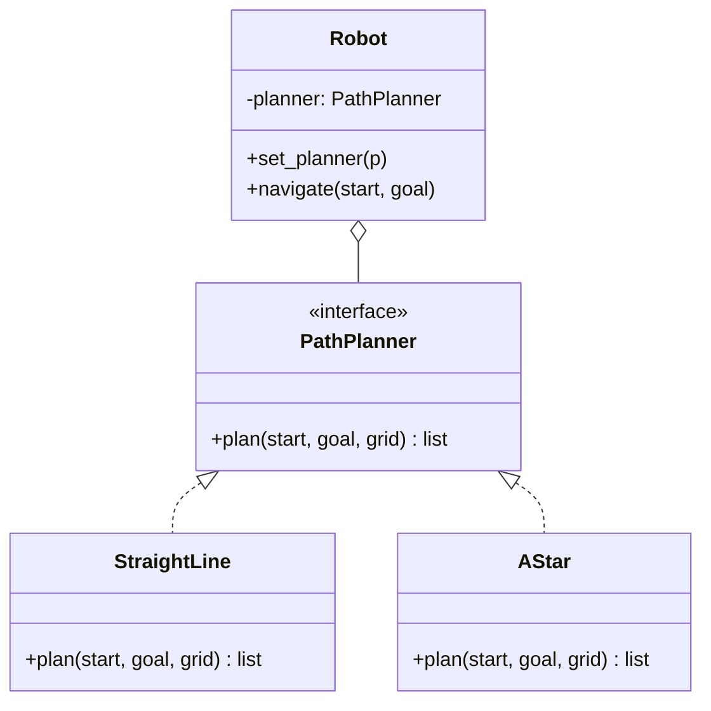

# ♟️ Strategy (Strategie)

**Kategorie:** Verhaltensmuster · **Gültigkeitsbereich:** Objekt · **Auch bekannt als:** Policy

<!-- TOC -->
## Inhaltsverzeichnis

- [Zweck](#zweck)
- [Problem](#problem)
- [Lösung](#lösung)
- [Struktur](#struktur)
- [Beispiel](#beispiel)
- [Praxis](#praxis)
- [Vor- und Nachteile](#vor--und-nachteile)
- [Verwandte Muster](#verwandte-muster)
<!-- /TOC -->

## Zweck

Definiert eine **Familie austauschbarer Algorithmen**, kapselt jeden einzelnen und macht sie austauschbar. Strategy ermöglicht es, den Algorithmus **unabhängig von den Clients** zu variieren, die ihn nutzen.

---

## Problem

Ein mobiler Roboter soll einen Pfad planen. Je nach Situation eignet sich ein anderer Algorithmus: **Luftlinie** (freie Fläche), **A\*** (bekannte Karte), **Wandfolgen** (unbekannte Umgebung). Fest einprogrammierte `if algorithm == ...`-Zweige machen die Planer-Klasse groß, schwer testbar und nicht erweiterbar.

---

## Lösung

Jeder Algorithmus wird in eine eigene Klasse (oder Funktion) mit **gemeinsamer Schnittstelle** ausgelagert. Der **Context** (Roboter) hält eine Referenz auf eine Strategie und delegiert die Arbeit. Die Strategie kann **zur Laufzeit gewechselt** werden.

---

## Struktur



---

## Beispiel

```python
import heapq
from abc import ABC, abstractmethod

Point = tuple[int, int]

GRID = [
    "..........",
    "....#.....",
    "....#.....",
    "....#.....",
    "..........",
]


def free(grid: list[str], p: Point) -> bool:
    x, y = p
    return 0 <= y < len(grid) and 0 <= x < len(grid[0]) and grid[y][x] == "."


class PathPlanner(ABC):
    @abstractmethod
    def plan(self, start: Point, goal: Point, grid: list[str]) -> list[Point]: ...


class StraightLine(PathPlanner):
    """Ignores obstacles - fine on an empty floor."""
    def plan(self, start, goal, grid):
        (x, y), path = start, [start]
        while (x, y) != goal:
            x += (goal[0] > x) - (goal[0] < x)
            y += (goal[1] > y) - (goal[1] < y)
            path.append((x, y))
        return path


class AStar(PathPlanner):
    """Shortest path around obstacles (4-neighbourhood, Manhattan heuristic)."""
    def plan(self, start, goal, grid):
        def h(p): return abs(p[0] - goal[0]) + abs(p[1] - goal[1])
        queue, came_from, cost = [(h(start), start)], {start: None}, {start: 0}
        while queue:
            _, current = heapq.heappop(queue)
            if current == goal:
                break
            for dx, dy in ((1, 0), (-1, 0), (0, 1), (0, -1)):
                nxt = (current[0] + dx, current[1] + dy)
                if free(grid, nxt) and cost[current] + 1 < cost.get(nxt, 1e9):
                    cost[nxt] = cost[current] + 1
                    came_from[nxt] = current
                    heapq.heappush(queue, (cost[nxt] + h(nxt), nxt))
        path, node = [], goal
        while node is not None:
            path.append(node)
            node = came_from.get(node)
        return path[::-1]


class Robot:
    def __init__(self, planner: PathPlanner):
        self._planner = planner

    def set_planner(self, planner: PathPlanner) -> None:
        self._planner = planner

    def navigate(self, start: Point, goal: Point) -> None:
        path = self._planner.plan(start, goal, GRID)
        blocked = [p for p in path if not free(GRID, p)]
        print(f"{type(self._planner).__name__}: {len(path)} steps, collisions: {blocked}")


robot = Robot(StraightLine())
robot.navigate((2, 2), (7, 2))     # drives through the wall
robot.set_planner(AStar())
robot.navigate((2, 2), (7, 2))     # goes around
```

**Pythonisch:** Funktionen sind Objekte – eine Strategie kann auch einfach eine Funktion sein:

```python
def by_name(device): return device["name"]
def by_ip(device): return tuple(int(part) for part in device["ip"].split("."))

devices = [{"name": "pi-03", "ip": "192.168.1.20"}, {"name": "beamer", "ip": "192.168.1.3"}]
print(sorted(devices, key=by_ip))   # 'key' is a strategy
```

---

## Praxis

* **Sortieren:** `sorted(key=...)`, Java `Comparator`, C++ `std::sort` mit Vergleichsfunktion.
* **Robotik:** Austauschbare Planer/Regler in ROS (`nav2`-Plugins, `move_base`-Planer).
* **Kompression / Verschlüsselung:** Algorithmus wählbar (gzip, zstd, xz; AES, ChaCha20).
* **Authentifizierung:** Passport.js-Strategies, Django-Auth-Backends.
* **Backup:** Voll / inkrementell / differentiell als austauschbare Strategien (→ [Backup-Arten](../../Backup-Strategien/Backup-Arten.md)).
* **Retry/Backoff-Policies** in HTTP-Clients.

---

## Vor- und Nachteile

| Vorteile | Nachteile |
| --- | --- |
| Algorithmen austauschbar, auch zur Laufzeit | Client muss die Strategien kennen, um zu wählen |
| Keine `if/switch`-Kaskaden | Mehr Klassen/Objekte |
| Algorithmen einzeln testbar | Bei nur 1–2 Algorithmen oft überflüssig |
| Open/Closed: neue Strategie ohne Änderung am Context | Einheitliche Schnittstelle kann Strategien Daten aufzwingen, die sie nicht brauchen |

---

## Verwandte Muster

* **[State](State.md):** Gleiche Struktur; bei State wechselt das Objekt selbst, bei Strategy der Client.
* **[Template Method](Template%20Method.md):** Variiert Teile eines Algorithmus per **Vererbung**; Strategy tauscht den **ganzen** Algorithmus per **Komposition**.
* **[Decorator](../Strukturmuster/Decorator.md):** Ändert die Hülle, Strategy das Innere.
* **[Flyweight](../Strukturmuster/Flyweight.md):** Zustandslose Strategien lassen sich teilen.
* **[Bridge](../Strukturmuster/Bridge.md):** Ähnliche Struktur, aber für dauerhafte Trennung von Abstraktion und Implementierung.

---
