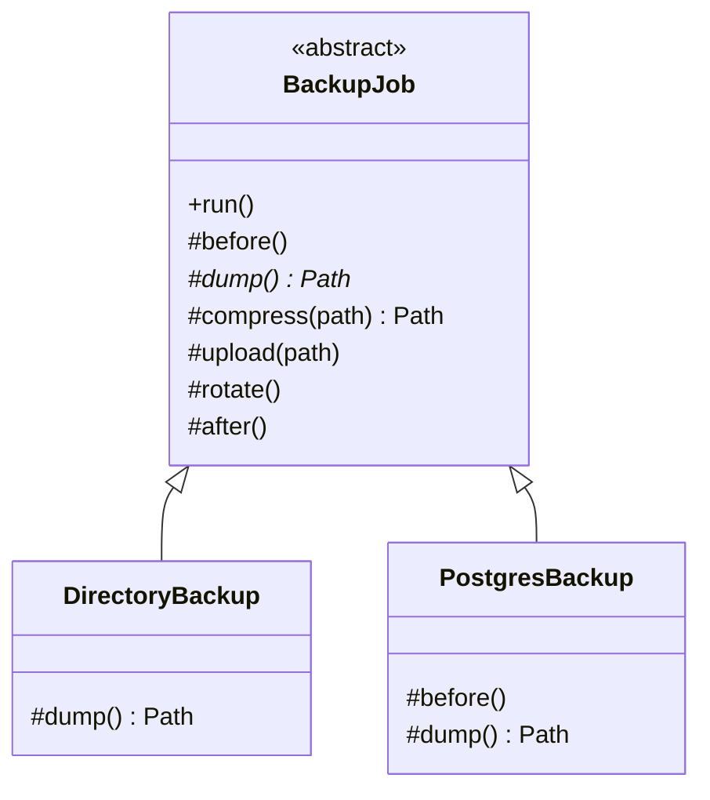

# 📐 Template Method (Schablonenmethode)

**Kategorie:** Verhaltensmuster · **Gültigkeitsbereich:** Klasse

<!-- TOC -->
## Inhaltsverzeichnis

- [Zweck](#zweck)
- [Problem](#problem)
- [Lösung](#lösung)
- [Struktur](#struktur)
- [Beispiel](#beispiel)
- [Praxis](#praxis)
- [Vor- und Nachteile](#vor--und-nachteile)
- [Verwandte Muster](#verwandte-muster)
<!-- /TOC -->

## Zweck

Definiert das **Skelett eines Algorithmus** in einer Methode und überlässt einzelne Schritte den Unterklassen. Unterklassen können bestimmte Schritte **überschreiben, ohne die Struktur des Algorithmus zu verändern**.

> Nicht zu verwechseln mit C++-**Templates** (Generics) oder **Templating** (Jinja2) – siehe [Templates & Templating](../../Software-Konzepte/Templates%20%26%20Templating.md).

---

## Problem

Backups für verschiedene Systeme (Datei-Verzeichnis, PostgreSQL, openHAB) laufen immer nach demselben Ablauf ab: vorbereiten → Daten sichern → komprimieren → auf NAS kopieren → alte Backups löschen → melden. Nur **einzelne Schritte** unterscheiden sich. Kopiert man den Ablauf in jedes Skript, wird jede Verbesserung (z. B. Retention) an vielen Stellen nötig.

---

## Lösung

Eine abstrakte Basisklasse enthält die **Template Method** (`run()`), die den Ablauf festlegt und **nicht überschrieben** werden soll. Sie ruft auf:

| Art | Bedeutung |
| --- | --- |
| **Abstrakte Operationen** | Müssen von Unterklassen implementiert werden (`dump()`) |
| **Konkrete Operationen** | In der Basisklasse fertig (`compress()`, `rotate()`) |
| **Hooks** | Optional überschreibbar, Standard tut nichts (`before()`, `after()`) |

**Hollywood-Prinzip:** *„Don't call us, we'll call you.“* – Die Basisklasse ruft die Unterklasse auf, nicht umgekehrt.

---

## Struktur



---

## Beispiel

```python
from abc import ABC, abstractmethod
from datetime import date


class BackupJob(ABC):
    keep = 5

    def run(self) -> None:                         # the template method
        print(f"=== {self.name} ===")
        self.before()
        raw = self.dump()
        archive = self.compress(raw)
        self.upload(archive)
        self.rotate()
        self.after()

    # hooks (optional)
    def before(self) -> None: ...
    def after(self) -> None:
        print("  done")

    # primitive operation (mandatory)
    @abstractmethod
    def dump(self) -> str: ...

    # concrete operations (shared)
    def compress(self, path: str) -> str:
        archive = f"{path}.tar.gz"
        print(f"  compress {path} -> {archive}")
        return archive

    def upload(self, archive: str) -> None:
        print(f"  copy {archive} -> nas:/backups/{self.name}/")

    def rotate(self) -> None:
        print(f"  delete all but the newest {self.keep} archives")

    @property
    def name(self) -> str:
        return type(self).__name__


class DirectoryBackup(BackupJob):
    def __init__(self, directory: str):
        self.directory = directory

    def dump(self) -> str:
        print(f"  tar {self.directory}")
        return f"/tmp/files_{date.today()}"


class PostgresBackup(BackupJob):
    keep = 14

    def before(self) -> None:
        print("  check database connection")

    def dump(self) -> str:
        print("  pg_dump --format=custom labdb")
        return f"/tmp/labdb_{date.today()}"


for job in (DirectoryBackup("/etc/openhab"), PostgresBackup()):
    job.run()
```

---

## Praxis

* **Frameworks:** `unittest.TestCase` (`setUp()` → Test → `tearDown()`), Django Class-Based Views (`get()`, `get_context_data()`), Java `HttpServlet.service()` → `doGet()`/`doPost()`.
* **ROS:** Node-Basisklassen mit Lebenszyklus (`on_configure`, `on_activate` bei Lifecycle Nodes).
* **Ansible-Rollen:** Feste Struktur (`tasks/`, `handlers/`, `defaults/`), Inhalte variieren (→ [Best Practice Ansible](../../Best%20Practices/Ansible.md)).
* **GUI:** `paintEvent()` in Qt, `onCreate()` in Android.
* **Spiele-Engines:** `Start()`, `Update()` in Unity.

---

## Vor- und Nachteile

| Vorteile | Nachteile |
| --- | --- |
| Gemeinsamer Ablauf an **einer** Stelle | Bindung durch Vererbung (starr, nur eine Basisklasse) |
| Unterklassen implementieren nur das Nötige | Ablauf der Basisklasse schwer zu verstehen, wenn viele Hooks existieren |
| Fehlerkorrekturen im Ablauf wirken überall | Liskov-Verletzung möglich, wenn Unterklassen Schritte „falsch“ überschreiben |

---

## Verwandte Muster

* **[Strategy](Strategy.md):** Austausch des ganzen Algorithmus per Komposition statt einzelner Schritte per Vererbung.
* **[Factory Method](../Erzeugungsmuster/Factory%20Method.md):** Ist oft ein Schritt innerhalb einer Template Method.
* Siehe auch [Skeleton, Boilerplate & Scaffolding](../../Software-Konzepte/Skeleton%2C%20Boilerplate%20%26%20Scaffolding.md): Ein Projekt-Skeleton ist die „Template Method“ auf Projektebene.

---
