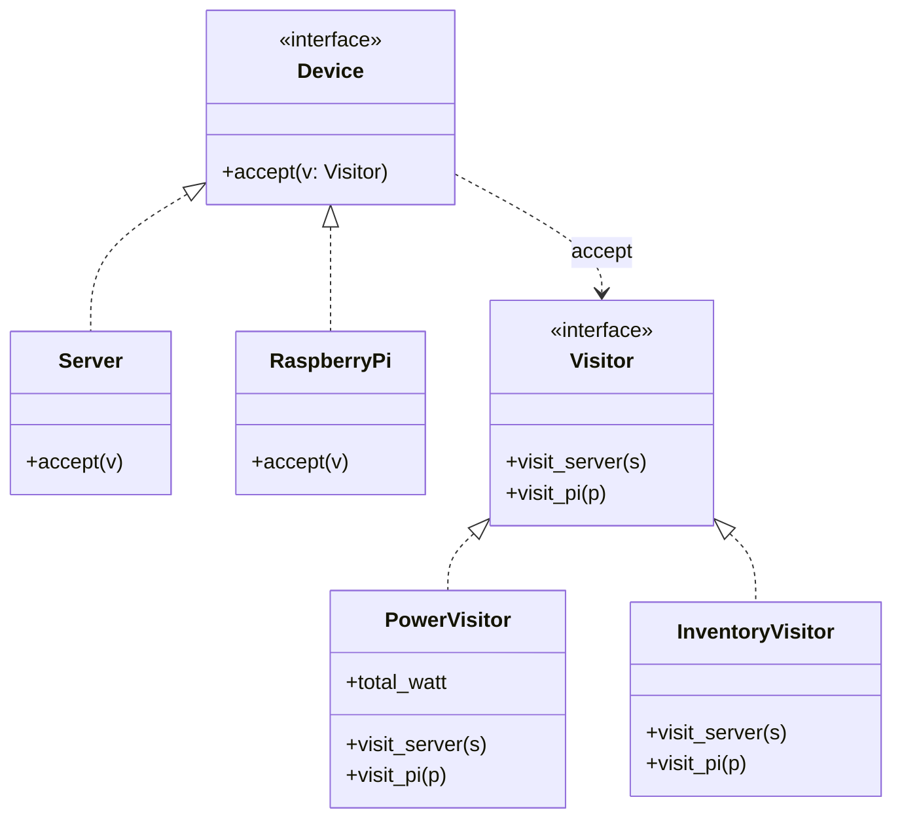

# 🧳 Visitor (Besucher)

**Kategorie:** Verhaltensmuster · **Gültigkeitsbereich:** Objekt

<!-- TOC -->
## Inhaltsverzeichnis

- [Zweck](#zweck)
- [Problem](#problem)
- [Lösung](#lösung)
- [Struktur](#struktur)
- [Beispiel](#beispiel)
- [Praxis](#praxis)
- [Vor- und Nachteile](#vor--und-nachteile)
- [Verwandte Muster](#verwandte-muster)
<!-- /TOC -->

## Zweck

Kapselt eine **Operation, die auf den Elementen einer Objektstruktur ausgeführt wird**. Mit Visitor lassen sich **neue Operationen definieren, ohne die Klassen der Elemente zu ändern**.

---

## Problem

Die Laborinfrastruktur besteht aus Elementen verschiedener Typen: `Server`, `RaspberryPi`, `NetworkSwitch`. Darauf sollen immer neue Auswertungen laufen: Stromverbrauch summieren, Ansible-Inventar erzeugen, Wartungsliste exportieren. Fügt man jedes Mal eine Methode in **jede** Geräteklasse ein, werden diese Klassen mit fachfremder Logik überladen.

---

## Lösung

Jede Operation wird ein **Visitor**-Objekt mit einer Methode pro Elementtyp (`visit_server()`, `visit_pi()` …). Jedes Element hat nur **eine** Methode `accept(visitor)`, die die passende `visit_*`-Methode aufruft. Dieses Hin-und-Zurück heißt **Double Dispatch**: Welche Methode ausgeführt wird, hängt vom Typ des Elements **und** des Visitors ab.

| Wenn sich häufig ändert … | … eignet sich |
| --- | --- |
| die **Operationen** (neue Auswertungen) | **Visitor** ✅ |
| die **Elementtypen** (neue Geräteklassen) | normale Methoden/Polymorphie (bei Visitor müsste jeder Visitor angepasst werden) |

---

## Struktur



---

## Beispiel

```python
from abc import ABC, abstractmethod
from dataclasses import dataclass


class Device(ABC):
    @abstractmethod
    def accept(self, visitor: "Visitor"): ...


@dataclass
class Server(Device):
    hostname: str
    ip: str
    cpus: int

    def accept(self, visitor):
        return visitor.visit_server(self)


@dataclass
class RaspberryPi(Device):
    hostname: str
    ip: str
    model: int

    def accept(self, visitor):
        return visitor.visit_pi(self)


@dataclass
class NetworkSwitch(Device):
    hostname: str
    ports: int

    def accept(self, visitor):
        return visitor.visit_switch(self)


class Visitor(ABC):
    @abstractmethod
    def visit_server(self, server: Server): ...
    @abstractmethod
    def visit_pi(self, pi: RaspberryPi): ...
    @abstractmethod
    def visit_switch(self, switch: NetworkSwitch): ...


class PowerVisitor(Visitor):
    def __init__(self):
        self.total_watt = 0.0

    def visit_server(self, server):  self.total_watt += 40 * server.cpus
    def visit_pi(self, pi):          self.total_watt += {3: 4.0, 4: 6.4, 5: 8.0}[pi.model]
    def visit_switch(self, switch):  self.total_watt += 0.8 * switch.ports


class InventoryVisitor(Visitor):
    def __init__(self):
        self.groups: dict[str, list[str]] = {"servers": [], "raspberrypis": []}

    def visit_server(self, server):  self.groups["servers"].append(f"{server.hostname} ansible_host={server.ip}")
    def visit_pi(self, pi):          self.groups["raspberrypis"].append(f"{pi.hostname} ansible_host={pi.ip}")
    def visit_switch(self, switch):  pass          # not managed by Ansible

    def render(self) -> str:
        return "\n".join(f"[{group}]\n" + "\n".join(hosts) for group, hosts in self.groups.items())


lab = [
    Server("proxmox01", "192.168.10.10", cpus=2),
    RaspberryPi("pi-mqtt", "192.168.10.21", model=4),
    RaspberryPi("pi-beamer", "192.168.10.22", model=5),
    NetworkSwitch("sw-lab", ports=24),
]

power = PowerVisitor()
inventory = InventoryVisitor()
for device in lab:
    device.accept(power)
    device.accept(inventory)

print(f"estimated power: {power.total_watt:.1f} W")
print(inventory.render())
```

> In Python ab 3.10 lässt sich vieles auch mit `match`/`case` oder `functools.singledispatch` lösen – das klassische Visitor-Pattern ist vor allem in statisch typisierten Sprachen (Java, C++, C#) verbreitet.

---

## Praxis

* **Compiler:** Typprüfung, Optimierung, Codegenerierung als Visitors über den AST (→ [Compiler & Build](../../Compiler%20%26%20Build/README.md)).
* **Python:** `ast.NodeVisitor` / `ast.NodeTransformer` (z. B. in Lintern wie `flake8`, Formatierern).
* **Java:** `FileVisitor` für `Files.walkFileTree()`, Annotation-Processing.
* **Dokumente:** Export desselben Dokumentbaums nach HTML, PDF, Markdown.
* **Clang/LLVM:** `RecursiveASTVisitor` für Code-Analyse-Tools.

---

## Vor- und Nachteile

| Vorteile | Nachteile |
| --- | --- |
| Neue Operationen ohne Änderung der Elementklassen | Neuer Elementtyp → **alle** Visitors anpassen |
| Zusammengehörige Logik in einer Klasse gebündelt | Elemente müssen oft Interna offenlegen |
| Visitor kann Zustand über alle Elemente sammeln | Double Dispatch ist für Einsteiger schwer zu durchschauen |

---

## Verwandte Muster

* **[Composite](../Strukturmuster/Composite.md):** Visitor wird häufig auf Kompositum-Bäume angewendet.
* **[Interpreter](Interpreter.md):** Zusätzliche Operationen auf dem Syntaxbaum.
* **[Iterator](Iterator.md):** Iterator bestimmt die Reihenfolge, Visitor die Operation.

---
