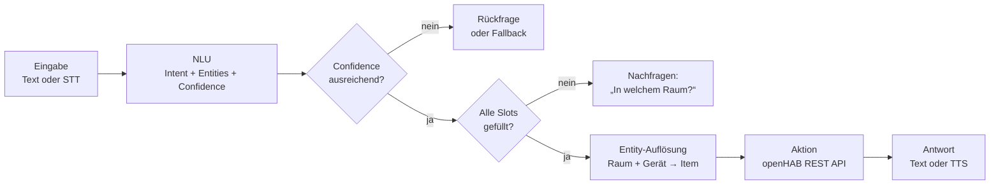

# 🎯 Intents, Entities & Confidence

Chatbots und Sprachassistenten müssen aus einem freien Satz wie *„Mach mal das Licht in der Küche auf 30 Prozent“* eine **ausführbare Aktion** machen. Diese Aufgabe heißt **Natural Language Understanding (NLU)**. Ihre drei Grundbegriffe sind **Intent**, **Entity** und **Confidence**.

<!-- TOC -->
## Inhaltsverzeichnis

- [Die drei Grundbegriffe](#die-drei-grundbegriffe)
- [Intents](#intents)
- [Entities](#entities)
  - [Synonyme](#synonyme)
- [Confidence und Schwellwerte](#confidence-und-schwellwerte)
- [Ansätze im Vergleich](#ansätze-im-vergleich)
- [Beispiel: Regelbasiert](#beispiel-regelbasiert)
- [Beispiel: Kleiner ML-Klassifikator](#beispiel-kleiner-ml-klassifikator)
- [Vom Intent zur Aktion](#vom-intent-zur-aktion)
- [Daten, Training und Pflege](#daten-training-und-pflege)
<!-- /TOC -->

## Die drei Grundbegriffe

```text
„Mach mal das Licht in der Küche auf 30 Prozent“
          └─┬─┘          └─┬─┘    └────┬────┘
         Gerät           Raum       Wert
          (Entity)      (Entity)   (Entity)

Intent:     licht_dimmen        ← Was will die Person?
Confidence: 0.91                ← Wie sicher ist das System?
```

| Begriff | Deutsch | Bedeutung | Beispiel |
| --- | --- | --- | --- |
| **Utterance** | Äußerung | Die Eingabe der Person (Text oder erkannte Sprache) | „Wie warm ist es im Bad?“ |
| **Intent** | Absicht | **Was** die Person erreichen will – eine aus einer festen Liste von Kategorien | `temperatur_abfragen` |
| **Entity** | Entität | **Parameter** der Absicht, aus dem Satz extrahiert | `raum = Bad` |
| **Slot** | Platz | Eine Entität, die ein Intent **benötigt** | `licht_dimmen` braucht `raum` und `wert` |
| **Confidence** | Konfidenz | Wie sicher die Zuordnung ist, meist ein Wert zwischen 0 und 1 | `0.91` |
| **Fallback** | Rückfallebene | Was passiert, wenn kein Intent sicher erkannt wird | „Das habe ich nicht verstanden.“ |

---

## Intents

Ein **Intent** ist eine **Klasse**: NLU ist in diesem Teil eine **Textklassifikation**. Für jeden Intent definiert man **Beispielsätze** (Trainingsdaten):

```yaml
intents:
  licht_schalten:
    - Schalte das Licht in der Küche ein
    - Mach das Licht im Bad aus
    - Licht an im Konferenzraum
    - Küchenlicht aus
  temperatur_abfragen:
    - Wie warm ist es im Bad?
    - Wie ist die Temperatur in der Küche?
    - Temperatur Konferenzraum
  rollladen_fahren:
    - Fahr den Rollladen im Konferenzraum hoch
    - Rollladen runter
```

**Gute Intents …**

* sind **klar voneinander abgegrenzt** (`licht_schalten` und `licht_dimmen` können getrennt oder zusammengefasst werden – aber nicht überlappend),
* haben **genügend und vielfältige Beispiele** (Faustregel für einfache Klassifikatoren: mindestens 10–20 pro Intent, unterschiedliche Formulierungen, nicht nur andere Raumnamen),
* sind **nicht zu fein**: `licht_kueche_an` und `licht_bad_an` sind **ein** Intent mit der Entität `raum`.

---

## Entities

**Entities** sind die Informationen, die man zum Ausführen braucht. Man unterscheidet:

| Art | Beispiele | Erkennung |
| --- | --- | --- |
| **System-Entities** (vordefiniert) | Zahlen, Prozentwerte, Uhrzeiten, Datumsangaben, Dauer | Regeln/Parser (z. B. `dateparser`, Duckling) |
| **Eigene Entities** (aus einer Liste) | Räume, Geräte, Szenen | **Liste + Synonyme + [Fuzzy Matching](Fuzzy%20Matching.md)** |
| **Gelernte Entities** | Freie Namen, Titel | **Named Entity Recognition (NER)** mit einem trainierten Modell (z. B. spaCy) |

Im Smart Home sind die meisten Entities **geschlossene Listen** – die Räume und Geräte sind bekannt. Diese Listen lassen sich direkt aus openHAB gewinnen (Items, Labels, Tags, semantisches Modell) und **automatisch aktualisieren**, wenn Geräte hinzukommen oder entfernt werden.

### Synonyme

Eine Entität hat einen **kanonischen Wert** und beliebig viele **Synonyme**:

| Kanonischer Wert | Synonyme |
| --- | --- |
| `Kueche` | Küche, Kochbereich, Küchenzeile |
| `Konferenz` | Konferenzraum, Besprechungsraum, Meetingraum |
| `ON` | an, ein, einschalten, anmachen, aktivieren |

Wie man Synonyme in einer Datenbank als **n:m-Beziehung** modelliert, steht unter [Relationale Modellierung](../Datenbanken/Relationale%20Modellierung.md).

---

## Confidence und Schwellwerte

Ein ML-Klassifikator liefert für **jeden** Intent eine Wahrscheinlichkeit; die Werte summieren sich zu 1. Der höchste Wert ist die **Confidence**.

```text
licht_schalten       0.82   ← bester Treffer
temperatur_abfragen  0.11
rollladen_fahren     0.07
```

Mit einem **Schwellwert** entscheidet man, ob dem Ergebnis vertraut wird:

| Confidence | Reaktion | Beispiel |
| --- | --- | --- |
| hoch (z. B. ≥ 0,75) | Ausführen | Licht schalten |
| mittel (z. B. 0,4–0,75) | **Rückfrage** | „Meinst du das Licht in der Küche?“ |
| niedrig (< 0,4) | **Fallback** | „Das habe ich nicht verstanden.“ |

> Die Werte sind nur Beispiele. Schwellwerte hängen vom Modell ab und müssen mit **echten Eingaben** kalibriert werden. Bei Aktionen mit Folgen (Tür öffnen, Heizung, Alarmanlage) gilt: **lieber nachfragen als falsch handeln**.

**Wichtig:** Eine hohe Confidence bedeutet nicht, dass das Ergebnis richtig ist – nur, dass das Modell sich sicher ist. Ein Satz, der zu **keinem** Intent passt (*„Wie spät ist es in Tokio?“*), wird trotzdem einem der bekannten Intents zugeordnet, eventuell sogar mit hoher Confidence. Abhilfe: ein eigener Intent `out_of_scope` mit Beispielen für Themen, die das System nicht beherrscht.

---

## Ansätze im Vergleich

| Ansatz | Funktionsweise | Stärken | Schwächen |
| --- | --- | --- | --- |
| **Regelbasiert** | Schlüsselwörter, Muster, reguläre Ausdrücke, Satzvorlagen | Vorhersagbar, kein Training, sofort erklärbar | Jede Formulierung muss vorgesehen werden |
| **Klassischer ML-Klassifikator** | Text → Merkmale (z. B. TF-IDF) → Klassifikator | Leichtgewichtig, läuft auf dem Raspberry Pi, lernt Varianten | Braucht Beispieldaten, versteht keine echte Bedeutung |
| **NLU-Frameworks** | Fertige Pipeline für Intents, Entities, Dialoge (z. B. Rasa, spaCy-Komponenten) | Viel Funktionalität, bewährte Konzepte | Einarbeitung, Ressourcen, Lizenz- und Wartungsstatus prüfen |
| **Embeddings / Transformer** | Satz → Bedeutungsvektor (z. B. Sentence-BERT), Vergleich per Kosinusähnlichkeit | Erkennt Bedeutung auch bei neuen Wörtern | Größere Modelle, mehr Rechenleistung |
| **Großes Sprachmodell (LLM)** | Prompt mit Gerätebeschreibung → strukturierte Antwort (JSON) bzw. Tool-Aufruf | Sehr flexibel, versteht Kontext und Umgangssprache | Ressourcen, Latenz, Halluzinationen, Datenschutz bei Cloud-Diensten |

Viele Systeme kombinieren die Ansätze **gestuft**: erst Regeln (schnell, exakt), dann ein Klassifikator, und nur wenn beides scheitert ein LLM oder eine Rückfrage.

---

## Beispiel: Regelbasiert

```python
import re

ROOMS = {"küche": "Kueche", "bad": "Bad", "konferenz": "Konferenz"}
ACTIONS = {"an": "ON", "ein": "ON", "aus": "OFF"}


def parse(text: str) -> dict | None:
    words = re.findall(r"\w+", text.lower())
    if "licht" in words:
        room = next((ROOMS[w] for w in words if w in ROOMS), None)
        action = next((ACTIONS[w] for w in words if w in ACTIONS), None)
        if room and action:
            return {"intent": "licht_schalten", "raum": room, "befehl": action}
    return None


print(parse("Schalte das Licht in der Küche an"))
print(parse("Licht aus im Bad"))
print(parse("Wie warm ist es?"))       # None -> fallback
```

> Vorsicht bei Teilstrings: `"an" in text` ist auch in „K**an**ne“ oder „Pl**an**“ wahr. Deshalb oben erst in **Wörter** zerlegen und ganze Wörter vergleichen.

---

## Beispiel: Kleiner ML-Klassifikator

Ein Klassifikator aus **TF-IDF-Merkmalen** (auf Zeichen-n-Grammen, dadurch robust gegen Tippfehler) und **logistischer Regression** – trainiert in Millisekunden, lauffähig auf jedem Raspberry Pi:

```python
# pip install scikit-learn
from sklearn.feature_extraction.text import TfidfVectorizer
from sklearn.linear_model import LogisticRegression
from sklearn.pipeline import make_pipeline

examples = {
    "licht_schalten": ["schalte das licht ein", "mach das licht aus", "licht an",
                       "licht in der küche aus", "küchenlicht an", "mach mal licht"],
    "temperatur_abfragen": ["wie warm ist es", "wie ist die temperatur", "temperatur im bad",
                            "ist es kalt in der küche", "wie viel grad hat es"],
    "rollladen_fahren": ["rollladen hoch", "fahr den rollladen runter", "rollo runter",
                         "mach die rollläden auf", "rollladen im konferenzraum schließen"],
}
texts = [t for samples in examples.values() for t in samples]
labels = [intent for intent, samples in examples.items() for _ in samples]

model = make_pipeline(
    TfidfVectorizer(analyzer="char_wb", ngram_range=(2, 4)),
    LogisticRegression(max_iter=1000),
)
model.fit(texts, labels)

THRESHOLD = 0.5
for utterance in ["Mach bitte das Lciht an", "wie kalt ist es im bad", "Rolladen hoch", "Spiel Musik"]:
    probabilities = model.predict_proba([utterance.lower()])[0]
    best = probabilities.argmax()
    intent, confidence = model.classes_[best], probabilities[best]
    decision = intent if confidence >= THRESHOLD else "fallback"
    print(f"{utterance:28} -> {intent:20} {confidence:.2f}  => {decision}")
```

Beispielausgabe:

```text
Mach bitte das Lciht an      -> licht_schalten       0.57  => licht_schalten
wie kalt ist es im bad       -> temperatur_abfragen  0.62  => temperatur_abfragen
Rolladen hoch                -> rollladen_fahren     0.60  => rollladen_fahren
Spiel Musik                  -> temperatur_abfragen  0.37  => fallback
```

Der Tippfehler „Lciht“ wird dank der Zeichen-n-Gramme erkannt. „Spiel Musik“ gehört zu keinem Intent – das Modell ordnet es trotzdem einem zu, hier fängt der Schwellwert es ab. Darauf verlassen kann man sich nicht: Mit mehr Trainingsdaten steigen die Confidence-Werte insgesamt, und unbekannte Sätze können den Schwellwert überschreiten. Ein eigener `out_of_scope`-Intent mit Beispielen ist robuster.

---

## Vom Intent zur Aktion

Nach der Erkennung folgt das **Ausführen**. Eine saubere Trennung macht das System erweiterbar:



| Schritt | Aufgabe |
| --- | --- |
| **Slot Filling** | Fehlende Pflichtangaben nachfragen („In welchem Raum?“) |
| **Entity-Auflösung** | „Küche“ + „Licht“ → Item `iKueche_Licht` (Mapping-Tabelle, semantisches Modell, Fuzzy Matching) |
| **Whitelist** | Nur freigegebene Items dürfen gesteuert werden (→ [Whitelist & Blacklist](../Zugriffskontrolle/Whitelist%20%26%20Blacklist.md)) |
| **Aktion** | Command senden oder State abfragen (→ [HTTP & REST](../Netzwerk/HTTP%20%26%20REST.md)) |
| **Antwort** | Ergebnis in natürlicher Sprache, mit Grammatik (Artikel, Einheit, Plural) |

---

## Daten, Training und Pflege

* **Trainingsdaten sind Code:** versionieren (Git), prüfen, testen.
* **Testdaten getrennt halten:** Sätze, die **nicht** im Training vorkommen, zur Bewertung nutzen (→ [Machine-Learning-Grundlagen](Machine-Learning-Grundlagen.md)).
* **Aus echten Eingaben lernen** (*Active Learning*): Nicht erkannte oder unsicher erkannte Eingaben protokollieren, von einer Person zuordnen lassen, dann ins Training übernehmen – **nie ungeprüft** automatisch.
* **Modelle versionieren:** Jedes Training erzeugt eine neue Version mit Zeitstempel, damit man bei einer Verschlechterung zurückwechseln kann.
* **Datenschutz:** Gesprochene oder getippte Eingaben können personenbezogene Daten enthalten – Speicherung begründen, begrenzen und dokumentieren.

---
