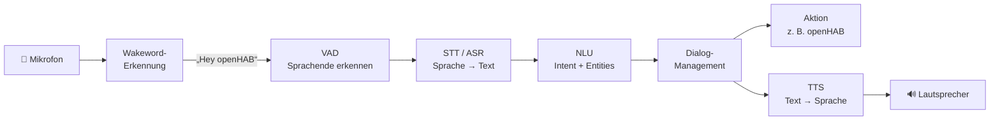
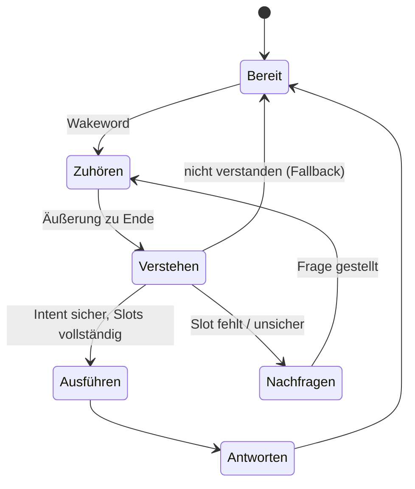

# 🗣️ Sprachassistenten

Ein Sprachassistent ist keine einzelne Software, sondern eine **Kette spezialisierter Komponenten**: Er muss erkennen, dass er angesprochen wird, Sprache in Text umwandeln, die Absicht verstehen, etwas ausführen und eine Antwort sprechen. Dieses Kapitel erklärt die Bausteine, die Fachbegriffe und den Stand lokaler (cloudfreier) Werkzeuge.

<!-- TOC -->
## Inhaltsverzeichnis

- [Die Verarbeitungskette](#die-verarbeitungskette)
- [Warum ein Wakeword?](#warum-ein-wakeword)
- [Sprachbefehl oder Konversation?](#sprachbefehl-oder-konversation)
- [Lokal oder Cloud?](#lokal-oder-cloud)
- [Lokale Werkzeuge und ihr Status](#lokale-werkzeuge-und-ihr-status)
  - [Wakeword](#wakeword)
  - [Speech-to-Text](#speech-to-text)
  - [Text-to-Speech](#text-to-speech)
  - [NLU und Dialog](#nlu-und-dialog)
- [openHAB hat bereits ein Sprachsystem](#openhab-hat-bereits-ein-sprachsystem)
- [SSML](#ssml)
- [Hardware](#hardware)
- [Was man messen kann](#was-man-messen-kann)
<!-- /TOC -->

## Die Verarbeitungskette



| Baustein | Abkürzung | Aufgabe |
| --- | --- | --- |
| **Wakeword-Erkennung** | KWS (*Keyword Spotting*) | Lauscht dauerhaft **lokal** auf ein Aktivierungswort; alles andere wird verworfen |
| **Sprachaktivitätserkennung** | VAD (*Voice Activity Detection*) | Erkennt, wann gesprochen wird und wann die Äußerung zu Ende ist |
| **Spracherkennung** | STT (*Speech-to-Text*) bzw. ASR (*Automatic Speech Recognition*) | Wandelt Audio in Text um |
| **Sprachverstehen** | NLU (*Natural Language Understanding*) | Erkennt Absicht und Parameter (→ [Intents, Entities & Confidence](Intents%2C%20Entities%20%26%20Confidence.md)) |
| **Dialog-Management** | DM | Entscheidet, was als Nächstes passiert: ausführen, nachfragen, Kontext merken |
| **Sprachausgabe** | TTS (*Text-to-Speech*) | Wandelt die Antwort in Sprache um |

> **Begriffe:** Das Aktivierungswort heißt auch *Wakeword*, *Hotword*, *Trigger Word*, Aktivierungs- oder Aufwachwort. NLU ist ein Teilgebiet von **NLP** (*Natural Language Processing*), das alle Arten maschineller Sprachverarbeitung umfasst.

---

## Warum ein Wakeword?

Ein System, das **jede** Äußerung vollständig verarbeitet, wäre

* **rechnerisch überlastet** – STT und NLU laufen dauerhaft,
* **fehleranfällig** – Gespräche im Raum lösen ungewollt Aktionen aus,
* **datenschutzrechtlich problematisch** – alles Gesprochene würde verarbeitet.

Die Wakeword-Erkennung ist dagegen ein **sehr kleines, spezialisiertes Modell**, das nur ein bis wenige Wörter kennt und auch auf schwacher Hardware dauerhaft laufen kann. Erst danach startet die aufwendige Verarbeitung.

**Gute Wakewords** haben mehrere Silben, ungewöhnliche Lautfolgen und kommen im Alltag selten vor („Hey Smart Home“ ist besser als „Licht“).

---

## Sprachbefehl oder Konversation?

| | Befehlssystem | Konversationssystem |
| --- | --- | --- |
| Interaktion | Eine Äußerung → eine Aktion | Mehrere Wechsel, Rückfragen |
| Kontext | Keiner | Vorherige Äußerungen werden berücksichtigt |
| Beispiel | „Licht in der Küche an.“ | „Mir ist zu dunkel.“ – „Soll ich das Licht in der Küche einschalten?“ – „Ja, aber nur halb.“ |
| Technik | Regeln oder Intent-Klassifikation | Zustandsautomat, Dialog-Framework oder LLM |
| Rechenaufwand | gering | höher |
| Fehlerverhalten | vorhersagbar | schwerer testbar |

Für ein Smart Home reicht ein **Befehlssystem mit Rückfragen** (fehlende Slots, unsichere Erkennung) oft völlig aus. Der Dialog lässt sich als **Zustandsautomat** modellieren (→ [State-Pattern](../Design%20Pattern/Verhaltensmuster/State.md)):



---

## Lokal oder Cloud?

| Kriterium | Lokal | Cloud |
| --- | --- | --- |
| **Datenschutz** | Audio verlässt das Gerät bzw. das Heimnetz nicht | Audio bzw. Text wird an einen Anbieter übertragen |
| **Verfügbarkeit** | Funktioniert ohne Internet | Fällt bei gestörter Verbindung aus |
| **Qualität** | Gut bis sehr gut für STT (Whisper); TTS inzwischen ordentlich (Piper) | Meist sehr natürliche Stimmen, sehr gute Erkennung |
| **Latenz** | Abhängig von der Hardware | Abhängig von Netzwerk und Dienst |
| **Kosten** | Hardware, Strom | Oft nutzungsabhängig |
| **Anpassbarkeit** | Vollständig | Durch den Anbieter begrenzt; Dienste werden auch eingestellt oder geändert |

Ein **hybrider** Ansatz ist möglich: Basisfunktionen lokal, zusätzliche Dienste (Websuche, Wetter) optional über das Netz – fällt das Internet aus, funktioniert der Kern weiter.

---

## Lokale Werkzeuge und ihr Status

> Dieses Feld entwickelt sich schnell. Viele Werkzeuge aus älteren Anleitungen werden **nicht mehr gepflegt**. Vor einer Auswahl immer Repository, letzte Version und Lizenz prüfen. (Stand dieser Übersicht: 2026)

### Wakeword

| Werkzeug | Status | Hinweise |
| --- | --- | --- |
| **openWakeWord** | ✅ aktiv, Open Source | Eigene Wakewords trainierbar (auch mit synthetischen Daten), u. a. in Home Assistant eingesetzt |
| **Porcupine** (Picovoice) | ✅ aktiv, proprietär | Sehr effizient, eigene Wakewords über die Picovoice Console; benötigt einen **AccessKey**, kostenlose Nutzung nur im Rahmen der Lizenzbedingungen |
| **Rustpotter** | ✅ aktiv, Open Source | Als Keyword Spotter in openHAB nutzbar; Wakewords aus eigenen Aufnahmen |
| **microWakeWord** | ✅ aktiv, Open Source | Für Mikrocontroller (ESP32-S3) |
| **Mycroft Precise** | ⚠️ nicht mehr aktiv gepflegt | Das Unternehmen hinter Mycroft hat den Betrieb eingestellt; nur noch Community-Forks (z. B. OpenVoiceOS) |
| **Snowboy** | ❌ eingestellt (2020) | Training eigener Wakewords nicht mehr möglich |

### Speech-to-Text

| Werkzeug | Status | Hinweise |
| --- | --- | --- |
| **Whisper** (OpenAI, offene Modelle) | ✅ aktiv | Sehr gute Erkennung, auch Deutsch; schnelle Implementierungen **whisper.cpp** und **faster-whisper**; Modellgröße bestimmt Qualität und Latenz (`tiny` … `large`) |
| **Vosk** | ✅ aktiv | Leichtgewichtig, auch auf dem Raspberry Pi; Streaming; kleinere deutsche Modelle |
| **DeepSpeech** (Mozilla) | ❌ nicht mehr weiterentwickelt | Nicht für neue Projekte |

### Text-to-Speech

| Werkzeug | Status | Hinweise |
| --- | --- | --- |
| **Piper** | ✅ aktiv | Schnell, läuft auf dem Raspberry Pi, mehrere deutsche Stimmen; derzeit erste Wahl für lokale TTS |
| **eSpeak NG** | ✅ aktiv | Sehr klein, viele Sprachen, klingt aber deutlich synthetisch |
| **Coqui TTS** | ⚠️ Firma eingestellt (2024) | Weiterentwicklung als Community-Fork; hohe Qualität, aber ressourcenhungrig |
| **pyttsx3** | ✅ | Nutzt die TTS-Engine des Betriebssystems (unter Linux meist eSpeak) |
| **MaryTTS** | ⚠️ kaum noch gepflegt | Java-basiert, historisch für Deutsch bedeutend |

### NLU und Dialog

| Werkzeug | Status | Hinweise |
| --- | --- | --- |
| **Eigene Regeln / Satzvorlagen** | – | Für ein Smart Home oft ausreichend; z. B. Template-Matching nach dem Vorbild von *hassil* (Home Assistant) |
| **scikit-learn, spaCy** | ✅ aktiv | Eigene leichte Klassifikatoren und NER |
| **Rasa** | ✅ aktiv | Umfangreiches Framework für Intents und Dialoge; Ausrichtung und Lizenzbedingungen der aktuellen Version prüfen |
| **Snips NLU** | ❌ nicht mehr gepflegt | Nach der Übernahme von Snips durch Sonos (2019) eingestellt |
| **Lokale LLMs** (z. B. über Ollama, llama.cpp) | ✅ aktiv | Kleine Modelle laufen auch auf Mini-PCs; Latenz und Hardware beachten |

---

## openHAB hat bereits ein Sprachsystem

openHAB bringt eine eigene **Voice-Infrastruktur** mit, die sich aus austauschbaren Diensten zusammensetzt:

| openHAB-Dienst | Aufgabe | Beispiele für Add-ons |
| --- | --- | --- |
| **Keyword Spotter (KS)** | Wakeword | Rustpotter, Porcupine |
| **Speech-to-Text (STT)** | Spracherkennung | Whisper (lokal über whisper.cpp oder über eine kompatible API), Vosk |
| **Human Language Interpreter (HLI)** | Text → Aktion | Standard-Interpreter (regelbasiert), HABot, weitere Interpreter aus der Community |
| **Text-to-Speech (TTS)** | Sprachausgabe | Piper, VoiceRSS (Cloud) u. a. |
| **Audio Sources / Sinks** | Mikrofon / Lautsprecher | Lokal, PulseAudio, Sonos u. a. |

Die **Dialog Processing**-Funktion verbindet diese Dienste zu einer kompletten Kette. Wer einen eigenen Sprachassistenten für openHAB entwickelt, sollte diese Infrastruktur kennen – entweder um sie zu **nutzen** oder um bewusst zu begründen, warum eine **eigene** Architektur sinnvoller ist.

---

## SSML

Die **Speech Synthesis Markup Language** (SSML, ein W3C-Standard) steuert, **wie** ein Text gesprochen wird:

```xml
<speak>
  Guten Morgen! <break time="500ms"/>
  Draußen sind es <say-as interpret-as="cardinal">12</say-as> Grad.
  <emphasis level="strong">Denk an den Regenschirm.</emphasis>
  <prosody rate="slow" pitch="low">Der Bus kommt in fünf Minuten.</prosody>
</speak>
```

| Element | Wirkung |
| --- | --- |
| `<break>` | Pause |
| `<emphasis>` | Betonung |
| `<prosody>` | Geschwindigkeit (`rate`), Tonhöhe (`pitch`), Lautstärke (`volume`) |
| `<say-as>` | Interpretation: Zahl, Datum, Uhrzeit, Buchstabieren |
| `<phoneme>` | Aussprache in Lautschrift vorgeben |
| `<lang>` | Sprache für einen Abschnitt wechseln |

Viele Cloud-Dienste unterstützen SSML weitgehend, lokale Engines oft nur **teilweise oder gar nicht** – bei einem Vergleich ein wichtiges Kriterium.

---

## Hardware

| Komponente | Hinweise |
| --- | --- |
| **Rechner** | Raspberry Pi 5 reicht für Wakeword, Vosk, kleine Whisper-Modelle und Piper. Größere Whisper-Modelle oder lokale LLMs brauchen einen Mini-PC oder eine GPU/NPU |
| **Mikrofon** | Entscheidend für die Erkennungsqualität. Raum-Mikrofone bzw. **Mikrofon-Arrays** mit Echounterdrückung (AEC) erkennen Sprache aus dem ganzen Raum – Handmikrofone nicht |
| **Lautsprecher** | Lokal, Bluetooth oder Netzwerk-Lautsprecher (z. B. Sonos über `play_uri`; auf unterstützte Audioformate achten) |
| **Satelliten** | Verteilte Mikrofon-/Lautsprechereinheiten pro Raum (z. B. ESP32), die Audio an einen zentralen Server streamen |

---

## Was man messen kann

Für Vergleiche und Abschlussarbeiten bieten sich messbare Kriterien an:

| Kriterium | Messgröße |
| --- | --- |
| **Erkennungsqualität STT** | Word Error Rate (**WER**): Anteil falsch erkannter Wörter |
| **Wakeword** | Falsch-Positive pro Stunde, Erkennungsrate |
| **NLU** | Accuracy, Precision/Recall je Intent (→ [Machine-Learning-Grundlagen](Machine-Learning-Grundlagen.md)) |
| **Latenz** | Zeit vom Ende der Äußerung bis zum Beginn der Antwort bzw. Aktion |
| **Ressourcen** | CPU-, RAM- und Energiebedarf |
| **TTS-Qualität** | Verständlichkeit, Natürlichkeit (z. B. Hörtest mit Bewertungsskala) |

---
