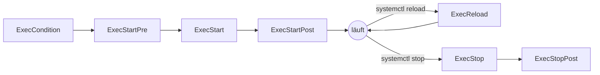

# 🧩 systemd-Services

Programme im Labor – Gerätesteuerungen, MQTT-Clients, Web-APIs, Dashboards – sollen **nach jedem Neustart automatisch starten**, **nach einem Absturz neu starten** und **nachvollziehbar loggen**. Unter Linux erledigt das **systemd**. Dieses Kapitel zeigt, wie man eigene **Service-Units** schreibt – über `systemctl start` und `enable` hinaus.

<!-- TOC -->
## Inhaltsverzeichnis

- [Was ist systemd?](#was-ist-systemd)
- [Wo liegen Unit-Dateien?](#wo-liegen-unit-dateien)
- [Aufbau einer Service-Unit](#aufbau-einer-service-unit)
- [Service-Typen](#service-typen)
  - [oneshot mit RemainAfterExit](#oneshot-mit-remainafterexit)
- [Der Lebenszyklus: ExecStartPre bis ExecStop](#der-lebenszyklus-execstartpre-bis-execstop)
- [Abhängigkeiten und Reihenfolge](#abhängigkeiten-und-reihenfolge)
  - [Reihenfolge](#reihenfolge)
  - [Abhängigkeit](#abhängigkeit)
  - [Beispiel: Ein Dienst startet nach einem anderen und endet mit ihm](#beispiel-ein-dienst-startet-nach-einem-anderen-und-endet-mit-ihm)
  - [Auf das Netzwerk warten](#auf-das-netzwerk-warten)
  - [Abhängigkeiten anzeigen](#abhängigkeiten-anzeigen)
- [Verzögerter Start](#verzögerter-start)
- [Umgebung: WorkingDirectory, Environment, User](#umgebung-workingdirectory-environment-user)
- [Neustart bei Fehlern](#neustart-bei-fehlern)
- [Logging mit journalctl](#logging-mit-journalctl)
- [Härtung (optional)](#härtung-optional)
- [Vollständige Vorlage](#vollständige-vorlage)
- [Checkliste](#checkliste)
<!-- /TOC -->

## Was ist systemd?

**systemd** ist das **Init-System** fast aller aktuellen Linux-Distributionen (Debian, Ubuntu, Raspberry Pi OS, Fedora …). Es ist der erste Prozess nach dem Kernel (**PID 1**) und startet, überwacht und beendet alle anderen Dienste (→ [Bootstrapping](../Software-Konzepte/Bootstrapping.md)).

systemd verwaltet **Units**. Die wichtigsten Typen:

| Unit-Typ | Endung | Zweck |
| --- | --- | --- |
| **Service** | `.service` | Ein Dienst/Programm |
| **Timer** | `.timer` | Zeitgesteuerter Start eines Service (→ [Cron & systemd-Timer](Cron%20%26%20systemd-Timer.md)) |
| **Target** | `.target` | Gruppe von Units / Systemzustand (`multi-user.target`, `network-online.target`) |
| **Socket** | `.socket` | Start eines Dienstes bei eingehender Verbindung |
| **Mount** | `.mount` | Eingehängtes Dateisystem (z. B. NAS-Freigabe) |
| **Path** | `.path` | Start, wenn sich eine Datei/ein Verzeichnis ändert |

---

## Wo liegen Unit-Dateien?

| Ort | Inhalt |
| --- | --- |
| `/etc/systemd/system/` | **Eigene Units** und Anpassungen – hier legen wir unsere Dienste ab |
| `/lib/systemd/system/` bzw. `/usr/lib/systemd/system/` | Units aus Paketen – **nicht** direkt bearbeiten (werden bei Updates überschrieben) |
| `~/.config/systemd/user/` | User-Units (laufen nur, solange der Benutzer angemeldet ist, außer mit `loginctl enable-linger`) |

Units aus Paketen passt man über **Drop-ins** an, statt sie zu kopieren:

```bash
sudo systemctl edit mosquitto        # creates /etc/systemd/system/mosquitto.service.d/override.conf
```

---

## Aufbau einer Service-Unit

Eine Unit ist eine INI-artige Textdatei mit drei Abschnitten:

```ini
# /etc/systemd/system/beamer-control.service
[Unit]
Description=BenQ beamer control via MQTT
Documentation=https://github.com/example/BenQ-RS232-TCP
After=network-online.target mosquitto.service
Wants=network-online.target

[Service]
Type=simple
User=labservice
Group=labservice
WorkingDirectory=/opt/lab/beamer-control
EnvironmentFile=/etc/lab/beamer-control.env
ExecStart=/opt/lab/beamer-control/.venv/bin/python -m beamer_control
Restart=on-failure
RestartSec=10

[Install]
WantedBy=multi-user.target
```

| Abschnitt | Inhalt |
| --- | --- |
| `[Unit]` | Beschreibung, **Abhängigkeiten** und **Reihenfolge** |
| `[Service]` | **Wie** das Programm gestartet, gestoppt und überwacht wird |
| `[Install]` | **Wann** die Unit beim `enable` aktiviert wird (meist `multi-user.target`) |

```bash
sudo systemctl daemon-reload                  # after every change to a unit file!
sudo systemctl enable --now beamer-control    # enable at boot + start now
systemctl status beamer-control
sudo systemctl restart beamer-control
sudo systemctl disable --now beamer-control
systemd-analyze verify /etc/systemd/system/beamer-control.service   # syntax check
```

---

## Service-Typen

Der `Type=` sagt systemd, **woran es erkennt, dass der Dienst erfolgreich gestartet ist**.

| Typ | Verhalten | Gestartet, wenn … | Einsatz |
| --- | --- | --- | --- |
| `simple` (Standard) | Programm läuft im Vordergrund weiter | … der Prozess **erzeugt** wurde | Die meisten eigenen Python-/Node-Programme |
| `exec` | Wie `simple` | … das Programm **erfolgreich ausgeführt** wurde (Fehler wie „Datei nicht gefunden“ werden sofort erkannt) | Empfohlen statt `simple` (ab systemd 240) |
| `forking` | Programm startet, erzeugt einen **Kindprozess** im Hintergrund und **beendet sich** | … der Elternprozess sich beendet hat | Klassische Daemons (alte Versionen von nginx, Apache); meist mit `PIDFile=` |
| `oneshot` | Programm läuft **einmal durch** und endet | … das Programm **beendet** ist | Skripte: Initialisierung, Backups, Konfiguration setzen |
| `notify` | Programm meldet sich selbst per `sd_notify` als bereit | … die Meldung `READY=1` kommt | Dienste mit systemd-Unterstützung (z. B. Gunicorn mit passender Konfiguration, viele Systemdienste) |
| `dbus` | Bereit, wenn ein Name auf dem D-Bus registriert ist | … der Bus-Name erscheint | Desktop-/Systemdienste |
| `idle` | Wie `simple`, Start wird verzögert, bis andere Jobs fertig sind | – | Selten, z. B. für Konsolenausgaben |

> **Häufiger Fehler:** Ein Programm, das im Vordergrund läuft, mit `Type=forking` zu starten. systemd wartet dann vergeblich auf das Ende des Elternprozesses und bricht nach dem Timeout ab. Umgekehrt beendet sich ein forkender Daemon mit `Type=simple` „sofort“ – und systemd hält den Dienst für beendet.

### oneshot mit RemainAfterExit

Ein `oneshot`-Dienst ist nach dem Durchlauf „inactive“. Soll er als **aktiv** gelten (z. B. weil er etwas eingeschaltet hat, das später beim Stoppen wieder ausgeschaltet werden soll), hilft `RemainAfterExit=yes`:

```ini
# /etc/systemd/system/lab-relays.service
[Unit]
Description=Switch lab power relays on at boot, off at shutdown

[Service]
Type=oneshot
RemainAfterExit=yes
ExecStart=/opt/lab/bin/relays.sh on
ExecStop=/opt/lab/bin/relays.sh off

[Install]
WantedBy=multi-user.target
```

---

## Der Lebenszyklus: ExecStartPre bis ExecStop



| Direktive | Zweck | Beispiel |
| --- | --- | --- |
| `ExecCondition=` | Nur starten, wenn Bedingung erfüllt (Exit-Code 0) | Prüfen, ob ein USB-Gerät vorhanden ist |
| `ExecStartPre=` | Vorbereitung **vor** dem Start (mehrfach möglich) | Verzeichnisse anlegen, auf den Broker warten, Konfiguration prüfen |
| `ExecStart=` | Das eigentliche Programm (genau **einmal**, außer bei `oneshot`) | `/opt/lab/.venv/bin/python app.py` |
| `ExecStartPost=` | Nach erfolgreichem Start | Statusmeldung per MQTT |
| `ExecReload=` | Konfiguration neu laden ohne Neustart | `/bin/kill -HUP $MAINPID` |
| `ExecStop=` | Sauberes Beenden (sonst schickt systemd `SIGTERM`) | Gerät in sicheren Zustand fahren |
| `ExecStopPost=` | Aufräumen nach dem Stopp – **auch nach Absturz** | Lock-Datei löschen |

**Präfixe** vor dem Befehl:

| Präfix | Wirkung |
| --- | --- |
| `-` | Fehler (Exit-Code ≠ 0) wird **ignoriert**: `ExecStartPre=-/usr/bin/rm /tmp/old.lock` |
| `+` | Befehl läuft mit **vollen Rechten** (root), auch wenn `User=` gesetzt ist |
| `@` | Das zweite Argument wird als `argv[0]` übergeben (selten) |

> **Wichtig:** `ExecStart` ist **keine Shell**. Umleitungen (`>`), Pipes (`|`), `&&` und `~` funktionieren nicht direkt. Entweder ein Skript aufrufen oder explizit `ExecStart=/bin/bash -c '…'` verwenden. Pfade müssen **absolut** sein.

---

## Abhängigkeiten und Reihenfolge

systemd trennt strikt zwischen **Abhängigkeit** („brauche ich das?“) und **Reihenfolge** („wann starte ich?“). Das ist die häufigste Quelle für Missverständnisse.

### Reihenfolge

| Direktive | Bedeutung |
| --- | --- |
| `After=b.service` | Starte **nach** `b` (und stoppe **vor** `b`) – **zieht b aber nicht hoch** |
| `Before=b.service` | Starte **vor** `b` |

### Abhängigkeit

| Direktive | Bedeutung | Wenn `b` nicht startet … | Wenn `b` später stoppt … |
| --- | --- | --- | --- |
| `Wants=b` | Schwach: `b` wird mitgestartet | … startet `a` trotzdem | … läuft `a` weiter |
| `Requires=b` | Stark: `b` wird mitgestartet | … startet `a` nicht | … wird `a` gestoppt (bei explizitem Stopp von `b`) |
| `BindsTo=b` | Noch stärker als `Requires` | … startet `a` nicht | … wird `a` **immer** gestoppt – auch wenn `b` abstürzt oder verschwindet |
| `PartOf=b` | Nur Stopp/Neustart wird weitergegeben | – | `stop`/`restart` von `b` wirkt auch auf `a` |
| `Requisite=b` | `b` muss **bereits** laufen, wird nicht gestartet | … startet `a` nicht | – |
| `Conflicts=b` | `a` und `b` schließen sich aus | – | – |

**Faustregel:** Abhängigkeit **und** Reihenfolge fast immer **gemeinsam** angeben:

```ini
[Unit]
Requires=mosquitto.service
After=mosquitto.service
```

### Beispiel: Ein Dienst startet nach einem anderen und endet mit ihm

Die Sensor-Bridge soll erst starten, wenn der MQTT-Broker läuft, und **automatisch beendet werden, wenn der Broker endet**:

```ini
# /etc/systemd/system/sensor-bridge.service
[Unit]
Description=Sensor bridge (needs local MQTT broker)
BindsTo=mosquitto.service
After=mosquitto.service

[Service]
Type=exec
User=labservice
WorkingDirectory=/opt/lab/sensor-bridge
ExecStart=/opt/lab/sensor-bridge/.venv/bin/python bridge.py
Restart=on-failure
RestartSec=5

[Install]
WantedBy=mosquitto.service      # 'enable' starts it whenever mosquitto starts
```

`WantedBy=mosquitto.service` sorgt dafür, dass die Bridge auch dann mitstartet, wenn der Broker später erneut gestartet wird.

### Auf das Netzwerk warten

```ini
[Unit]
Wants=network-online.target
After=network-online.target
```

`network.target` bedeutet nur „Netzwerkdienste wurden gestartet“ – **nicht**, dass eine IP-Adresse vorhanden ist. Für Programme, die beim Start eine Verbindung aufbauen, ist `network-online.target` richtig.

### Abhängigkeiten anzeigen

```bash
systemctl list-dependencies sensor-bridge
systemctl list-dependencies --reverse mosquitto     # who depends on mosquitto?
systemd-analyze critical-chain sensor-bridge.service
```

---

## Verzögerter Start

Manche Geräte oder Dienste brauchen nach dem Booten Zeit (Beamer im Netz, Broker in einer anderen VM, USB-Gerät). Möglichkeiten – von schlecht nach gut:

| Variante | Beispiel | Bewertung |
| --- | --- | --- |
| Feste Wartezeit | `ExecStartPre=/bin/sleep 30` | Einfach, aber Raten: zu kurz → Fehler, zu lang → Zeitverschwendung. Achtung: `TimeoutStartSec` beachten |
| Timer mit Verzögerung | `OnBootSec=2min` in einer `.timer`-Unit | Sauber, wenn wirklich eine Zeitspanne gemeint ist |
| **Aktiv warten** | `ExecStartPre=` mit Schleife, die prüft, ob der Dienst erreichbar ist | Robust: startet, sobald es geht |
| **Im Programm** | Verbindungsaufbau mit Retry/Backoff | Am robustesten – hilft auch bei späteren Verbindungsabbrüchen |
| **Restart nutzen** | Programm beendet sich bei Fehler, `Restart=on-failure` startet neu | Einfach und robust |

**Aktiv warten, bis ein Port erreichbar ist:**

```ini
[Service]
ExecStartPre=/bin/bash -c 'for i in $(seq 1 30); do nc -z broker.lab.local 8883 && exit 0; sleep 2; done; exit 1'
TimeoutStartSec=90
```

**Mit Timer verzögert starten:**

```ini
# /etc/systemd/system/beamer-control.timer
[Unit]
Description=Start beamer control 2 minutes after boot

[Timer]
OnBootSec=2min
Unit=beamer-control.service

[Install]
WantedBy=timers.target
```

Dann **nur den Timer** aktivieren (`systemctl enable beamer-control.timer`), nicht den Service selbst.

---

## Umgebung: WorkingDirectory, Environment, User

```ini
[Service]
User=labservice
Group=labservice
SupplementaryGroups=dialout gpio       # access to serial ports and GPIO
WorkingDirectory=/opt/lab/sensor-bridge
Environment=PYTHONUNBUFFERED=1
Environment="LOG_LEVEL=INFO"
EnvironmentFile=/etc/lab/sensor-bridge.env
```

| Direktive | Zweck |
| --- | --- |
| `WorkingDirectory=` | Arbeitsverzeichnis – relative Pfade im Programm beziehen sich darauf. Ohne Angabe: `/` |
| `User=` / `Group=` | Unter welchem Benutzer der Dienst läuft – **nie** unnötig als `root` (→ [Benutzer, Gruppen & Rechte](Benutzer%2C%20Gruppen%20%26%20Rechte.md)) |
| `SupplementaryGroups=` | Zusätzliche Gruppen, z. B. `dialout` für `/dev/ttyUSB0` |
| `Environment=` | Einzelne Umgebungsvariablen |
| `EnvironmentFile=` | Variablen aus Datei (ideal für **Passwörter**, Datei mit `chmod 600`) |
| `DynamicUser=yes` | systemd erzeugt einen temporären Benutzer – sehr sicher für einfache Dienste |

**Eigenen Dienstbenutzer anlegen:**

```bash
sudo useradd --system --no-create-home --shell /usr/sbin/nologin labservice
sudo chown -R labservice:labservice /opt/lab/sensor-bridge
```

**`/etc/lab/sensor-bridge.env`** (Rechte `600`, Eigentümer root):

```bash
MQTT_HOST=broker.lab.local
MQTT_USER=sensor-bridge
MQTT_PASSWORD=change-me
```

> Wenn ein Programm im Terminal läuft, als Dienst aber nicht, liegt es fast immer an **Benutzer**, **Arbeitsverzeichnis**, **Umgebungsvariablen** oder **PATH**. Testen kann man das mit `sudo -u labservice env -i /opt/lab/.venv/bin/python app.py`.

---

## Neustart bei Fehlern

```ini
[Unit]
StartLimitIntervalSec=300      # within 5 minutes ...
StartLimitBurst=5              # ... at most 5 starts, then give up

[Service]
Restart=on-failure
RestartSec=10                  # wait 10 s before restarting
```

| `Restart=` | Neustart bei … |
| --- | --- |
| `no` (Standard) | nie |
| `on-failure` | Exit-Code ≠ 0, Absturz durch Signal, Timeout, Watchdog – **empfohlen** |
| `on-abnormal` | Signal, Timeout, Watchdog (nicht bei Exit-Code ≠ 0) |
| `on-abort` | nur bei unbehandeltem Signal |
| `always` | immer, auch nach regulärem Ende |

**Maximale Anzahl an Neustarts:** `StartLimitBurst` und `StartLimitIntervalSec` stehen im Abschnitt **`[Unit]`** (in älteren Anleitungen findet man sie fälschlich unter `[Service]`). Wird das Limit erreicht, geht der Dienst in den Zustand **failed** und wird nicht weiter gestartet. Zurücksetzen mit:

```bash
sudo systemctl reset-failed sensor-bridge
```

Optional lässt sich bei endgültigem Fehlschlag eine Aktion auslösen, z. B. eine Benachrichtigung:

```ini
[Unit]
OnFailure=notify-failure@%n.service
```

---

## Logging mit journalctl

Alles, was ein Dienst auf **stdout** und **stderr** schreibt, landet automatisch im **Journal** – mit Zeitstempel und Dienstname.

```bash
journalctl -u sensor-bridge                 # all logs of the service
journalctl -u sensor-bridge -f              # follow live (like tail -f)
journalctl -u sensor-bridge -b              # since last boot
journalctl -u sensor-bridge --since "1 hour ago"
journalctl -u sensor-bridge -p err          # only errors and worse
journalctl -u sensor-bridge -n 50 --no-pager
```

> **Python:** Ohne `PYTHONUNBUFFERED=1` (oder `python -u`) puffert Python die Ausgabe – die Logs erscheinen dann verzögert oder erst beim Beenden.

Optional kann die Ausgabe auch in Dateien gehen:

```ini
[Service]
StandardOutput=append:/var/log/lab/sensor-bridge.log
StandardError=append:/var/log/lab/sensor-bridge.log
SyslogIdentifier=sensor-bridge
```

Damit das Journal auf einer SD-Karte nicht überläuft: `SystemMaxUse=200M` in `/etc/systemd/journald.conf`.

---

## Härtung (optional)

systemd kann Dienste stark einschränken – ohne Änderung am Programm:

```ini
[Service]
NoNewPrivileges=yes
ProtectSystem=strict              # whole file system read-only ...
ReadWritePaths=/opt/lab/sensor-bridge/data   # ... except this
ProtectHome=yes
PrivateTmp=yes
ProtectKernelTunables=yes
RestrictAddressFamilies=AF_INET AF_INET6 AF_UNIX
```

`systemd-analyze security sensor-bridge` bewertet, wie gut ein Dienst abgesichert ist.

---

## Vollständige Vorlage

```ini
# /etc/systemd/system/<name>.service
[Unit]
Description=<what the service does>
Documentation=<link to repository/README>
Wants=network-online.target
After=network-online.target
# Requires=/BindsTo= + After= for hard dependencies
StartLimitIntervalSec=300
StartLimitBurst=5

[Service]
Type=exec
User=labservice
Group=labservice
WorkingDirectory=/opt/lab/<name>
EnvironmentFile=-/etc/lab/<name>.env
Environment=PYTHONUNBUFFERED=1
ExecStartPre=/opt/lab/<name>/scripts/check-config.sh
ExecStart=/opt/lab/<name>/.venv/bin/python -m <package>
ExecStop=/opt/lab/<name>/scripts/safe-shutdown.sh
Restart=on-failure
RestartSec=10
TimeoutStopSec=20
NoNewPrivileges=yes
PrivateTmp=yes

[Install]
WantedBy=multi-user.target
```

---

## Checkliste

* [ ] Unit liegt in `/etc/systemd/system/`, Name sprechend (`<projekt>.service`)
* [ ] Passender `Type=` gewählt
* [ ] Eigener Benutzer, nicht `root`
* [ ] `WorkingDirectory` gesetzt, alle Pfade absolut
* [ ] Abhängigkeiten **und** Reihenfolge (`Requires`/`BindsTo` + `After`)
* [ ] `Restart=on-failure` mit `RestartSec` und Start-Limit
* [ ] Passwörter in `EnvironmentFile` mit Rechten `600`, nicht in der Unit
* [ ] Nach Änderungen `daemon-reload`
* [ ] Neustart des ganzen Systems getestet (`sudo reboot`) – startet alles von selbst?
* [ ] Unit-Datei im Projekt-Repository versioniert und in der README dokumentiert (oder per [Ansible](../Best%20Practices/Ansible.md) ausgerollt)

---
