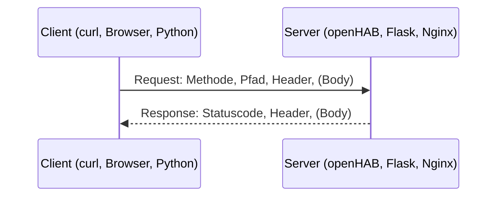

# 🌐 HTTP & REST

**HTTP** ist das Protokoll des Webs – und die Grundlage fast aller Programmierschnittstellen (APIs) im Labor: Die **openHAB REST API**, Weboberflächen von Geräten, Proxmox, eigene Flask- oder Node-Dienste. Wer HTTP versteht, kann jede dieser Schnittstellen mit `curl`, Python oder JavaScript ansprechen und Fehler gezielt finden.

<!-- TOC -->
## Inhaltsverzeichnis

- [HTTP in einem Satz](#http-in-einem-satz)
- [Aufbau einer Anfrage](#aufbau-einer-anfrage)
- [Aufbau einer Antwort](#aufbau-einer-antwort)
- [HTTP-Methoden](#http-methoden)
  - [PUT vs. POST](#put-vs-post)
- [Statuscodes](#statuscodes)
- [Wichtige Header](#wichtige-header)
  - [Anfrage](#anfrage)
  - [Antwort](#antwort)
- [REST](#rest)
  - [Gutes Endpunkt-Design](#gutes-endpunkt-design)
- [Praxis mit curl](#praxis-mit-curl)
- [Praxis mit Python](#praxis-mit-python)
- [Praxis mit JavaScript](#praxis-mit-javascript)
- [HTTP vs. MQTT vs. WebSockets](#http-vs-mqtt-vs-websockets)
<!-- /TOC -->

## HTTP in einem Satz

HTTP (*Hypertext Transfer Protocol*) ist ein **Anfrage-Antwort-Protokoll**: Ein **Client** (Browser, Skript, App) schickt eine **Anfrage (Request)** an einen **Server**, der mit genau **einer Antwort (Response)** reagiert. Jede Anfrage steht für sich – HTTP ist **zustandslos**.



**HTTPS** ist HTTP über eine **TLS-verschlüsselte** Verbindung. Der Inhalt ist identisch, aber niemand im Netz kann mitlesen oder manipulieren – deshalb gilt im Labor: **HTTPS von Anfang an** (→ [Best Practice Zertifikate](../Best%20Practices/Zertifikate.md)).

---

## Aufbau einer Anfrage

```http
PUT /rest/items/Beamer_Power/state HTTP/1.1
Host: openhab.lab.local:8443
Authorization: Bearer oh.labtoken.abc123
Content-Type: text/plain
Accept: application/json
Content-Length: 2

ON
```

| Teil | Beispiel | Bedeutung |
| --- | --- | --- |
| **Request-Zeile** | `PUT /rest/items/Beamer_Power/state HTTP/1.1` | **Methode**, **Pfad** (inkl. Query-String), Protokollversion |
| **Header** | `Content-Type: text/plain` | Metadaten als `Name: Wert`, je eine Zeile |
| **Leerzeile** | | Trennt Header und Body |
| **Body** | `ON` | Die eigentlichen Nutzdaten (optional) |

Eine **URL** setzt sich so zusammen:

```text
https://openhab.lab.local:8443/rest/items?tags=Lighting&recursive=false
└─┬─┘   └───────┬───────┘└┬─┘└────┬────┘└─────────────┬──────────────┘
Schema        Host       Port   Pfad              Query-String (Parameter)
```

## Aufbau einer Antwort

```http
HTTP/1.1 200 OK
Content-Type: application/json
Content-Length: 87
Cache-Control: no-cache

{"name":"Beamer_Power","state":"ON","type":"Switch","label":"Beamer"}
```

| Teil | Bedeutung |
| --- | --- |
| **Status-Zeile** | Protokollversion, **Statuscode** und Text |
| **Header** | Metadaten der Antwort |
| **Body** | Inhalt (HTML, JSON, Bild …) |

> **„Head“ und Header:** Den gesamten Kopfbereich (Request-/Status-Zeile + Header) nennt man oft **Head**, im Gegensatz zum **Body**. Mit der Methode **`HEAD`** fragt man genau diesen Kopf ab – ohne Body.

---

## HTTP-Methoden

| Methode | Zweck | Body in der Anfrage | Sicher¹ | Idempotent² | Beispiel (openHAB) |
| --- | --- | --- | --- | --- | --- |
| **GET** | Ressource **lesen** | nein | ✅ | ✅ | `GET /rest/items/Beamer_Power` |
| **HEAD** | Wie GET, aber **nur Header** | nein | ✅ | ✅ | Existiert die Ressource? Wie groß ist die Datei? |
| **POST** | Etwas **erzeugen** oder eine **Aktion auslösen** | ja | ❌ | ❌ | `POST /rest/items/Beamer_Power` mit `ON` = **Befehl** senden |
| **PUT** | Ressource **vollständig anlegen/ersetzen** | ja | ❌ | ✅ | `PUT /rest/items/Beamer_Power/state` = **Zustand** setzen; `PUT /rest/items/Neu` = Item anlegen |
| **PATCH** | Ressource **teilweise** ändern | ja | ❌ | (meist ❌) | Einzelne Felder aktualisieren |
| **DELETE** | Ressource **löschen** | nein (meist) | ❌ | ✅ | `DELETE /rest/items/Test_Item` |
| **OPTIONS** | Welche Methoden sind erlaubt? (CORS-Preflight) | nein | ✅ | ✅ | – |

¹ **Sicher:** verändert nichts auf dem Server. ² **Idempotent:** Mehrfaches Ausführen hat **dieselbe Wirkung** wie einmaliges – zweimal `DELETE` löscht nichts Zusätzliches, zweimal `PUT` setzt denselben Wert. Zweimal `POST` legt (potenziell) zwei Dinge an oder löst die Aktion zweimal aus.

### PUT vs. POST

| | PUT | POST |
| --- | --- | --- |
| Wer bestimmt die Adresse? | Der **Client**: `PUT /items/Lampe_Flur` | Der **Server**: `POST /items` → Antwort `201 Created`, `Location: /items/42` |
| Wiederholung | unkritisch (idempotent) | kann doppelte Einträge/Aktionen erzeugen |
| Merkhilfe | „Lege **genau das** an **genau diese** Stelle“ | „Hier, mach was damit“ |

> **openHAB-Besonderheit:** `POST /rest/items/{name}` sendet einen **Command** (das Gerät wird geschaltet), `PUT /rest/items/{name}/state` setzt nur den **Zustand** (Status-Update, kein Befehl an das Gerät). Diese Unterscheidung zwischen Command und State findet sich auch in openHAB-Regeln wieder.

---

## Statuscodes

| Klasse | Bedeutung | Wichtige Codes |
| --- | --- | --- |
| **1xx** | Information | `101 Switching Protocols` (WebSocket) |
| **2xx** | Erfolg | `200 OK`, `201 Created`, `202 Accepted`, `204 No Content` |
| **3xx** | Umleitung | `301 Moved Permanently`, `302 Found`, `304 Not Modified`, `307`/`308` |
| **4xx** | **Fehler des Clients** | siehe unten |
| **5xx** | **Fehler des Servers** | siehe unten |

| Code | Bedeutung | Typische Ursache im Labor |
| --- | --- | --- |
| `400 Bad Request` | Anfrage fehlerhaft | Ungültiges JSON, falscher `Content-Type` |
| `401 Unauthorized` | **Nicht authentifiziert** – wer bist du? | Token/Passwort fehlt oder ist falsch |
| `403 Forbidden` | **Nicht autorisiert** – du darfst das nicht | Benutzer hat keine Rechte; Dateirechte bei Nginx |
| `404 Not Found` | Ressource existiert nicht | Tippfehler im Item-Namen, falscher Pfad |
| `405 Method Not Allowed` | Methode für diese Ressource nicht erlaubt | `POST` statt `PUT` |
| `409 Conflict` | Konflikt mit dem aktuellen Zustand | Ressource existiert bereits |
| `415 Unsupported Media Type` | Server versteht das Format nicht | `Content-Type` fehlt oder falsch |
| `429 Too Many Requests` | Rate Limit | Zu häufiges Polling |
| `500 Internal Server Error` | Fehler im Server-Code | Exception in der Anwendung – Logs prüfen |
| `502 Bad Gateway` | Proxy erreicht die Anwendung nicht | Anwendung hinter Nginx läuft nicht |
| `503 Service Unavailable` | Dienst vorübergehend nicht verfügbar | Neustart, Überlast |
| `504 Gateway Timeout` | Anwendung antwortet zu langsam | Gerät reagiert nicht |

Den Unterschied zwischen **401** und **403** – Authentifizierung vs. Autorisierung – erklärt [Authentifizierung & Autorisierung](../Zugriffskontrolle/Authentifizierung%20%26%20Autorisierung.md).

---

## Wichtige Header

### Anfrage

| Header | Bedeutung | Beispiel |
| --- | --- | --- |
| `Host` | Ziel-Hostname (Pflicht in HTTP/1.1) | `Host: openhab.lab.local` |
| `Authorization` | Zugangsdaten | `Bearer <token>`, `Basic <base64(user:pass)>` |
| `Content-Type` | Format **des gesendeten** Bodys | `application/json`, `text/plain` |
| `Accept` | Gewünschtes Format **der Antwort** | `application/json` |
| `User-Agent` | Wer fragt? | `curl/8.5.0`, `python-requests/2.32` |
| `Cookie` | Vom Server gesetzte Cookies zurückschicken | `session=abc` |
| `If-None-Match` / `If-Modified-Since` | Nur liefern, wenn geändert (Caching) | – |

### Antwort

| Header | Bedeutung |
| --- | --- |
| `Content-Type` | Format des Bodys |
| `Content-Length` | Größe in Bytes |
| `Location` | Ziel einer Umleitung bzw. Adresse einer neu angelegten Ressource |
| `Set-Cookie` | Cookie setzen |
| `Cache-Control`, `ETag` | Caching |
| `WWW-Authenticate` | Bei `401`: welches Anmeldeverfahren erwartet wird |
| `Access-Control-Allow-Origin` | **CORS**: Welche fremden Webseiten dürfen per JavaScript zugreifen? |

> ⚠️ **Basic Auth** ist nur Base64-**kodiert**, nicht verschlüsselt. Ohne HTTPS liest jeder im Netz das Passwort mit.

---

## REST

**REST** (*Representational State Transfer*) ist ein **Architekturstil** für Schnittstellen über HTTP, beschrieben von Roy Fielding (2000). Eine API ist **RESTful**, wenn sie diesen Prinzipien folgt:

| Prinzip | Bedeutung | Beispiel |
| --- | --- | --- |
| **Ressourcen** | Alles ist eine Ressource mit eigener **URL** | `/rest/items/Beamer_Power` |
| **Einheitliche Schnittstelle** | Die **Methode** sagt, was passiert – nicht der Pfad | `DELETE /items/42`, **nicht** `GET /deleteItem?id=42` |
| **Repräsentationen** | Ressourcen werden in einem Format übertragen | JSON, XML, Text |
| **Zustandslos** | Jede Anfrage enthält alles Nötige (z. B. das Token) | Kein Server-Gedächtnis zwischen Anfragen |
| **Cachebar** | Antworten geben an, ob sie zwischengespeichert werden dürfen | `Cache-Control` |
| **Client-Server** | Klare Trennung von Oberfläche und Datenhaltung | Dashboard ↔ openHAB |

### Gutes Endpunkt-Design

| Aktion | RESTful | Nicht RESTful |
| --- | --- | --- |
| Alle Geräte | `GET /devices` | `GET /getAllDevices` |
| Ein Gerät | `GET /devices/beamer` | `GET /device?name=beamer&action=get` |
| Gerät anlegen | `POST /devices` | `GET /createDevice?...` |
| Gerät ändern | `PUT/PATCH /devices/beamer` | `POST /updateDevice` |
| Gerät löschen | `DELETE /devices/beamer` | `GET /devices/beamer/delete` |
| Unterressource | `GET /devices/beamer/inputs` | – |
| Filtern | `GET /devices?room=lab&type=light` | – |

* Ressourcen als **Substantive im Plural**, Aktionen über **Methoden**.
* Sinnvolle **Statuscodes** zurückgeben (nicht immer `200` mit `{"error": …}` im Body).
* API **versionieren**: `/api/v1/…`.
* **Dokumentieren**, z. B. mit **OpenAPI/Swagger** – openHAB liefert seine API-Dokumentation unter *Developer Tools → API Explorer* mit.

---

## Praxis mit curl

```bash
# read an item (JSON)
curl -s https://openhab.lab.local:8443/rest/items/Beamer_Power \
     -H "Authorization: Bearer $OH_TOKEN" -H "Accept: application/json"

# only the state as plain text
curl -s https://openhab.lab.local:8443/rest/items/Beamer_Power/state \
     -H "Authorization: Bearer $OH_TOKEN"

# send a command (POST)
curl -X POST https://openhab.lab.local:8443/rest/items/Beamer_Power \
     -H "Authorization: Bearer $OH_TOKEN" -H "Content-Type: text/plain" \
     --data "ON"

# update the state without a command (PUT)
curl -X PUT https://openhab.lab.local:8443/rest/items/Room_Temperature/state \
     -H "Authorization: Bearer $OH_TOKEN" -H "Content-Type: text/plain" \
     --data "21.5"

# headers only (HEAD)
curl -I https://openhab.lab.local:8443/

# show everything: request, response headers, TLS handshake
curl -v https://openhab.lab.local:8443/rest/
```

| curl-Option | Bedeutung |
| --- | --- |
| `-X METHODE` | HTTP-Methode |
| `-H "Name: Wert"` | Header |
| `-d` / `--data` | Body (setzt automatisch POST) |
| `--json '{…}'` | JSON-Body inkl. passender Header (curl ≥ 7.82) |
| `-i` / `-I` | Antwort-Header anzeigen / nur HEAD |
| `-v` | Ausführlich (Fehlersuche) |
| `-s` | Ohne Fortschrittsanzeige |
| `--cacert ca.crt` | Eigene CA vertrauen (statt `-k`!) |
| `-k` | Zertifikat **nicht** prüfen – nur zur Diagnose, nie in Skripten |

`jq` formatiert und filtert JSON: `curl -s …/rest/items | jq '.[] | select(.type=="Switch") | .name'`.

---

## Praxis mit Python

```python
import os

import requests

BASE = "https://openhab.lab.local:8443/rest"
session = requests.Session()
session.headers["Authorization"] = f"Bearer {os.environ['OH_TOKEN']}"
session.verify = "/etc/ssl/lab/lab_ca.crt"      # trust the lab CA


def get_state(item: str) -> str:
    response = session.get(f"{BASE}/items/{item}/state", timeout=5)
    response.raise_for_status()                  # raises on 4xx/5xx
    return response.text


def send_command(item: str, command: str) -> None:
    response = session.post(f"{BASE}/items/{item}", data=command,
                            headers={"Content-Type": "text/plain"}, timeout=5)
    response.raise_for_status()


send_command("Beamer_Power", "ON")
print(get_state("Beamer_Power"))
```

* **Immer einen `timeout`** setzen – sonst wartet das Programm bei einem toten Gerät ewig.
* `raise_for_status()` statt den Statuscode zu ignorieren.
* Token aus der Umgebung, nicht im Code.

---

## Praxis mit JavaScript

```javascript
const BASE = "https://openhab.lab.local:8443/rest";
const headers = { Authorization: `Bearer ${token}` };

async function getItem(name) {
  const response = await fetch(`${BASE}/items/${name}`, {
    headers: { ...headers, Accept: "application/json" },
  });
  if (!response.ok) throw new Error(`${response.status} ${response.statusText}`);
  return response.json();
}

async function sendCommand(name, command) {
  const response = await fetch(`${BASE}/items/${name}`, {
    method: "POST",
    headers: { ...headers, "Content-Type": "text/plain" },
    body: command,
  });
  if (!response.ok) throw new Error(`${response.status} ${response.statusText}`);
}
```

> **CORS:** Läuft das JavaScript im Browser auf einer **anderen Origin** (Schema + Host + Port) als die API, blockiert der Browser die Antwort, sofern der Server sie nicht per `Access-Control-Allow-Origin` erlaubt. Abhilfe: API und Webseite über **denselben** Nginx ausliefern (→ [Web-Server & Deployment](../Best%20Practices/Web-Server%20%26%20Deployment.md)) oder CORS auf dem Server gezielt freigeben.

---

## HTTP vs. MQTT vs. WebSockets

| | HTTP/REST | MQTT | WebSocket / Server-Sent Events |
| --- | --- | --- | --- |
| Muster | Anfrage–Antwort | Publish–Subscribe über Broker | Dauerhafte Verbindung |
| Wer startet? | Immer der Client | Jeder publiziert, Abonnenten erhalten | Beide Seiten (WebSocket) / Server (SSE) |
| Live-Updates | Nur per Polling | ✅ | ✅ |
| Overhead | Relativ hoch (Header pro Anfrage) | Sehr gering | Gering nach Aufbau |
| Typisch im Labor | Konfiguration, Abfragen, Befehle an openHAB | Sensoren und Aktoren, Geräte untereinander | Live-Dashboards (openHAB bietet SSE unter `/rest/events`) |

Mehr zu MQTT: [Best Practice MQTT](../Best%20Practices/MQTT.md).

---
