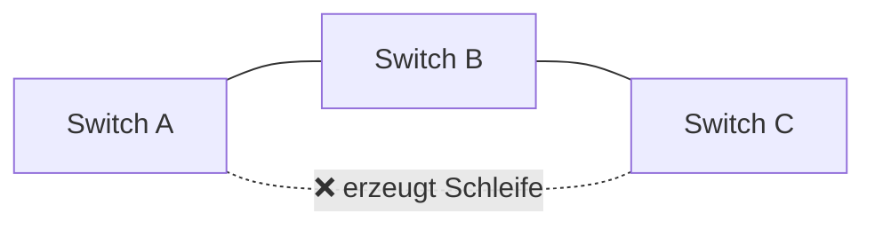

# 🔌 Netzwerk-Grundlagen

Ein Smart Home ist vor allem ein **Netzwerk** aus vielen Geräten. Wer versteht, wie Geräte adressiert werden und wie Pakete ihren Weg finden, löst die meisten Probleme im Labor in Minuten statt in Stunden. Dieses Kapitel fasst das praktisch Nötige zusammen – mit den Werkzeugen, die man täglich braucht.

<!-- TOC -->
## Inhaltsverzeichnis

- [Das Schichtenmodell in Kürze](#das-schichtenmodell-in-kürze)
- [Adressen](#adressen)
  - [MAC-Adresse](#mac-adresse)
  - [IPv4-Adresse und Subnetz](#ipv4-adresse-und-subnetz)
  - [Private Adressbereiche](#private-adressbereiche)
  - [IPv6](#ipv6)
  - [Ports](#ports)
  - [TCP und UDP](#tcp-und-udp)
- [Namen: Hostname, DNS, mDNS](#namen-hostname-dns-mdns)
  - [Hostname ändern](#hostname-ändern)
- [Die eigene Netzwerkkonfiguration](#die-eigene-netzwerkkonfiguration)
- [ping](#ping)
  - [Systematisch von innen nach außen](#systematisch-von-innen-nach-außen)
  - [Port statt Ping prüfen](#port-statt-ping-prüfen)
- [ARP](#arp)
- [nmap](#nmap)
- [Switches, Kabel und Schleifen](#switches-kabel-und-schleifen)
  - [Hub, Switch, Router, Access Point](#hub-switch-router-access-point)
  - [Kabel](#kabel)
  - [Schleifen (Loops) – warum sie gefährlich sind](#schleifen-loops--warum-sie-gefährlich-sind)
- [WLAN im Labor](#wlan-im-labor)
- [Werkzeuge im Überblick](#werkzeuge-im-überblick)
<!-- /TOC -->

## Das Schichtenmodell in Kürze

Netzwerkkommunikation wird in **Schichten** beschrieben. Jede Schicht nutzt die darunterliegende und bietet der darüberliegenden einen Dienst an – wie bei einem Brief: Inhalt, Umschlag mit Adresse, Postsack, LKW.

| Schicht (TCP/IP) | Entspricht OSI | Aufgabe | Beispiele | Adresse |
| --- | --- | --- | --- | --- |
| **Anwendung** | 5–7 | Was wird übertragen? | HTTP, MQTT, SSH, DNS, DHCP | URL, Topic |
| **Transport** | 4 | Zwischen welchen Programmen? Zuverlässig? | TCP, UDP | **Port** |
| **Internet** | 3 | Über welche Netze hinweg? | IP, ICMP | **IP-Adresse** |
| **Netzzugang** | 1–2 | Im lokalen Netz, über welches Medium? | Ethernet, WLAN | **MAC-Adresse** |

---

## Adressen

### MAC-Adresse

* Hardware-Adresse der Netzwerkschnittstelle, 48 Bit, z. B. `b8:27:eb:12:34:56`.
* Die ersten drei Bytes (**OUI**) verraten den **Hersteller** (`b8:27:eb`, `dc:a6:32`, `d8:3a:dd`, `2c:cf:67` = Raspberry Pi).
* Gilt nur im **lokalen Netz** (wird von Routern nicht weitergegeben).
* Grundlage für **DHCP-Reservierungen** (→ [Best Practice DHCP](../Best%20Practices/DHCP.md)).

> Smartphones und neuere Betriebssysteme verwenden im WLAN oft **zufällige MAC-Adressen** („Private Wi-Fi Address“). Für Laborgeräte mit fester IP muss das abgeschaltet werden.

### IPv4-Adresse und Subnetz

Eine IPv4-Adresse besteht aus 32 Bit, geschrieben als vier Zahlen: `192.168.10.21`. Die **Subnetzmaske** bzw. das **Präfix** legt fest, welcher Teil das **Netz** und welcher das **Gerät** bezeichnet:

```text
IP-Adresse   192.168.10.21
Präfix       /24  = Maske 255.255.255.0
Netz         192.168.10.0      (erste 24 Bit)
Gerät        .21               (letzte 8 Bit)
Broadcast    192.168.10.255
nutzbar      192.168.10.1 – 192.168.10.254  (254 Geräte)
```

| Präfix | Maske | Geräte |
| --- | --- | --- |
| `/24` | 255.255.255.0 | 254 |
| `/23` | 255.255.254.0 | 510 |
| `/16` | 255.255.0.0 | 65 534 |

Geräte im **selben Subnetz** sprechen direkt miteinander. Für alles andere schicken sie die Pakete an das **Gateway** (den Router).

### Private Adressbereiche

| Bereich | Typischer Einsatz |
| --- | --- |
| `10.0.0.0/8` | Unternehmen, Hochschulen |
| `172.16.0.0/12` | Docker-Netze (`172.17.0.0/16`) |
| `192.168.0.0/16` | Heimnetze, Labornetze |
| `127.0.0.0/8` | **Loopback** – `127.0.0.1` ist immer der eigene Rechner |
| `169.254.0.0/16` | **Link-Local** – Gerät hat **keine** Adresse per DHCP bekommen ⚠️ |

### IPv6

128 Bit, z. B. `fe80::ba27:ebff:fe12:3456`. Jedes Gerät hat mindestens eine **Link-Local-Adresse** (`fe80::…`). Viele Smart-Home-Standards (z. B. **Thread/Matter**) setzen auf IPv6 (→ [Smart-Home-Funkstandards](Smart-Home-Funkstandards.md)).

### Ports

Eine IP-Adresse adressiert ein **Gerät**, ein **Port** ein **Programm** darauf – wie Hausnummer und Wohnungsnummer.

| Port | Dienst | Port | Dienst |
| --- | --- | --- | --- |
| 22 | SSH | 1883 | MQTT |
| 53 | DNS | 8883 | MQTT über TLS |
| 67/68 (UDP) | DHCP | 8080 / 8443 | openHAB HTTP / HTTPS |
| 80 | HTTP | 5353 (UDP) | mDNS |
| 443 | HTTPS | 8006 | Proxmox Web-UI |

### TCP und UDP

| | TCP | UDP |
| --- | --- | --- |
| Verbindung | Verbindungsaufbau (Handshake) | Verbindungslos |
| Zuverlässigkeit | Garantierte, geordnete Zustellung | Pakete können verloren gehen |
| Overhead | höher | gering |
| Beispiele | HTTP, SSH, MQTT | DNS, DHCP, Video-Streams, viele Geräte-Discovery-Protokolle |

---

## Namen: Hostname, DNS, mDNS

Menschen merken sich Namen besser als Zahlen.

| Mechanismus | Funktion | Beispiel |
| --- | --- | --- |
| **Hostname** | Name, den sich ein Gerät selbst gibt | `pi-mqtt` |
| **DNS** | Zentraler „Telefonbuch“-Dienst: Name → IP | `broker.lab.example.org` |
| **mDNS / Avahi / Bonjour** | Geräte melden ihren Namen selbst im lokalen Netz | `pi-mqtt.local` |
| **`/etc/hosts`** | Lokale, fest eingetragene Zuordnung | `192.168.10.21 pi-mqtt` |

### Hostname ändern

```bash
hostnamectl                                    # show current hostname
sudo hostnamectl set-hostname pi-beamer        # set new hostname
sudo nano /etc/hosts                           # replace old name in the 127.0.1.1 line
```

```text
# /etc/hosts
127.0.0.1   localhost
127.0.1.1   pi-beamer
```

Auf dem Raspberry Pi geht es alternativ mit `sudo raspi-config` → *System Options* → *Hostname*. Danach neu starten.

> Ein Hostname ist **nice to have**, ersetzt aber **keine feste IP-Adresse**. mDNS funktioniert nicht über Subnetzgrenzen hinweg und nicht in jedem Programm zuverlässig (→ [Best Practice DHCP](../Best%20Practices/DHCP.md)).

---

## Die eigene Netzwerkkonfiguration

```bash
ip -br addr                 # short overview: interface, state, IP addresses
ip addr show eth0           # details of one interface (incl. MAC)
ip route                    # routing table - 'default via ...' is the gateway
resolvectl status           # DNS servers (systemd-resolved); else: cat /etc/resolv.conf
nmcli device show           # NetworkManager (Raspberry Pi OS Bookworm and newer)
```

Unter Windows: `ipconfig /all`, unter macOS: `ifconfig` bzw. `ipconfig getifaddr en0`.

---

## ping

`ping` schickt **ICMP-Echo-Anfragen** und misst, ob und wie schnell eine Antwort kommt (→ [Namensherkunft: Ping](../Begriffe%20%26%20Herkunft/Namensherkunft%20%26%20Analogien.md)).

```bash
ping 192.168.10.21              # until Ctrl+C
ping -c 4 pi-mqtt.local         # 4 packets only
ping -c 3 -W 1 192.168.10.1     # timeout 1 s per packet
```

```text
64 bytes from 192.168.10.21: icmp_seq=1 ttl=64 time=0.48 ms
--- 192.168.10.21 ping statistics ---
4 packets transmitted, 4 received, 0% packet loss
```

| Ergebnis | Bedeutung |
| --- | --- |
| Antworten, niedrige Zeit | Gerät erreichbar |
| `Destination Host Unreachable` | Im lokalen Netz antwortet niemand auf die Adresse (Gerät aus, falsche IP) |
| `Request timeout` / keine Antwort | Gerät aus **oder** Firewall blockiert ICMP – kein Ping heißt **nicht zwingend** „Gerät aus“ |
| `Name or service not known` | DNS-/mDNS-Problem, nicht Netzwerk |
| Hohe, schwankende Zeiten, Verluste | Schlechtes WLAN, Überlast, Kabelproblem |

### Systematisch von innen nach außen

```bash
ping -c2 127.0.0.1            # 1. own network stack
ping -c2 192.168.10.50        # 2. own IP address
ping -c2 192.168.10.1         # 3. gateway (router)
ping -c2 192.168.10.21        # 4. target device
ping -c2 9.9.9.9              # 5. internet by IP
ping -c2 example.org          # 6. internet by name (DNS)
```

Wo es zuerst scheitert, liegt das Problem.

### Port statt Ping prüfen

Ein Gerät kann erreichbar sein, der **Dienst** aber nicht laufen:

```bash
nc -zv 192.168.10.21 8883        # is the MQTT TLS port open?
curl -I http://192.168.10.30     # does the web server answer?
sudo ss -tlnp                    # on the device itself: which programs listen on which ports?
```

---

## ARP

Das **Address Resolution Protocol** übersetzt im lokalen Netz **IP-Adressen in MAC-Adressen**. Bevor ein Rechner ein Paket an `192.168.10.21` schickt, fragt er per Broadcast: *„Wer hat 192.168.10.21?“* – das Gerät antwortet mit seiner MAC-Adresse. Die Antwort landet im **ARP-Cache**.

```bash
ip neigh                         # ARP/neighbour table (modern)
arp -a                           # classic (package net-tools), also on Windows/macOS
sudo arp-scan --localnet         # actively ask every address in the subnet
```

```text
192.168.10.21 dev eth0 lladdr b8:27:eb:12:34:56 REACHABLE
192.168.10.35 dev eth0 lladdr 50:c7:bf:aa:bb:cc STALE
```

**Praktischer Nutzen im Labor:**

* **Neues Gerät finden:** Gerät einschalten, `arp-scan` vorher und nachher vergleichen – oder anhand des Herstellerpräfix der MAC erkennen. Dann **sofort** eine DHCP-Reservierung anlegen.
* **IP-Konflikte erkennen:** Zwei MAC-Adressen für dieselbe IP → zwei Geräte haben dieselbe Adresse.
* **Gerät ohne Ping-Antwort:** Steht es mit MAC in der ARP-Tabelle, ist es im Netz – es blockiert nur ICMP.

---

## nmap

**nmap** (*Network Mapper*) scannt Netzwerke: welche Geräte sind da, welche Ports sind offen, welche Dienste laufen?

> ⚠️ **Nur in eigenen bzw. ausdrücklich freigegebenen Netzen scannen.** Portscans in fremden Netzen – auch im Hochschulnetz außerhalb des eigenen Labornetzes – können als Angriff gewertet werden und rechtliche bzw. disziplinarische Folgen haben.

```bash
sudo apt install nmap

nmap -sn 192.168.10.0/24                 # host discovery: who is online? (no port scan)
nmap 192.168.10.21                       # top 1000 TCP ports of one host
nmap -p 22,80,443,1883,8883 192.168.10.0/24   # specific ports in the whole subnet
nmap -sV -p 8080,8443 192.168.10.30      # detect service and version
sudo nmap -O 192.168.10.21               # guess the operating system
sudo nmap -sU -p 5353 192.168.10.0/24    # UDP (slow)
```

| Status | Bedeutung |
| --- | --- |
| `open` | Ein Programm lauscht auf dem Port |
| `closed` | Erreichbar, aber kein Programm lauscht |
| `filtered` | Keine Antwort – meist eine Firewall |

**Im Labor nützlich für:**

* Bestandsaufnahme: Welche Geräte sind im Labornetz, und stimmt das mit dem Ansible-Inventar überein?
* **Sicherheitscheck:** Lauscht irgendwo noch ein unverschlüsselter Dienst (MQTT 1883, HTTP 80, Telnet 23)?
* Nach der Konfiguration prüfen, ob die Firewall wie erwartet filtert.

---

## Switches, Kabel und Schleifen

### Hub, Switch, Router, Access Point

| Gerät | Arbeitet mit | Aufgabe |
| --- | --- | --- |
| **Hub** (veraltet) | – | Verteilt jedes Paket an alle Ports |
| **Switch** | MAC-Adressen (Schicht 2) | Leitet Pakete gezielt an den Port weiter, an dem das Zielgerät hängt |
| **Router** | IP-Adressen (Schicht 3) | Verbindet **verschiedene Netze** (z. B. Labornetz und Internet) |
| **Access Point** | – | Bringt Geräte per WLAN ins (kabelgebundene) Netz |

### Kabel

* **Patchkabel** (Cat 5e, Cat 6, Cat 6a) mit RJ45-Steckern; Cat 5e reicht für 1 Gbit/s, Cat 6a für 10 Gbit/s.
* Maximale Länge einer Strecke: **100 m**.
* Moderne Geräte erkennen die Belegung automatisch (Auto-MDI-X) – ein „Crossover-Kabel“ braucht man praktisch nie mehr.
* **PoE** (Power over Ethernet): Strom über das Netzwerkkabel, z. B. für Kameras, Access Points oder Raspberry Pis mit PoE-HAT. Nur mit PoE-fähigem Switch bzw. Injektor.
* Kabel **beschriften** (beide Enden) und im Labor dokumentieren, welcher Switch-Port wohin führt.

### Schleifen (Loops) – warum sie gefährlich sind

Eine **Netzwerkschleife** entsteht, wenn es zwischen zwei Punkten **mehr als einen Weg** gibt – zum Beispiel, wenn

* zwei Ports **desselben** Switches mit einem Kabel verbunden werden,
* zwei Switches mit **zwei** Kabeln verbunden werden,
* Switch A mit B, B mit C **und** C wieder mit A verbunden ist.



**Was dann passiert – ein Broadcast-Sturm:**

1. Ein Gerät sendet einen **Broadcast** (z. B. eine ARP- oder DHCP-Anfrage).
2. Switches leiten Broadcasts an **alle** Ports weiter – auch zurück in die Schleife.
3. Ethernet-Frames haben **keine Lebensdauer** (anders als IP-Pakete mit TTL). Sie kreisen **endlos** und vervielfältigen sich bei jedem Durchlauf.
4. Innerhalb von Sekunden ist das Netz **vollständig ausgelastet**. Die MAC-Tabellen der Switches „flattern“, Geräte sind nicht mehr erreichbar – das **ganze Netzsegment fällt aus**, oft auch über das Labor hinaus.

**Schutz:**

* **Spanning Tree Protocol (STP/RSTP)** auf verwalteten (managed) Switches erkennt Schleifen und schaltet redundante Ports ab. Viele kleine, **unverwaltete** Switches können das **nicht**.
* **Disziplin beim Verkabeln:** Netzwerk als **Baum** aufbauen – jeder Switch hängt mit **genau einem** Kabel am übergeordneten Switch.
* Bevor ein Kabel eingesteckt wird: **beide Enden verfolgen**. Ein loses Kabel neben dem Switch gehört nicht „einfach mal irgendwo“ eingesteckt.
* Fällt das Netz plötzlich aus, nachdem etwas umgesteckt wurde: **das zuletzt eingesteckte Kabel ziehen**.

---

## WLAN im Labor

* Viele IoT-Geräte unterstützen **nur 2,4 GHz** – das 5-GHz-Netz sehen sie nicht.
* Geräte mit **Smart Config** / **WPS** / eigenem Access-Point-Modus werden über eine App ins WLAN gebracht. Die Zugangsdaten danach dokumentieren.
* IoT-Geräte gehören idealerweise in ein **eigenes Netz** (VLAN/SSID), getrennt von Arbeitsrechnern – viele davon bekommen selten Sicherheitsupdates.
* Für stationäre Geräte (Server, Pis, Beamer) ist **Kabel** immer die zuverlässigere Wahl.

---

## Werkzeuge im Überblick

| Frage | Werkzeug |
| --- | --- |
| Welche IP/MAC habe ich? | `ip -br addr`, `ip link` |
| Wer ist mein Gateway? | `ip route` |
| Ist ein Gerät erreichbar? | `ping` |
| Welche MAC hat eine IP? | `ip neigh`, `arp -a`, `arp-scan` |
| Welche Geräte sind im Netz? | `nmap -sn`, `arp-scan --localnet` |
| Ist ein Port offen? | `nc -zv`, `nmap -p` |
| Welche Ports lauschen hier? | `ss -tlnp` |
| Welcher Weg zum Ziel? | `traceroute` / `tracepath`, `mtr` |
| Funktioniert DNS? | `dig`, `nslookup`, `resolvectl query` |
| Was geht über die Leitung? | `tcpdump`, Wireshark (→ [Debugging-Werkzeuge](../Debugging/Werkzeuge.md)) |
| Was sagt eine Web-API? | `curl -v` (→ [HTTP & REST](HTTP%20%26%20REST.md)) |

---
