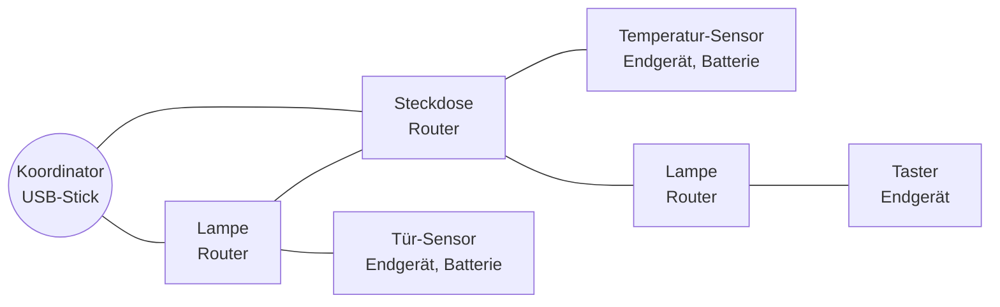
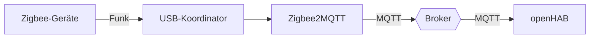
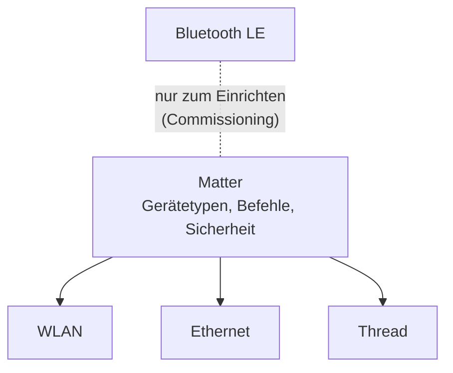

# 📡 Smart-Home-Funkstandards

Viele Smart-Home-Geräte sind nicht per WLAN oder Kabel im Netz, sondern funken über **eigene Standards** wie **Zigbee**, **Z-Wave** oder **Thread**. Sie brauchen ein **Gateway** (Koordinator, Controller, Border Router), das die Brücke ins IP-Netz und zu openHAB schlägt. Dieses Kapitel gibt einen Überblick – und erklärt, wo **Matter** ins Bild passt.

<!-- TOC -->
## Inhaltsverzeichnis

- [Überblick](#überblick)
- [Wichtige Begriffe](#wichtige-begriffe)
  - [Mesh-Netzwerk](#mesh-netzwerk)
  - [Anlernen (Pairing / Inklusion)](#anlernen-pairing--inklusion)
- [Zigbee](#zigbee)
- [Z-Wave](#z-wave)
- [Thread](#thread)
- [Matter](#matter)
- [Welcher Standard wofür?](#welcher-standard-wofür)
- [Fehlersuche bei Funkgeräten](#fehlersuche-bei-funkgeräten)
<!-- /TOC -->

## Überblick

| Standard | Frequenz (EU) | Topologie | IP-basiert | Typische Geräte | Anbindung an openHAB |
| --- | --- | --- | --- | --- | --- |
| **WLAN** | 2,4 / 5 GHz | Stern (Access Point) | ✅ | Steckdosen, Kameras, Beamer, ESP-Eigenbauten | Direkt (HTTP, MQTT, herstellerspezifisch) |
| **Zigbee** | 2,4 GHz | **Mesh** | ❌ | Lampen, Sensoren, Taster, Thermostate | Zigbee-Stick + Zigbee-Binding oder **Zigbee2MQTT** |
| **Z-Wave** | **868 MHz** | **Mesh** | ❌ | Rollladen, Schalter, Schlösser, Sensoren | Z-Wave-Stick + Z-Wave-Binding (oder Z-Wave JS UI) |
| **Thread** | 2,4 GHz | **Mesh** | ✅ (IPv6) | Neuere Sensoren, Lampen, Schalter (meist mit Matter) | Über einen **Thread Border Router** + Matter |
| **Bluetooth LE** | 2,4 GHz | Punkt-zu-Punkt (Mesh optional) | ❌ | Thermometer, Tracker, Thermostate | Bluetooth-Binding, BLE-Gateways (z. B. ESPHome-Proxy) |
| **EnOcean** | 868 MHz | Stern | ❌ | **Batterielose** Taster und Sensoren (Energy Harvesting) | EnOcean-Stick + Binding |
| **KNX RF** / **Homematic IP** | 868 MHz | proprietär | ❌ | Gebäudetechnik, Heizung | Herstellereigene Zentrale + Binding |
| **433 MHz** | 433 MHz | unidirektional | ❌ | Günstige Funksteckdosen, Wetterstationen | SDR/RFLink – unsicher, keine Rückmeldung |

---

## Wichtige Begriffe

### Mesh-Netzwerk

In einem **Mesh** leiten Geräte die Nachrichten anderer Geräte weiter. Je mehr Geräte, desto **größer die Reichweite** und desto **robuster** das Netz.

| Rolle | Aufgabe | Beispiele |
| --- | --- | --- |
| **Koordinator / Controller** | Bildet das Netz, verwaltet Geräte, Brücke zum Server | USB-Stick am Raspberry Pi oder Server |
| **Router / Repeater** | Leitet weiter, **dauerhaft mit Strom versorgt** | Lampen, Steckdosen, Unterputz-Aktoren |
| **Endgerät** | Leitet **nicht** weiter, schläft meist (Batterie) | Sensoren, Taster |

> **Praxis:** Batteriegeräte verlängern das Mesh **nicht**. Wer Reichweitenprobleme hat, braucht mehr **netzbetriebene** Geräte dazwischen.

### Anlernen (Pairing / Inklusion)

Ein neues Gerät muss dem Netz **bekannt gemacht** werden: Koordinator in den Anlernmodus versetzen, dann am Gerät einen Knopf drücken, es zurücksetzen oder einen QR-Code scannen. Bei Z-Wave heißt das **Inklusion** bzw. **Exklusion**.

> Im Labor: Jedes angelernte Gerät **sofort dokumentieren** (Name, Ort, Netzadresse/IEEE-Adresse, Batterietyp) und in openHAB mit einem sprechenden Namen versehen – wie bei der [DHCP-Reservierung](../Best%20Practices/DHCP.md) für WLAN-Geräte.

---

## Zigbee

* Basiert auf **IEEE 802.15.4**, 2,4 GHz, Mesh, sehr stromsparend.
* Herausgegeben von der **Connectivity Standards Alliance (CSA)**, vormals Zigbee Alliance.
* Sehr verbreitet und günstig (Philips Hue, IKEA, Aqara, viele Marken).
* **Interoperabilität:** Theoretisch standardisiert, praktisch nutzen viele Hersteller eigene Erweiterungen. Herstellerunabhängige Lösungen wie **Zigbee2MQTT** unterstützen deshalb Tausende Geräte individuell.
* **Funkkanäle:** Zigbee teilt sich das 2,4-GHz-Band mit **WLAN**. Zigbee-Kanal und WLAN-Kanäle sollten sich möglichst wenig überlappen (z. B. Zigbee-Kanal 25 bei WLAN auf Kanal 1–6). Den USB-Stick mit einem **Verlängerungskabel** vom Rechner weg platzieren – USB 3.0 stört 2,4 GHz deutlich.

**Zigbee2MQTT im Labor:**

Vorteil: Geräte erscheinen als MQTT-Topics und lassen sich von **jedem** System nutzen (→ [Best Practice MQTT](../Best%20Practices/MQTT.md)).

---

## Z-Wave

* Funkt im **Sub-GHz-Bereich** (in Europa **868,42 MHz**) – **keine Störungen durch WLAN**, bessere Durchdringung von Wänden.
* **Regionale Frequenzen:** Ein US-Gerät (908 MHz) funktioniert **nicht** an einem EU-Controller. Beim Kauf auf die Region achten!
* Strengere **Zertifizierung** als Zigbee – Geräte verschiedener Hersteller funktionieren meist zuverlässig zusammen.
* Maximal **232 Geräte** pro Netz (Z-Wave Long Range: mehr).
* **Security S2** verschlüsselt die Kommunikation; beim Anlernen wird dafür ein PIN/DSK abgefragt.
* Tendenziell **teurer** als Zigbee.

---

## Thread

* Ebenfalls **IEEE 802.15.4**, 2,4 GHz, Mesh – aber im Gegensatz zu Zigbee **IP-basiert (IPv6)**. Jedes Gerät hat eine eigene IPv6-Adresse.
* Ein **Thread Border Router** verbindet das Thread-Mesh mit dem normalen (WLAN/Ethernet-)Netz. Border Router stecken z. B. in Apple HomePod/TV, Google Nest Hub, manchen Routern – oder als eigener Stick (OpenThread Border Router).
* Thread definiert **nur das Netzwerk**, nicht die Anwendungsebene. Darüber läuft in der Regel **Matter**.

---

## Matter

**Matter** ist **kein Funkstandard**, sondern ein **Anwendungsprotokoll** – eine gemeinsame Sprache für Smart-Home-Geräte, entwickelt von der CSA zusammen mit Apple, Google, Amazon, Samsung und vielen weiteren (Version 1.0 im Jahr 2022).

| Eigenschaft | Bedeutung |
| --- | --- |
| **Transport** | Über **WLAN**, **Ethernet** oder **Thread** – immer IP-basiert |
| **Lokal** | Steuerung funktioniert **ohne Cloud** im lokalen Netz |
| **Multi-Admin** | Ein Gerät kann gleichzeitig mit mehreren Systemen verbunden sein (z. B. Apple Home **und** openHAB) |
| **Einrichtung** | Per QR-Code oder Zahlencode, meist über Bluetooth LE |
| **Brücken** | Bestehende Zigbee/Z-Wave-Systeme können als **Matter-Bridge** ihre Geräte freigeben |

openHAB kann Matter-Geräte einbinden und eigene Items als Matter-Geräte bereitstellen; der Umfang hängt von der openHAB-Version und dem Matter-Binding ab – vor dem Einsatz die aktuelle Dokumentation prüfen.

> **Einordnung:** Matter verspricht, das „Welcher Standard passt zu welchem System?“-Problem zu lösen. In der Praxis unterstützen viele Geräte erst einen Teil der Gerätetypen, und Zigbee/Z-Wave bleiben für die nächsten Jahre weit verbreitet. Im Labor sind deshalb **alle** Standards relevant.

---

## Welcher Standard wofür?

| Anforderung | Gute Wahl |
| --- | --- |
| Günstige Sensoren in großer Zahl | Zigbee |
| Zuverlässige Aktoren, wenig Funkstörungen, Altbau | Z-Wave |
| Herstellerübergreifend, zukunftsorientiert | Matter (über Thread oder WLAN) |
| Batterielose Taster | EnOcean |
| Eigenbau mit ESP32 | WLAN + MQTT, ggf. ESPHome |
| Geräte mit viel Datenverkehr (Kamera, Beamer, TV) | WLAN oder Ethernet |

---

## Fehlersuche bei Funkgeräten

* **Gerät reagiert unzuverlässig:** Mesh-Karte ansehen (Zigbee2MQTT und Z-Wave JS bieten Netzwerkkarten), Repeater ergänzen, Störquellen (USB 3.0, WLAN-Kanal, Metall) prüfen.
* **Batteriegerät meldet sich nicht:** Endgeräte schlafen. Konfigurationsänderungen werden oft erst beim nächsten Aufwachen übernommen – manche Geräte muss man per Knopfdruck wecken.
* **Nach Umzug des Koordinators geht nichts mehr:** Das Netz hängt an der Koordinator-Hardware bzw. deren Datenbank. **Backup** der Netzwerkdaten (Zigbee2MQTT-Datenverzeichnis, Z-Wave-NVM) ist Pflicht (→ [Backup-Strategien](../Backup-Strategien/README.md)).
* **Funkverkehr analysieren:** Mit einem zweiten Stick als **Sniffer** und **Wireshark** lässt sich der Zigbee-/Thread-Verkehr mitschneiden (→ [Debugging-Werkzeuge](../Debugging/Werkzeuge.md)).

---
