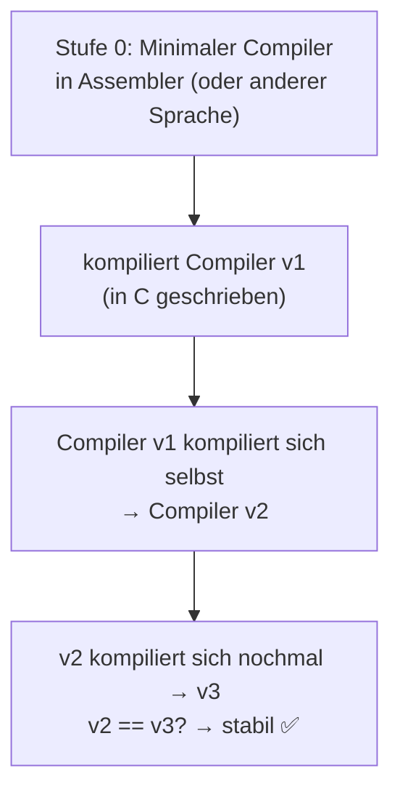

# 👢 Bootstrapping

**Bootstrapping** bezeichnet einen Vorgang, bei dem sich ein System **aus einem minimalen Anfangszustand selbst in einen vollständigen Zustand bringt** – ohne (viel) Hilfe von außen.

<!-- TOC -->
## Inhaltsverzeichnis

- [Herkunft des Begriffs](#herkunft-des-begriffs)
- [Bedeutungen in der IT](#bedeutungen-in-der-it)
- [Der Bootvorgang](#der-bootvorgang)
- [Compiler-Bootstrapping – das Henne-Ei-Problem](#compiler-bootstrapping--das-henne-ei-problem)
- [Bootstrap-Skripte für Projekte](#bootstrap-skripte-für-projekte)
- [Bootstrapping neuer Geräte mit Ansible](#bootstrapping-neuer-geräte-mit-ansible)
<!-- /TOC -->

## Herkunft des Begriffs

Ein *bootstrap* ist die **Schlaufe hinten am Stiefel**, an der man ihn anzieht. Die englische Redewendung *„to pull oneself up by one's bootstraps“* (sich an den eigenen Stiefelschlaufen hochziehen) beschrieb im 19. Jahrhundert ursprünglich etwas **Unmögliches** – wie im Deutschen **Münchhausen**, der sich am eigenen Schopf aus dem Sumpf zieht. Später wurde daraus „aus eigener Kraft etwas erreichen“.

In der Informatik passt das Bild genau: Ein Computer braucht ein Programm, um Programme zu laden – aber wie lädt er das **erste**? Von *bootstrapping* kommt auch das Wort **booten**.

---

## Bedeutungen in der IT

| Kontext | Bedeutung | Beispiel |
| --- | --- | --- |
| **Booten eines Rechners** | Kleines Programm lädt größeres Programm lädt Betriebssystem | Firmware → Bootloader → Kernel → init |
| **Compiler-Bootstrapping** | Ein Compiler wird in **seiner eigenen Sprache** geschrieben | GCC kompiliert GCC, Rust-Compiler in Rust |
| **Bootstrap-Skript** | Skript, das eine Entwicklungs-/Laufzeitumgebung einrichtet | `scripts/bootstrap.sh`, `get-pip.py` |
| **Server-/Cluster-Bootstrap** | Erster Knoten/erste Konfiguration, damit sich der Rest automatisch einrichtet | `kubeadm init`, Ansible-Bootstrap-Playbook |
| **Statistik** | Resampling-Verfahren (Ziehen mit Zurücklegen aus der eigenen Stichprobe) | Konfidenzintervalle |
| **Startup-Gründung** | Firma ohne externes Kapital aufbauen | „bootstrapped company“ |
| **Bootstrap (Framework)** | CSS/JS-Framework von Twitter (2011), Name spielt auf „schneller Start“ an | `class="btn btn-primary"` |

---

## Der Bootvorgang


Jede Stufe ist **gerade groß genug**, um die nächste zu laden. Beim klassischen BIOS-Boot mussten die ersten Anweisungen sogar in die **446 Byte** Code-Bereich des Master Boot Record (MBR) passen.

**Nützliche Befehle:**

```bash
systemd-analyze                 # how long did booting take?
systemd-analyze blame           # which service was slowest?
journalctl -b                   # log of the current boot
journalctl -b -1                # log of the previous boot (after crash)
```

---

## Compiler-Bootstrapping – das Henne-Ei-Problem

Wie kompiliert man einen C-Compiler, der in C geschrieben ist, wenn es noch keinen C-Compiler gibt?



GCC macht genau das bei jedem Build in **drei Stufen** (stage1–3) und vergleicht die Ergebnisse. Siehe auch [Compiler & Build](../Compiler%20%26%20Build/README.md).

> **Exkurs „Trusting Trust“:** Ken Thompson zeigte 1984, dass ein manipulierter Compiler eine Hintertür in jedes damit kompilierte Programm – und in neue Versionen **seiner selbst** – einbauen kann, ohne dass sie im Quellcode sichtbar ist. Deshalb gibt es heute **Reproducible Builds** und Projekte wie *bootstrappable.org*.

---

## Bootstrap-Skripte für Projekte

Ein Bootstrap-Skript bringt ein frisch geklontes Repository mit **einem Befehl** in einen lauffähigen Zustand. Das spart neuen Hiwis und Praktikanten viele Stunden.

```bash
#!/usr/bin/env bash
# scripts/bootstrap.sh - set up the development environment
set -euo pipefail
cd "$(dirname "$0")/.."

echo "==> checking prerequisites"
command -v python3 >/dev/null || { echo "python3 missing"; exit 1; }

echo "==> creating virtual environment"
[ -d .venv ] || python3 -m venv .venv
# shellcheck disable=SC1091
source .venv/bin/activate

echo "==> installing dependencies"
pip install --upgrade pip
pip install -e ".[dev]"

echo "==> creating local config"
[ -f config/local.yaml ] || cp config/example.yaml config/local.yaml

echo "==> running smoke test"
pytest -q tests/test_smoke.py

echo "Done. Activate with: source .venv/bin/activate"
```

Eigenschaften eines guten Bootstrap-Skripts:

* [ ] **Idempotent:** Mehrfaches Ausführen schadet nicht (prüft, ob Schritte schon erledigt sind).
* [ ] Bricht bei Fehlern sofort ab (`set -euo pipefail`).
* [ ] Überschreibt **keine** lokalen Konfigurationen oder Secrets.
* [ ] Endet mit einem kurzen Test, der beweist, dass alles funktioniert.
* [ ] Ist in der README dokumentiert.

---

## Bootstrapping neuer Geräte mit Ansible

Ein frisch installierter Raspberry Pi hat noch keinen Ansible-Benutzer, keine SSH-Keys und vielleicht kein Python. Ein **Bootstrap-Playbook** erledigt diese Grundausstattung einmalig – danach übernehmen die normalen Rollen (→ [Best Practice Ansible](../Best%20Practices/Ansible.md)).

```yaml
# bootstrap.yml - run once with password auth:
#   ansible-playbook -i inventory.ini bootstrap.yml -l pi-new -k -K
- hosts: all
  gather_facts: false
  become: true
  tasks:
    - name: Ensure python3 is present (raw, works without python)
      ansible.builtin.raw: test -e /usr/bin/python3 || (apt-get update && apt-get install -y python3)
      changed_when: false

    - name: Create ansible user
      ansible.builtin.user:
        name: ansible
        groups: sudo
        append: true
        shell: /bin/bash

    - name: Deploy SSH key
      ansible.posix.authorized_key:
        user: ansible
        key: "{{ lookup('file', '~/.ssh/id_ed25519.pub') }}"

    - name: Passwordless sudo for ansible
      ansible.builtin.copy:
        dest: /etc/sudoers.d/ansible
        content: "ansible ALL=(ALL) NOPASSWD: ALL\n"
        mode: "0440"
        validate: visudo -cf %s
```

Der Parameter `-k` (Passwortabfrage für SSH) benötigt **sshpass** auf dem Steuerrechner (→ [Best Practice SSH](../Best%20Practices/SSH.md)).

---
