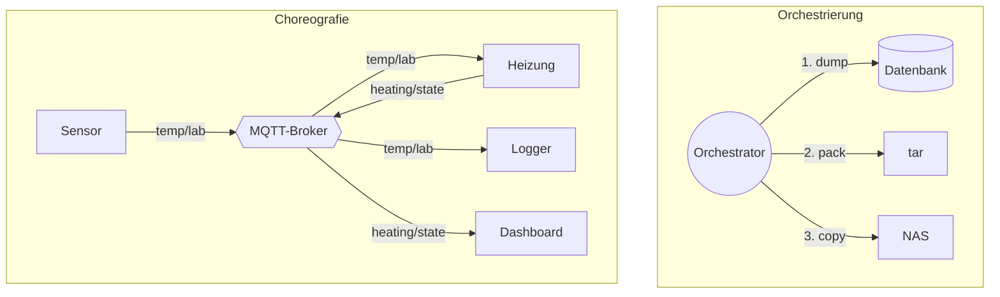

# 🎼 Orchestrierung & Choreografie

Sobald ein System aus **mehreren Komponenten** besteht (Container, VMs, Dienste, Geräte), stellt sich die Frage: **Wer sorgt dafür, dass alles im richtigen Moment, in der richtigen Reihenfolge und in der richtigen Anzahl läuft?** Dafür gibt es zwei Grundansätze.

<!-- TOC -->
## Inhaltsverzeichnis

- [Die Metapher](#die-metapher)
- [Orchestrierung in der Praxis](#orchestrierung-in-der-praxis)
  - [Beispiel: Docker Compose](#beispiel-docker-compose)
  - [Deklarativ vs. imperativ](#deklarativ-vs-imperativ)
- [Choreografie in der Praxis](#choreografie-in-der-praxis)
- [Wann was?](#wann-was)
- [Verwandte Begriffe](#verwandte-begriffe)
<!-- /TOC -->

## Die Metapher

| | Orchestrierung | Choreografie |
| --- | --- | --- |
| Bild | **Dirigent** vor einem Orchester | **Tanzgruppe** ohne Chef |
| Steuerung | **zentral** – einer gibt den Takt vor | **dezentral** – jeder kennt seine Schritte und reagiert auf die anderen |
| Kommunikation | Befehle: „Du jetzt!“ | Ereignisse: „Ich bin fertig.“ |
| Überblick | Ablauf an **einer** Stelle sichtbar | Ablauf ergibt sich aus dem Zusammenspiel |
| Ausfall | Dirigent fällt aus → alles steht | Einzelne fallen aus → Rest kann weitermachen |
| Design Pattern | [Mediator](../Design%20Pattern/Verhaltensmuster/Mediator.md), [Command](../Design%20Pattern/Verhaltensmuster/Command.md) | [Observer](../Design%20Pattern/Verhaltensmuster/Observer.md), Publish-Subscribe |



---

## Orchestrierung in der Praxis

**Orchestrierung** heißt im IT-Betrieb meist: **automatisiertes Bereitstellen, Starten, Skalieren, Überwachen und Neustarten** vieler Komponenten nach einer **deklarativen Beschreibung** („So soll der Zielzustand aussehen“).

| Werkzeug | Orchestriert | Beschreibung | Typischer Einsatz |
| --- | --- | --- | --- |
| **Docker Compose** | Container auf **einem** Host | `compose.yaml` | Laborrechner: openHAB + Mosquitto + InfluxDB + Grafana |
| **Kubernetes (K8s)** | Container auf **vielen** Hosts | YAML-Manifeste, Helm-Charts | Produktion, Hochverfügbarkeit |
| **K3s / MicroK8s** | Leichtgewichtiges Kubernetes | wie K8s | Raspberry-Pi-Cluster, Edge |
| **Ansible** | Konfiguration vieler **Rechner** | Playbooks, Rollen | Laborgeräte einrichten (→ [Best Practice Ansible](../Best%20Practices/Ansible.md)) |
| **Terraform / OpenTofu** | Infrastruktur (VMs, Netze) | HCL | Proxmox-/Cloud-VMs anlegen |
| **Apache Airflow, Prefect** | Daten-Workflows | Python-DAGs | ETL, Datenpipelines |
| **GitHub Actions / GitLab CI** | Build- und Deploy-Schritte | YAML-Workflows | CI/CD |
| **ROS 2 Launch** | ROS-Nodes | Launch-Dateien (Python/XML/YAML) | Roboter starten |
| **systemd** | Dienste auf **einem** Linux-System | Unit-Dateien | Abhängigkeiten `After=`, `Requires=` |

### Beispiel: Docker Compose

```yaml
# compose.yaml
services:
  mosquitto:
    image: eclipse-mosquitto:2
    restart: unless-stopped
    ports: ["8883:8883"]
    volumes:
      - ./mosquitto/config:/mosquitto/config:ro
      - mosquitto-data:/mosquitto/data

  openhab:
    image: openhab/openhab:5.0.0          # pin versions instead of :latest
    restart: unless-stopped
    depends_on:
      mosquitto:
        condition: service_started
    network_mode: host
    volumes:
      - ./openhab/conf:/openhab/conf
      - openhab-userdata:/openhab/userdata

volumes:
  mosquitto-data:
  openhab-userdata:
```

```bash
docker compose up -d          # create and start everything in the right order
docker compose ps             # status
docker compose logs -f openhab
docker compose pull && docker compose up -d   # update
```

### Deklarativ vs. imperativ

| Imperativ („Wie?“) | Deklarativ („Was?“) |
| --- | --- |
| `docker run …`, dann `docker network connect …` | `compose.yaml` beschreibt Zielzustand |
| Shell-Skript mit 20 Schritten | Ansible-Task `state: present` |
| Reihenfolge und Fehlerfälle selbst behandeln | Werkzeug berechnet die nötigen Schritte |

Deklarative Werkzeuge sind meist **idempotent**: Mehrfaches Ausführen führt zum selben Ergebnis. Das ist die Grundlage zuverlässiger Orchestrierung.

---

## Choreografie in der Praxis

Bei der **Choreografie** gibt es keinen zentralen Ablaufplan. Jede Komponente **veröffentlicht Ereignisse** und **reagiert** auf Ereignisse anderer.

* **MQTT:** Sensoren publizieren, Aktoren und Logger abonnieren (→ [Best Practice MQTT](../Best%20Practices/MQTT.md)).
* **ROS-Topics:** Nodes kommunizieren über Topics, nicht über direkte Aufrufe.
* **Microservices mit Event-Bus:** Kafka, RabbitMQ, NATS.
* **Webhooks:** GitHub meldet „push“, CI reagiert.

```python
# Choreography with MQTT: the heating reacts on its own to temperature events.
# Requires: pip install paho-mqtt (2.x) and a running broker.
import paho.mqtt.client as mqtt

def on_message(client, userdata, msg):
    temperature = float(msg.payload)
    client.publish("lab/heating/cmd", "OFF" if temperature > 22 else "ON")

client = mqtt.Client(mqtt.CallbackAPIVersion.VERSION2, client_id="heating-controller")
client.on_message = on_message
client.username_pw_set("heating", "secret-from-env")
client.tls_set(ca_certs="certs/broker_ca.crt")
client.connect("broker.lab.local", 8883)
client.subscribe("lab/temperature")
client.loop_forever()
```

---

## Wann was?

| Situation | Empfehlung |
| --- | --- |
| Feste Abfolge mit klaren Schritten (Backup, Deployment, Installation) | **Orchestrierung** |
| Fehlerbehandlung und Rollback müssen zentral nachvollziehbar sein | **Orchestrierung** |
| Viele unabhängige Geräte/Dienste, die auf Zustände reagieren | **Choreografie** |
| Komponenten sollen ohne Änderung anderer hinzugefügt werden | **Choreografie** |
| Smart Home im Labor | **Beides:** Choreografie über MQTT im Betrieb, Orchestrierung (Ansible/Compose) für Einrichtung und Updates |

---

## Verwandte Begriffe

| Begriff | Bedeutung |
| --- | --- |
| **Provisionierung** | Ressourcen bereitstellen (VM anlegen, Betriebssystem installieren) |
| **Konfigurationsmanagement** | Rechner in einen definierten Zustand bringen und dort halten (Ansible, Puppet, Salt) |
| **Deployment** | Software auf Zielsysteme ausrollen |
| **Infrastructure as Code (IaC)** | Infrastruktur als versionierte Textdateien beschreiben |
| **Saga** | Lang laufende, verteilte Transaktion mit Ausgleichsschritten – als Orchestrierung oder Choreografie umsetzbar |
| **Service Mesh** | Infrastruktur-Schicht für Kommunikation zwischen Microservices (Istio, Linkerd) |

---
