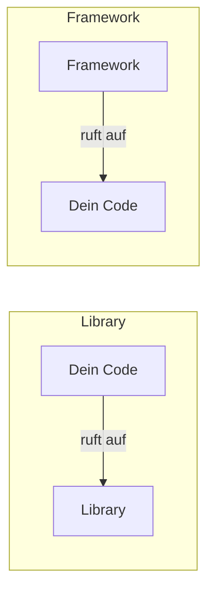

# 🧩 Software-Konzepte

Begriffe, die im Alltag ständig fallen, aber selten sauber erklärt werden. Viele davon klingen ähnlich (Template, Skeleton, Scaffold, Boilerplate) – sie meinen aber Unterschiedliches. Dieser Ordner grenzt sie voneinander und von den [Design Pattern](../Design%20Pattern/README.md) ab.

<!-- TOC -->
## Inhaltsverzeichnis

- [Übersicht](#übersicht)
- [Begriffe im Vergleich](#begriffe-im-vergleich)
  - [Framework vs. Library](#framework-vs-library)
- [Wie hängt alles zusammen?](#wie-hängt-alles-zusammen)
<!-- /TOC -->

## Übersicht

| Dokument | Inhalt |
| --- | --- |
| [Templates & Templating](Templates%20%26%20Templating.md) | Vorlagen mit Platzhaltern: Jinja2, Ansible-Templates, HTML-Templates, Projekt-Templates, C++-Templates/Generics |
| [Skeleton, Boilerplate & Scaffolding](Skeleton%2C%20Boilerplate%20%26%20Scaffolding.md) | Grundgerüste für Projekte, wiederkehrender Pflichtcode, Code-Generatoren (Cookiecutter, `ansible-galaxy init`, `npm create`) |
| [Bootstrapping](Bootstrapping.md) | Sich „an den eigenen Stiefelriemen hochziehen“: Booten, Compiler-Bootstrapping, Bootstrap-Skripte, Cluster-Bootstrap, Bootstrap (CSS) |
| [Refactoring & Migration](Refactoring%20%26%20Migration.md) | Altprojekte sicher modernisieren: Refactoring vs. Migration vs. Rewrite, Charakterisierungstests, Python 2 → 3, Python-2-Teile kapseln, openHAB-Rule-Engines migrieren |
| [Orchestrierung & Choreografie](Orchestrierung%20%26%20Choreografie.md) | Zentrale vs. dezentrale Koordination: Kubernetes, Docker Compose, Ansible, Workflows, Event-getriebene Systeme |

---

## Begriffe im Vergleich

| Begriff | Kurz gesagt | Analogie | Ergebnis |
| --- | --- | --- | --- |
| **Design Pattern** | Bewährte **Idee** für ein wiederkehrendes Problem | Bauweise „Fachwerkhaus“ | Kein Code, sondern Lösungsprinzip |
| **Template** | Vorlage mit **Platzhaltern**, die gefüllt werden | Serienbrief | Fertiges Dokument/Datei |
| **Skeleton** | Minimales, lauffähiges **Grundgerüst** | Rohbau | Leeres, aber funktionsfähiges Projekt |
| **Boilerplate** | Immer gleicher **Pflichtcode** | Kleingedrucktes im Vertrag | Code, den man „halt schreiben muss“ |
| **Scaffolding** | **Werkzeug**, das Gerüste/Code generiert | Baugerüst | Generierte Dateien |
| **Bootstrapping** | Ein System **aus sich selbst heraus** starten/aufbauen | Münchhausen am eigenen Schopf | Laufendes System |
| **Orchestrierung** | **Zentrale** Steuerung vieler Komponenten | Dirigent | Koordinierter Ablauf |
| **Choreografie** | **Dezentrale** Koordination über Ereignisse | Tanzgruppe | Koordinierter Ablauf ohne Chef |
| **Framework** | Gerüst, das **deinen** Code aufruft | Fertighaus-Bausatz | Inversion of Control |
| **Library** | Sammlung von Funktionen, die **du** aufrufst | Werkzeugkasten | Wiederverwendung |

### Framework vs. Library

Der wichtigste Unterschied ist die **Kontrollrichtung**:

Bei einer Library behältst du die Kontrolle. Bei einem Framework gibst du sie ab („Don't call us, we'll call you“ – **Inversion of Control**, vgl. [Template Method](../Design%20Pattern/Verhaltensmuster/Template%20Method.md)). Flask, Django, ROS, openHAB-Regeln und Ansible sind Frameworks; `requests`, `numpy` und `paho-mqtt` sind Libraries.

---

## Wie hängt alles zusammen?

Ein typischer Projektstart im Labor:

1. **Scaffolding**-Tool ausführen (`cookiecutter`, `ansible-galaxy init`, `ros2 pkg create`) …
2. … erzeugt ein **Skeleton** aus einem **Template** …
3. … das bereits den nötigen **Boilerplate** enthält.
4. Ein **Bootstrap**-Skript installiert Abhängigkeiten und richtet die Umgebung ein.
5. Im Code werden **Design Pattern** eingesetzt.
6. Im Betrieb übernimmt **Orchestrierung** (Ansible, Docker Compose, Kubernetes) das Ausrollen und Starten.

---
