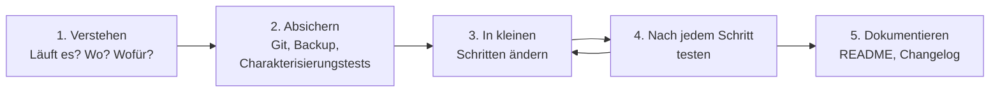
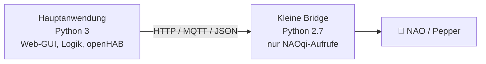

# 🔧 Refactoring & Migration

In einem Labor, das über viele Jahre wächst, gibt es immer **Altprojekte**: Code aus Abschlussarbeiten, Skripte für Python 2.7, Rules für eine Rule Engine, die es nicht mehr gibt, Anwendungen, die „irgendwie“ laufen. Dieses Kapitel erklärt, wie man solchen Code sicher modernisiert.

<!-- TOC -->
## Inhaltsverzeichnis

- [Begriffe](#begriffe)
- [Vorgehen](#vorgehen)
  - [1. Verstehen](#1-verstehen)
  - [2. Absichern](#2-absichern)
  - [3.–4. In kleinen Schritten ändern und testen](#34-in-kleinen-schritten-ändern-und-testen)
  - [5. Dokumentieren](#5-dokumentieren)
- [Typische Refactorings für Laborprojekte](#typische-refactorings-für-laborprojekte)
- [Python 2 → Python 3](#python-2--python-3)
  - [Die wichtigsten Unterschiede](#die-wichtigsten-unterschiede)
  - [Werkzeuge](#werkzeuge)
  - [Wenn Python 2 bleiben muss: kapseln](#wenn-python-2-bleiben-muss-kapseln)
- [openHAB: Rule Engines migrieren](#openhab-rule-engines-migrieren)
- [Wann neu schreiben?](#wann-neu-schreiben)
- [Checkliste](#checkliste)
<!-- /TOC -->

## Begriffe

| Begriff | Bedeutung | Ändert das Verhalten? |
| --- | --- | --- |
| **Refactoring** | Innere Struktur verbessern, ohne das **äußere Verhalten** zu ändern (Namen, Aufteilung, Duplikate entfernen) | Nein |
| **Migration** | Auf eine neue Plattform, Sprache, Version oder Bibliothek umstellen (Python 2 → 3, Jython → Python 3 Scripting) | Soll gleich bleiben |
| **Rewrite** | Neu schreiben | Oft ja |
| **Upgrade** | Abhängigkeiten auf neuere Versionen bringen | Möglich |
| **Deprecation** | Etwas als veraltet kennzeichnen, mit Hinweis auf den Nachfolger | – |
| **Legacy Code** | Code, den man ändern muss, aber nicht gut versteht – oft ohne Tests | – |

> Martin Fowler: *Refactoring* ist eine Folge kleiner, verhaltenserhaltender Schritte. Wer gleichzeitig Funktionen hinzufügt, betreibt kein Refactoring mehr – und weiß hinterher nicht, ob ein Fehler aus dem Umbau oder der neuen Funktion kommt.

---

## Vorgehen



### 1. Verstehen

* Wird das Projekt **noch gebraucht**? Gibt es inzwischen eine eingebaute Funktion oder einen Nachfolger? Dann ist **Archivieren** oft besser als Migrieren (→ [Repositories pflegen & archivieren](../Best%20Practices/Repositories%20pflegen%20%26%20archivieren.md)).
* Wo läuft es (Gerät, VM, Container), wie wird es gestartet (Cron, systemd, Exec Binding, von Hand), welche Abhängigkeiten hat es?
* Welche Version des Codes läuft **tatsächlich**? Bei mehreren Varianten im Repository: auf dem Gerät nachsehen und mit dem Repository vergleichen (`diff`, `git log`).

### 2. Absichern

* Alles unter **Git** – auch den Zustand, der gerade auf dem Gerät liegt, als eigenen Commit („Stand auf pi-xyz am …“).
* **Charakterisierungstests** (*characterization tests*): Tests, die das **aktuelle** Verhalten festhalten – auch wenn es seltsam ist. Sie zeigen später, ob der Umbau etwas verändert hat.
* Backup bzw. Snapshot des Systems, auf dem das Programm läuft.

### 3.–4. In kleinen Schritten ändern und testen

* Ein Schritt = ein Commit = ein Test.
* Erst **migrieren** (gleiches Verhalten auf neuer Plattform), dann **refactoren**, dann **neue Funktionen**.

### 5. Dokumentieren

* README: unterstützte Versionen (Python, openHAB), Installation, Start, Konfiguration.
* Changelog oder Release mit Hinweis auf die Migration.

---

## Typische Refactorings für Laborprojekte

| Problem | Lösung |
| --- | --- |
| IP-Adressen, Item-Namen, Passwörter im Code | In eine Konfigurationsdatei (YAML/TOML/`.env`) auslagern |
| Ein Skript mit 800 Zeilen | In Module und Funktionen aufteilen |
| Mehrere Varianten desselben Skripts im Repository (`test.py`, `test2.py`, `final.py`, `final_neu.py`) | Funktionierende Variante bestimmen, übrige in `archive/` verschieben oder löschen (Git hat die Historie) |
| `time.sleep()` in Schleifen statt Ereignissen | Auf MQTT, SSE oder Callbacks umstellen |
| Start „von Hand“ in einer offenen Konsole | systemd-Service bzw. Gunicorn/pm2 (→ [systemd-Services](../Linux%20%26%20Werkzeuge/systemd-Services.md), [Web-Server & Deployment](../Best%20Practices/Web-Server%20%26%20Deployment.md)) |
| Exec Binding mit beliebigen Befehlen | MQTT-Schnittstelle oder Whitelist (→ [Whitelist & Blacklist](../Zugriffskontrolle/Whitelist%20%26%20Blacklist.md)) |
| Keine Fehlerbehandlung | Logging, Timeouts, Reconnect (→ [Fehlermeldungen, Logging & Exceptions](../Code-Formatierung/Fehlermeldungen%2C%20Logging%20%26%20Exceptions.md)) |

---

## Python 2 → Python 3

Python 2 ist seit dem **1. Januar 2020** ohne Unterstützung. Einige Laborgeräte (z. B. die NAOqi-SDKs für **NAO** und **Pepper**) benötigen trotzdem noch Python 2.7 – dort hilft nur, den Python-2-Teil **so klein wie möglich** zu halten (siehe unten).

### Die wichtigsten Unterschiede

| Python 2 | Python 3 | Hinweis |
| --- | --- | --- |
| `print "Hallo"` | `print("Hallo")` | `print` ist eine Funktion |
| `str` = Bytes, `unicode` = Text | `str` = Text, `bytes` = Bytes | **Größte Fehlerquelle**: Netzwerk, Serielle Schnittstelle, Dateien liefern `bytes` |
| `5 / 2 == 2` | `5 / 2 == 2.5`, `5 // 2 == 2` | Ganzzahldivision mit `//` |
| `raw_input()` | `input()` | – |
| `dict.has_key(k)` | `k in dict` | – |
| `dict.iteritems()` | `dict.items()` | `keys()`/`values()`/`items()` liefern Views |
| `except Exception, e:` | `except Exception as e:` | – |
| `urllib2` | `urllib.request` bzw. besser `requests` | Viele Module wurden umbenannt |
| `xrange()` | `range()` | – |
| `"%s" % x` | f-Strings `f"{x}"` | `%` funktioniert noch, f-Strings sind lesbarer |

```python
# typical bytes/str issue when reading from a socket or serial port
data = sock.recv(1024)          # Python 3: bytes, e.g. b'POW=ON\r'
text = data.decode("ascii").strip()
sock.sendall(f"*pow=on#\r".encode("ascii"))
```

### Werkzeuge

* **`pyupgrade`** und **`ruff`** (Regelgruppe `UP`) modernisieren Syntax automatisch.
* `2to3` gibt es in neueren Python-Versionen **nicht mehr** (seit 3.13 entfernt).
* Danach immer **testen** – automatische Werkzeuge erkennen die `bytes`/`str`-Frage nicht zuverlässig.

### Wenn Python 2 bleiben muss: kapseln



Die Python-2-Bridge macht **nur** die Aufrufe, die das alte SDK erfordert, und bietet sie über eine einfache Schnittstelle (REST oder MQTT) an. Alles andere läuft in Python 3. So lässt sich die Bridge später austauschen (z. B. durch ROS 2), ohne die Hauptanwendung zu ändern – ein [Adapter](../Design%20Pattern/Strukturmuster/Adapter.md) bzw. [Proxy](../Design%20Pattern/Strukturmuster/Proxy.md) auf Prozessebene.

---

## openHAB: Rule Engines migrieren

| Von | Nach | Hinweise |
| --- | --- | --- |
| **Jython (Helper Libraries)** | **Python 3 Scripting** (GraalPy) | Andere API und andere Behandlung von Nebenläufigkeit; `sleep` in Rules und blockierende Abläufe besonders prüfen |
| **Rules DSL** | bleibt unterstützt | Für einfache Regeln weiterhin in Ordnung; kann parallel zu Python-Rules laufen |
| **Exec Action / Exec Binding mit Python-2-Skripten** | Python-3-Skript oder MQTT-Dienst | Pfad in `misc/exec.whitelist` aktualisieren |
| **HABApp** | HABApp (aktuelle Version) oder Python 3 Scripting | HABApp läuft als eigener Prozess – Versionen von HABApp und openHAB müssen zusammenpassen |

**Bewährtes Vorgehen:** Die alte Rule zunächst **parallel** und deaktiviert behalten, die neue Rule testen, erst dann die alte entfernen. Bei kritischen Abläufen (z. B. einer Labor-Demo) eine funktionierende Variante als **Notfallplan** bereithalten.

---

## Wann neu schreiben?

Ein Rewrite ist verlockend, aber riskant: Altes, hässliches Code enthält oft **jahrelang gesammelte Fehlerbehebungen**, die man beim Neuschreiben vergisst. Neu schreiben lohnt sich, wenn

* die Plattform wegfällt (z. B. Flash, eingestellte Bibliotheken),
* der Code klein ist und das Verhalten gut verstanden wird,
* die Anforderungen sich grundlegend geändert haben.

Andernfalls: schrittweise ersetzen (*Strangler Fig Pattern*) – neue Teile neben die alten stellen und die alten Stück für Stück abschalten.

---

## Checkliste

* [ ] Wird das Projekt noch gebraucht? Sonst archivieren.
* [ ] Aktuell laufenden Stand gesichert und in Git
* [ ] Abhängigkeiten und Startweg dokumentiert
* [ ] Charakterisierungstests oder zumindest ein manueller Testplan
* [ ] Erst migrieren, dann refactoren, dann erweitern
* [ ] Konfiguration und Geheimnisse aus dem Code entfernt
* [ ] Betrieb als Dienst (systemd, Gunicorn, pm2, Container)
* [ ] README mit unterstützten Versionen aktualisiert

---
