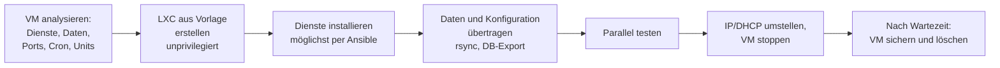

# 🖧 Proxmox: VMs und Container

**Proxmox Virtual Environment (PVE)** ist die Virtualisierungsplattform des Labors. Auf einem physischen Server laufen viele **virtuelle Maschinen (VMs)** und **Linux-Container (LXC)** – für openHAB, MQTT, Datenbanken, Docker, Asterisk, Windows und mehr. Gesichert wird mit dem **Proxmox Backup Server (PBS)**.

<!-- TOC -->
## Inhaltsverzeichnis

- [VM oder LXC?](#vm-oder-lxc)
  - [Privilegierte und unprivilegierte Container](#privilegierte-und-unprivilegierte-container)
- [Grundbegriffe](#grundbegriffe)
- [Wichtige Befehle](#wichtige-befehle)
- [Backups](#backups)
- [VMs umziehen](#vms-umziehen)
- [Von der VM zum LXC-Container](#von-der-vm-zum-lxc-container)
- [Checkliste für neue VMs und Container](#checkliste-für-neue-vms-und-container)
<!-- /TOC -->

## VM oder LXC?

| | Virtuelle Maschine (KVM/QEMU) | Linux-Container (LXC) |
| --- | --- | --- |
| **Prinzip** | Vollständig emulierter Rechner mit **eigenem Kernel** | Isolierte Umgebung, teilt sich den **Kernel des Hosts** |
| **Betriebssysteme** | Beliebig: Linux, Windows, BSD … | Nur Linux |
| **Ressourcen** | Mehr RAM/CPU-Overhead | Sehr sparsam, startet in Sekunden |
| **Isolation** | Stark | Gut, aber geringer (gemeinsamer Kernel) |
| **Kernel-Module, eigener Kernel** | ✅ | ❌ (nur, was der Host bereitstellt) |
| **Hardware durchreichen** | PCI/USB-Passthrough | Gerätedateien einbinden, aufwendiger |
| **Docker im Inneren** | ✅ problemlos | ⚠️ möglich (`nesting`), aber mit Einschränkungen |
| **Typisch im Labor** | Windows-VMs, Docker-VM, Systeme mit besonderen Anforderungen | MQTT-Broker, Web-Server, Datenbanken, kleine Python-Dienste |

**Faustregel:** Linux-Dienst ohne besondere Kernel- oder Hardware-Anforderungen → **LXC**. Alles andere → **VM**.

### Privilegierte und unprivilegierte Container

* **Unprivilegiert (empfohlen):** `root` im Container ist auf dem Host ein **normaler Benutzer** (UID-Mapping). Bricht jemand aus dem Container aus, hat er auf dem Host keine Root-Rechte.
* **Privilegiert:** `root` im Container ist `root` auf dem Host. Nur verwenden, wenn es zwingend nötig ist.

Wichtige Container-Optionen (*Optionen → Features*):

| Feature | Wofür |
| --- | --- |
| `nesting=1` | Container in Containern (z. B. Docker, systemd-Funktionen neuerer Distributionen) |
| `keyctl=1` | Für Docker in unprivilegierten Containern |
| `fuse=1`, `mount=nfs;cifs` | Bestimmte Dateisysteme im Container einhängen |

---

## Grundbegriffe

| Begriff | Bedeutung |
| --- | --- |
| **Knoten (Node)** | Ein physischer Proxmox-Server |
| **Cluster** | Mehrere Knoten mit gemeinsamer Verwaltung; ermöglicht Migration zwischen Knoten |
| **VMID** | Eindeutige Nummer jeder VM/jedes Containers (z. B. `105`) |
| **Storage** | Speicherort für Disks, ISOs, Vorlagen, Backups (lokal, LVM-Thin, ZFS, NFS, Ceph …) |
| **Template** | Vorlage, aus der neue VMs/Container geklont werden |
| **Snapshot** | Momentaufnahme einer VM auf demselben Storage – **kein Backup** |
| **vzdump** | Proxmox-Werkzeug für Backups |
| **PBS** | Proxmox Backup Server: dedupliziert, inkrementell, verifizierbar |

---

## Wichtige Befehle

Alles ist auch über die Weboberfläche (Port 8006) möglich. Auf der Kommandozeile des Knotens:

| Aufgabe | VM (`qm`) | Container (`pct`) |
| --- | --- | --- |
| Auflisten | `qm list` | `pct list` |
| Starten / Stoppen | `qm start 105` / `qm shutdown 105` | `pct start 205` / `pct shutdown 205` |
| Konfiguration anzeigen | `qm config 105` | `pct config 205` |
| Konsole | `qm terminal 105` (serielle Konsole) | `pct enter 205` |
| Snapshot | `qm snapshot 105 vor-update` | `pct snapshot 205 vor-update` |
| Autostart | `qm set 105 --onboot 1` | `pct set 205 --onboot 1` |
| Disk verschieben | `qm disk move 105 scsi0 <storage>` | `pct move-volume 205 rootfs <storage>` |

Konfigurationsdateien liegen unter `/etc/pve/qemu-server/<vmid>.conf` bzw. `/etc/pve/lxc/<vmid>.conf`.

---

## Backups

```bash
# backup of VM 105 to the storage "pbs" (Proxmox Backup Server), snapshot mode = no downtime
vzdump 105 --storage pbs --mode snapshot

# restore as new VM 115 (keep the original until the restore is tested)
qmrestore pbs:backup/vm/105/2026-10-01T02:00:00Z 115
pct restore 215 pbs:backup/ct/205/2026-10-01T02:00:00Z
```

* Regelmäßige Backups über **Rechenzentrum → Backup** als Job planen, mit Aufbewahrung (*Retention*, z. B. 7 täglich, 4 wöchentlich, 6 monatlich).
* Auf dem PBS **Verify-Jobs** einrichten – ein Backup, das sich nicht lesen lässt, ist keins.
* **Wiederherstellung regelmäßig testen** (→ [Wiederherstellung & Tests](../Backup-Strategien/Wiederherstellung%20%26%20Tests.md)).
* Snapshots sind praktisch vor Updates, ersetzen aber **kein** Backup: Sie liegen auf demselben Speicher.

---

## VMs umziehen

| Situation | Vorgehen |
| --- | --- |
| Anderer Storage, gleicher Knoten | Disk verschieben (`qm disk move`), auch im laufenden Betrieb |
| Anderer Knoten **im selben Cluster** | `qm migrate 105 <ziel-knoten>` – mit `--online` im laufenden Betrieb; bei lokalen Disks zusätzlich `--with-local-disks` |
| Anderer, **getrennter** Proxmox-Server | **Backup und Restore** über den PBS (robust) |
| Container | `pct migrate 205 <ziel-knoten>` (Container werden dabei kurz neu gestartet: `--restart`) |

**Checkliste für einen Umzug:**

* [ ] Aktuelles Backup vorhanden und Wiederherstellung getestet
* [ ] Abhängigkeiten bekannt (welche Dienste nutzen diese VM?)
* [ ] Durchgereichte Hardware (USB, PCI) und eingebundene ISOs entfernt bzw. notiert – sie verhindern die Live-Migration
* [ ] **MAC-Adresse** der Netzwerkkarte notiert – bei Neuanlage oder Restore als neue VMID kann sie sich ändern, dann greift die DHCP-Reservierung nicht mehr
* [ ] Nach dem Umzug: Netzwerk, Dienste, Autostart (`onboot`), Backup-Job, Monitoring, Ansible-Inventar geprüft
* [ ] Alte VM erst nach einer Wartezeit löschen

---

## Von der VM zum LXC-Container

Es gibt **keine automatische Umwandlung** einer VM in einen Container – die VM hat einen eigenen Kernel, Bootloader und virtuelle Hardware, ein Container nicht. Der Weg führt über einen **sauberen Neuaufbau**:



```bash
# list available templates and download one
pveam update
pveam available --section system | grep debian
pveam download local debian-12-standard_12.7-1_amd64.tar.zst

# create an unprivileged container
pct create 210 local:vztmpl/debian-12-standard_12.7-1_amd64.tar.zst \
    --hostname mqtt-broker --cores 1 --memory 512 --swap 512 \
    --rootfs local-lvm:8 \
    --net0 name=eth0,bridge=vmbr0,ip=dhcp \
    --unprivileged 1 --features nesting=1 --onboot 1
pct start 210

# copy data from the old VM into the new container (run on the container)
rsync -avz -e "ssh -p 2222" admin@old-vm:/etc/mosquitto/ /etc/mosquitto/
```

(Vorlagenname und Version mit `pveam available` prüfen – sie ändern sich mit jeder Debian-Version.)

**Analyse der VM vorher:**

```bash
systemctl list-units --type=service --state=running   # running services
sudo ss -tlnp                                          # listening ports
crontab -l; ls /etc/cron.d /etc/systemd/system/*.timer # scheduled jobs
df -h; du -sh /var/lib/* 2>/dev/null | sort -h | tail  # where is the data?
dpkg --get-selections | grep -v deinstall > packages.txt
```

**Eignet sich die VM für einen Container?**

| ✅ Gut geeignet | ⚠️ Prüfen | ❌ Besser VM bleiben |
| --- | --- | --- |
| Web-Server, Reverse Proxy | Dienste mit USB-Geräten | Windows |
| MQTT-Broker | VPN-Server (TUN/TAP) | Eigener Kernel, Kernel-Module |
| Datenbanken | Dienste, die viele Systemrechte brauchen | Docker-Host mit vielen Containern |
| Python-/Node-Dienste | NFS-/SMB-Server | Hohe Sicherheitsanforderungen an die Isolation |

---

## Checkliste für neue VMs und Container

* [ ] Sprechender Name/Hostname, VMID nach Labor-Schema
* [ ] Feste IP über **DHCP-Reservierung** (MAC notieren) (→ [DHCP](../Best%20Practices/DHCP.md))
* [ ] SSH mit Schlüssel, eigener Port (→ [SSH](../Best%20Practices/SSH.md))
* [ ] Im **Ansible-Inventar** eingetragen (→ [Ansible](../Best%20Practices/Ansible.md))
* [ ] Autostart (`onboot`) und Startreihenfolge gesetzt, wenn andere Dienste davon abhängen
* [ ] In einem **Backup-Job** enthalten
* [ ] Im Notizfeld (*Übersicht → Notizen*) Zweck, Ansprechperson und Link zur Dokumentation

---
