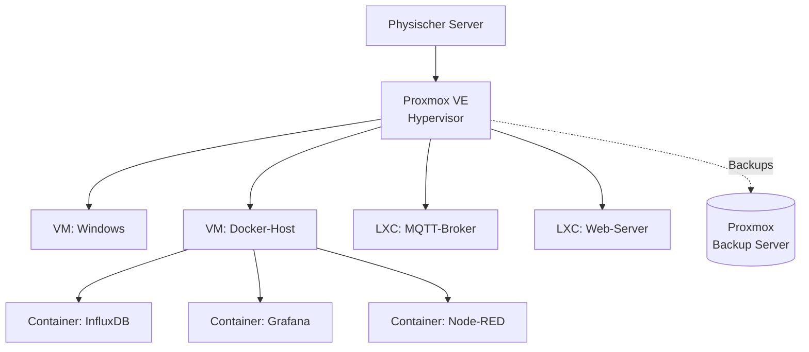

# 🖧 Virtualisierung

Fast alle Server-Dienste des Labors laufen virtualisiert: als **VMs** und **LXC-Container** unter **Proxmox** und als **Docker-Container** in einer eigenen Docker-VM. Dieser Ordner erklärt die Konzepte und wie wir sie betreiben.

<!-- TOC -->
## Inhaltsverzeichnis

- [Übersicht](#übersicht)
- [Ebenen im Überblick](#ebenen-im-überblick)
- [Verwandte Dokumente](#verwandte-dokumente)
<!-- /TOC -->

## Übersicht

| Dokument | Inhalt |
| --- | --- |
| [Proxmox: VMs und Container](Proxmox.md) | VM vs. LXC, privilegiert/unprivilegiert, wichtige Befehle (`qm`, `pct`, `vzdump`), Backups mit dem Proxmox Backup Server, VMs umziehen, VMs in LXC-Container überführen, Checkliste für neue Systeme |
| [Docker & Compose betreiben](Docker%20%26%20Compose.md) | Von `docker run` zu Compose, Verzeichnisstruktur, feste Versionen, Secrets, Ports, Healthchecks, Updates, Backups von Volumes, Checkliste pro Container |

---

## Ebenen im Überblick

---

## Verwandte Dokumente

* [Backup-Strategien → Backups nach Domäne](../Backup-Strategien/Backups%20nach%20Dom%C3%A4ne.md) – VMs, Container, Datenbanken
* [Orchestrierung & Choreografie](../Software-Konzepte/Orchestrierung%20%26%20Choreografie.md) – Docker Compose, Kubernetes, Ansible
* [Best Practice Ansible](../Best%20Practices/Ansible.md) – Systeme reproduzierbar einrichten
* [Best Practice DHCP](../Best%20Practices/DHCP.md) – feste IPs auch für VMs und Container

---
