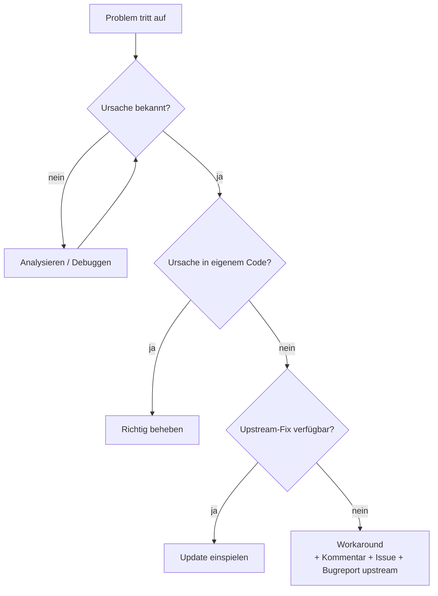

# 📖 Begriffe: Workaround, Hack, Kludge & Co.

Viele Begriffe rund um „schnelle Lösungen“ klingen ähnlich, haben aber unterschiedliche Bedeutungen und Untertöne. Wer sie präzise verwendet, kommuniziert im Team besser.

<!-- TOC -->
## Inhaltsverzeichnis

- [Übersicht](#übersicht)
- [Workaround](#workaround)
- [Hack](#hack)
- [Kludge](#kludge)
- [Patch, Hotfix, Bugfix](#patch-hotfix-bugfix)
- [Faustregel](#faustregel)
<!-- /TOC -->

## Übersicht

| Begriff | Bedeutung | Unterton |
| --- | --- | --- |
| **Workaround** | Umgehung eines bekannten Problems, ohne die Ursache zu beheben | neutral |
| **Hack** | Unkonventionelle, oft clevere Lösung | positiv (clever) oder negativ (unsauber) – je nach Kontext |
| **Kludge / Kluge** | Zusammengeschusterte, unelegante, fragile Lösung | negativ |
| **Quick Fix** | Schnelle Korrektur, oft ohne gründliche Analyse | leicht negativ |
| **Hotfix** | Dringende Korrektur, die **direkt im Live-System** eingespielt wird | neutral (Prozessbegriff) |
| **Patch** | Änderung an bestehendem Code (Korrektur oder Erweiterung) | neutral |
| **Monkey Patch** | Änderung fremden Codes **zur Laufzeit** | riskant (→ [Monkey Patching](Monkey%20Patching.md)) |
| **Polyfill / Shim** | Nachrüsten fehlender Funktionen | neutral (→ [Polyfill & Shim](Polyfill%20%26%20Shim.md)) |
| **Band-Aid / Pflaster** | Symptombehandlung | negativ |
| **Duct Tape** | „Mit Panzertape geflickt“ | negativ, manchmal anerkennend |
| **Provisorium** | Vorübergehende Lösung – die oft dauerhaft bleibt | Warnsignal (→ [Technische Schulden](Technische%20Schulden.md)) |

---

## Workaround

Engl. *to work around* = **um etwas herumarbeiten**. Das Problem bleibt bestehen, man umgeht es nur. Beispiele:

* Ein Gerät verliert nach 24 h die WLAN-Verbindung → nächtlicher Neustart per Cron (Workaround), statt den Treiber-Bug zu finden (Lösung).
* Eine API liefert gelegentlich Timeouts → Retry mit Backoff.
* Ein Binding in openHAB funktioniert nicht zuverlässig → eigenes Python-Skript, das per MQTT angebunden wird.

> Workarounds sind **legitim**, solange sie dokumentiert, eingegrenzt und bewusst gewählt sind.

---

## Hack

Das Wort hat eine lange Geschichte:

* *to hack* = **hacken, grob zerhauen** (Holz, mit der Axt).
* Am **MIT** (Tech Model Railroad Club, späte 1950er) bedeutete *hack* einen **cleveren, verspielten technischen Streich oder Trick**. Ein *Hacker* war jemand, der Systeme tief verstand und kreativ einsetzte.
* Erst später (1980er) übernahmen Medien „Hacker“ für Computereinbrecher. In der Szene heißen diese eher **Cracker**; man unterscheidet auch **White Hat** (ethisch), **Black Hat** (kriminell) und **Grey Hat**.

Heute kann *Hack* bedeuten:

* **positiv:** „Ein eleganter Hack!“ (*Life Hack*, *Hackathon*)
* **negativ:** „Das ist ein ziemlicher Hack.“ = unsauber, schwer wartbar

---

## Kludge

Gesprochen etwa „kludsch“ oder „kluhdsch“. Ein **Flickwerk** aus nicht zusammenpassenden Teilen, das irgendwie funktioniert, aber jeder hat Angst, es anzufassen. Die Herkunft ist unsicher; eine verbreitete Erklärung leitet es von deutsch **„klug“** ab, ironisch gemeint („ach wie klug“). Belegt ist der Begriff in der US-Technik spätestens in den 1960er-Jahren (u. a. ein ironischer Artikel von Jackson Granholm, 1962).

---

## Patch, Hotfix, Bugfix

| Begriff | Bedeutung |
| --- | --- |
| **Patch** | Ursprünglich wörtlich ein **Flicken**: Bei Lochstreifen und Lochkarten wurden Löcher überklebt oder neu gestanzt, um Programme zu korrigieren. Heute: eine Änderung als Diff (`git diff > fix.patch`, `patch -p1 < fix.patch`). |
| **Bugfix** | Behebung eines Fehlers (→ [Namensherkunft: Bug](../Begriffe%20%26%20Herkunft/Namensherkunft%20%26%20Analogien.md)) |
| **Hotfix** | „Heiße“ Korrektur am laufenden Produktivsystem, außerhalb des normalen Release-Zyklus. In Git oft ein Branch `hotfix/...` vom Release-Stand. |
| **Service Pack / Update** | Sammlung vieler Patches |
| **Backport** | Korrektur aus einer neueren Version in eine ältere übertragen |

---

## Faustregel

---
