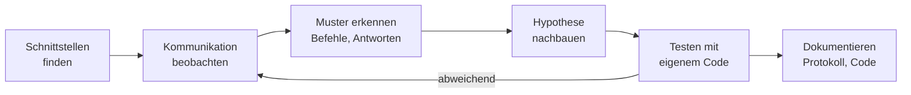

# 🔬 Reverse Engineering von Geräten

Viele Smart-Home-Geräte lassen sich nur über eine Hersteller-App bedienen – und diese App wird irgendwann nicht mehr gepflegt, läuft auf neuen Smartphones nicht mehr oder verlangt eine Cloud, die abgeschaltet wird. **Reverse Engineering** bedeutet herauszufinden, **wie ein Gerät kommuniziert**, um es mit eigener Software anzusteuern. Im Labor wurde das z. B. beim Hologram Fan Projector, den Beam-Labs-Lampen und dem BenQ-Beamer angewendet.

<!-- TOC -->
## Inhaltsverzeichnis

- [Rechtlicher Rahmen](#rechtlicher-rahmen)
- [Vorgehen](#vorgehen)
  - [1. Schnittstellen finden](#1-schnittstellen-finden)
  - [2. Kommunikation beobachten](#2-kommunikation-beobachten)
  - [3. Muster erkennen](#3-muster-erkennen)
  - [4.–5. Nachbauen und testen](#45-nachbauen-und-testen)
- [Apps analysieren](#apps-analysieren)
- [Firmware](#firmware)
- [Dokumentieren](#dokumentieren)
<!-- /TOC -->

## Rechtlicher Rahmen

> Dies ist keine Rechtsberatung. Im Zweifel vorher mit der Betreuung sprechen.

* Das **Beobachten** der eigenen Kommunikation im **eigenen** Netz (Mitschneiden mit Wireshark) ist bei eigenen Geräten unproblematisch.
* Das **Dekompilieren** von Software ist in Deutschland urheberrechtlich nur in engen Grenzen erlaubt – insbesondere, um die **Interoperabilität** eines eigenständig geschaffenen Programms herzustellen (§ 69e UrhG). Die gewonnenen Informationen dürfen nur dafür verwendet werden.
* **Lizenzbedingungen** von Apps und Firmware können zusätzliche Einschränkungen enthalten.
* **Sicherheitslücken** auszunutzen, um an Informationen zu kommen, ist bei eigenen Geräten im eigenen Netz etwas anderes als bei fremden. Niemals fremde Geräte oder Netze untersuchen.
* Dekompilierten Code, Firmware-Abbilder und Schlüssel **nicht unbedacht veröffentlichen**.

---

## Vorgehen



### 1. Schnittstellen finden

| Frage | Werkzeug |
| --- | --- |
| Welche Ports sind offen? | `nmap -p- <ip>`, `nmap -sU` für UDP (→ [Netzwerk-Grundlagen](../Netzwerk/Netzwerk-Grundlagen.md)) |
| Gibt es eine Weboberfläche oder API? | Browser, `curl -v`, Pfade wie `/api`, `/cgi-bin` |
| Meldet sich das Gerät im Netz? | mDNS/SSDP/UPnP beobachten (Wireshark-Filter `mdns`, `ssdp`) |
| Bluetooth? | `bluetoothctl scan on`, BLE-Scanner-Apps (z. B. nRF Connect) |
| Hardware-Schnittstellen? | Gehäuse: UART-Pins (TX/RX/GND), RS232, USB |
| Dokumentation vorhanden? | Handbuch, Protokoll-PDFs (z. B. RS232-Befehlslisten von Beamern), Foren, existierende Open-Source-Projekte |

> **Erst suchen, dann zerlegen:** Für viele Geräte haben andere die Arbeit schon gemacht – Home-Assistant-Integrationen, Python-Bibliotheken, Blogartikel. Das spart Tage.

### 2. Kommunikation beobachten

**Netzwerk (WLAN/LAN):**

* **Wireshark** auf dem Rechner, auf dem die Hersteller-Software läuft – am einfachsten mit einer **Windows-App** oder einem Android-Emulator auf dem eigenen Rechner.
* Für Smartphone-Apps: Rechner als WLAN-Hotspot betreiben und dort mitschneiden, oder einen **Mirror-Port** am verwalteten Switch.
* Mit Filtern eingrenzen: `ip.addr == 192.168.10.42`, `tcp.port == 8080`.
* *Follow TCP/UDP Stream* zeigt eine Unterhaltung im Zusammenhang.

**HTTPS-Verkehr** einer App lässt sich mit einem Proxy wie **mitmproxy** sichtbar machen, wenn man dem Gerät das Proxy-Zertifikat unterschiebt – bei modernen Apps oft durch *Certificate Pinning* verhindert.

**Bluetooth LE:** Android bietet unter den Entwickleroptionen ein **HCI-Snoop-Log**, das sich in Wireshark öffnen lässt. Interessant sind GATT-*Write*- und *Notify*-Operationen auf bestimmten Characteristics.

**Seriell:** Ein USB-Seriell-Adapter am TX-Pin des Geräts (gemeinsame Masse, **richtige Spannung** – 3,3 V vs. 5 V vs. RS232-Pegel!) zeigt oft Boot-Logs oder Befehle.

### 3. Muster erkennen

**Systematisch** genau **eine** Aktion in der App auslösen und den Verkehr dazu aufzeichnen – dann die nächste. Typische Funde:

| Muster | Beispiel |
| --- | --- |
| Klartext-Befehle | `*pow=on#`, JSON wie `{"cmd":"setBrightness","value":50}` |
| Feste Byte-Folgen mit Kopf, Länge, Nutzdaten, Prüfsumme | `AA 55 03 01 32 C8` |
| Zähler oder Zeitstempel | Bytes, die bei jeder Nachricht hochzählen |
| Prüfsummen | Letztes Byte = Summe/XOR der vorherigen; CRC |
| Verschlüsselung / Kompression | Zufällig wirkende Daten trotz gleicher Aktion |

Hilfreich: **dieselbe Aktion mehrfach** aufzeichnen (was bleibt gleich?) und **leicht unterschiedliche** Aktionen vergleichen (Helligkeit 10 % vs. 20 % – welches Byte ändert sich?).

### 4.–5. Nachbauen und testen

```python
import socket

# replay a captured command and print the answer (example values)
with socket.create_connection(("192.168.10.42", 5000), timeout=3) as s:
    s.sendall(bytes.fromhex("AA 55 03 01 32 C8"))
    print(s.recv(1024).hex(" "))
```

Erst exakt **wiederholen** (Replay), dann einzelne Bytes gezielt verändern. Ergebnisse sofort in einer Protokolltabelle festhalten.

---

## Apps analysieren

| Schritt | Werkzeug | Ergebnis |
| --- | --- | --- |
| APK beschaffen | Vom eigenen Gerät: `adb shell pm path <paket>`, `adb pull` | `.apk`-Datei |
| Ressourcen und Smali | **apktool** | Manifest, Ressourcen, Smali-Code (lesbarer Bytecode) |
| Java-Code | **jadx** (mit GUI) | Rekonstruierter Java/Kotlin-Code – nicht immer kompilierbar, aber gut lesbar |
| Laufzeit beobachten | **Frida**, Logcat | Aufrufe und Werte während der Ausführung |

Gesucht sind meist: Klassen mit Namen wie `*Protocol*`, `*Command*`, `*Packet*`, Konstanten mit Byte-Folgen, Ports, UUIDs von BLE-Characteristics, URLs.

> Dekompilierter Code ist eine **Informationsquelle**, keine Vorlage zum Kopieren. Das eigene Programm sollte das Protokoll unabhängig nachbauen.

---

## Firmware

* Firmware-Updates des Herstellers sind oft herunterladbar; **binwalk** zeigt enthaltene Dateisysteme.
* Eigene Firmware flashen (z. B. Tasmota, ESPHome, OpenWrt) kann ein Gerät dauerhaft unabhängig machen – aber auch **unbrauchbar** („Brick“). Vorher Original-Firmware sichern, Anleitung für **genau dieses Modell** und diese Hardware-Revision verwenden, Wiederherstellungsweg kennen.

---

## Dokumentieren

Das Ergebnis ist nicht nur Code, sondern **Wissen**. In der README des Projekts:

* Gerät, Modell, Hardware- und Firmware-Version
* Transport (TCP/UDP-Port, BLE-UUIDs, serielle Parameter wie `9600 8N1`)
* Befehlstabelle mit Beispielen und Antworten
* Was **nicht** funktioniert hat (und warum)
* Rechtliche Einordnung (z. B. „Protokoll durch Beobachtung des eigenen Netzwerkverkehrs ermittelt“)

---
